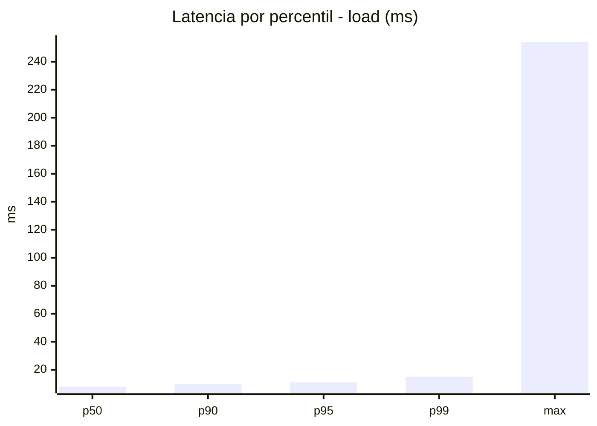
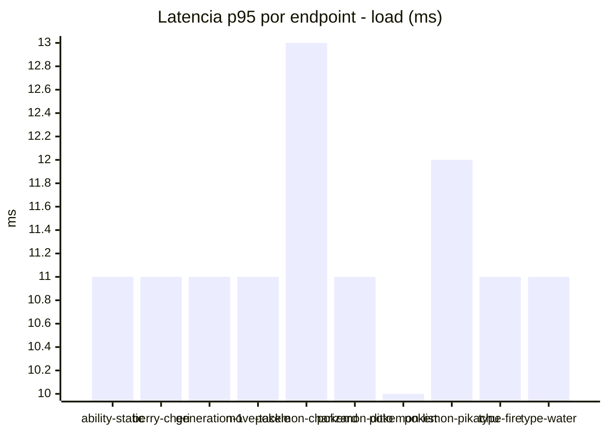
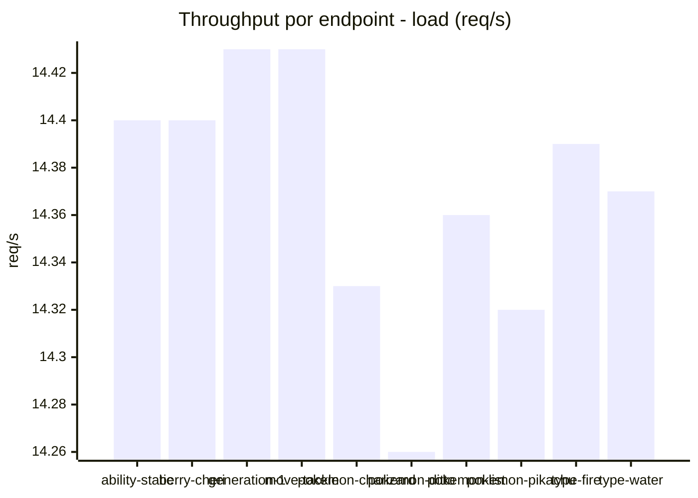
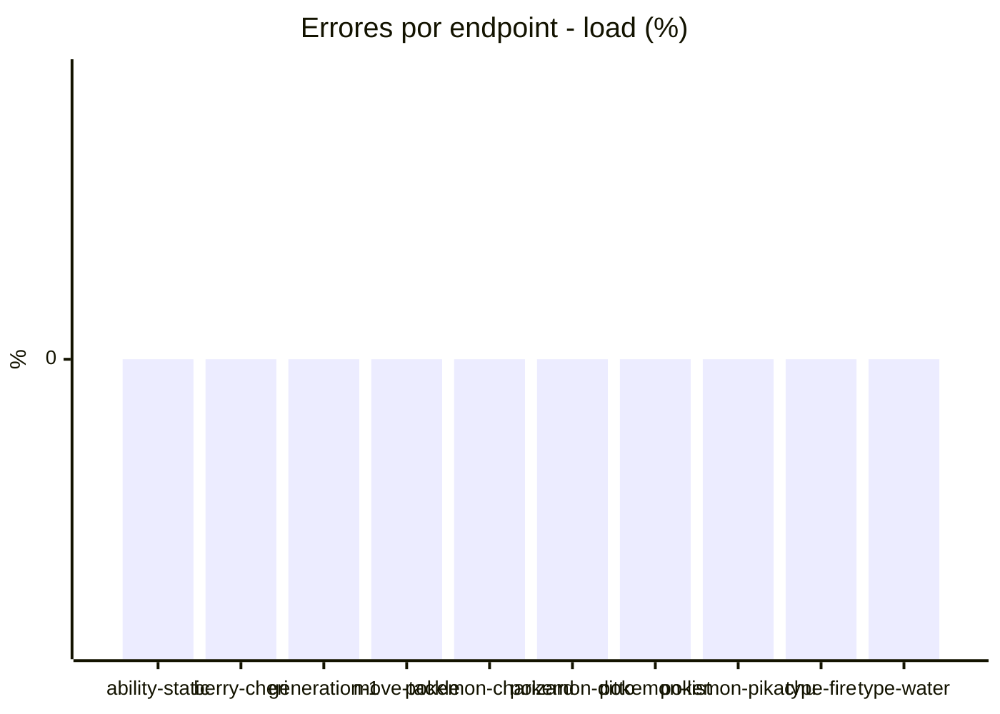
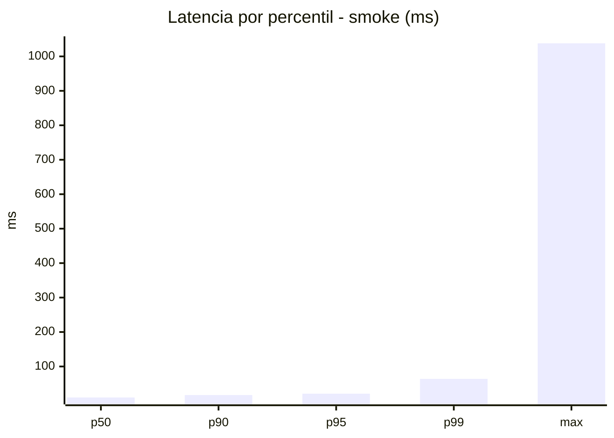
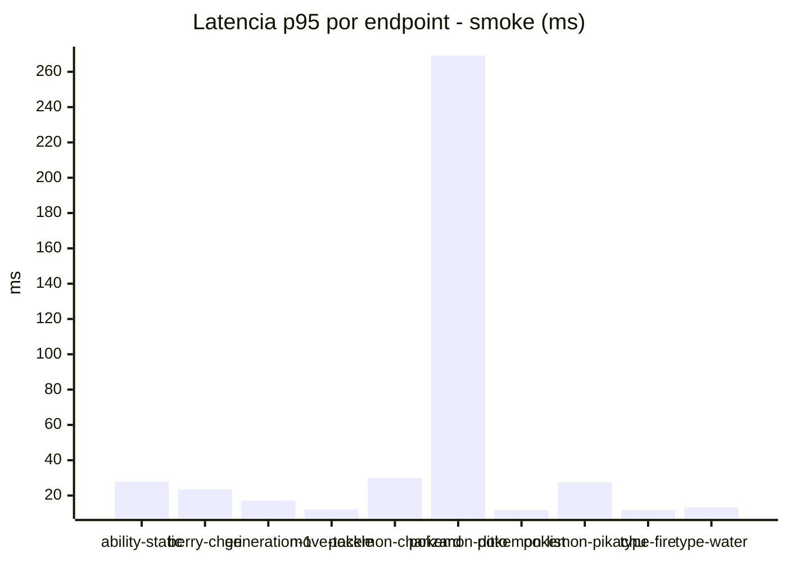
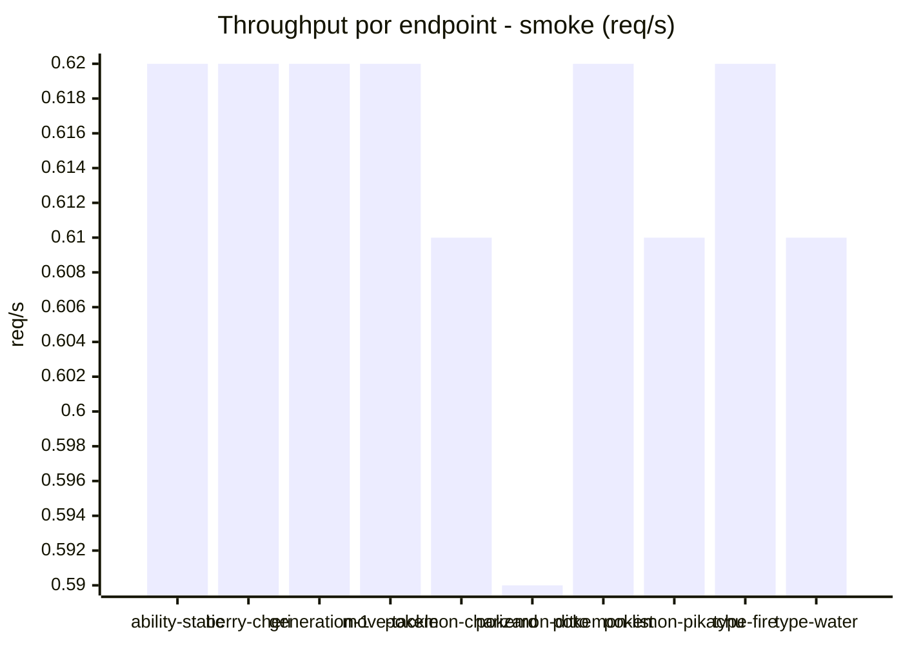

# Reporte de performance - PokeAPI

**Fecha:** 2026-07-23 15:08 UTC  
**Veredicto del agente:** `PASS`  
**Corrida:** [ver en GitHub Actions](https://github.com/lrbg/jmeter-pokeapi-lab/actions/runs/30018937585)  

## Validacion del agente de IA

PASS

1. Todas las métricas de error están por debajo del 1%, lo que indica que el servicio es muy fiable durante la carga, sin errores reportados.
2. Los tiempos de respuesta de p95 son de 11 ms para la prueba de carga y 21 ms para la prueba de humo, ambos quedando muy por debajo del límite de 800 ms, lo que sugiere un rendimiento óptimo.
3. El rendimiento de throughput es adecuado en ambas pruebas, alcanzando hasta 142.54 RPS en carga, indicando que el sistema puede manejar una fuerte carga sin degradación del rendimiento.
4. Aunque no se presentan errores, la variación en los tiempos máximos en la prueba de humo (hasta 1038 ms para "pokemon-ditto") sugiere la necesidad de investigar posibles cuellos de botella en ciertos endpoints. Se recomienda monitorear esos casos específicos y considerar optimizaciones.

## Resultados

### Escenario: `load`

| Metrica | Valor |
| --- | --- |
| Muestras | 17048 |
| Errores | 0 (0.0%) |
| Latencia media | 8.2 ms |
| p50 / p90 / p95 / p99 | 8.0 / 10.0 / 11.0 / 15.0 ms |
| Min / Max | 5 / 254 ms |
| Throughput | 142.54 req/s |
| Duracion | 119.6 s |

Detalle por endpoint

| Endpoint | Muestras | Error % | avg | p95 | p99 | req/s |
| --- | --- | --- | --- | --- | --- | --- |
| ability-static | 1705 | 0.0% | 8.3 | 11.0 | 13.0 | 14.4 |
| berry-cheri | 1705 | 0.0% | 8.0 | 11.0 | 14.0 | 14.4 |
| generation-1 | 1704 | 0.0% | 8.2 | 11.0 | 14.0 | 14.43 |
| move-tackle | 1704 | 0.0% | 8.2 | 11.0 | 13.0 | 14.43 |
| pokemon-charizard | 1705 | 0.0% | 9.3 | 13.0 | 17.0 | 14.33 |
| pokemon-ditto | 1705 | 0.0% | 8.2 | 11.0 | 14.0 | 14.26 |
| pokemon-list | 1705 | 0.0% | 7.6 | 10.0 | 13.0 | 14.36 |
| pokemon-pikachu | 1705 | 0.0% | 8.9 | 12.0 | 18.0 | 14.32 |
| type-fire | 1705 | 0.0% | 8.0 | 11.0 | 14.0 | 14.39 |
| type-water | 1705 | 0.0% | 7.9 | 11.0 | 14.0 | 14.37 |

### Escenario: `smoke`

| Metrica | Valor |
| --- | --- |
| Muestras | 160 |
| Errores | 0 (0.0%) |
| Latencia media | 18.9 ms |
| p50 / p90 / p95 / p99 | 10.0 / 17.0 / 21.0 / 64.0 ms |
| Min / Max | 7 / 1038 ms |
| Throughput | 5.54 req/s |
| Duracion | 28.9 s |

Detalle por endpoint

| Endpoint | Muestras | Error % | avg | p95 | p99 | req/s |
| --- | --- | --- | --- | --- | --- | --- |
| ability-static | 16 | 0.0% | 15 | 28.0 | 56.8 | 0.62 |
| berry-cheri | 16 | 0.0% | 12.3 | 23.5 | 55.9 | 0.62 |
| generation-1 | 16 | 0.0% | 11.3 | 17.2 | 29.8 | 0.62 |
| move-tackle | 16 | 0.0% | 10.4 | 12.2 | 12.8 | 0.62 |
| pokemon-charizard | 16 | 0.0% | 19 | 30.0 | 46.8 | 0.61 |
| pokemon-ditto | 16 | 0.0% | 73.9 | 269.2 | 884.2 | 0.59 |
| pokemon-list | 16 | 0.0% | 9.9 | 11.8 | 13.5 | 0.62 |
| pokemon-pikachu | 16 | 0.0% | 17.2 | 27.5 | 43.1 | 0.61 |
| type-fire | 16 | 0.0% | 9.7 | 11.8 | 13.5 | 0.62 |
| type-water | 16 | 0.0% | 10 | 13.2 | 13.8 | 0.61 |

