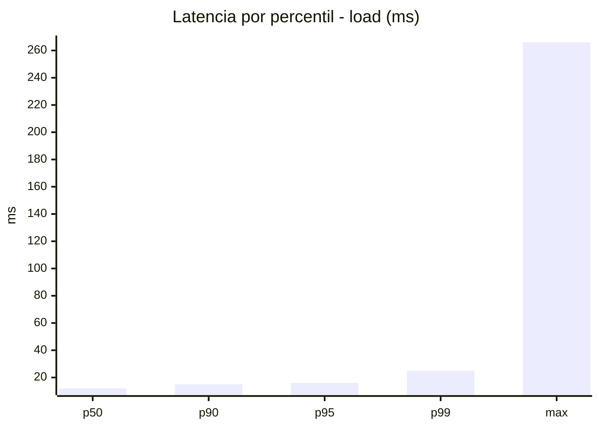
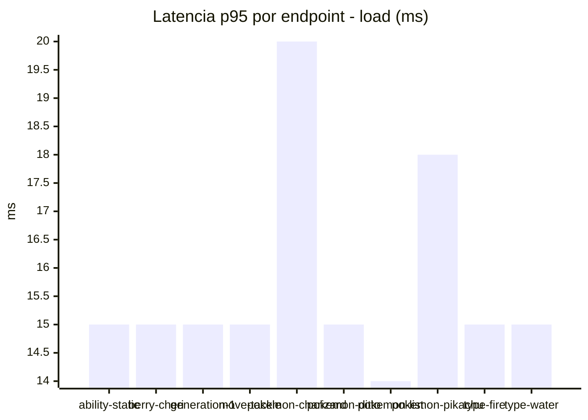
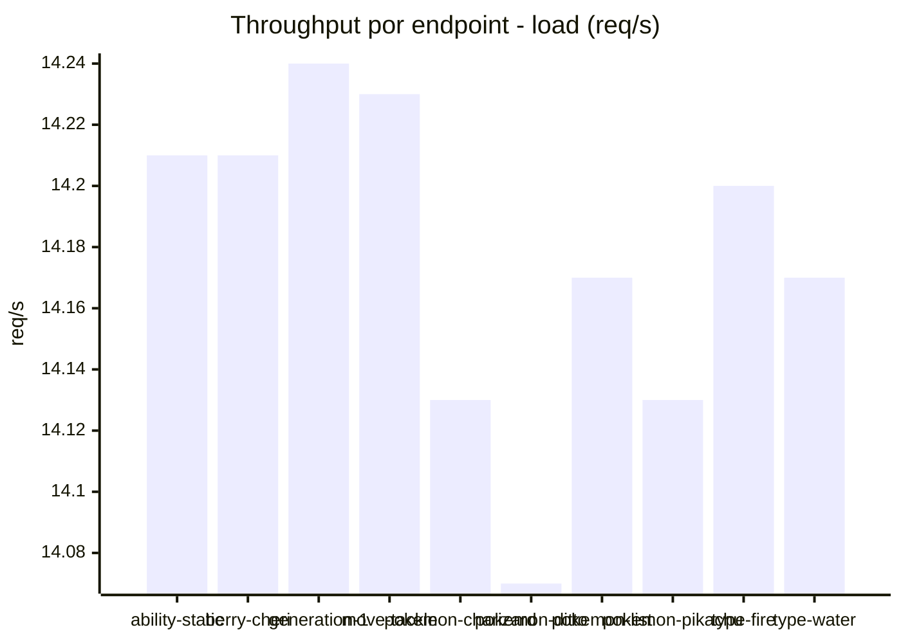
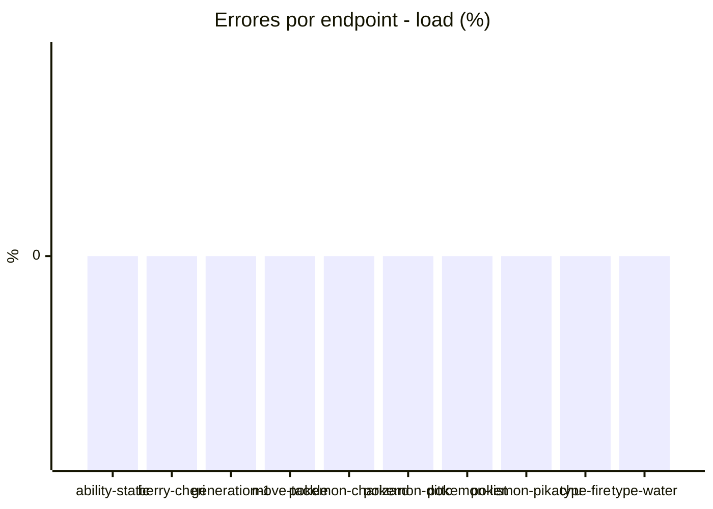
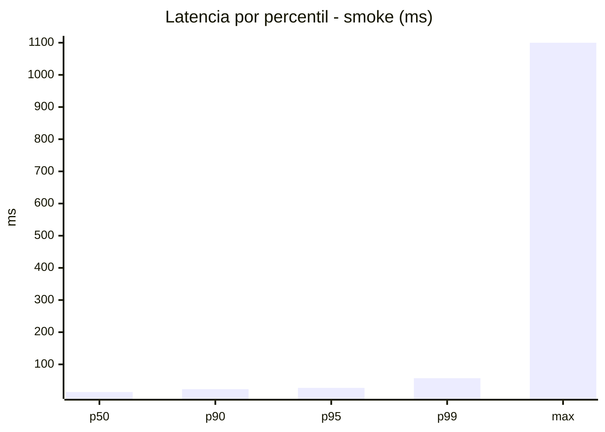
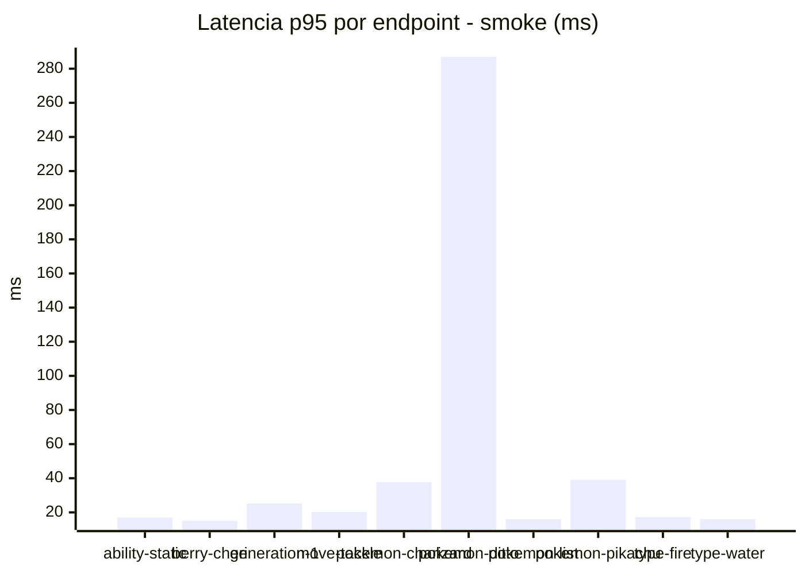
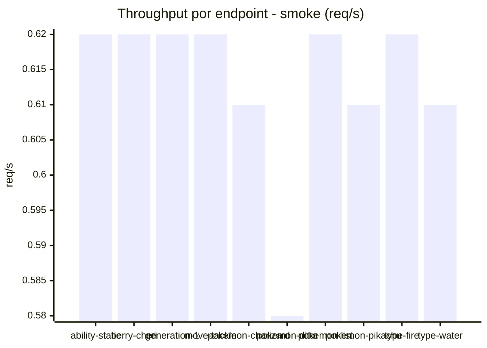

# Reporte de performance - PokeAPI

**Fecha:** 2026-07-24 14:55 UTC  
**Veredicto del agente:** `PASS`  
**Corrida:** [ver en GitHub Actions](https://github.com/lrbg/jmeter-pokeapi-lab/actions/runs/30102847077)  

## Validacion del agente de IA

PASS  
1. Todas las métricas del escenario de carga cumplen con los SLOs establecidos: 0% de errores y p95 de 16 ms, lo cual es excelente.  
2. El rendimiento promedio es muy bajo (12.5 ms), lo que indica una buena capacidad de respuesta. Se mantiene un throughput de 140.57 solicitudes por segundo.  
3. Sin embargo, el endpoint "pokemon-ditto" muestra un tiempo máximo de respuesta de 266 ms. Se recomienda investigar esta discrepancia para asegurar la consistencia del rendimiento.  
4. Realizar monitorización continua y pruebas de estrés para asegurar la estabilidad bajo condiciones de alta carga.

## Resultados

### Escenario: `load`

| Metrica | Valor |
| --- | --- |
| Muestras | 16812 |
| Errores | 0 (0.0%) |
| Latencia media | 12.5 ms |
| p50 / p90 / p95 / p99 | 12.0 / 15.0 / 16.0 / 25.0 ms |
| Min / Max | 9 / 266 ms |
| Throughput | 140.57 req/s |
| Duracion | 119.6 s |

Detalle por endpoint

| Endpoint | Muestras | Error % | avg | p95 | p99 | req/s |
| --- | --- | --- | --- | --- | --- | --- |
| ability-static | 1681 | 0.0% | 12.0 | 15.0 | 21.0 | 14.21 |
| berry-cheri | 1681 | 0.0% | 11.7 | 15.0 | 19.0 | 14.21 |
| generation-1 | 1681 | 0.0% | 12.3 | 15.0 | 21.2 | 14.24 |
| move-tackle | 1681 | 0.0% | 12.3 | 15.0 | 18.2 | 14.23 |
| pokemon-charizard | 1682 | 0.0% | 14.9 | 20.0 | 31.0 | 14.13 |
| pokemon-ditto | 1682 | 0.0% | 12.4 | 15.0 | 25.2 | 14.07 |
| pokemon-list | 1681 | 0.0% | 11.4 | 14.0 | 18.2 | 14.17 |
| pokemon-pikachu | 1681 | 0.0% | 14.2 | 18.0 | 27.2 | 14.13 |
| type-fire | 1681 | 0.0% | 11.9 | 15.0 | 18.0 | 14.2 |
| type-water | 1681 | 0.0% | 12.1 | 15.0 | 24.2 | 14.17 |

### Escenario: `smoke`

| Metrica | Valor |
| --- | --- |
| Muestras | 160 |
| Errores | 0 (0.0%) |
| Latencia media | 23.0 ms |
| p50 / p90 / p95 / p99 | 14.0 / 23.1 / 27.0 / 57.1 ms |
| Min / Max | 10 / 1100 ms |
| Throughput | 5.49 req/s |
| Duracion | 29.1 s |

Detalle por endpoint

| Endpoint | Muestras | Error % | avg | p95 | p99 | req/s |
| --- | --- | --- | --- | --- | --- | --- |
| ability-static | 16 | 0.0% | 14.1 | 17.0 | 19.4 | 0.62 |
| berry-cheri | 16 | 0.0% | 12.7 | 15.0 | 15.0 | 0.62 |
| generation-1 | 16 | 0.0% | 16.2 | 25.2 | 40.2 | 0.62 |
| move-tackle | 16 | 0.0% | 15.2 | 20.2 | 23.2 | 0.62 |
| pokemon-charizard | 16 | 0.0% | 24.8 | 37.8 | 41.9 | 0.61 |
| pokemon-ditto | 16 | 0.0% | 81.4 | 287.0 | 937.4 | 0.58 |
| pokemon-list | 16 | 0.0% | 13.5 | 16.0 | 16.0 | 0.62 |
| pokemon-pikachu | 16 | 0.0% | 24 | 39.2 | 68.6 | 0.61 |
| type-fire | 16 | 0.0% | 14.4 | 17.2 | 17.9 | 0.62 |
| type-water | 16 | 0.0% | 14.1 | 16.0 | 16.0 | 0.61 |

