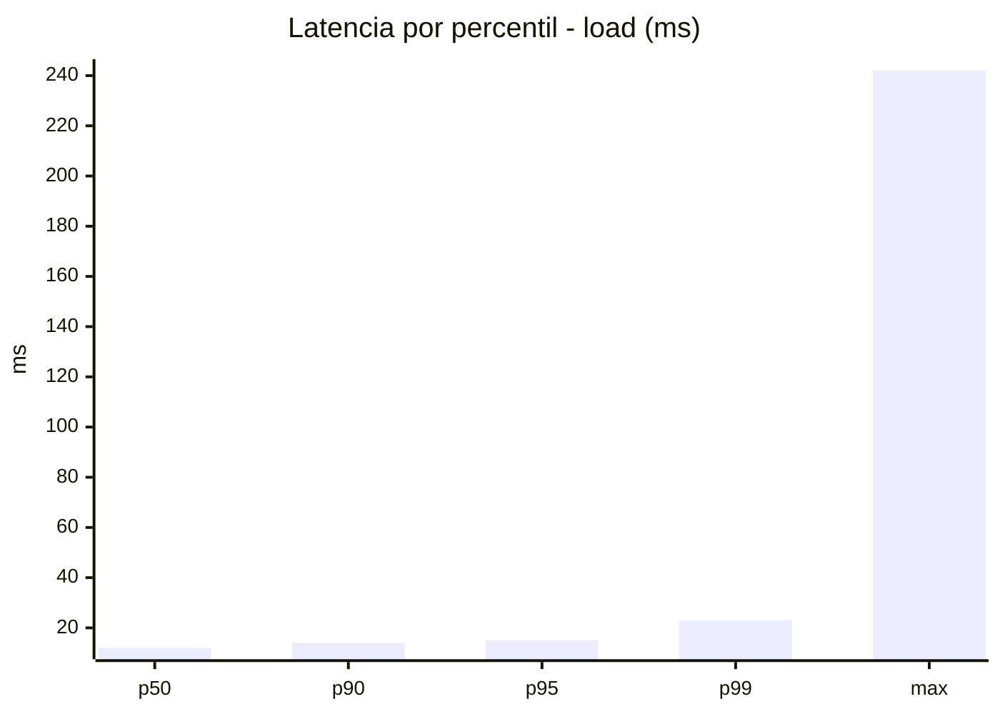
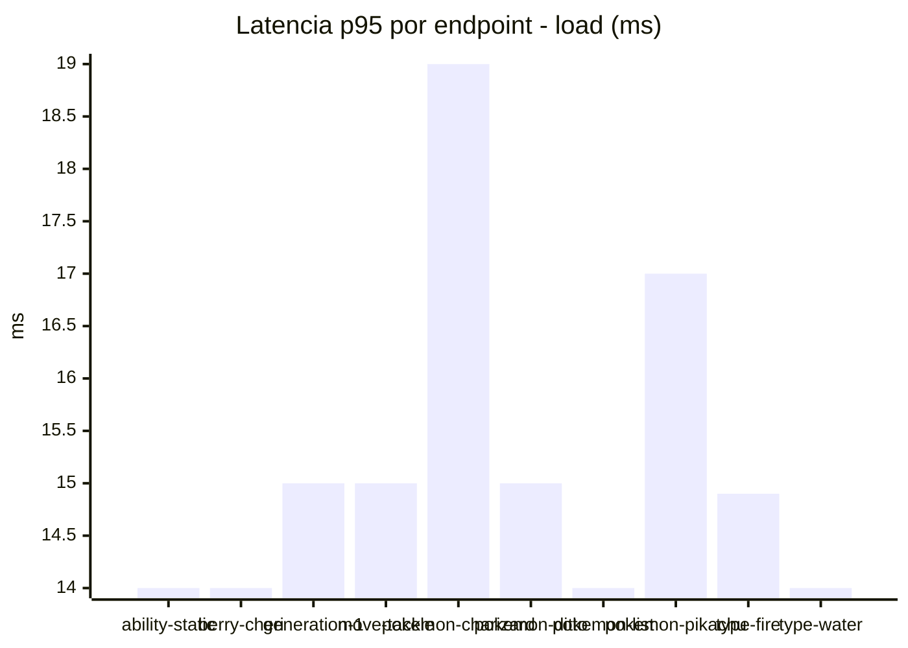
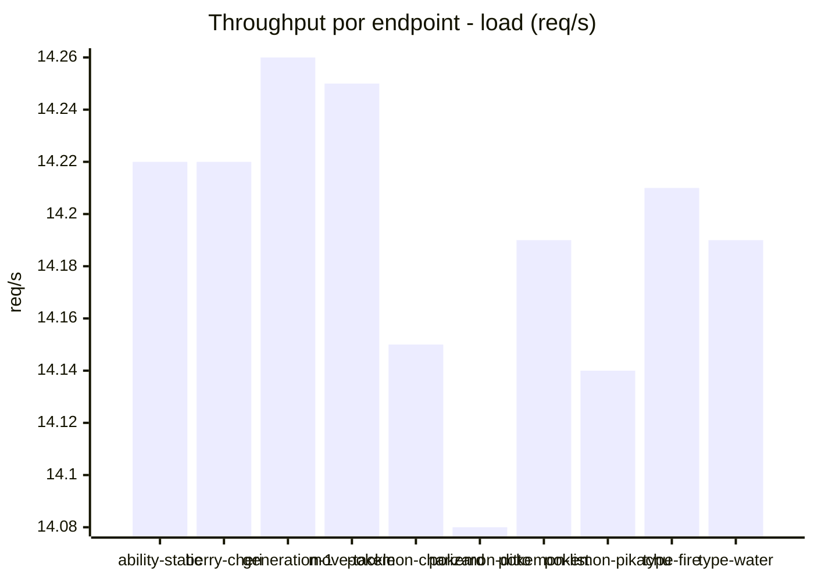
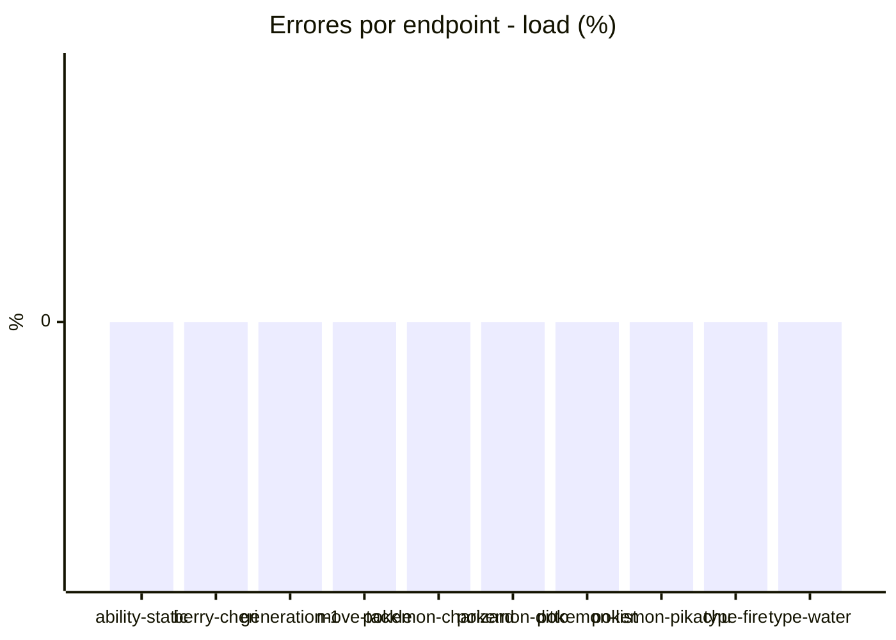
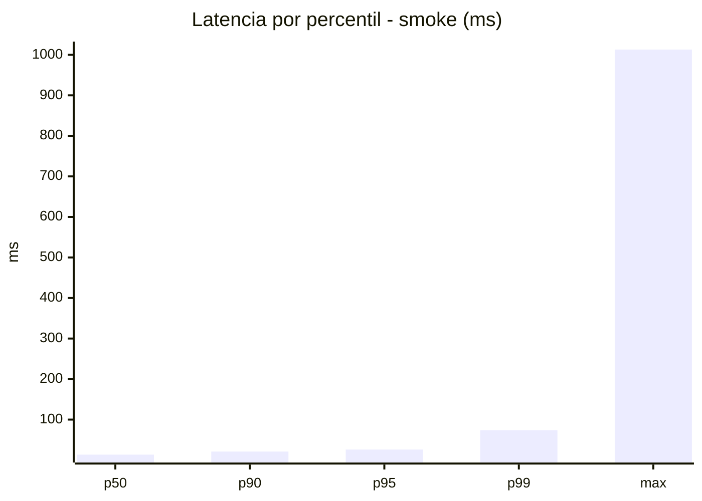
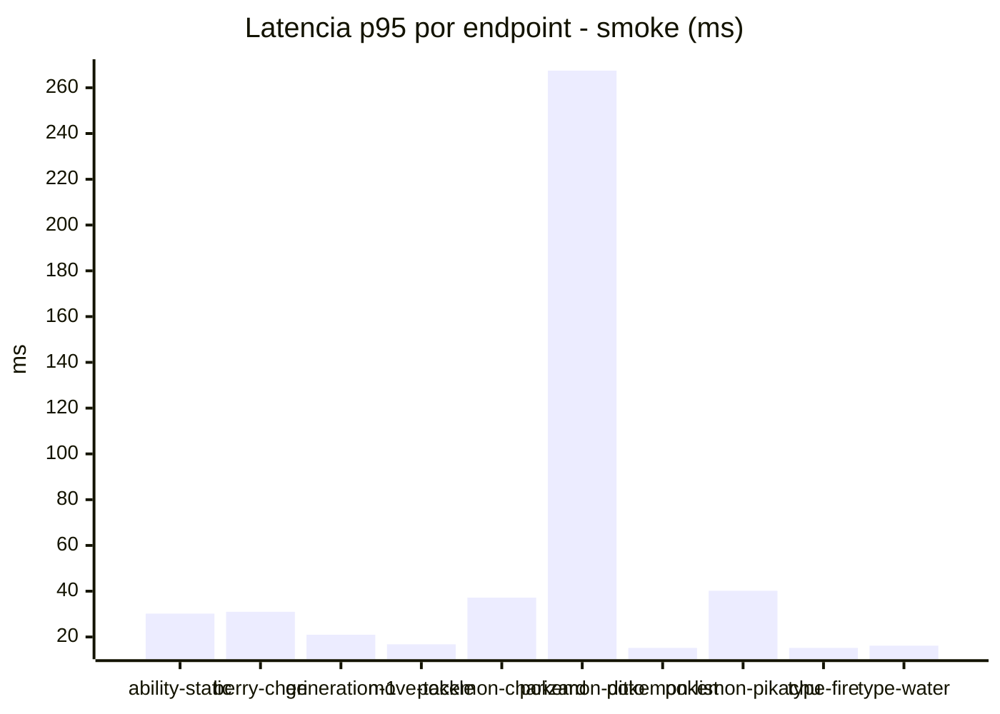
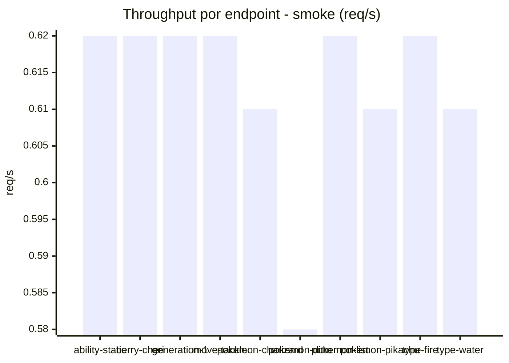

# Reporte de performance - PokeAPI

**Fecha:** 2026-07-25 14:31 UTC  
**Veredicto del agente:** `PASS`  
**Corrida:** [ver en GitHub Actions](https://github.com/lrbg/jmeter-pokeapi-lab/actions/runs/30161696910)  

## Validacion del agente de IA

PASS

1. Todos los resultados de la prueba muestran un porcentaje de error del 0%, cumpliendo con el SLO de error de menos del 1%. Esto indica que el servicio es robusto y confiable bajo carga.

2. Los tiempos de respuesta P95 en el escenario de carga son de 15 ms, muy por debajo del umbral de 800 ms. Esto demuestra que el rendimiento del sistema es excelente en condiciones de alta demanda.

3. A pesar de los buenos resultados generales, el endpoint "pokemon-ditto" tiene un máximo de latencia elevado de 242 ms. Se recomienda investigar y optimizar este endpoint para mejorar su desempeño, especialmente en escenarios de alto tráfico.

4. Para asegurar un rendimiento consistente, se sugiere programar pruebas regulares y monitorear el comportamiento bajo diferentes tipos de carga, especialmente después de cualquier cambio en el código o la infraestructura.

## Resultados

### Escenario: `load`

| Metrica | Valor |
| --- | --- |
| Muestras | 16833 |
| Errores | 0 (0.0%) |
| Latencia media | 12.1 ms |
| p50 / p90 / p95 / p99 | 12.0 / 14.0 / 15.0 / 23.0 ms |
| Min / Max | 8 / 242 ms |
| Throughput | 140.75 req/s |
| Duracion | 119.6 s |

Detalle por endpoint

| Endpoint | Muestras | Error % | avg | p95 | p99 | req/s |
| --- | --- | --- | --- | --- | --- | --- |
| ability-static | 1683 | 0.0% | 11.9 | 14.0 | 16.0 | 14.22 |
| berry-cheri | 1683 | 0.0% | 11.8 | 14.0 | 17.0 | 14.22 |
| generation-1 | 1683 | 0.0% | 12.1 | 15.0 | 20.7 | 14.26 |
| move-tackle | 1683 | 0.0% | 12.1 | 15.0 | 18.2 | 14.25 |
| pokemon-charizard | 1684 | 0.0% | 13.8 | 19.0 | 30.2 | 14.15 |
| pokemon-ditto | 1684 | 0.0% | 12.0 | 15.0 | 23.2 | 14.08 |
| pokemon-list | 1683 | 0.0% | 11.3 | 14.0 | 16.4 | 14.19 |
| pokemon-pikachu | 1684 | 0.0% | 12.8 | 17.0 | 25.2 | 14.14 |
| type-fire | 1683 | 0.0% | 11.9 | 14.9 | 20.2 | 14.21 |
| type-water | 1683 | 0.0% | 11.7 | 14.0 | 17.0 | 14.19 |

### Escenario: `smoke`

| Metrica | Valor |
| --- | --- |
| Muestras | 160 |
| Errores | 0 (0.0%) |
| Latencia media | 22.2 ms |
| p50 / p90 / p95 / p99 | 13.5 / 21.1 / 26.1 / 73.7 ms |
| Min / Max | 11 / 1013 ms |
| Throughput | 5.51 req/s |
| Duracion | 29.0 s |

Detalle por endpoint

| Endpoint | Muestras | Error % | avg | p95 | p99 | req/s |
| --- | --- | --- | --- | --- | --- | --- |
| ability-static | 16 | 0.0% | 16.7 | 30.2 | 62.0 | 0.62 |
| berry-cheri | 16 | 0.0% | 16.5 | 31.0 | 69.4 | 0.62 |
| generation-1 | 16 | 0.0% | 14.3 | 21.0 | 35.4 | 0.62 |
| move-tackle | 16 | 0.0% | 13.6 | 16.8 | 18.5 | 0.62 |
| pokemon-charizard | 16 | 0.0% | 23.7 | 37.2 | 57.0 | 0.61 |
| pokemon-ditto | 16 | 0.0% | 75.7 | 267.5 | 863.9 | 0.58 |
| pokemon-list | 16 | 0.0% | 13.5 | 15.2 | 15.8 | 0.62 |
| pokemon-pikachu | 16 | 0.0% | 21.2 | 40.2 | 50.4 | 0.61 |
| type-fire | 16 | 0.0% | 13.1 | 15.2 | 18.2 | 0.62 |
| type-water | 16 | 0.0% | 13.4 | 16.2 | 16.9 | 0.61 |

