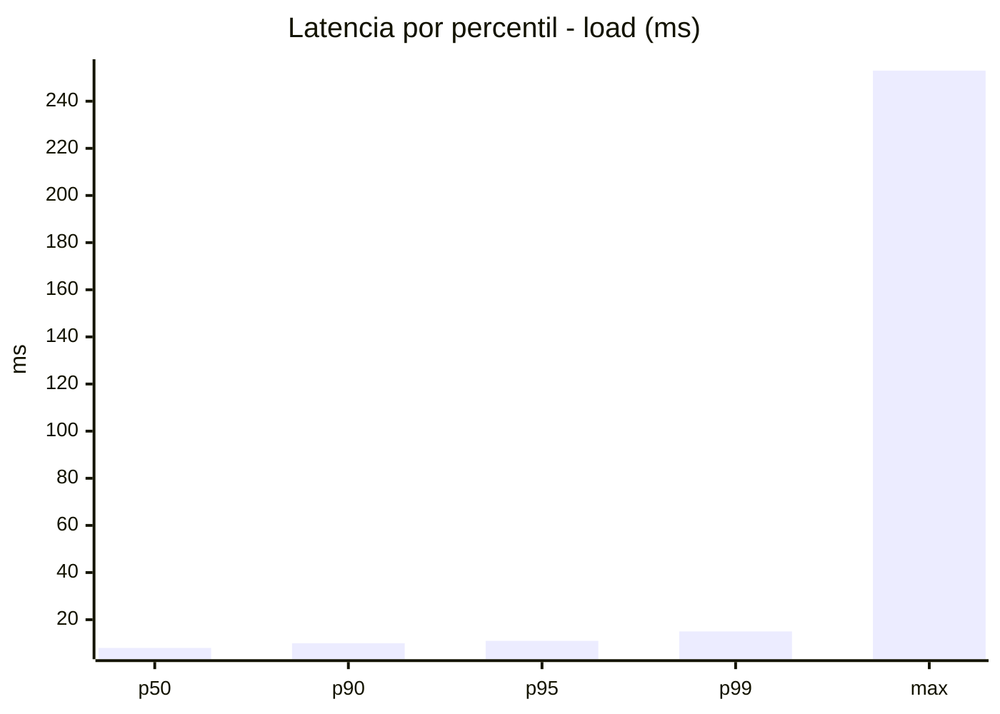
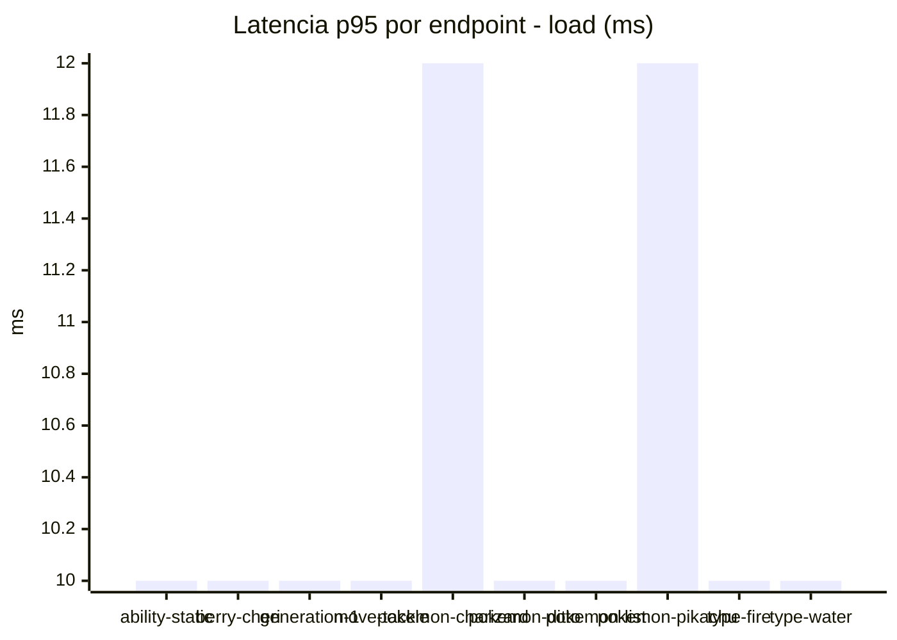
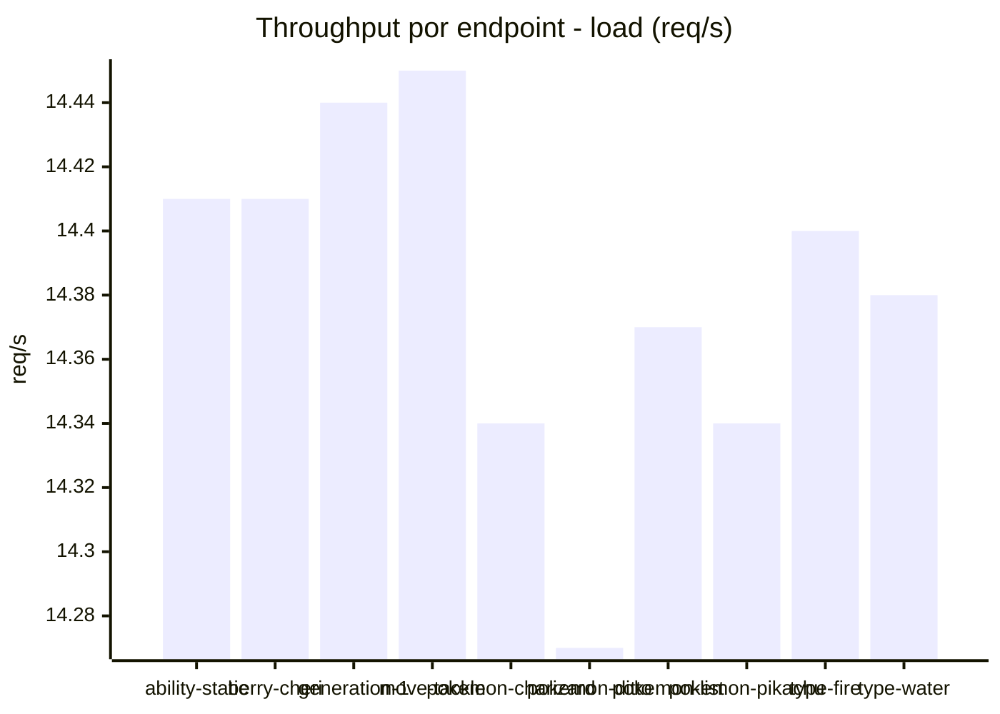
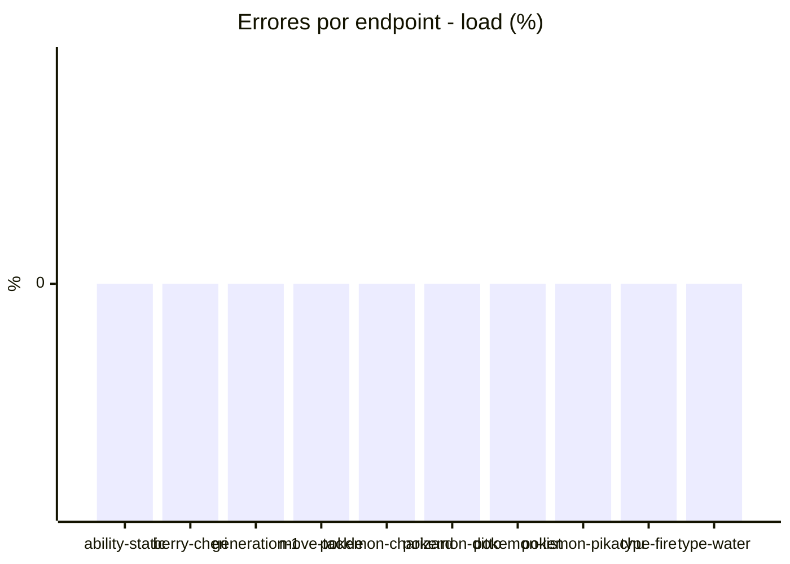
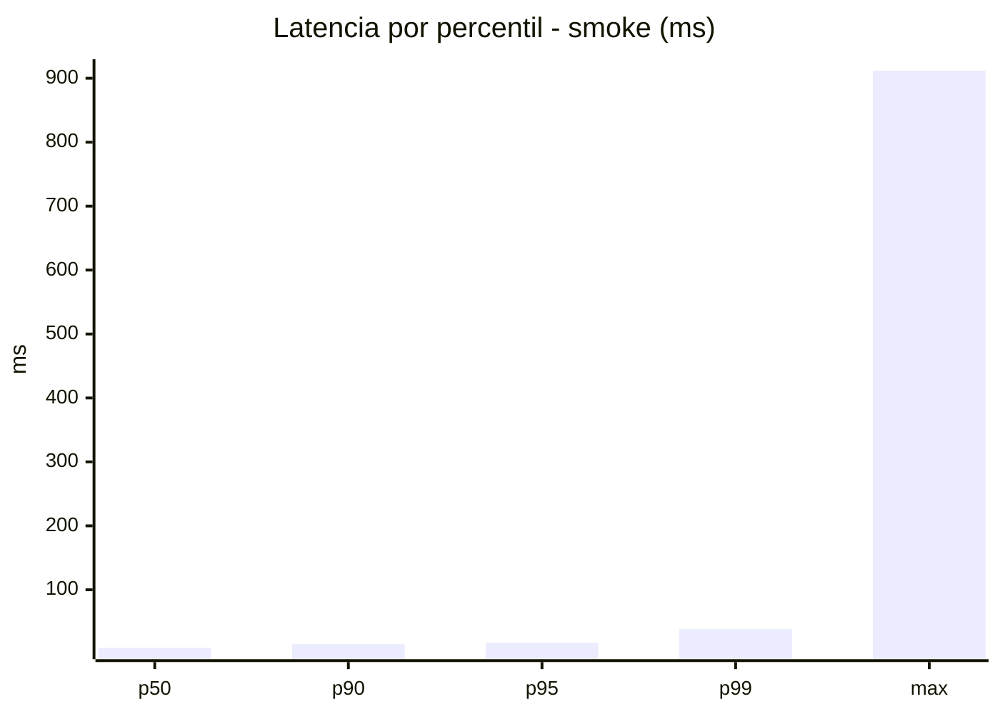
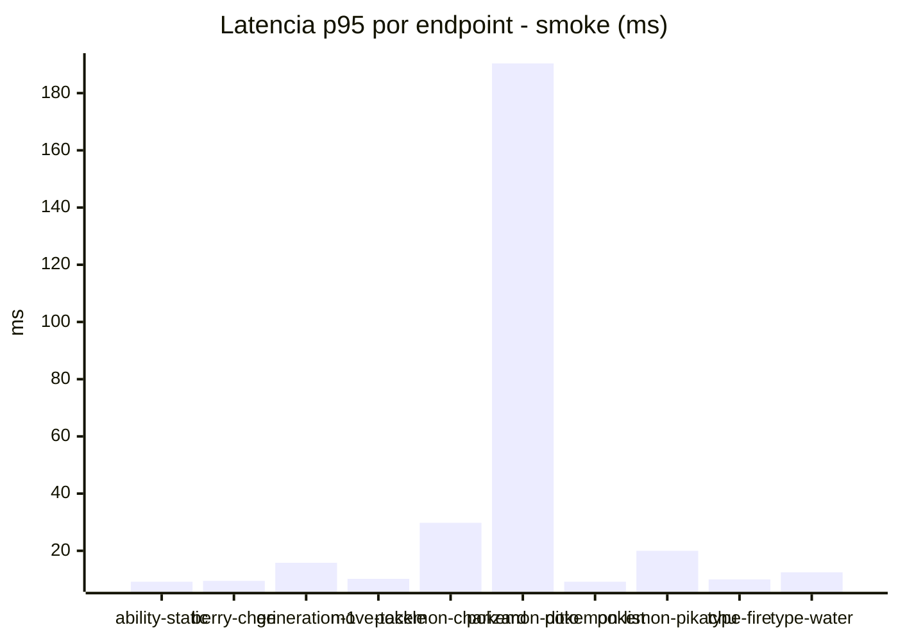
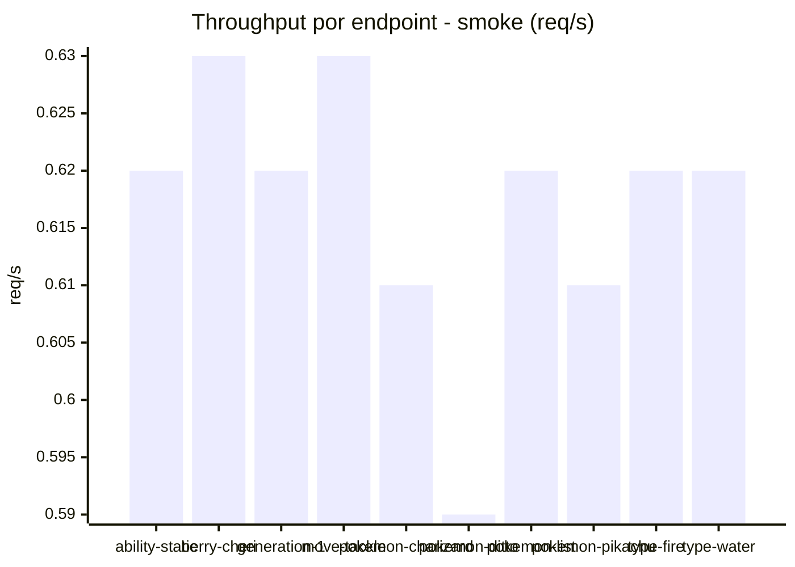

# Reporte de performance - PokeAPI

**Fecha:** 2026-07-26 14:30 UTC  
**Veredicto del agente:** `PASS`  
**Corrida:** [ver en GitHub Actions](https://github.com/lrbg/jmeter-pokeapi-lab/actions/runs/30206106990)  

## Validacion del agente de IA

PASS

1. **Exactitud en SLOs**: Todos los endpoints mostraron un porcentaje de errores del 0% y un p95 promedio de 10 ms, lo que está muy por debajo del umbral de 800 ms establecido.
  
2. **Rendimiento general**: El rendimiento promedio de la carga es excelente, con un tiempo promedio de 7.9 ms. Esto indica que el sistema puede manejar bien la carga.

3. **Endpoint con máx. tiempo alto**: El endpoint `pokemon-ditto` tuvo un tiempo máximo de 253 ms en la prueba de carga. Se recomienda investigar este endpoint específicamente para entender y mitigar el motivo de la latencia.

4. **Prueba de humo**: Aunque la prueba de carga es satisfactoria, la prueba de humo mostró un tiempo máximo de 912 ms en `pokemon-ditto`, lo que podría indicar problemas en condiciones de uso real. Se sugiere realizar más pruebas de rendimiento y optimización específicamente en este endpoint.

## Resultados

### Escenario: `load`

| Metrica | Valor |
| --- | --- |
| Muestras | 17063 |
| Errores | 0 (0.0%) |
| Latencia media | 7.9 ms |
| p50 / p90 / p95 / p99 | 8.0 / 10.0 / 11.0 / 15.0 ms |
| Min / Max | 5 / 253 ms |
| Throughput | 142.68 req/s |
| Duracion | 119.6 s |

Detalle por endpoint

| Endpoint | Muestras | Error % | avg | p95 | p99 | req/s |
| --- | --- | --- | --- | --- | --- | --- |
| ability-static | 1706 | 0.0% | 7.7 | 10.0 | 13.0 | 14.41 |
| berry-cheri | 1706 | 0.0% | 7.6 | 10.0 | 12.0 | 14.41 |
| generation-1 | 1705 | 0.0% | 7.9 | 10.0 | 13.0 | 14.44 |
| move-tackle | 1707 | 0.0% | 7.8 | 10.0 | 13.0 | 14.45 |
| pokemon-charizard | 1707 | 0.0% | 9.0 | 12.0 | 19.9 | 14.34 |
| pokemon-ditto | 1706 | 0.0% | 7.8 | 10.0 | 13.0 | 14.27 |
| pokemon-list | 1706 | 0.0% | 7.6 | 10.0 | 14.0 | 14.37 |
| pokemon-pikachu | 1707 | 0.0% | 8.7 | 12.0 | 17.9 | 14.34 |
| type-fire | 1706 | 0.0% | 7.6 | 10.0 | 12.0 | 14.4 |
| type-water | 1707 | 0.0% | 7.7 | 10.0 | 12.0 | 14.38 |

### Escenario: `smoke`

| Metrica | Valor |
| --- | --- |
| Muestras | 162 |
| Errores | 0 (0.0%) |
| Latencia media | 15.8 ms |
| p50 / p90 / p95 / p99 | 9.0 / 15.0 / 17.0 / 38.5 ms |
| Min / Max | 7 / 912 ms |
| Throughput | 5.55 req/s |
| Duracion | 29.2 s |

Detalle por endpoint

| Endpoint | Muestras | Error % | avg | p95 | p99 | req/s |
| --- | --- | --- | --- | --- | --- | --- |
| ability-static | 16 | 0.0% | 8.2 | 9.2 | 9.8 | 0.62 |
| berry-cheri | 16 | 0.0% | 8 | 9.5 | 10.7 | 0.63 |
| generation-1 | 16 | 0.0% | 10 | 15.8 | 29.5 | 0.62 |
| move-tackle | 16 | 0.0% | 9 | 10.2 | 10.8 | 0.63 |
| pokemon-charizard | 16 | 0.0% | 17.9 | 29.8 | 43.5 | 0.61 |
| pokemon-ditto | 17 | 0.0% | 61.7 | 190.4 | 767.7 | 0.59 |
| pokemon-list | 16 | 0.0% | 8.4 | 9.2 | 9.8 | 0.62 |
| pokemon-pikachu | 17 | 0.0% | 14.3 | 20.0 | 29.6 | 0.61 |
| type-fire | 16 | 0.0% | 8.9 | 10.0 | 10.0 | 0.62 |
| type-water | 16 | 0.0% | 9.3 | 12.5 | 13.7 | 0.62 |

