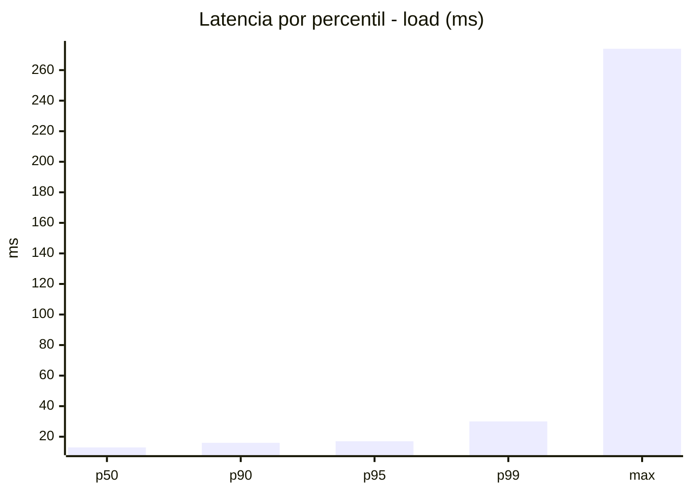
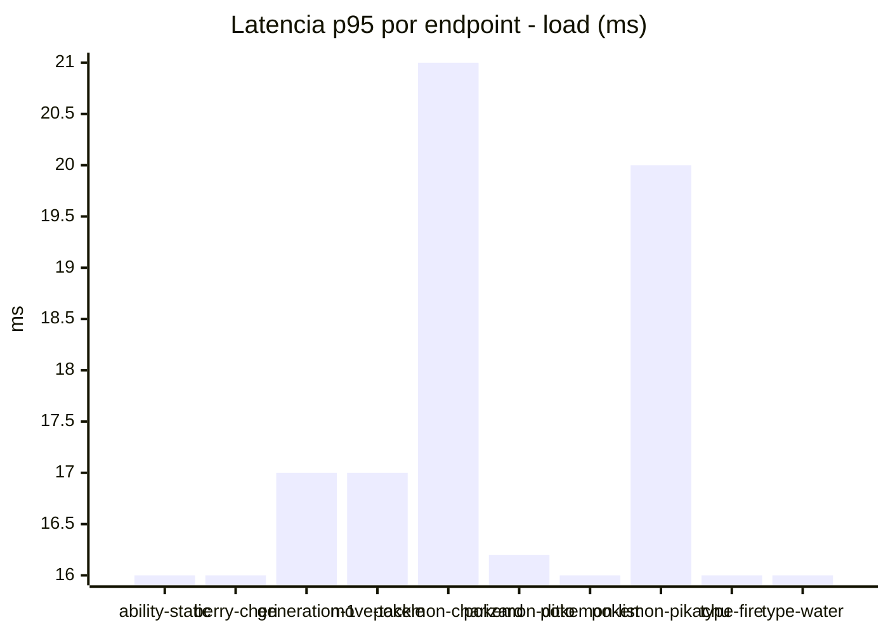
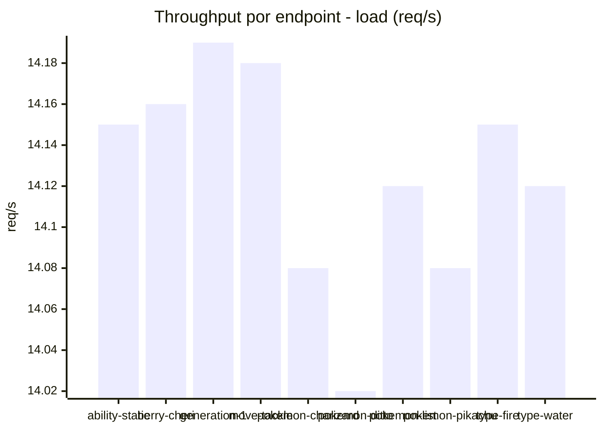
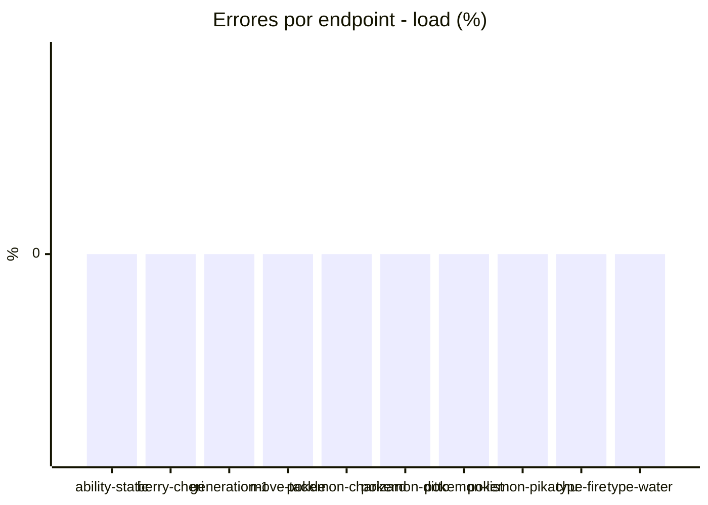
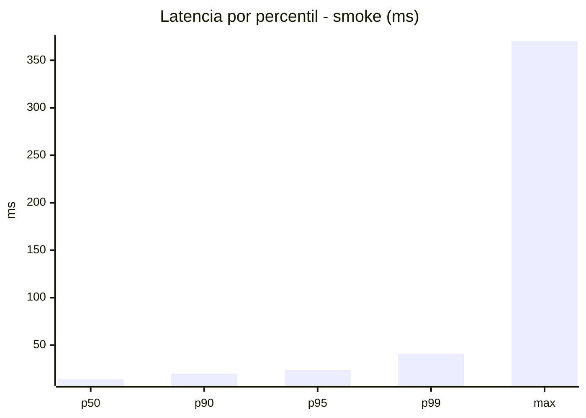
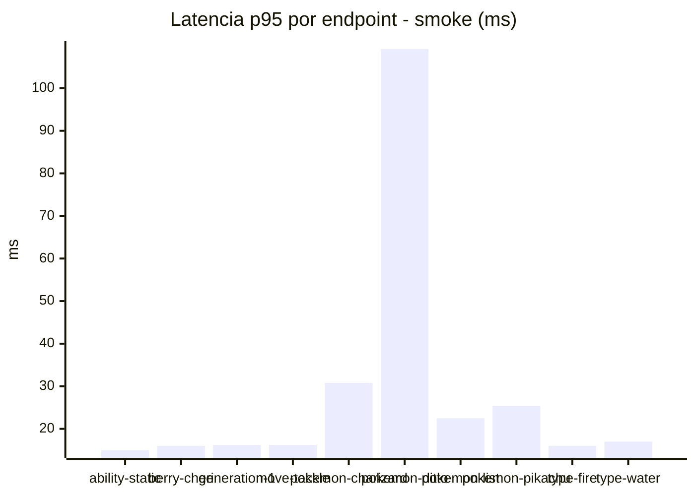
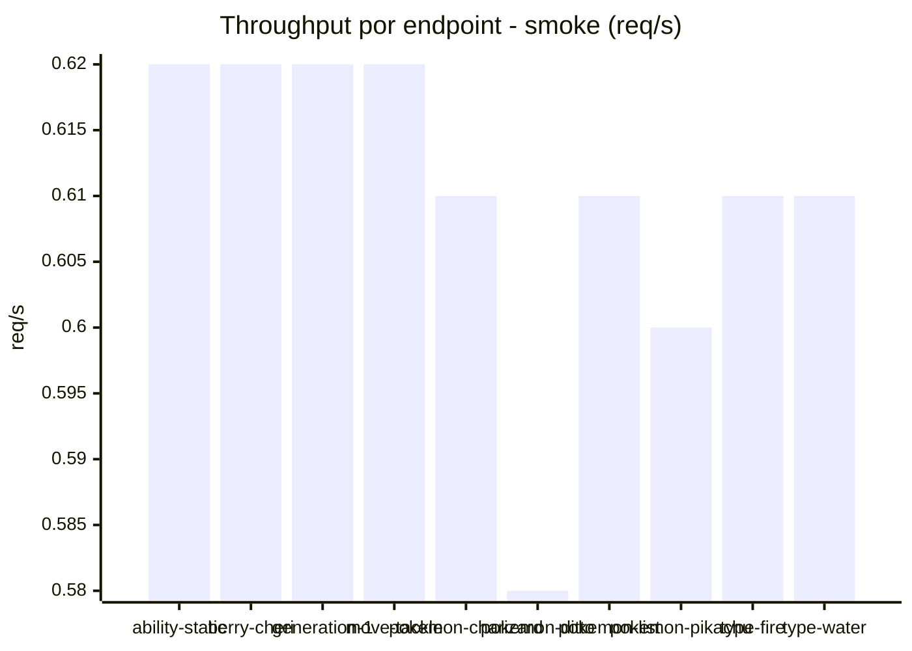

# Reporte de performance - PokeAPI

**Fecha:** 2026-07-27 15:42 UTC  
**Veredicto del agente:** `PASS`  
**Corrida:** [ver en GitHub Actions](https://github.com/lrbg/jmeter-pokeapi-lab/actions/runs/30281059048)  

## Validacion del agente de IA

PASS
1. Todas las métricas de error están por debajo del 1%, alcanzando un 0% de errores en ambas pruebas (load y smoke). Esto indica una alta disponibilidad del servicio.
2. Los tiempos de respuesta p95 son excelentes, con 17 ms en la prueba de carga y 23.9 ms en la prueba de humo, ambos significativamente por debajo del SLO de 800 ms.
3. Se observan algunos picos de latencia en endpoints como `pokemon-ditto` y `pokemon-charizard` durante la prueba de humo, donde el p99 llega a 317.8 ms. Este comportamiento debe ser monitoreado para prevenir problemas en picos de carga.
4. Para optimizar el rendimiento, se recomienda realizar una revisión del endpoint de `pokemon-ditto`, dado que presenta el mayor tiempo máximo y p99 comparado con otros endpoints, lo que podría afectar la experiencia del usuario durante picos de carga.

## Resultados

### Escenario: `load`

| Metrica | Valor |
| --- | --- |
| Muestras | 16753 |
| Errores | 0 (0.0%) |
| Latencia media | 13.5 ms |
| p50 / p90 / p95 / p99 | 13.0 / 16.0 / 17.0 / 30.0 ms |
| Min / Max | 8 / 274 ms |
| Throughput | 140.09 req/s |
| Duracion | 119.6 s |

Detalle por endpoint

| Endpoint | Muestras | Error % | avg | p95 | p99 | req/s |
| --- | --- | --- | --- | --- | --- | --- |
| ability-static | 1675 | 0.0% | 13.1 | 16.0 | 24.0 | 14.15 |
| berry-cheri | 1675 | 0.0% | 12.9 | 16.0 | 32.3 | 14.16 |
| generation-1 | 1675 | 0.0% | 13.4 | 17.0 | 30.0 | 14.19 |
| move-tackle | 1675 | 0.0% | 13.4 | 17.0 | 32.0 | 14.18 |
| pokemon-charizard | 1675 | 0.0% | 15.7 | 21.0 | 34.5 | 14.08 |
| pokemon-ditto | 1676 | 0.0% | 13.2 | 16.2 | 41.8 | 14.02 |
| pokemon-list | 1675 | 0.0% | 12.7 | 16.0 | 24.3 | 14.12 |
| pokemon-pikachu | 1676 | 0.0% | 14.8 | 20.0 | 47.0 | 14.08 |
| type-fire | 1675 | 0.0% | 13.2 | 16.0 | 30.0 | 14.15 |
| type-water | 1676 | 0.0% | 13.0 | 16.0 | 21.0 | 14.12 |

### Escenario: `smoke`

| Metrica | Valor |
| --- | --- |
| Muestras | 162 |
| Errores | 0 (0.0%) |
| Latencia media | 17.6 ms |
| p50 / p90 / p95 / p99 | 14.0 / 20.0 / 23.9 / 40.9 ms |
| Min / Max | 11 / 370 ms |
| Throughput | 5.54 req/s |
| Duracion | 29.2 s |

Detalle por endpoint

| Endpoint | Muestras | Error % | avg | p95 | p99 | req/s |
| --- | --- | --- | --- | --- | --- | --- |
| ability-static | 16 | 0.0% | 13.5 | 15.0 | 15.0 | 0.62 |
| berry-cheri | 16 | 0.0% | 13 | 16.0 | 16.0 | 0.62 |
| generation-1 | 16 | 0.0% | 13.9 | 16.2 | 16.9 | 0.62 |
| move-tackle | 16 | 0.0% | 13.9 | 16.2 | 16.9 | 0.62 |
| pokemon-charizard | 16 | 0.0% | 21.4 | 30.8 | 32.5 | 0.61 |
| pokemon-ditto | 17 | 0.0% | 36.2 | 109.2 | 317.8 | 0.58 |
| pokemon-list | 16 | 0.0% | 16 | 22.5 | 35.7 | 0.61 |
| pokemon-pikachu | 17 | 0.0% | 18.9 | 25.4 | 33.1 | 0.6 |
| type-fire | 16 | 0.0% | 14 | 16.0 | 16.0 | 0.61 |
| type-water | 16 | 0.0% | 14.1 | 17.0 | 17.0 | 0.61 |

