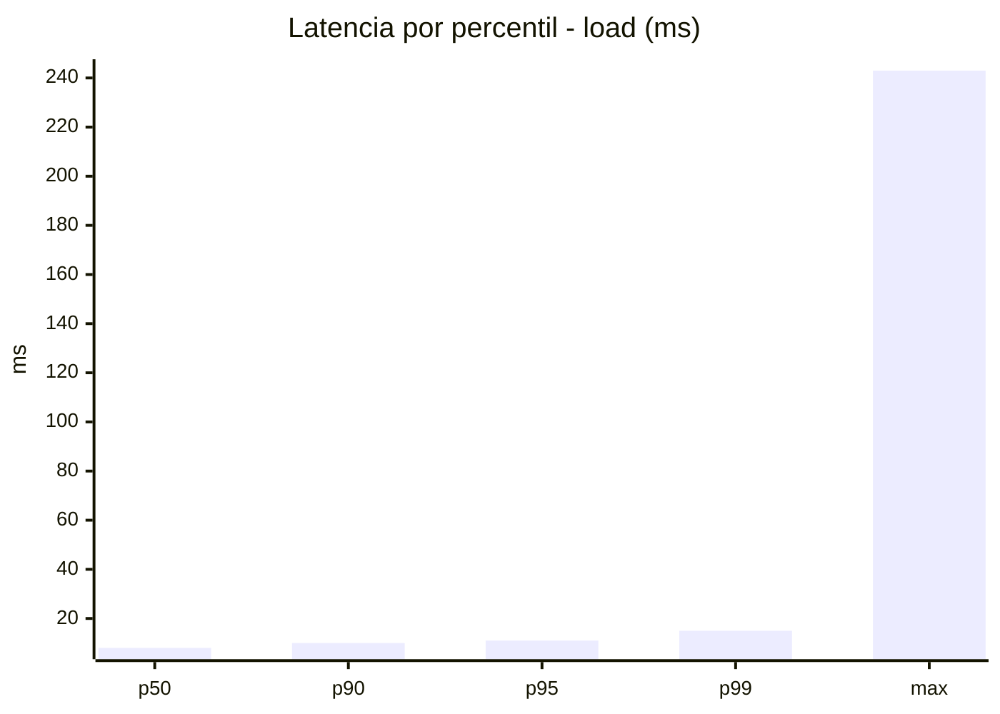
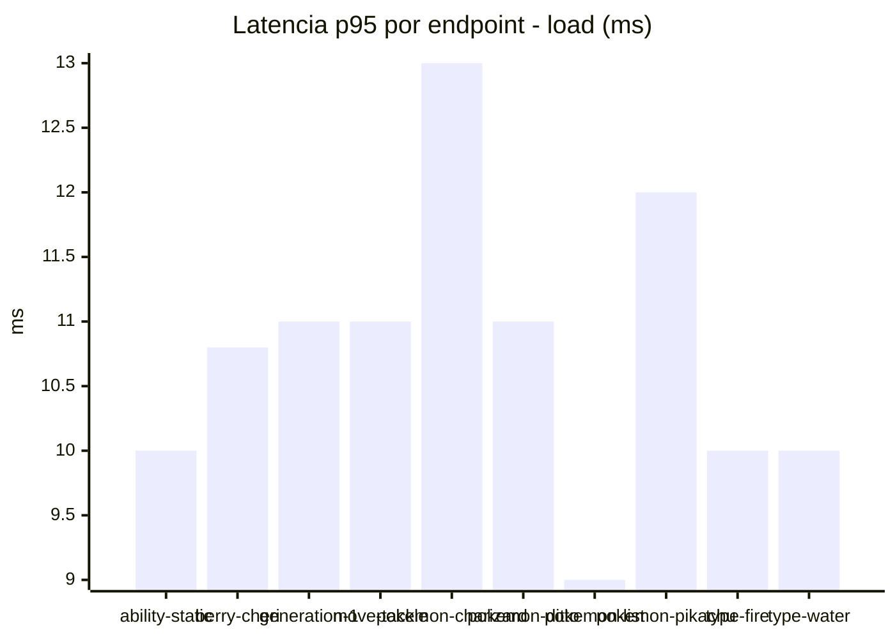
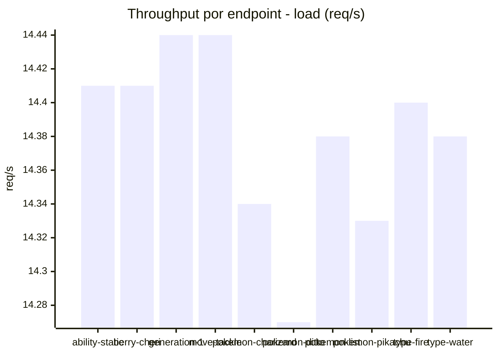
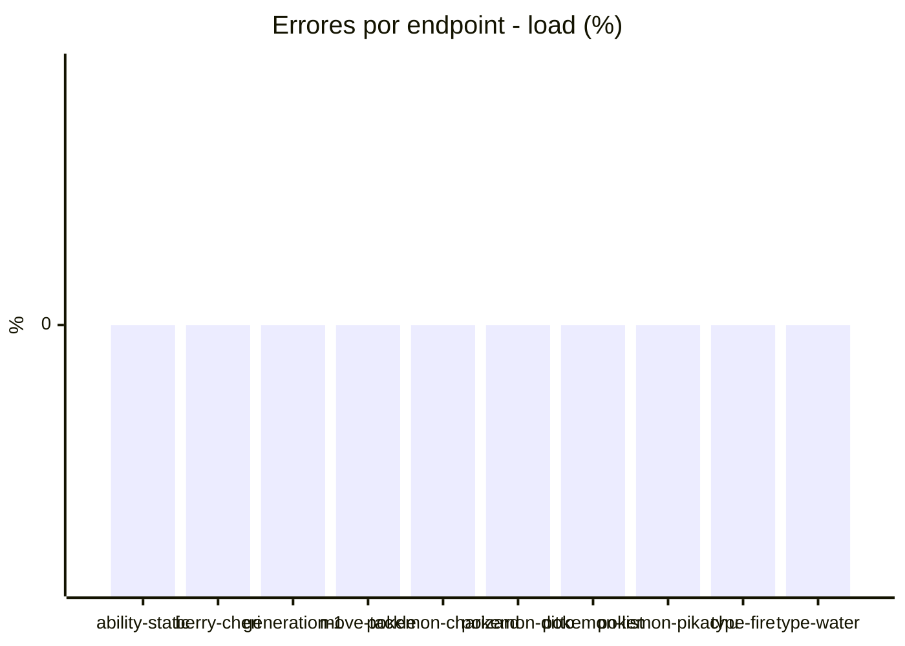
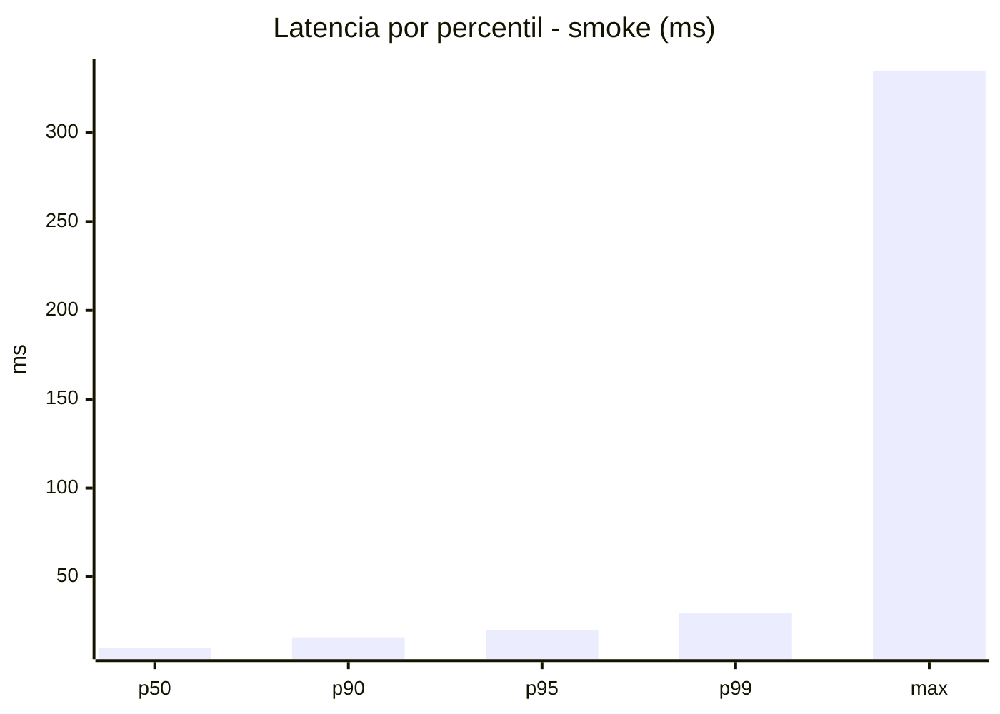
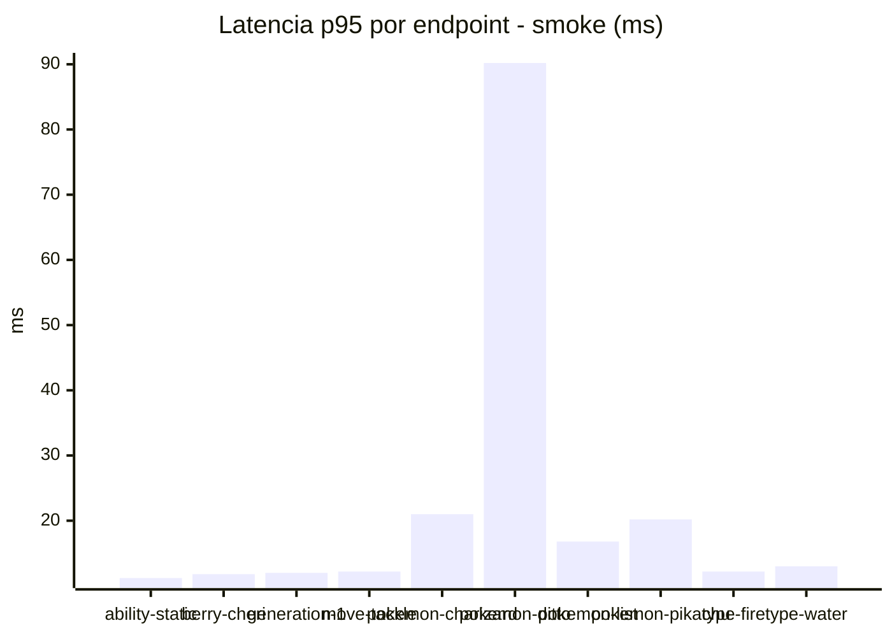
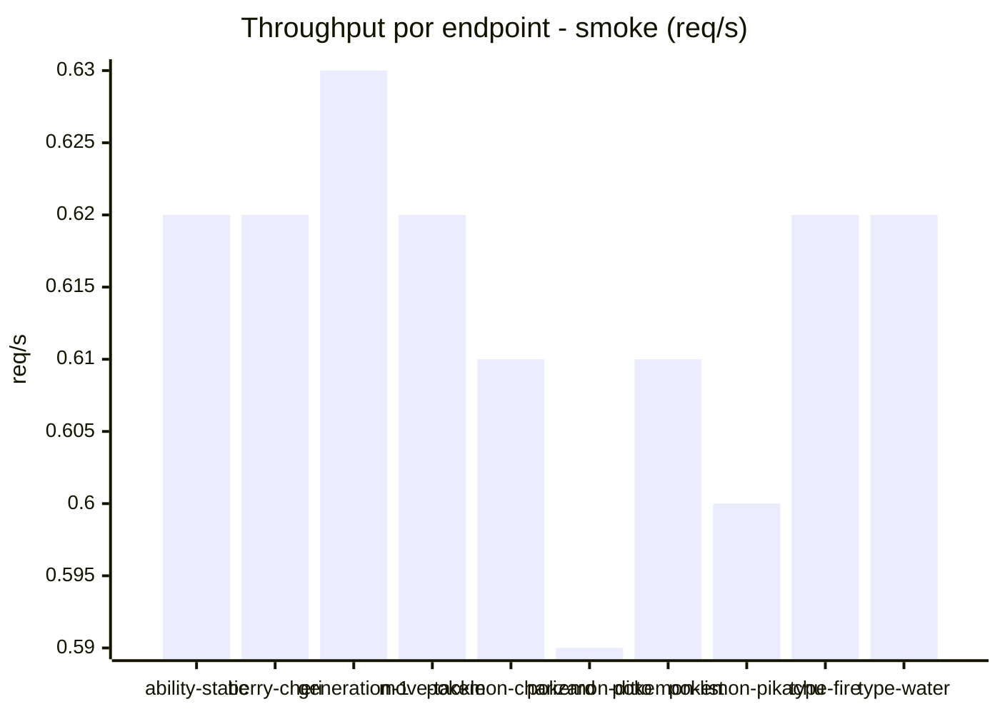

# Reporte de performance - PokeAPI

**Fecha:** 2026-07-28 15:19 UTC  
**Veredicto del agente:** `PASS`  
**Corrida:** [ver en GitHub Actions](https://github.com/lrbg/jmeter-pokeapi-lab/actions/runs/30372584309)  

## Validacion del agente de IA

PASS

1. Todos los endpoints presentan un porcentaje de errores del 0.0%, cumpliendo perfectamente con el SLO de error (< 1%).
2. El p95 general de 11 ms está muy por debajo del umbral de 800 ms, lo que indica una excelente capacidad de respuesta del sistema.
3. Se recomienda mantener esta carga y monitorizar el rendimiento con diferentes patrones de tráfico para asegurar la estabilidad ante picos de uso.
4. Algunos endpoints, como "pokemon-ditto", presentan un tiempo máximo de respuesta de 243 ms, sugiriendo que se debe investigar su rendimiento en futuros tests para identificar y resolver posibles cuellos de botella.

## Resultados

### Escenario: `load`

| Metrica | Valor |
| --- | --- |
| Muestras | 17051 |
| Errores | 0 (0.0%) |
| Latencia media | 8.0 ms |
| p50 / p90 / p95 / p99 | 8.0 / 10.0 / 11.0 / 15.0 ms |
| Min / Max | 5 / 243 ms |
| Throughput | 142.6 req/s |
| Duracion | 119.6 s |

Detalle por endpoint

| Endpoint | Muestras | Error % | avg | p95 | p99 | req/s |
| --- | --- | --- | --- | --- | --- | --- |
| ability-static | 1705 | 0.0% | 7.8 | 10.0 | 14.0 | 14.41 |
| berry-cheri | 1705 | 0.0% | 7.6 | 10.8 | 14.0 | 14.41 |
| generation-1 | 1705 | 0.0% | 7.9 | 11.0 | 15.0 | 14.44 |
| move-tackle | 1705 | 0.0% | 7.9 | 11.0 | 13.0 | 14.44 |
| pokemon-charizard | 1705 | 0.0% | 9.1 | 13.0 | 20.0 | 14.34 |
| pokemon-ditto | 1706 | 0.0% | 8.0 | 11.0 | 14.0 | 14.27 |
| pokemon-list | 1705 | 0.0% | 7.3 | 9.0 | 13.0 | 14.38 |
| pokemon-pikachu | 1705 | 0.0% | 8.7 | 12.0 | 20.0 | 14.33 |
| type-fire | 1705 | 0.0% | 7.8 | 10.0 | 14.0 | 14.4 |
| type-water | 1705 | 0.0% | 7.9 | 10.0 | 14.0 | 14.38 |

### Escenario: `smoke`

| Metrica | Valor |
| --- | --- |
| Muestras | 162 |
| Errores | 0 (0.0%) |
| Latencia media | 13.0 ms |
| p50 / p90 / p95 / p99 | 10.0 / 16.0 / 19.9 / 29.8 ms |
| Min / Max | 7 / 335 ms |
| Throughput | 5.58 req/s |
| Duracion | 29.0 s |

Detalle por endpoint

| Endpoint | Muestras | Error % | avg | p95 | p99 | req/s |
| --- | --- | --- | --- | --- | --- | --- |
| ability-static | 16 | 0.0% | 9.1 | 11.2 | 11.8 | 0.62 |
| berry-cheri | 16 | 0.0% | 8.8 | 11.8 | 18.3 | 0.62 |
| generation-1 | 16 | 0.0% | 9.6 | 12.0 | 12.0 | 0.63 |
| move-tackle | 16 | 0.0% | 9.6 | 12.2 | 12.8 | 0.62 |
| pokemon-charizard | 16 | 0.0% | 16.6 | 21.0 | 21.0 | 0.61 |
| pokemon-ditto | 17 | 0.0% | 29.3 | 90.2 | 286.0 | 0.59 |
| pokemon-list | 16 | 0.0% | 10.4 | 16.8 | 28.1 | 0.61 |
| pokemon-pikachu | 17 | 0.0% | 15 | 20.2 | 27.2 | 0.6 |
| type-fire | 16 | 0.0% | 10.1 | 12.2 | 12.8 | 0.62 |
| type-water | 16 | 0.0% | 10.4 | 13.0 | 13.0 | 0.62 |

