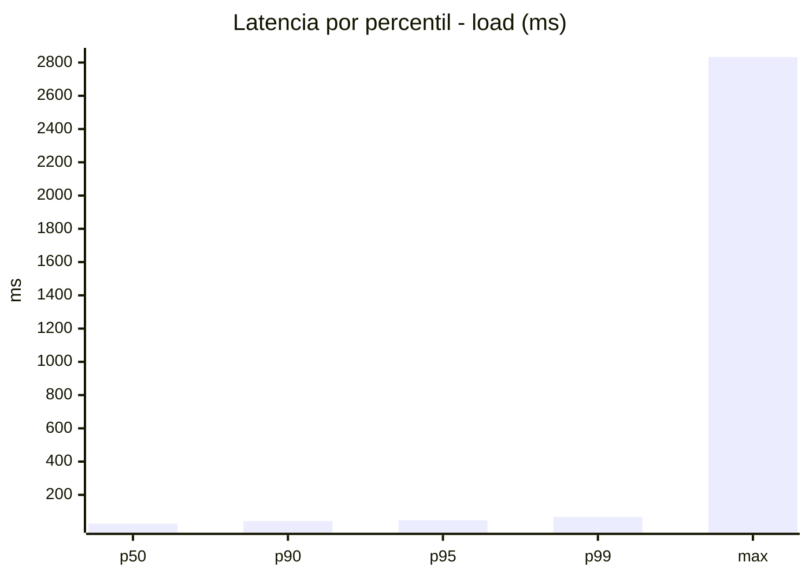
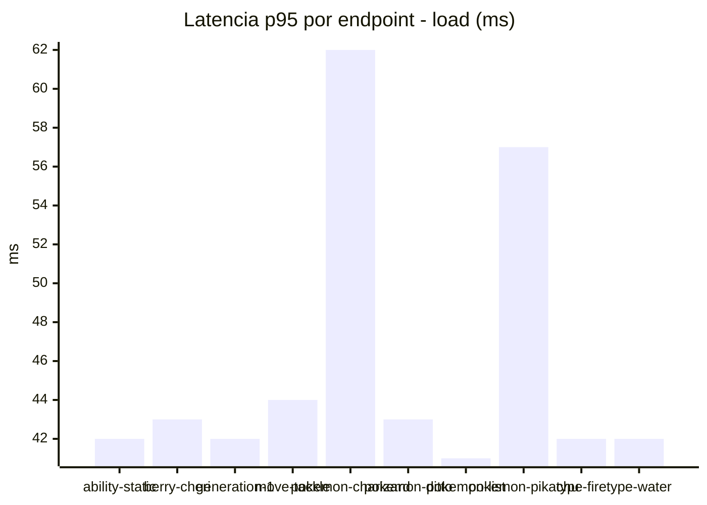
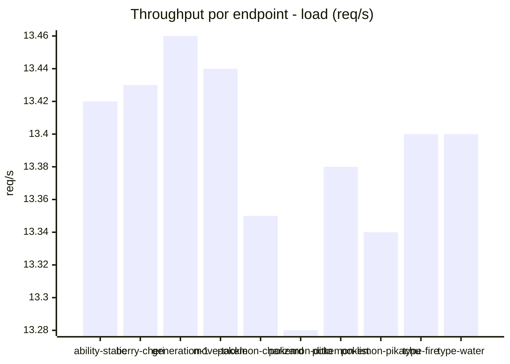
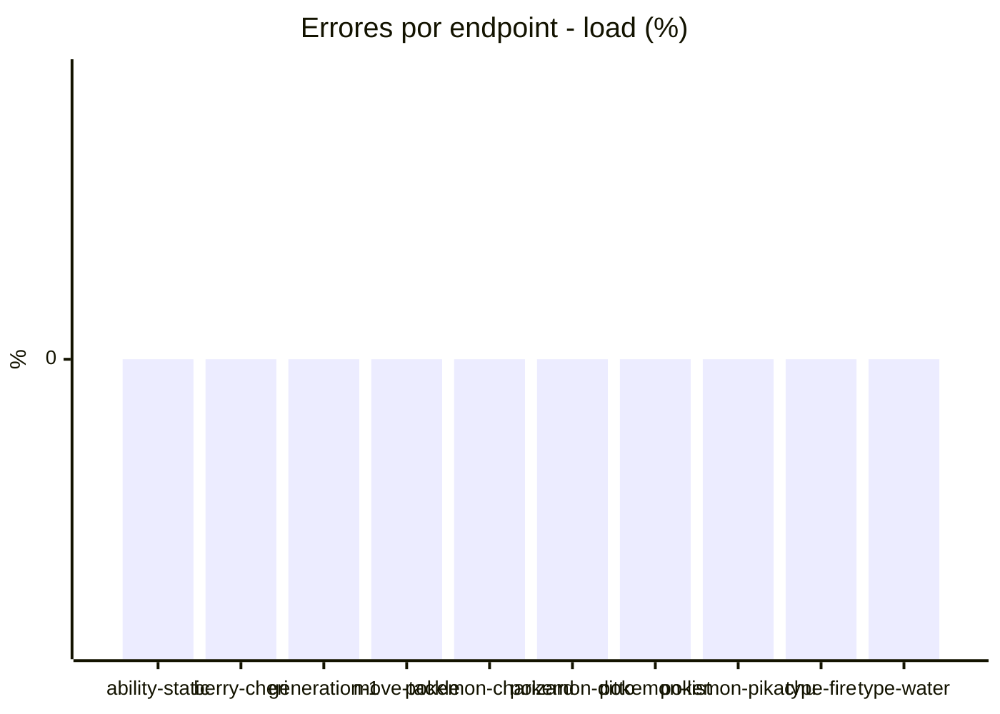
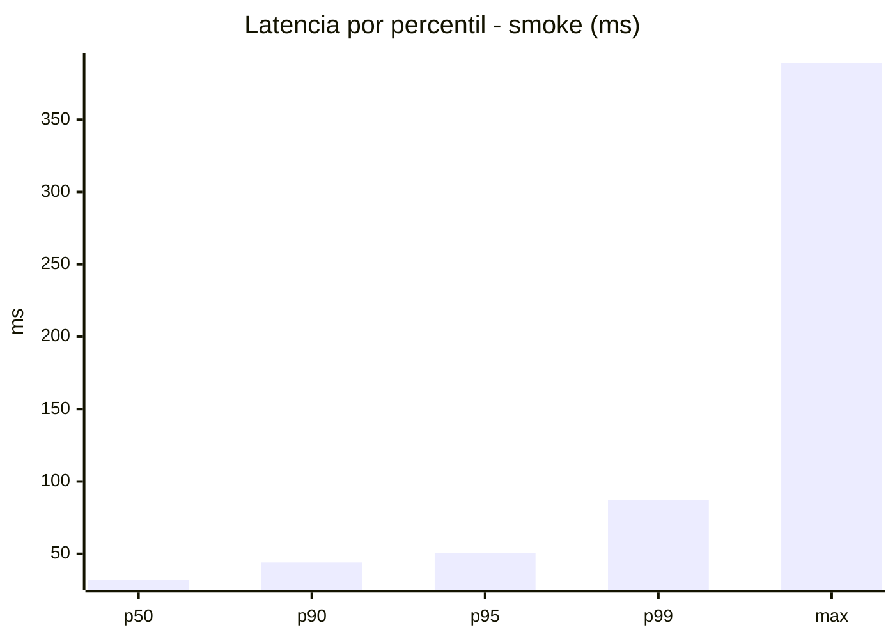
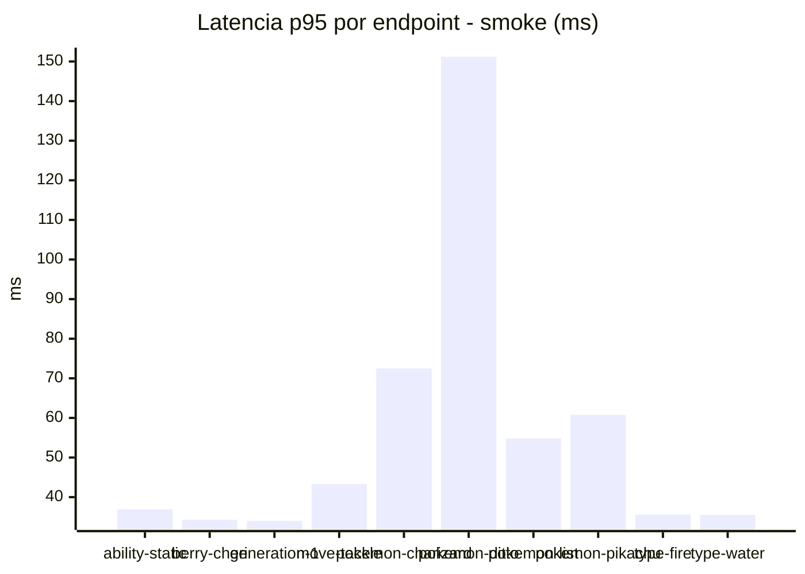
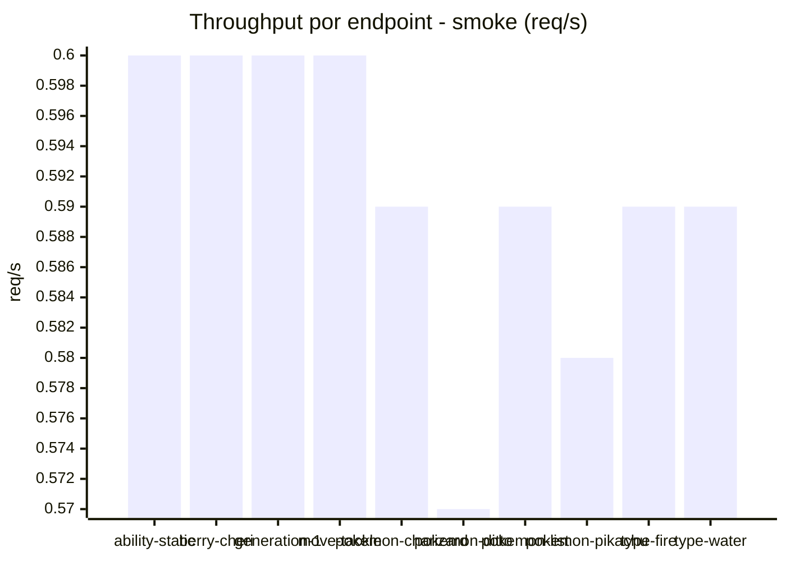

# Reporte de performance - PokeAPI

**Fecha:** 2026-07-29 15:09 UTC  
**Veredicto del agente:** `PASS`  
**Corrida:** [ver en GitHub Actions](https://github.com/lrbg/jmeter-pokeapi-lab/actions/runs/30464270151)  

## Validacion del agente de IA

PASS

1. Todos los SLOs se cumplen: se reporta un 0% de errores y los tiempos p95 están muy por debajo de los 800 ms en todas las pruebas.
2. Aunque el promedio de tiempos de respuesta es adecuado, se observa un máximo de 2833 ms en la carga, lo que podría indicar algunas anomalías en la red o puntos de congestión. Se recomienda investigar dichos picos.
3. Se sugiere realizar pruebas adicionales con mayor volumen de carga para asegurar la estabilidad del sistema bajo condiciones extremas.
4. Mantener un monitoreo constante de las métricas de desempeño en producción para poder anticipar y mitigar riesgos.

## Resultados

### Escenario: `load`

| Metrica | Valor |
| --- | --- |
| Muestras | 15879 |
| Errores | 0 (0.0%) |
| Latencia media | 30.9 ms |
| p50 / p90 / p95 / p99 | 27.0 / 42.0 / 47.0 / 68.0 ms |
| Min / Max | 16 / 2833 ms |
| Throughput | 132.74 req/s |
| Duracion | 119.6 s |

Detalle por endpoint

| Endpoint | Muestras | Error % | avg | p95 | p99 | req/s |
| --- | --- | --- | --- | --- | --- | --- |
| ability-static | 1588 | 0.0% | 29.4 | 42.0 | 47.0 | 13.42 |
| berry-cheri | 1587 | 0.0% | 30.4 | 43.0 | 83.8 | 13.43 |
| generation-1 | 1588 | 0.0% | 29.4 | 42.0 | 47.0 | 13.46 |
| move-tackle | 1587 | 0.0% | 30.4 | 44.0 | 52.0 | 13.44 |
| pokemon-charizard | 1588 | 0.0% | 37.1 | 62.0 | 123.0 | 13.35 |
| pokemon-ditto | 1589 | 0.0% | 29.2 | 43.0 | 49.1 | 13.28 |
| pokemon-list | 1588 | 0.0% | 27.4 | 41.0 | 46.0 | 13.38 |
| pokemon-pikachu | 1588 | 0.0% | 35.2 | 57.0 | 103.1 | 13.34 |
| type-fire | 1588 | 0.0% | 29.7 | 42.0 | 54.9 | 13.4 |
| type-water | 1588 | 0.0% | 30.6 | 42.0 | 47.0 | 13.4 |

### Escenario: `smoke`

| Metrica | Valor |
| --- | --- |
| Muestras | 155 |
| Errores | 0 (0.0%) |
| Latencia media | 35.4 ms |
| p50 / p90 / p95 / p99 | 32.0 / 44.0 / 50.3 / 87.4 ms |
| Min / Max | 22 / 389 ms |
| Throughput | 5.34 req/s |
| Duracion | 29.0 s |

Detalle por endpoint

| Endpoint | Muestras | Error % | avg | p95 | p99 | req/s |
| --- | --- | --- | --- | --- | --- | --- |
| ability-static | 15 | 0.0% | 30.5 | 36.9 | 38.6 | 0.6 |
| berry-cheri | 15 | 0.0% | 27.8 | 34.3 | 34.9 | 0.6 |
| generation-1 | 15 | 0.0% | 28.5 | 34.0 | 34.0 | 0.6 |
| move-tackle | 15 | 0.0% | 32 | 43.3 | 49.5 | 0.6 |
| pokemon-charizard | 16 | 0.0% | 45.2 | 72.5 | 73.7 | 0.59 |
| pokemon-ditto | 16 | 0.0% | 54.9 | 151.2 | 341.4 | 0.57 |
| pokemon-list | 16 | 0.0% | 32.3 | 54.8 | 70.9 | 0.59 |
| pokemon-pikachu | 16 | 0.0% | 42.2 | 60.8 | 93.7 | 0.58 |
| type-fire | 15 | 0.0% | 29.2 | 35.6 | 36.7 | 0.59 |
| type-water | 16 | 0.0% | 29.6 | 35.5 | 36.7 | 0.59 |

