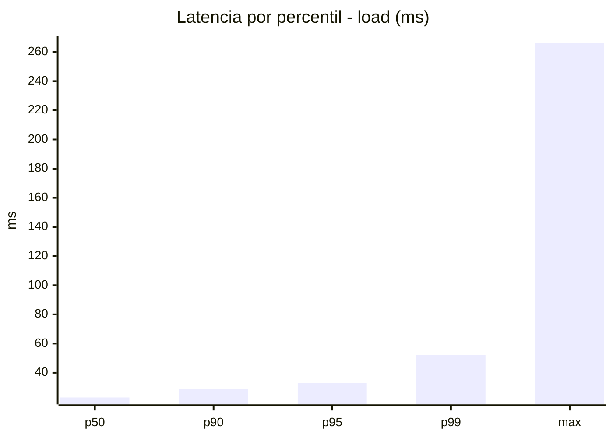
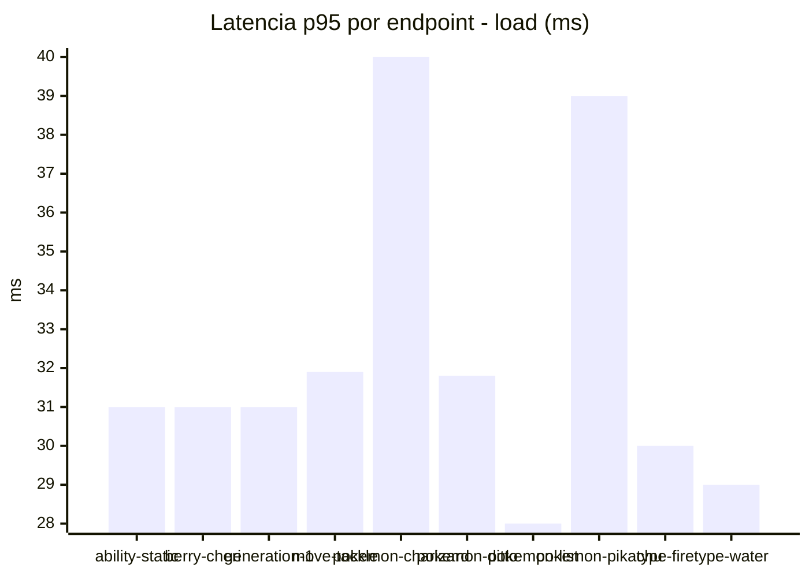
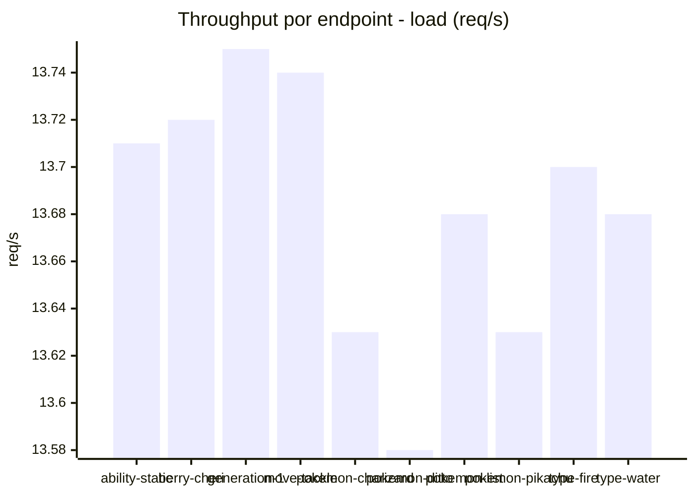
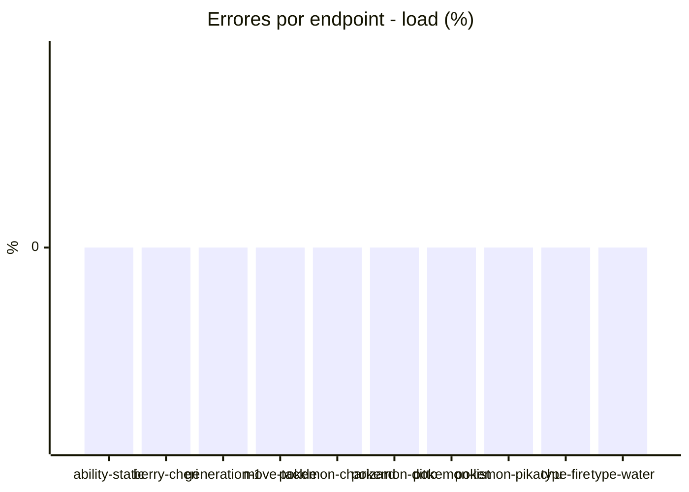
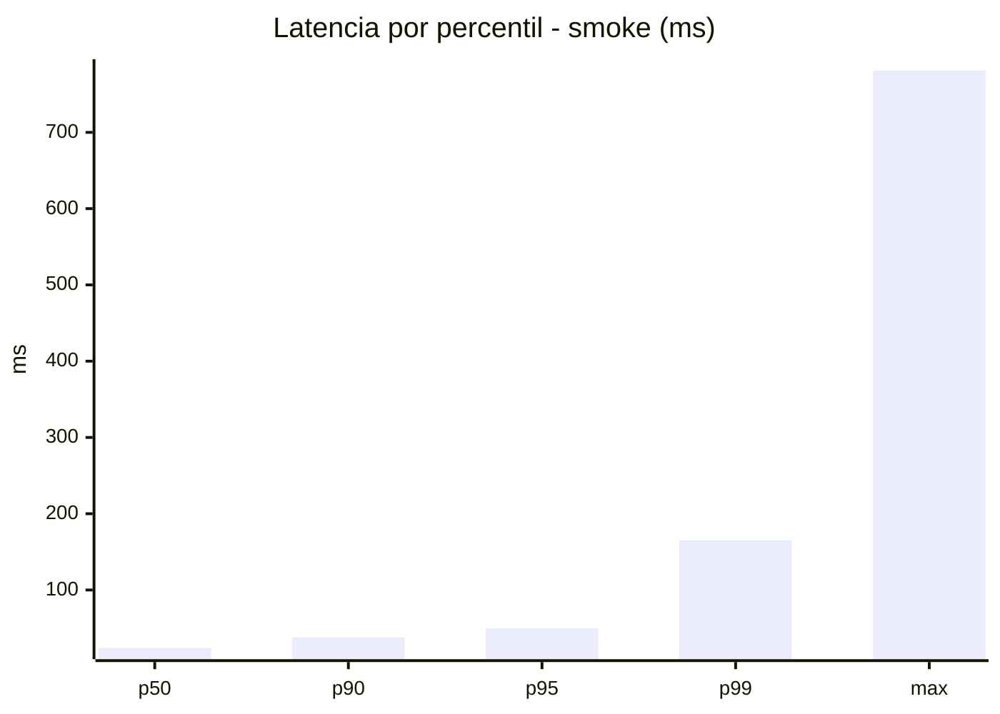
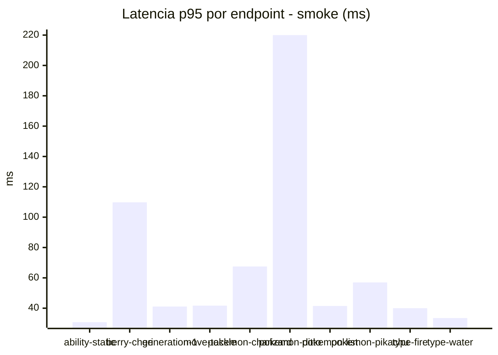
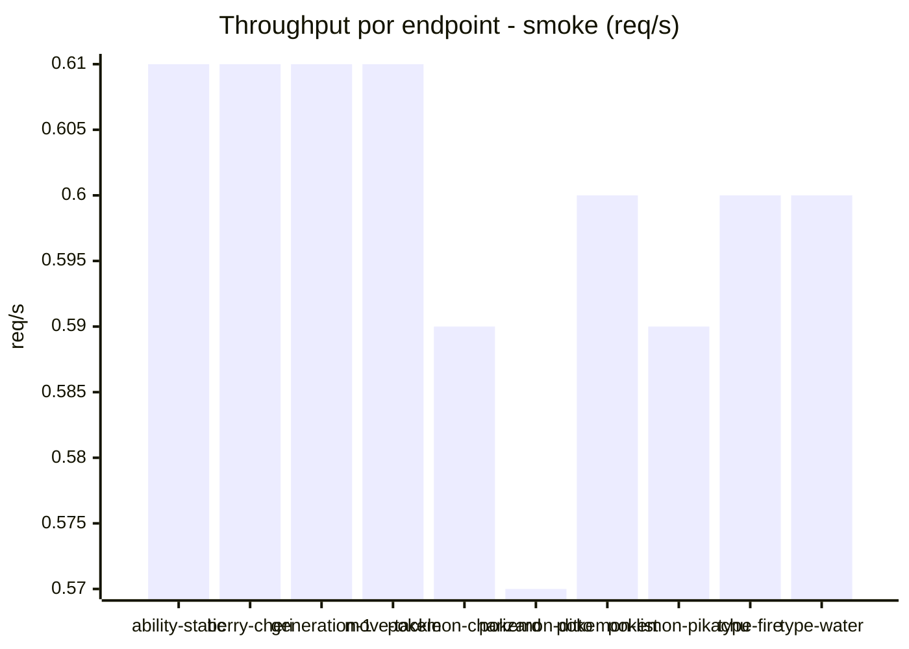

# Reporte de performance - PokeAPI

**Fecha:** 2026-07-30 15:11 UTC  
**Veredicto del agente:** `PASS`  
**Corrida:** [ver en GitHub Actions](https://github.com/lrbg/jmeter-pokeapi-lab/actions/runs/30555191159)  

## Validacion del agente de IA

PASS

1. Todas las métricas de error están por debajo del 1% con un 0% de errores, lo que indica una alta disponibilidad y estabilidad del sistema.
2. Los tiempos de respuesta en el escenario de carga son muy superiores a los límites establecidos, con un p95 de 33 ms, lo que es notablemente inferior a los 800 ms de SLOs, lo que confirma que el rendimiento es excelente.
3. En el escenario de humo, aunque el p95 de 50 ms está dentro de los limites, hay un máximo de 781 ms para el endpoint "pokemon-ditto", lo cual es atípico y debe ser revisado para entender las causas y optimizarlo. 
4. Recomendación: Asegúrese de realizar pruebas regulares y monitorear la latencia de cada endpoint, especialmente aquellos con variaciones significativas, para mantener un desempeño óptimo.

## Resultados

### Escenario: `load`

| Metrica | Valor |
| --- | --- |
| Muestras | 16225 |
| Errores | 0 (0.0%) |
| Latencia media | 23.8 ms |
| p50 / p90 / p95 / p99 | 23.0 / 29.0 / 33.0 / 52.0 ms |
| Min / Max | 13 / 266 ms |
| Throughput | 135.63 req/s |
| Duracion | 119.6 s |

Detalle por endpoint

| Endpoint | Muestras | Error % | avg | p95 | p99 | req/s |
| --- | --- | --- | --- | --- | --- | --- |
| ability-static | 1622 | 0.0% | 23.3 | 31.0 | 44.0 | 13.71 |
| berry-cheri | 1622 | 0.0% | 23.0 | 31.0 | 44.6 | 13.72 |
| generation-1 | 1622 | 0.0% | 23.0 | 31.0 | 46.0 | 13.75 |
| move-tackle | 1622 | 0.0% | 23.6 | 31.9 | 40.8 | 13.74 |
| pokemon-charizard | 1623 | 0.0% | 28.2 | 40.0 | 69.8 | 13.63 |
| pokemon-ditto | 1624 | 0.0% | 23.2 | 31.8 | 43.0 | 13.58 |
| pokemon-list | 1623 | 0.0% | 22.0 | 28.0 | 40.0 | 13.68 |
| pokemon-pikachu | 1623 | 0.0% | 26.2 | 39.0 | 61.0 | 13.63 |
| type-fire | 1622 | 0.0% | 23.2 | 30.0 | 41.0 | 13.7 |
| type-water | 1622 | 0.0% | 22.4 | 29.0 | 38.8 | 13.68 |

### Escenario: `smoke`

| Metrica | Valor |
| --- | --- |
| Muestras | 157 |
| Errores | 0 (0.0%) |
| Latencia media | 32.7 ms |
| p50 / p90 / p95 / p99 | 24.0 / 38.0 / 50.0 / 165.2 ms |
| Min / Max | 16 / 781 ms |
| Throughput | 5.4 req/s |
| Duracion | 29.1 s |

Detalle por endpoint

| Endpoint | Muestras | Error % | avg | p95 | p99 | req/s |
| --- | --- | --- | --- | --- | --- | --- |
| ability-static | 16 | 0.0% | 23.1 | 30.8 | 32.5 | 0.61 |
| berry-cheri | 15 | 0.0% | 39 | 109.8 | 230.8 | 0.61 |
| generation-1 | 15 | 0.0% | 26.1 | 41.1 | 56.2 | 0.61 |
| move-tackle | 15 | 0.0% | 25.6 | 41.7 | 57.9 | 0.61 |
| pokemon-charizard | 16 | 0.0% | 36.1 | 67.5 | 85.5 | 0.59 |
| pokemon-ditto | 16 | 0.0% | 70.4 | 220.0 | 668.8 | 0.57 |
| pokemon-list | 16 | 0.0% | 25.3 | 41.5 | 47.5 | 0.6 |
| pokemon-pikachu | 16 | 0.0% | 33.1 | 57.0 | 64.2 | 0.59 |
| type-fire | 16 | 0.0% | 25.3 | 40.0 | 44.8 | 0.6 |
| type-water | 16 | 0.0% | 22.1 | 33.5 | 34.7 | 0.6 |

