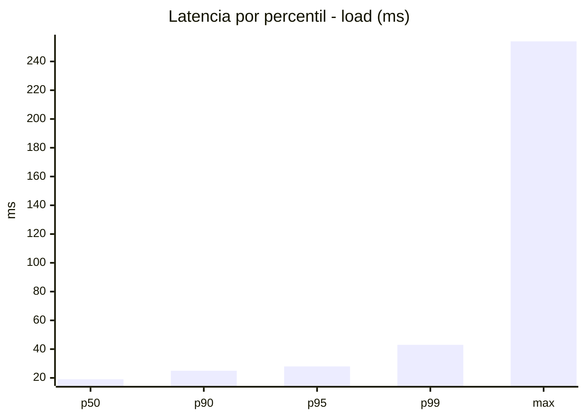
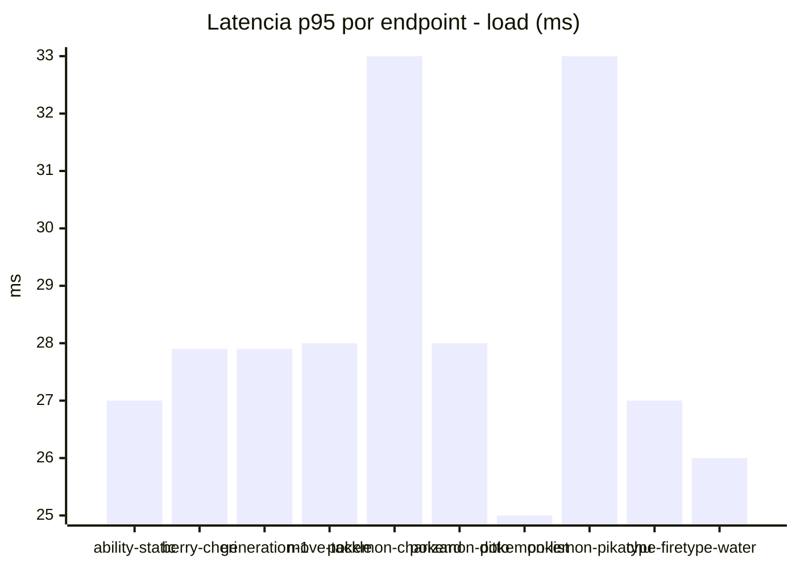
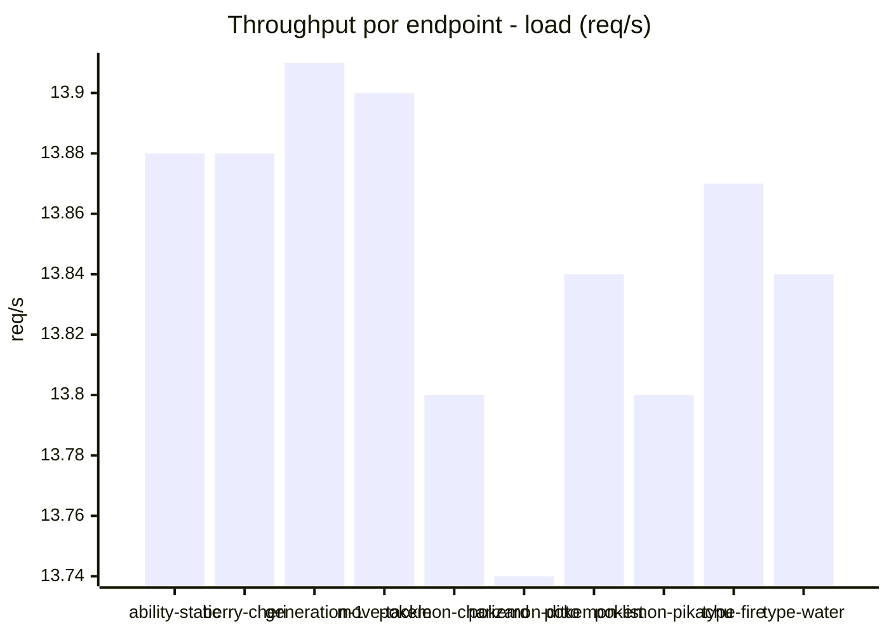
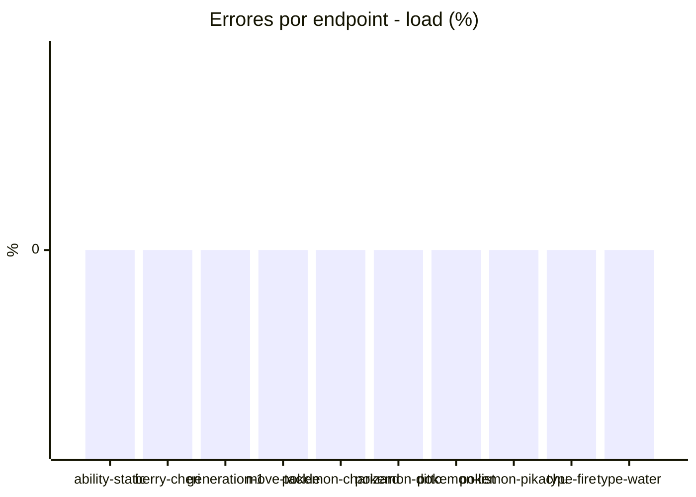
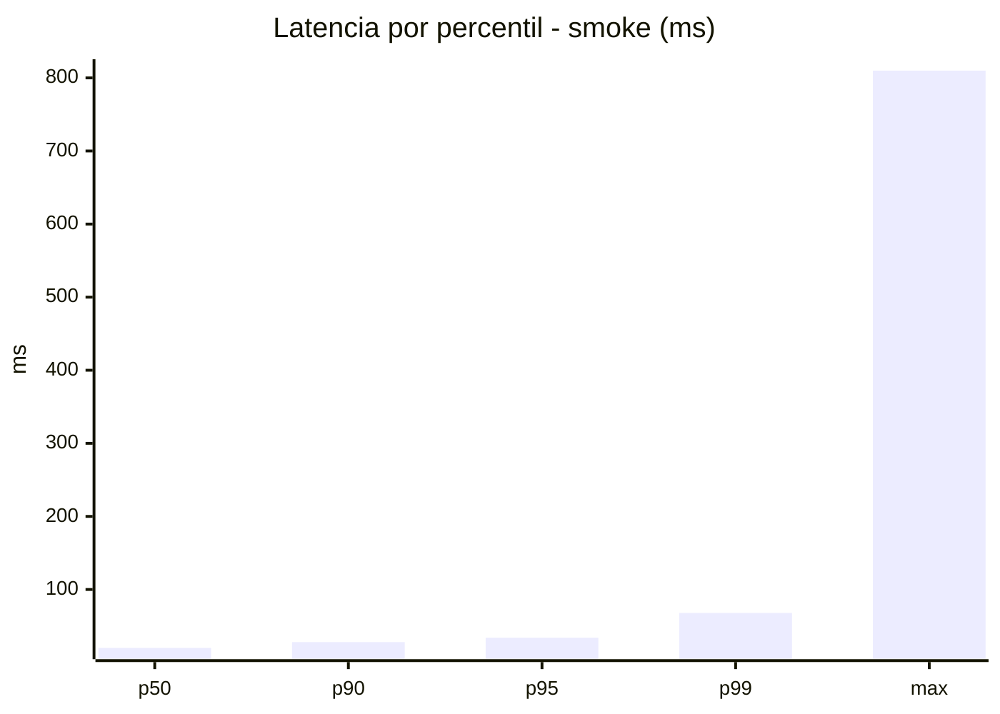
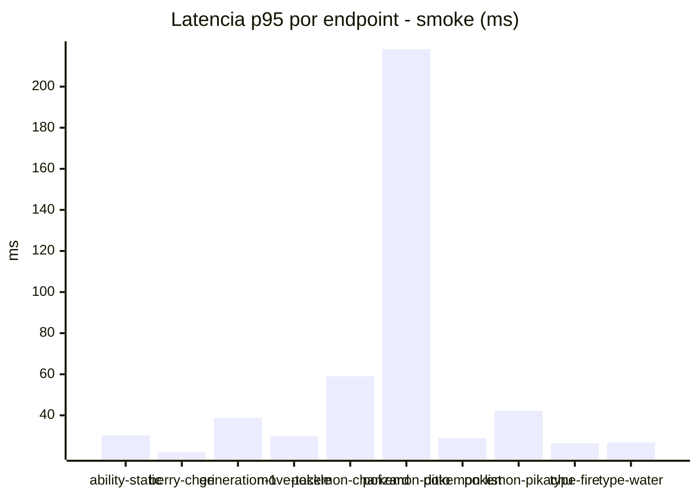
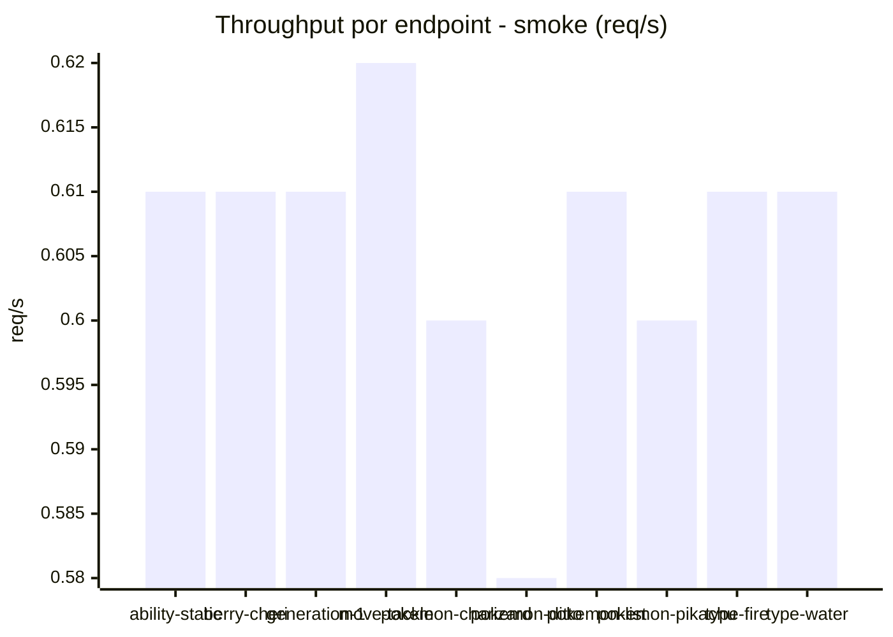

# Reporte de performance - PokeAPI

**Fecha:** 2026-07-31 15:18 UTC  
**Veredicto del agente:** `PASS`  
**Corrida:** [ver en GitHub Actions](https://github.com/lrbg/jmeter-pokeapi-lab/actions/runs/30642156665)  

## Validacion del agente de IA

PASS (fallback por umbrales)

- Error maximo: 0.0%
- p95 maximo: 34.0 ms

## Resultados

### Escenario: `load`

| Metrica | Valor |
| --- | --- |
| Muestras | 16426 |
| Errores | 0 (0.0%) |
| Latencia media | 19.9 ms |
| p50 / p90 / p95 / p99 | 19.0 / 25.0 / 28.0 / 43.0 ms |
| Min / Max | 13 / 254 ms |
| Throughput | 137.28 req/s |
| Duracion | 119.7 s |

Detalle por endpoint

| Endpoint | Muestras | Error % | avg | p95 | p99 | req/s |
| --- | --- | --- | --- | --- | --- | --- |
| ability-static | 1642 | 0.0% | 19.6 | 27.0 | 36.6 | 13.88 |
| berry-cheri | 1642 | 0.0% | 19.4 | 27.9 | 41.6 | 13.88 |
| generation-1 | 1642 | 0.0% | 19.5 | 27.9 | 45.0 | 13.91 |
| move-tackle | 1642 | 0.0% | 19.8 | 28.0 | 38.6 | 13.9 |
| pokemon-charizard | 1642 | 0.0% | 22.8 | 33.0 | 51.2 | 13.8 |
| pokemon-ditto | 1644 | 0.0% | 19.8 | 28.0 | 43.1 | 13.74 |
| pokemon-list | 1642 | 0.0% | 18.6 | 25.0 | 34.6 | 13.84 |
| pokemon-pikachu | 1644 | 0.0% | 22.4 | 33.0 | 46.6 | 13.8 |
| type-fire | 1643 | 0.0% | 18.8 | 27.0 | 41.0 | 13.87 |
| type-water | 1643 | 0.0% | 18.5 | 26.0 | 38.0 | 13.84 |

### Escenario: `smoke`

| Metrica | Valor |
| --- | --- |
| Muestras | 158 |
| Errores | 0 (0.0%) |
| Latencia media | 27.2 ms |
| p50 / p90 / p95 / p99 | 20.0 / 28.0 / 34.0 / 67.9 ms |
| Min / Max | 15 / 810 ms |
| Throughput | 5.43 req/s |
| Duracion | 29.1 s |

Detalle por endpoint

| Endpoint | Muestras | Error % | avg | p95 | p99 | req/s |
| --- | --- | --- | --- | --- | --- | --- |
| ability-static | 16 | 0.0% | 22.4 | 30.2 | 35.6 | 0.61 |
| berry-cheri | 16 | 0.0% | 19.2 | 22.2 | 22.9 | 0.61 |
| generation-1 | 15 | 0.0% | 21.7 | 38.8 | 47.8 | 0.61 |
| move-tackle | 15 | 0.0% | 22.1 | 29.9 | 31.6 | 0.62 |
| pokemon-charizard | 16 | 0.0% | 31 | 59.0 | 83.0 | 0.6 |
| pokemon-ditto | 16 | 0.0% | 68.6 | 218.2 | 691.6 | 0.58 |
| pokemon-list | 16 | 0.0% | 20.4 | 28.8 | 32.9 | 0.61 |
| pokemon-pikachu | 16 | 0.0% | 26.8 | 42.2 | 50.0 | 0.6 |
| type-fire | 16 | 0.0% | 19.9 | 26.5 | 27.7 | 0.61 |
| type-water | 16 | 0.0% | 19.1 | 26.8 | 28.5 | 0.61 |

