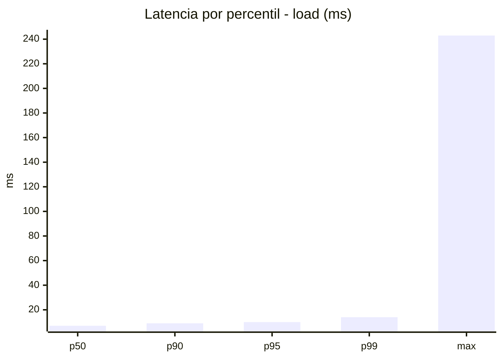
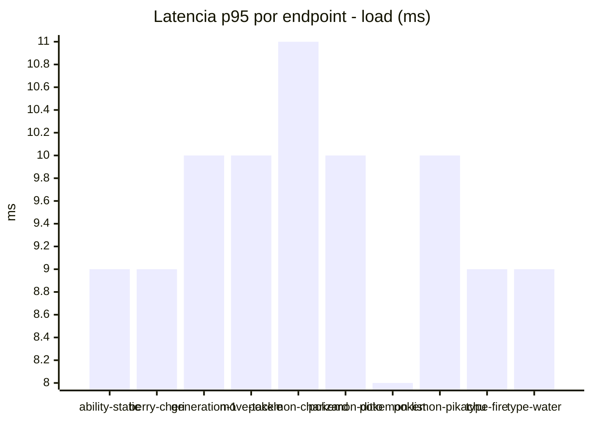
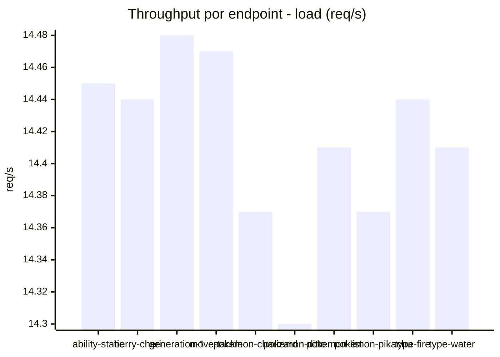
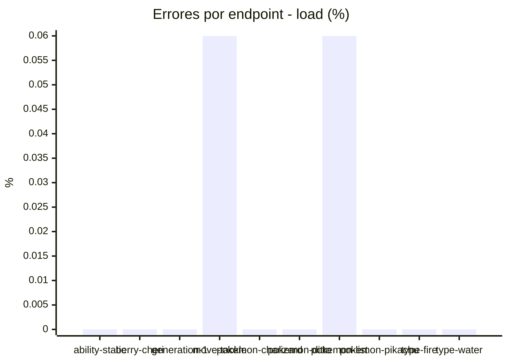
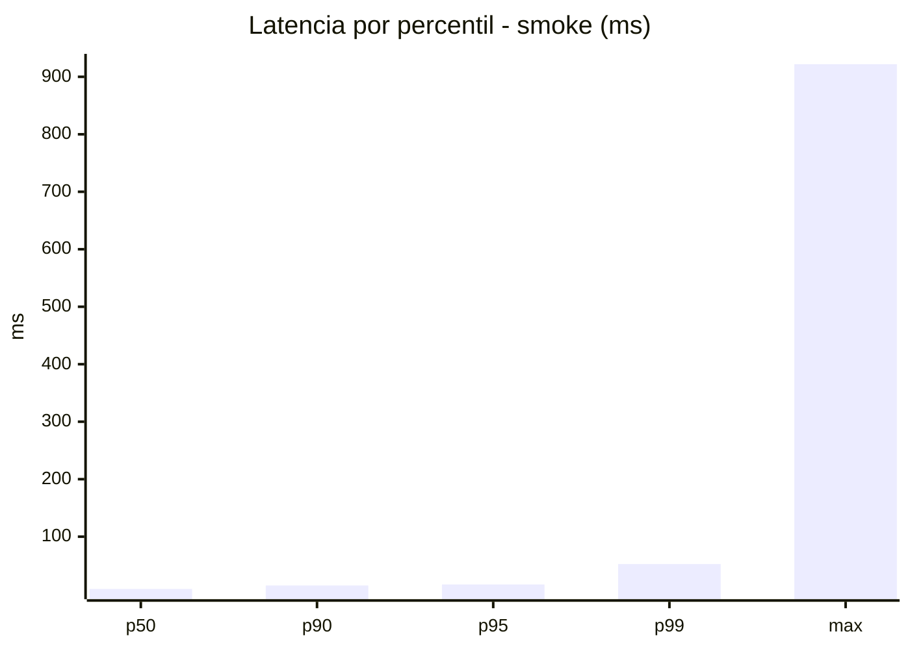
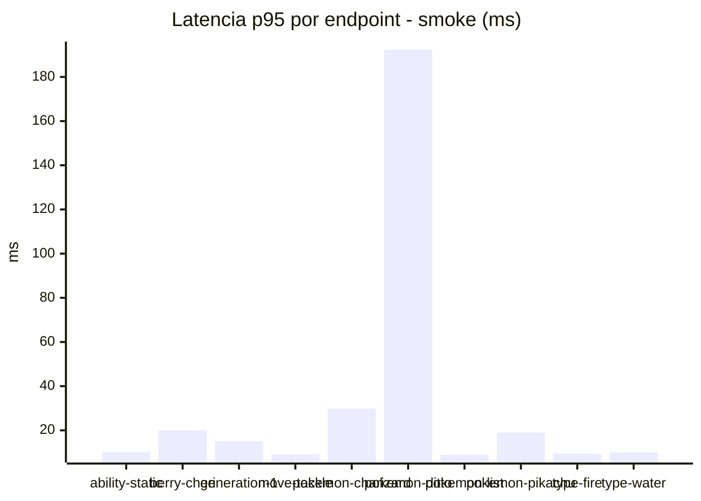
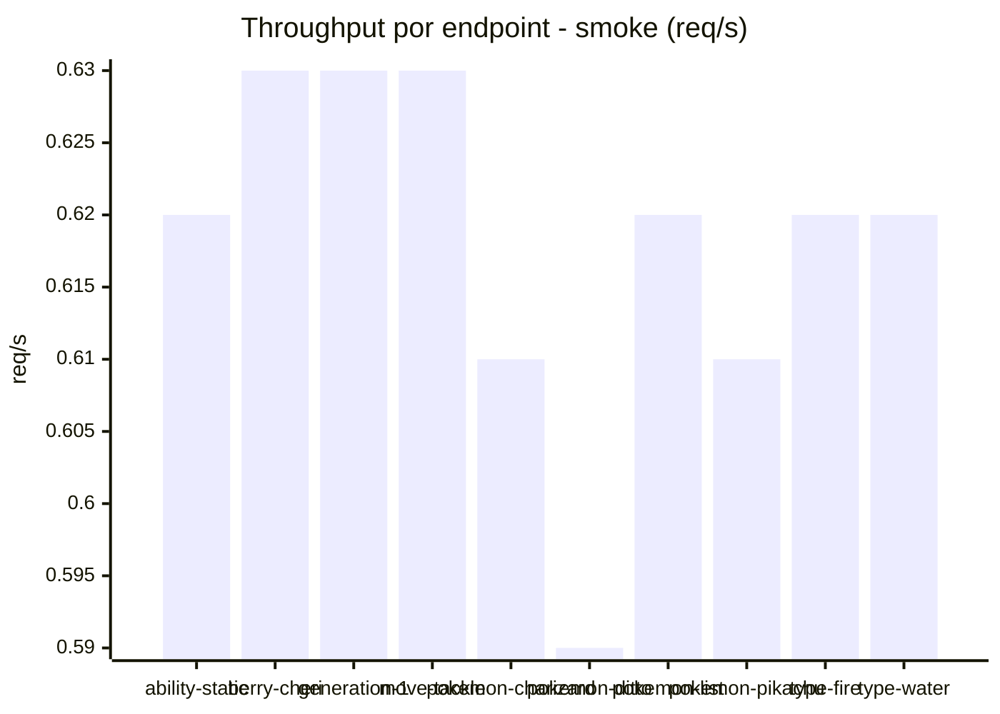
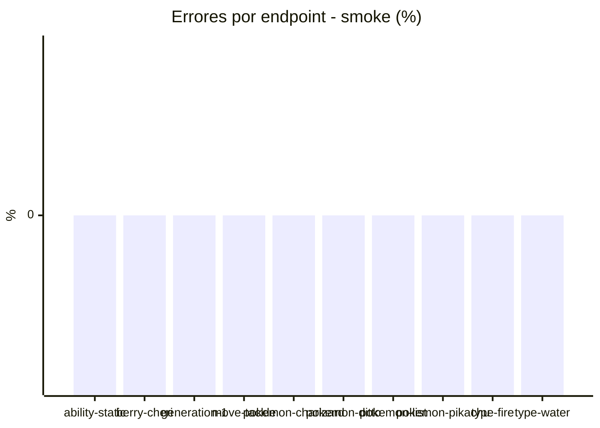

# Reporte de performance - PokeAPI

**Fecha:** 2026-08-01 14:27 UTC  
**Veredicto del agente:** `PASS`  
**Corrida:** [ver en GitHub Actions](https://github.com/lrbg/jmeter-pokeapi-lab/actions/runs/30703701414)  

## Validacion del agente de IA

PASS (fallback por umbrales)

- Error maximo: 0.01%
- p95 maximo: 16.9 ms

## Resultados

### Escenario: `load`

| Metrica | Valor |
| --- | --- |
| Muestras | 17098 |
| Errores | 2 (0.01%) |
| Latencia media | 7.2 ms |
| p50 / p90 / p95 / p99 | 7.0 / 9.0 / 10.0 / 14.0 ms |
| Min / Max | 4 / 243 ms |
| Throughput | 142.94 req/s |
| Duracion | 119.6 s |

Detalle por endpoint

| Endpoint | Muestras | Error % | avg | p95 | p99 | req/s |
| --- | --- | --- | --- | --- | --- | --- |
| ability-static | 1710 | 0.0% | 7.3 | 9.0 | 13.0 | 14.45 |
| berry-cheri | 1710 | 0.0% | 7.0 | 9.0 | 11.0 | 14.44 |
| generation-1 | 1709 | 0.0% | 7.1 | 10.0 | 13.0 | 14.48 |
| move-tackle | 1710 | 0.06% | 7.2 | 10.0 | 14.0 | 14.47 |
| pokemon-charizard | 1709 | 0.0% | 8.0 | 11.0 | 16.0 | 14.37 |
| pokemon-ditto | 1710 | 0.0% | 7.3 | 10.0 | 13.9 | 14.3 |
| pokemon-list | 1709 | 0.06% | 6.6 | 8.0 | 11.0 | 14.41 |
| pokemon-pikachu | 1711 | 0.0% | 7.8 | 10.0 | 15.9 | 14.37 |
| type-fire | 1710 | 0.0% | 6.9 | 9.0 | 12.0 | 14.44 |
| type-water | 1710 | 0.0% | 7.2 | 9.0 | 11.0 | 14.41 |

### Escenario: `smoke`

| Metrica | Valor |
| --- | --- |
| Muestras | 162 |
| Errores | 0 (0.0%) |
| Latencia media | 15.9 ms |
| p50 / p90 / p95 / p99 | 9.0 / 15.0 / 16.9 / 52.3 ms |
| Min / Max | 6 / 922 ms |
| Throughput | 5.56 req/s |
| Duracion | 29.2 s |

Detalle por endpoint

| Endpoint | Muestras | Error % | avg | p95 | p99 | req/s |
| --- | --- | --- | --- | --- | --- | --- |
| ability-static | 16 | 0.0% | 8.9 | 10.2 | 10.8 | 0.62 |
| berry-cheri | 16 | 0.0% | 10.4 | 20.0 | 48.8 | 0.63 |
| generation-1 | 16 | 0.0% | 9.4 | 15.0 | 27.0 | 0.63 |
| move-tackle | 16 | 0.0% | 8.5 | 9.2 | 9.8 | 0.63 |
| pokemon-charizard | 16 | 0.0% | 16.9 | 29.8 | 45.9 | 0.61 |
| pokemon-ditto | 17 | 0.0% | 62.6 | 192.4 | 776.1 | 0.59 |
| pokemon-list | 16 | 0.0% | 7.6 | 9.0 | 9.0 | 0.62 |
| pokemon-pikachu | 17 | 0.0% | 14.1 | 19.0 | 25.4 | 0.61 |
| type-fire | 16 | 0.0% | 8.4 | 9.5 | 10.7 | 0.62 |
| type-water | 16 | 0.0% | 9 | 10.0 | 10.0 | 0.62 |

