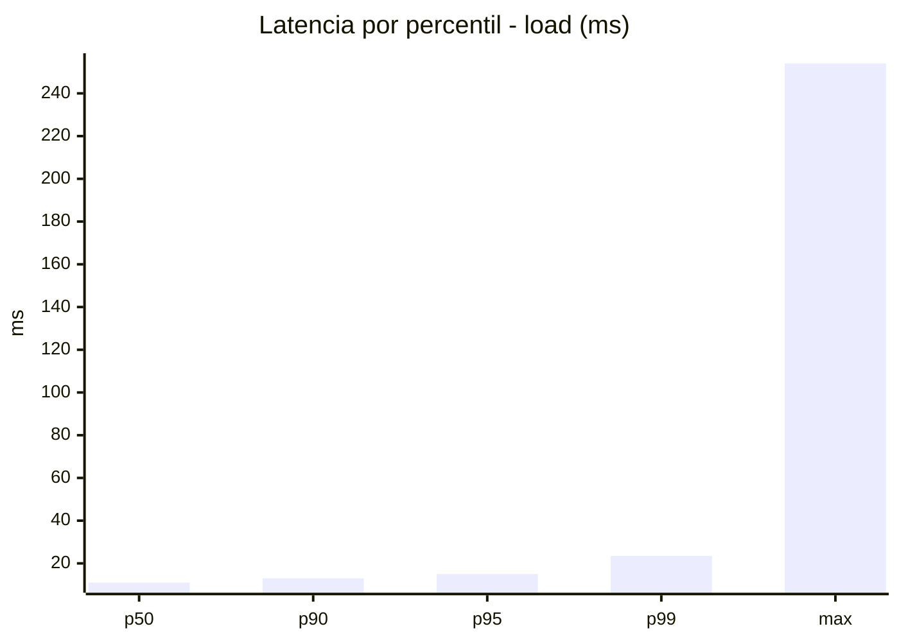
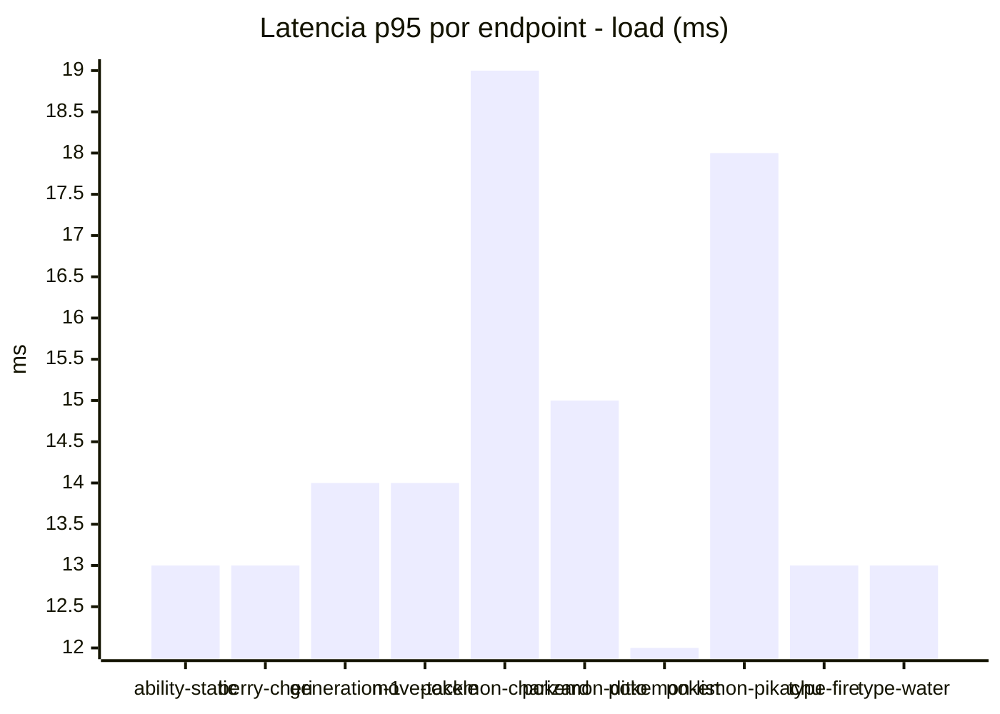
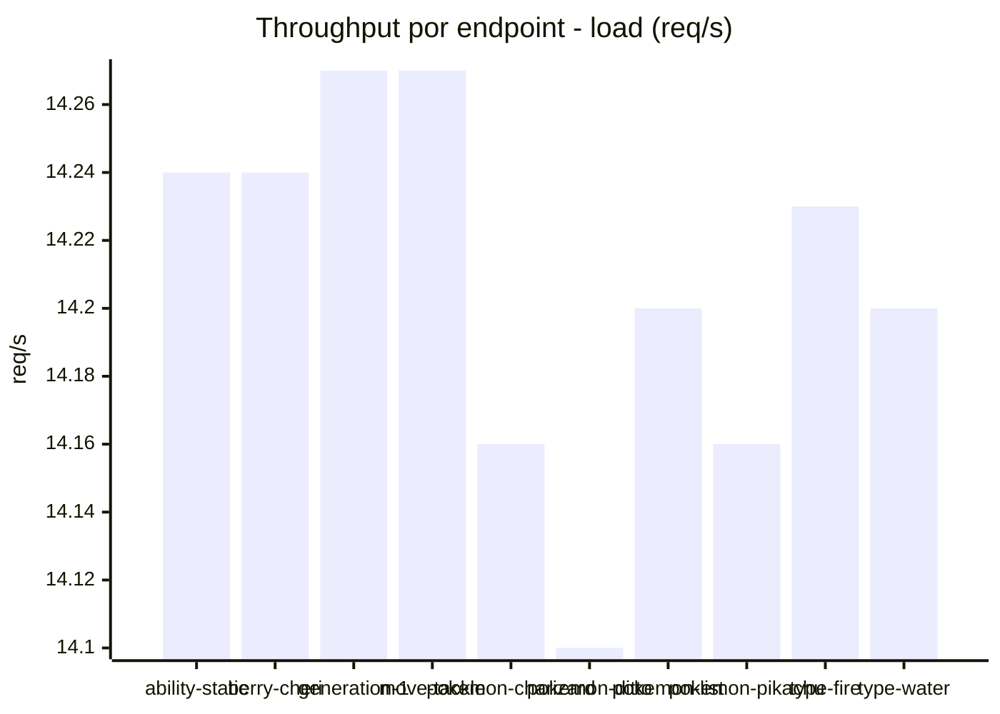
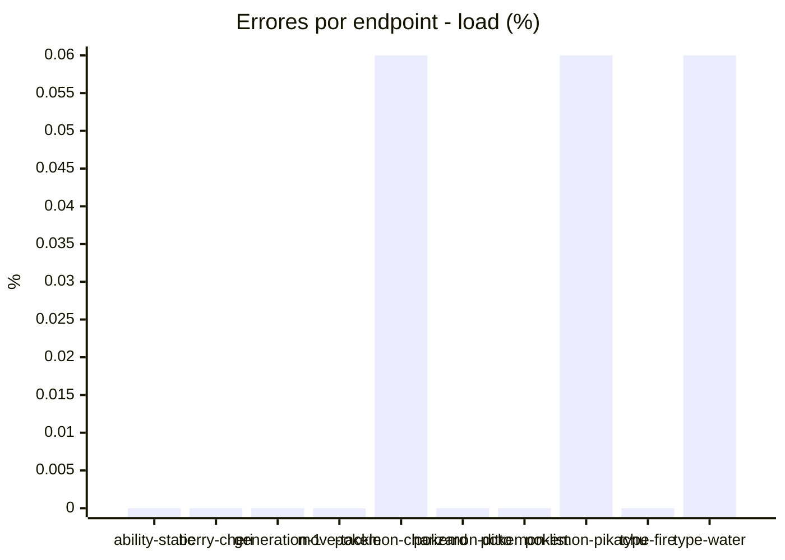
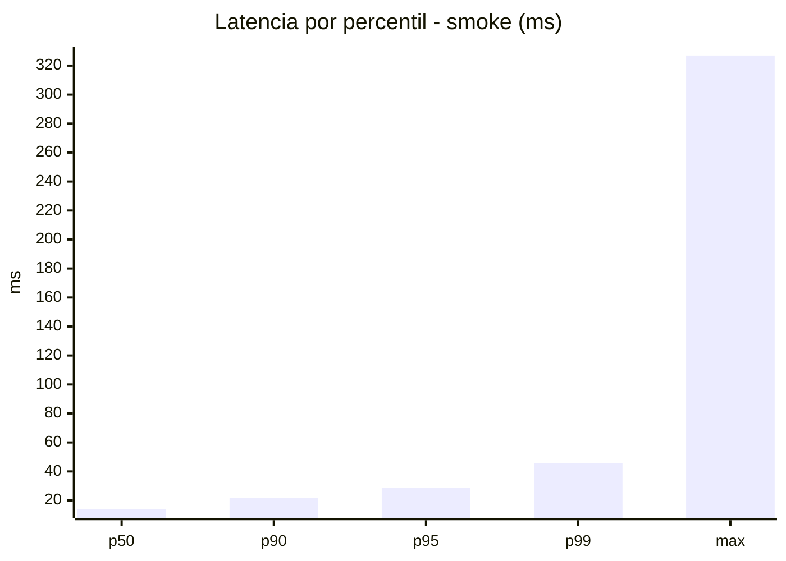
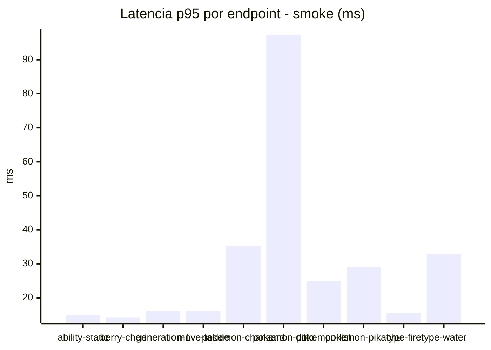
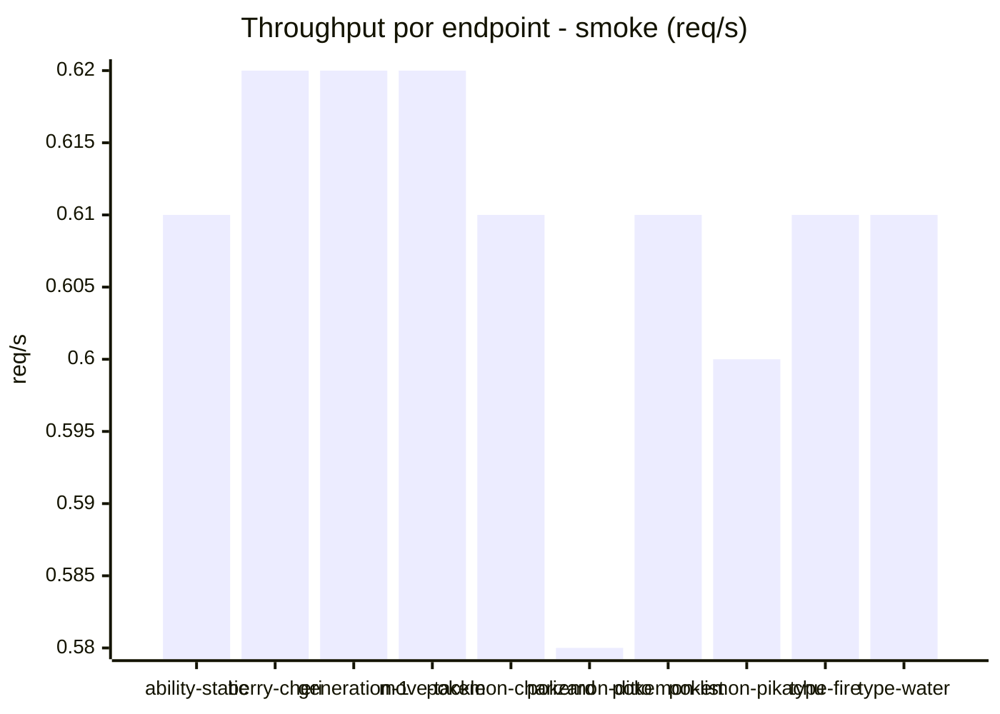
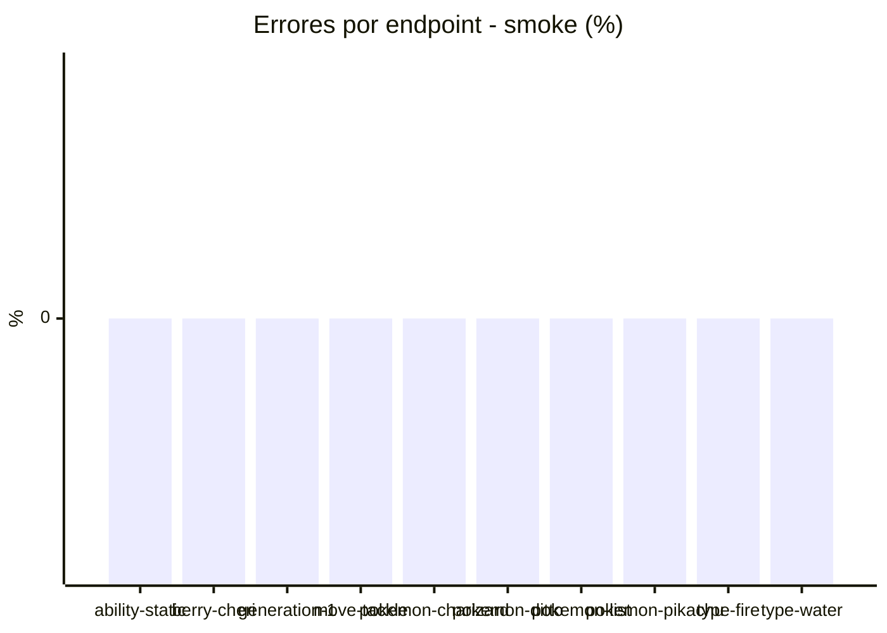

# Reporte de performance - PokeAPI

**Fecha:** 2026-08-02 14:29 UTC  
**Veredicto del agente:** `PASS`  
**Corrida:** [ver en GitHub Actions](https://github.com/lrbg/jmeter-pokeapi-lab/actions/runs/30752102271)  

## Validacion del agente de IA

PASS (fallback por umbrales)

- Error maximo: 0.02%
- p95 maximo: 28.9 ms

## Resultados

### Escenario: `load`

| Metrica | Valor |
| --- | --- |
| Muestras | 16851 |
| Errores | 3 (0.02%) |
| Latencia media | 11.7 ms |
| p50 / p90 / p95 / p99 | 11.0 / 13.0 / 15.0 / 23.5 ms |
| Min / Max | 8 / 254 ms |
| Throughput | 140.9 req/s |
| Duracion | 119.6 s |

Detalle por endpoint

| Endpoint | Muestras | Error % | avg | p95 | p99 | req/s |
| --- | --- | --- | --- | --- | --- | --- |
| ability-static | 1685 | 0.0% | 11.2 | 13.0 | 17.0 | 14.24 |
| berry-cheri | 1685 | 0.0% | 11.1 | 13.0 | 17.0 | 14.24 |
| generation-1 | 1685 | 0.0% | 11.6 | 14.0 | 18.0 | 14.27 |
| move-tackle | 1685 | 0.0% | 11.7 | 14.0 | 17.0 | 14.27 |
| pokemon-charizard | 1685 | 0.06% | 13.9 | 19.0 | 31.2 | 14.16 |
| pokemon-ditto | 1685 | 0.0% | 11.7 | 15.0 | 20.0 | 14.1 |
| pokemon-list | 1685 | 0.0% | 10.6 | 12.0 | 17.0 | 14.2 |
| pokemon-pikachu | 1685 | 0.06% | 13.3 | 18.0 | 28.2 | 14.16 |
| type-fire | 1685 | 0.0% | 11.2 | 13.0 | 16.2 | 14.23 |
| type-water | 1686 | 0.06% | 11.1 | 13.0 | 17.0 | 14.2 |

### Escenario: `smoke`

| Metrica | Valor |
| --- | --- |
| Muestras | 162 |
| Errores | 0 (0.0%) |
| Latencia media | 17.6 ms |
| p50 / p90 / p95 / p99 | 14.0 / 21.9 / 28.9 / 45.9 ms |
| Min / Max | 11 / 327 ms |
| Throughput | 5.54 req/s |
| Duracion | 29.3 s |

Detalle por endpoint

| Endpoint | Muestras | Error % | avg | p95 | p99 | req/s |
| --- | --- | --- | --- | --- | --- | --- |
| ability-static | 16 | 0.0% | 13.5 | 15.0 | 15.0 | 0.61 |
| berry-cheri | 16 | 0.0% | 12.4 | 14.2 | 14.8 | 0.62 |
| generation-1 | 16 | 0.0% | 13.1 | 16.0 | 16.0 | 0.62 |
| move-tackle | 16 | 0.0% | 13.9 | 16.2 | 16.9 | 0.62 |
| pokemon-charizard | 16 | 0.0% | 23.6 | 35.2 | 38.2 | 0.61 |
| pokemon-ditto | 17 | 0.0% | 33.6 | 97.4 | 281.1 | 0.58 |
| pokemon-list | 16 | 0.0% | 15.5 | 25.0 | 44.2 | 0.61 |
| pokemon-pikachu | 17 | 0.0% | 19.9 | 29.0 | 35.4 | 0.6 |
| type-fire | 16 | 0.0% | 13.2 | 15.5 | 16.7 | 0.61 |
| type-water | 16 | 0.0% | 16.1 | 32.8 | 41.7 | 0.61 |

