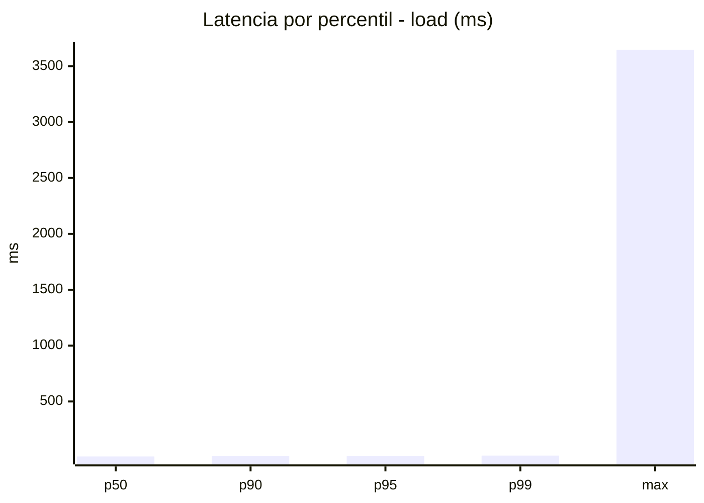
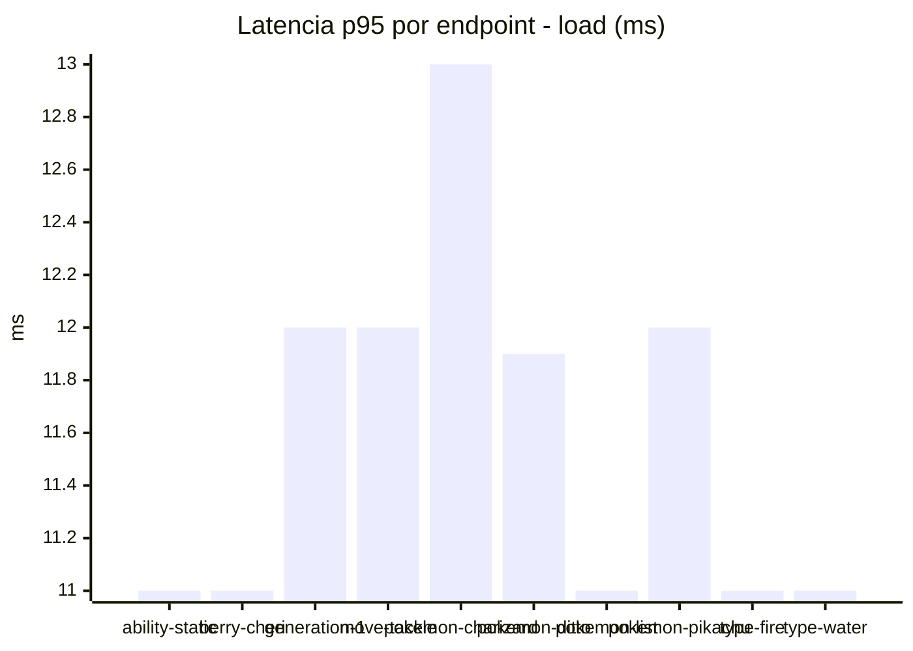
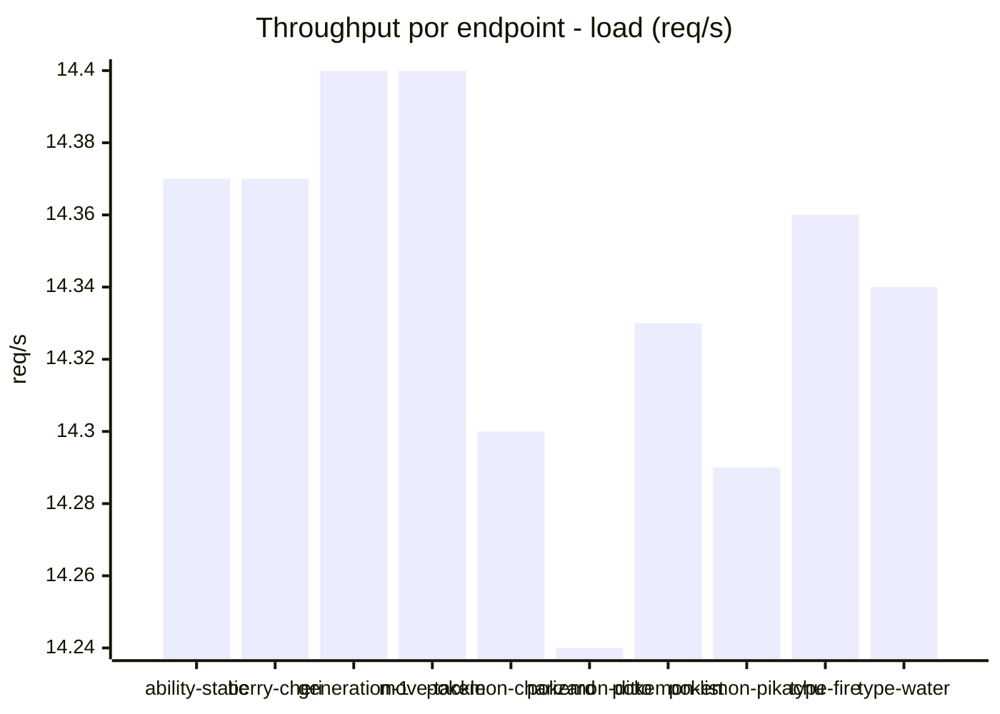
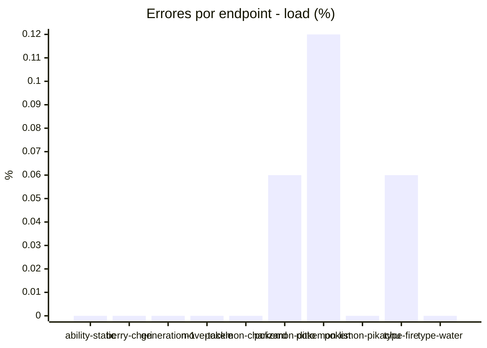
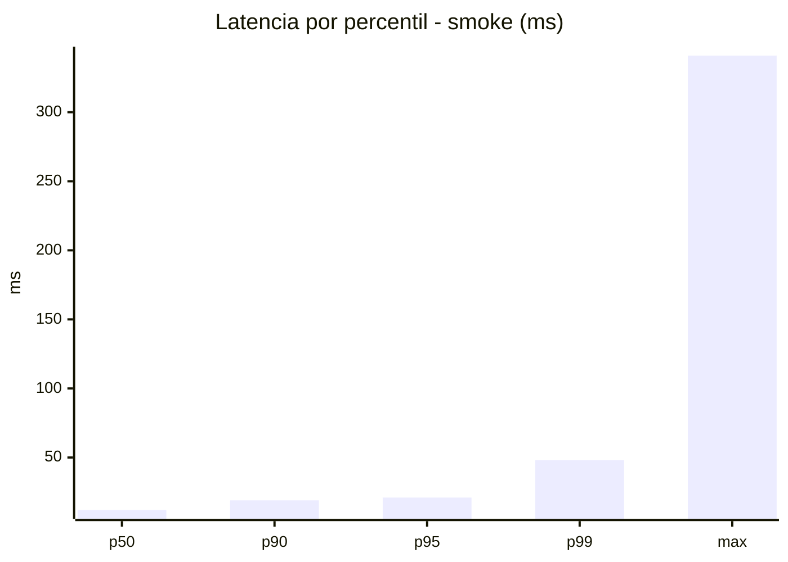
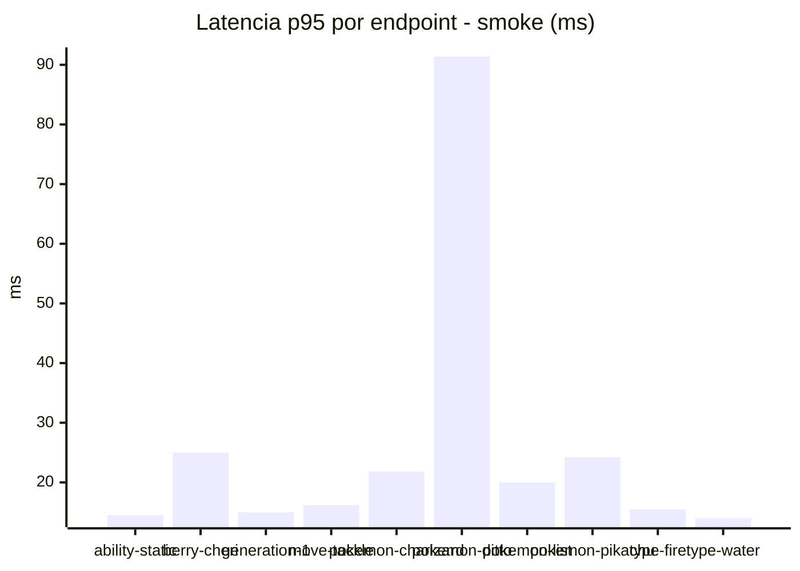
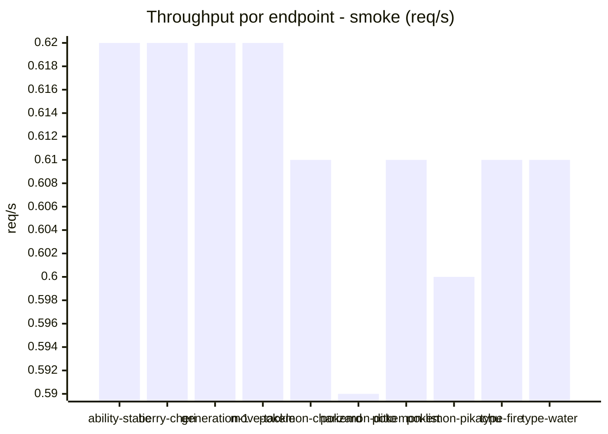
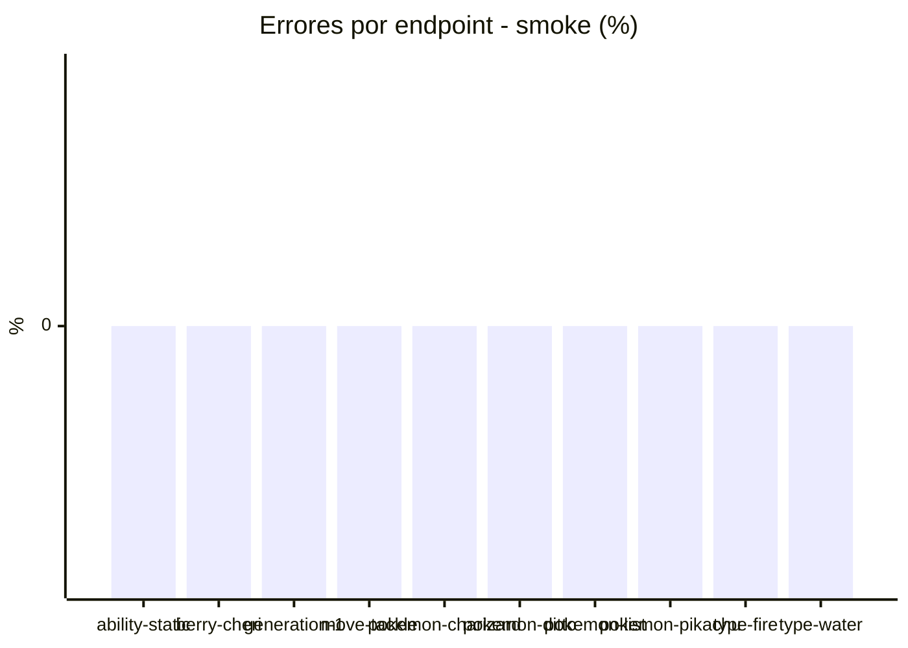

# Reporte de performance - PokeAPI

**Fecha:** 2026-08-03 15:44 UTC  
**Veredicto del agente:** `PASS`  
**Corrida:** [ver en GitHub Actions](https://github.com/lrbg/jmeter-pokeapi-lab/actions/runs/30828667381)  

## Validacion del agente de IA

PASS (fallback por umbrales)

- Error maximo: 0.02%
- p95 maximo: 21.0 ms

## Resultados

### Escenario: `load`

| Metrica | Valor |
| --- | --- |
| Muestras | 17013 |
| Errores | 4 (0.02%) |
| Latencia media | 8.8 ms |
| p50 / p90 / p95 / p99 | 8.0 / 11.0 / 12.0 / 16.0 ms |
| Min / Max | 5 / 3647 ms |
| Throughput | 142.23 req/s |
| Duracion | 119.6 s |

Detalle por endpoint

| Endpoint | Muestras | Error % | avg | p95 | p99 | req/s |
| --- | --- | --- | --- | --- | --- | --- |
| ability-static | 1701 | 0.0% | 8.4 | 11.0 | 15.0 | 14.37 |
| berry-cheri | 1701 | 0.0% | 10.1 | 11.0 | 15.0 | 14.37 |
| generation-1 | 1701 | 0.0% | 10.4 | 12.0 | 16.0 | 14.4 |
| move-tackle | 1701 | 0.0% | 8.4 | 12.0 | 15.0 | 14.4 |
| pokemon-charizard | 1701 | 0.0% | 9.2 | 13.0 | 18.0 | 14.3 |
| pokemon-ditto | 1703 | 0.06% | 8.6 | 11.9 | 16.0 | 14.24 |
| pokemon-list | 1702 | 0.12% | 7.8 | 11.0 | 14.0 | 14.33 |
| pokemon-pikachu | 1701 | 0.0% | 9.0 | 12.0 | 20.0 | 14.29 |
| type-fire | 1701 | 0.06% | 8.1 | 11.0 | 15.0 | 14.36 |
| type-water | 1701 | 0.0% | 8.6 | 11.0 | 15.0 | 14.34 |

### Escenario: `smoke`

| Metrica | Valor |
| --- | --- |
| Muestras | 162 |
| Errores | 0 (0.0%) |
| Latencia media | 15.2 ms |
| p50 / p90 / p95 / p99 | 12.0 / 19.0 / 21.0 / 48.1 ms |
| Min / Max | 6 / 341 ms |
| Throughput | 5.55 req/s |
| Duracion | 29.2 s |

Detalle por endpoint

| Endpoint | Muestras | Error % | avg | p95 | p99 | req/s |
| --- | --- | --- | --- | --- | --- | --- |
| ability-static | 16 | 0.0% | 11.5 | 14.5 | 15.7 | 0.62 |
| berry-cheri | 16 | 0.0% | 13.2 | 25.0 | 56.2 | 0.62 |
| generation-1 | 16 | 0.0% | 10.4 | 15.0 | 17.4 | 0.62 |
| move-tackle | 16 | 0.0% | 13.1 | 16.2 | 16.9 | 0.62 |
| pokemon-charizard | 16 | 0.0% | 17.9 | 21.8 | 23.5 | 0.61 |
| pokemon-ditto | 17 | 0.0% | 32.4 | 91.4 | 291.1 | 0.59 |
| pokemon-list | 16 | 0.0% | 12 | 20.0 | 34.4 | 0.61 |
| pokemon-pikachu | 17 | 0.0% | 17.3 | 24.2 | 31.2 | 0.6 |
| type-fire | 16 | 0.0% | 10.9 | 15.5 | 16.7 | 0.61 |
| type-water | 16 | 0.0% | 11.6 | 14.0 | 14.0 | 0.61 |

