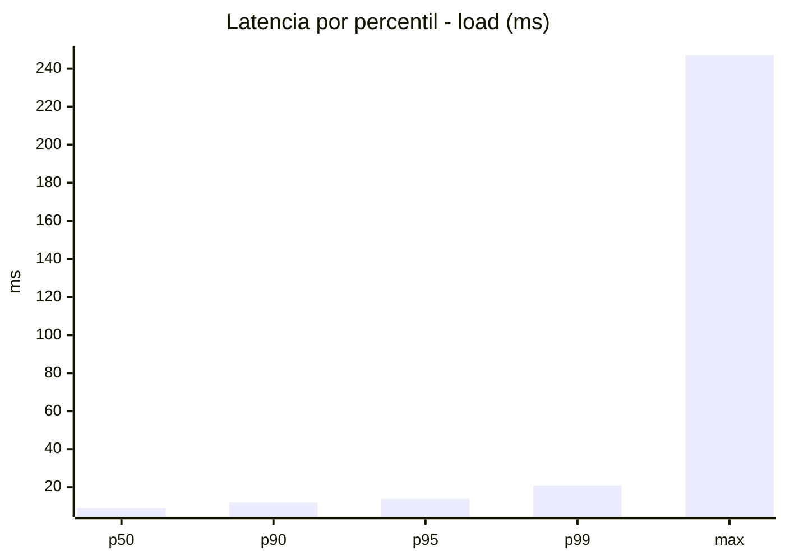
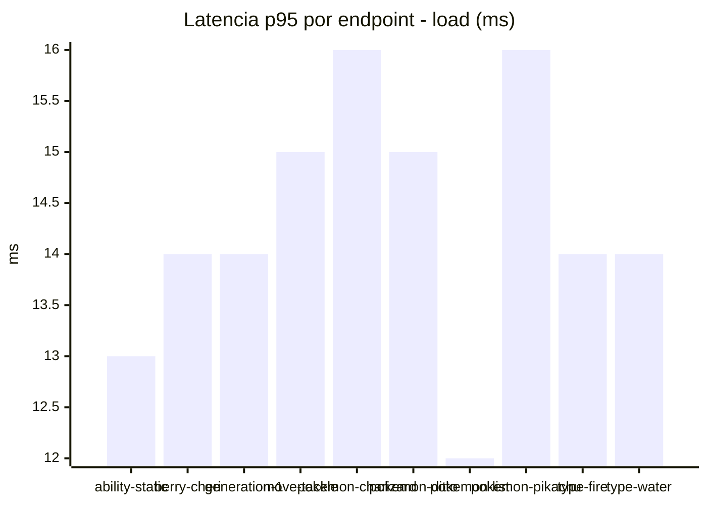
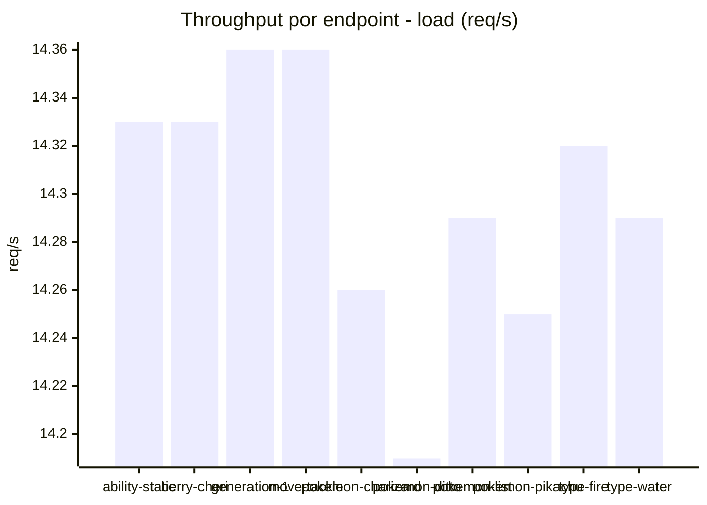
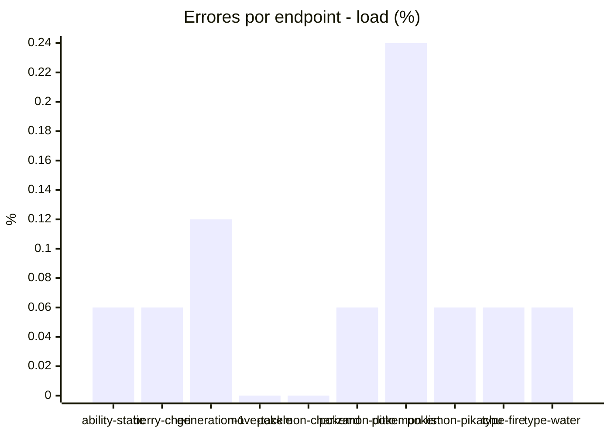
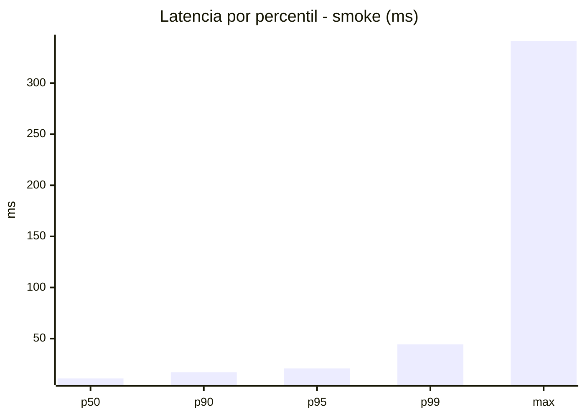
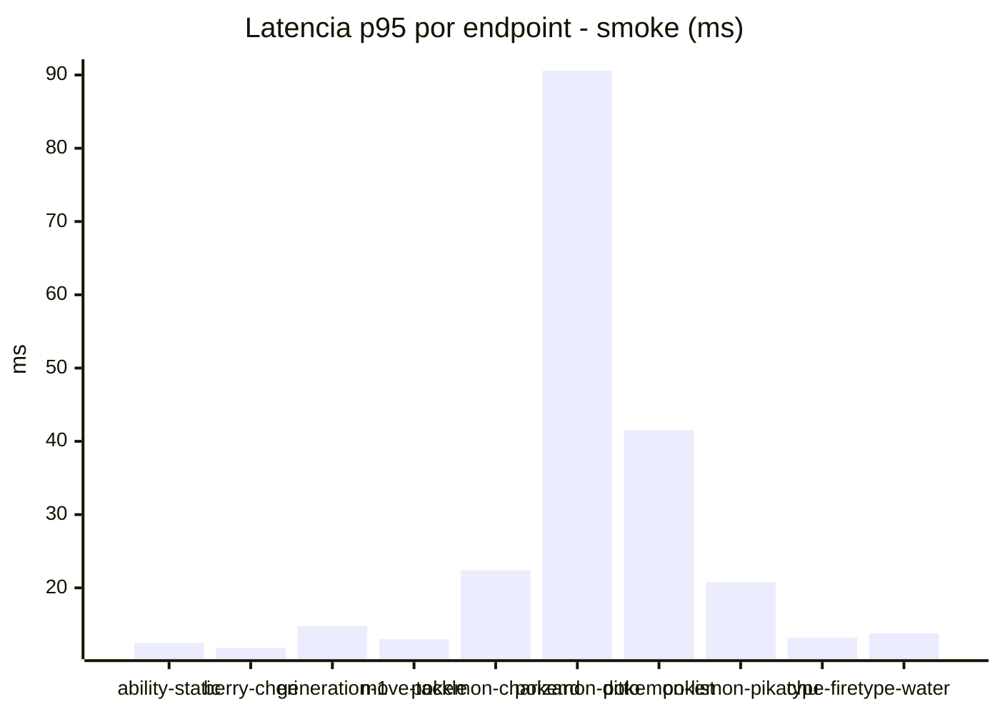
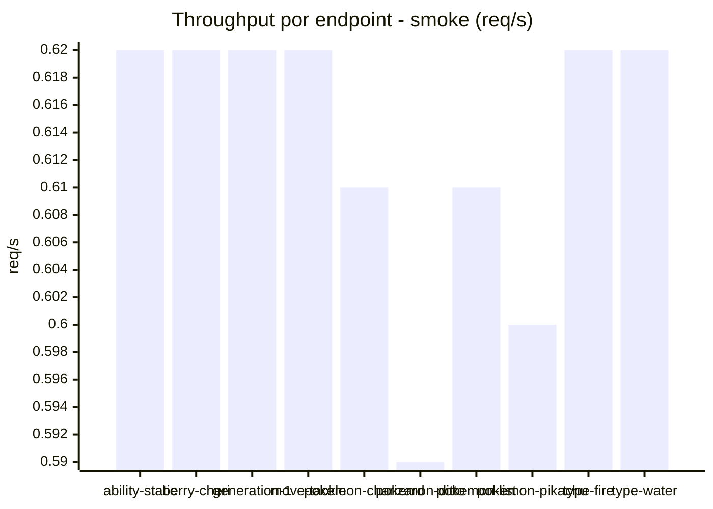
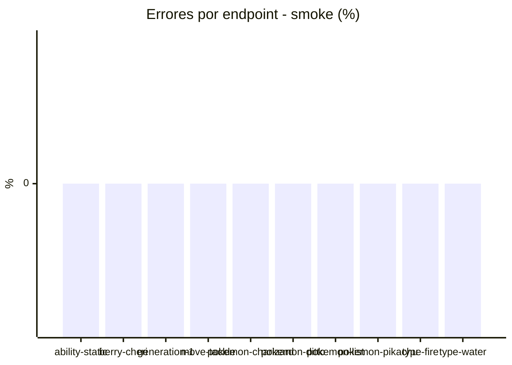

# Reporte de performance - PokeAPI

**Fecha:** 2026-08-04 15:24 UTC  
**Veredicto del agente:** `PASS`  
**Corrida:** [ver en GitHub Actions](https://github.com/lrbg/jmeter-pokeapi-lab/actions/runs/30923789008)  

## Validacion del agente de IA

PASS (fallback por umbrales)

- Error maximo: 0.07%
- p95 maximo: 20.8 ms

## Resultados

### Escenario: `load`

| Metrica | Valor |
| --- | --- |
| Muestras | 16964 |
| Errores | 12 (0.07%) |
| Latencia media | 9.7 ms |
| p50 / p90 / p95 / p99 | 9.0 / 12.0 / 14.0 / 21.0 ms |
| Min / Max | 5 / 247 ms |
| Throughput | 141.86 req/s |
| Duracion | 119.6 s |

Detalle por endpoint

| Endpoint | Muestras | Error % | avg | p95 | p99 | req/s |
| --- | --- | --- | --- | --- | --- | --- |
| ability-static | 1696 | 0.06% | 9.3 | 13.0 | 18.0 | 14.33 |
| berry-cheri | 1696 | 0.06% | 9.3 | 14.0 | 20.0 | 14.33 |
| generation-1 | 1696 | 0.12% | 9.5 | 14.0 | 20.0 | 14.36 |
| move-tackle | 1696 | 0.0% | 9.7 | 15.0 | 23.0 | 14.36 |
| pokemon-charizard | 1697 | 0.0% | 10.6 | 16.0 | 26.0 | 14.26 |
| pokemon-ditto | 1697 | 0.06% | 9.6 | 15.0 | 21.0 | 14.19 |
| pokemon-list | 1697 | 0.24% | 8.7 | 12.0 | 17.0 | 14.29 |
| pokemon-pikachu | 1697 | 0.06% | 10.9 | 16.0 | 29.0 | 14.25 |
| type-fire | 1696 | 0.06% | 9.7 | 14.0 | 20.0 | 14.32 |
| type-water | 1696 | 0.06% | 9.5 | 14.0 | 21.0 | 14.29 |

### Escenario: `smoke`

| Metrica | Valor |
| --- | --- |
| Muestras | 163 |
| Errores | 0 (0.0%) |
| Latencia media | 14.4 ms |
| p50 / p90 / p95 / p99 | 11.0 / 17.0 / 20.8 / 44.4 ms |
| Min / Max | 8 / 341 ms |
| Throughput | 5.56 req/s |
| Duracion | 29.3 s |

Detalle por endpoint

| Endpoint | Muestras | Error % | avg | p95 | p99 | req/s |
| --- | --- | --- | --- | --- | --- | --- |
| ability-static | 16 | 0.0% | 10.4 | 12.5 | 13.7 | 0.62 |
| berry-cheri | 16 | 0.0% | 9.8 | 11.8 | 13.5 | 0.62 |
| generation-1 | 16 | 0.0% | 10.8 | 14.8 | 16.5 | 0.62 |
| move-tackle | 16 | 0.0% | 10.9 | 13.0 | 13.0 | 0.62 |
| pokemon-charizard | 17 | 0.0% | 17.6 | 22.4 | 23.7 | 0.61 |
| pokemon-ditto | 17 | 0.0% | 30.9 | 90.6 | 290.9 | 0.59 |
| pokemon-list | 16 | 0.0% | 14.5 | 41.5 | 54.7 | 0.61 |
| pokemon-pikachu | 17 | 0.0% | 16.2 | 20.8 | 26.6 | 0.6 |
| type-fire | 16 | 0.0% | 10.4 | 13.2 | 13.8 | 0.62 |
| type-water | 16 | 0.0% | 10.6 | 13.8 | 15.5 | 0.62 |

