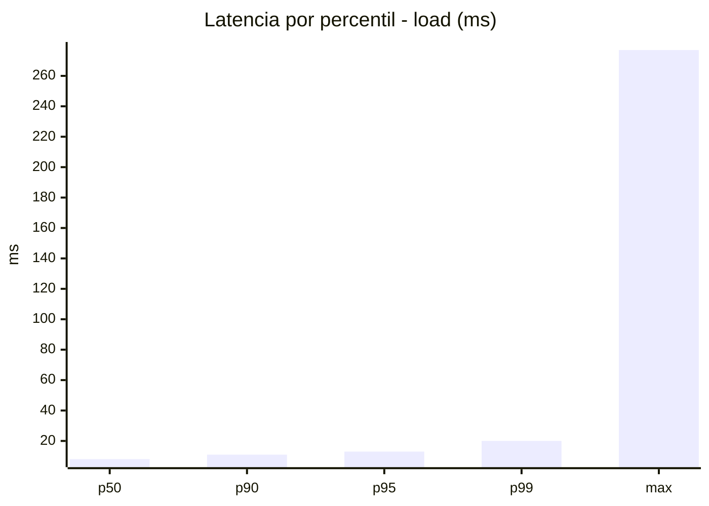
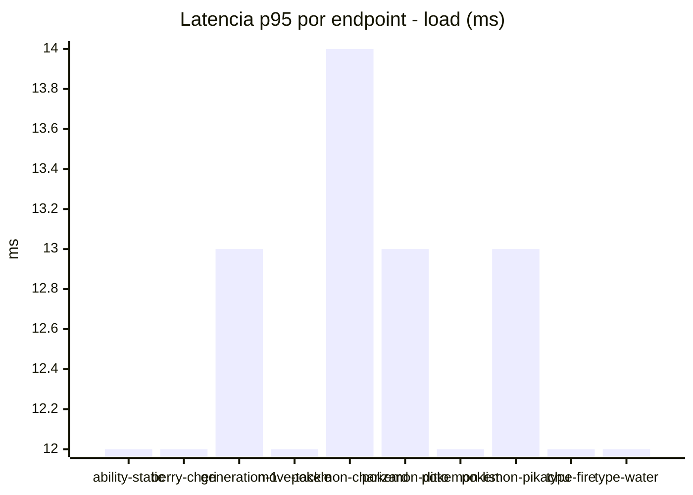
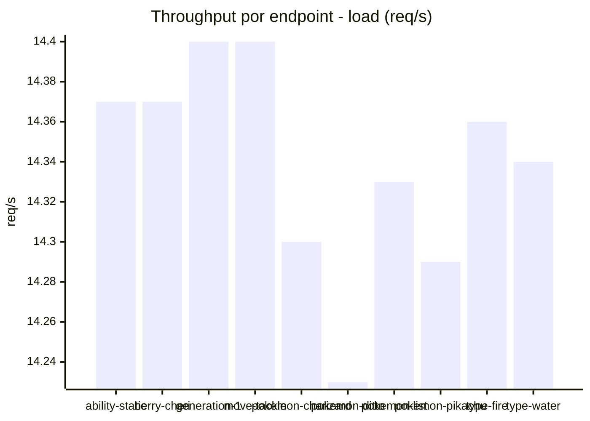
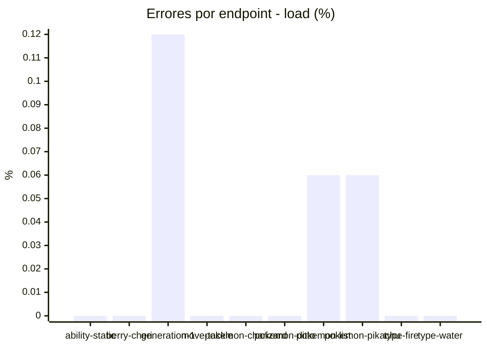
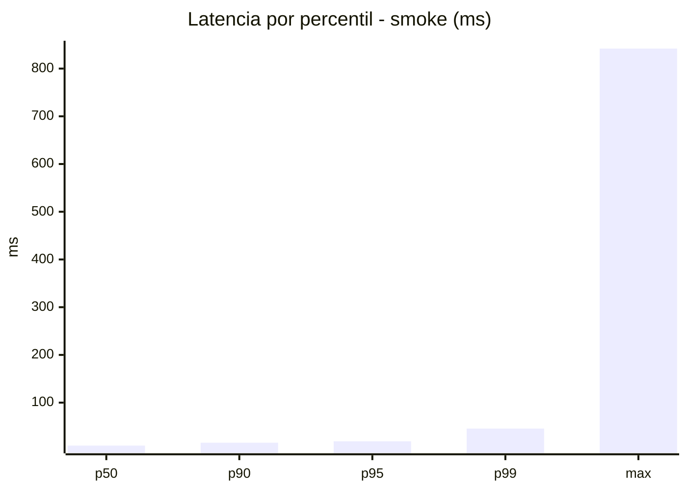
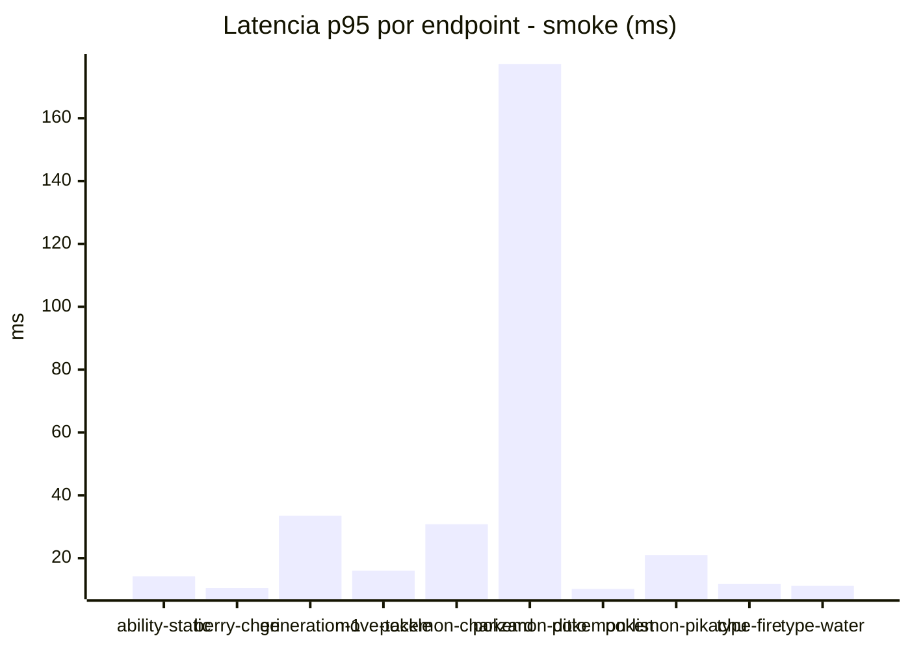
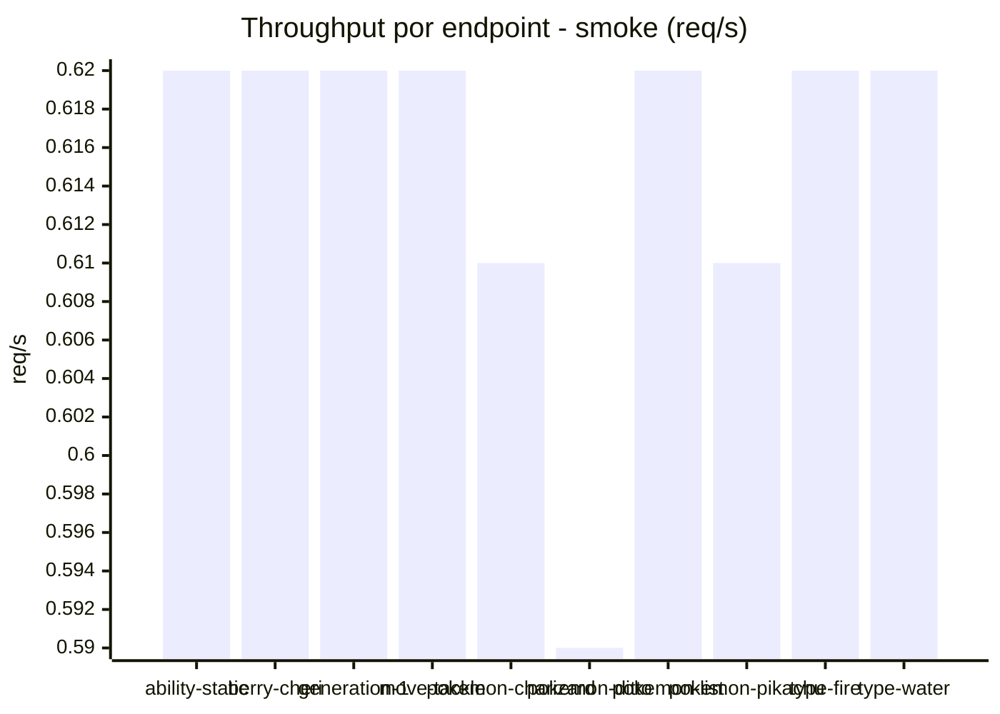
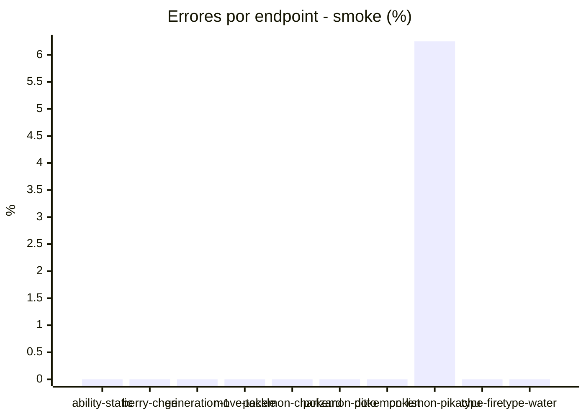

# Reporte de performance - PokeAPI

**Fecha:** 2026-08-05 15:14 UTC  
**Veredicto del agente:** `WARN`  
**Corrida:** [ver en GitHub Actions](https://github.com/lrbg/jmeter-pokeapi-lab/actions/runs/31019001839)  

## Validacion del agente de IA

WARN (fallback por umbrales)

- Error maximo: 0.62%
- p95 maximo: 19.0 ms

## Resultados

### Escenario: `load`

| Metrica | Valor |
| --- | --- |
| Muestras | 17004 |
| Errores | 4 (0.02%) |
| Latencia media | 8.9 ms |
| p50 / p90 / p95 / p99 | 8.0 / 11.0 / 13.0 / 20.0 ms |
| Min / Max | 5 / 277 ms |
| Throughput | 142.24 req/s |
| Duracion | 119.5 s |

Detalle por endpoint

| Endpoint | Muestras | Error % | avg | p95 | p99 | req/s |
| --- | --- | --- | --- | --- | --- | --- |
| ability-static | 1700 | 0.0% | 8.7 | 12.0 | 17.0 | 14.37 |
| berry-cheri | 1700 | 0.0% | 8.7 | 12.0 | 17.0 | 14.37 |
| generation-1 | 1700 | 0.12% | 8.8 | 13.0 | 19.0 | 14.4 |
| move-tackle | 1700 | 0.0% | 8.7 | 12.0 | 17.0 | 14.4 |
| pokemon-charizard | 1701 | 0.0% | 10.0 | 14.0 | 27.0 | 14.3 |
| pokemon-ditto | 1701 | 0.0% | 8.9 | 13.0 | 19.0 | 14.23 |
| pokemon-list | 1701 | 0.06% | 8.2 | 12.0 | 18.0 | 14.33 |
| pokemon-pikachu | 1701 | 0.06% | 9.4 | 13.0 | 23.0 | 14.29 |
| type-fire | 1700 | 0.0% | 8.5 | 12.0 | 19.0 | 14.36 |
| type-water | 1700 | 0.0% | 9.0 | 12.0 | 19.0 | 14.34 |

### Escenario: `smoke`

| Metrica | Valor |
| --- | --- |
| Muestras | 161 |
| Errores | 1 (0.62%) |
| Latencia media | 16.8 ms |
| p50 / p90 / p95 / p99 | 10.0 / 16.0 / 19.0 / 45.6 ms |
| Min / Max | 7 / 842 ms |
| Throughput | 5.54 req/s |
| Duracion | 29.0 s |

Detalle por endpoint

| Endpoint | Muestras | Error % | avg | p95 | p99 | req/s |
| --- | --- | --- | --- | --- | --- | --- |
| ability-static | 16 | 0.0% | 10.8 | 14.2 | 17.2 | 0.62 |
| berry-cheri | 16 | 0.0% | 9.2 | 10.5 | 11.7 | 0.62 |
| generation-1 | 16 | 0.0% | 13.2 | 33.5 | 41.9 | 0.62 |
| move-tackle | 16 | 0.0% | 11 | 16.0 | 18.4 | 0.62 |
| pokemon-charizard | 16 | 0.0% | 18.5 | 30.8 | 44.5 | 0.61 |
| pokemon-ditto | 17 | 0.0% | 58.9 | 177.2 | 709.0 | 0.59 |
| pokemon-list | 16 | 0.0% | 8.8 | 10.2 | 10.8 | 0.62 |
| pokemon-pikachu | 16 | 6.25% | 15.1 | 21.0 | 25.8 | 0.61 |
| type-fire | 16 | 0.0% | 9.7 | 11.8 | 13.5 | 0.62 |
| type-water | 16 | 0.0% | 9.9 | 11.2 | 11.8 | 0.62 |

