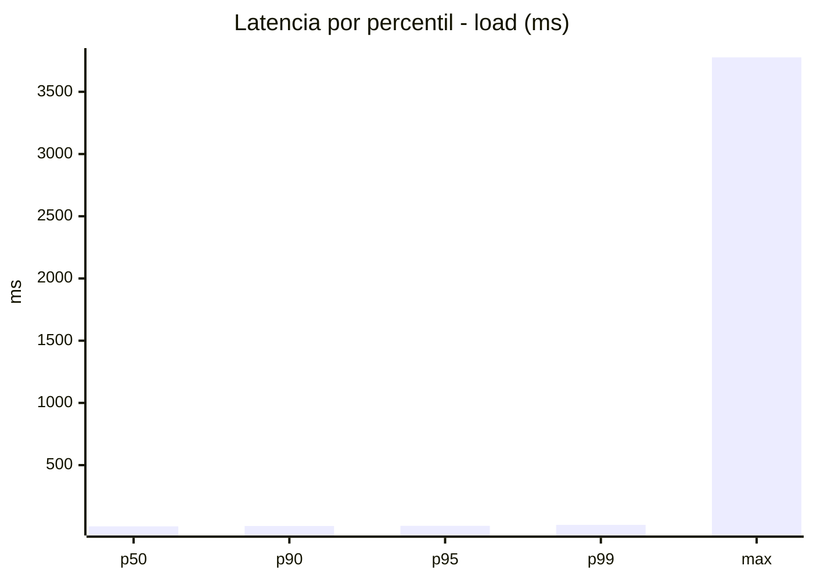
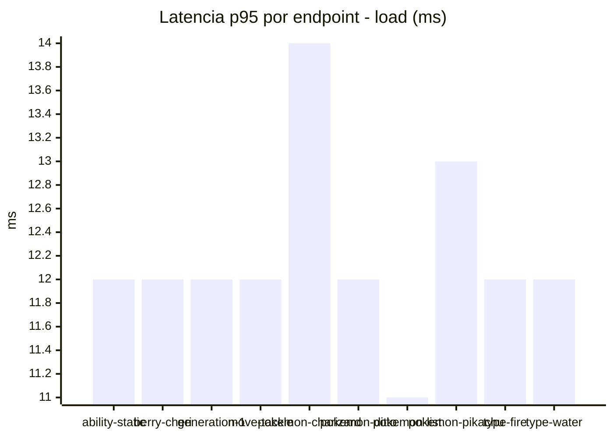
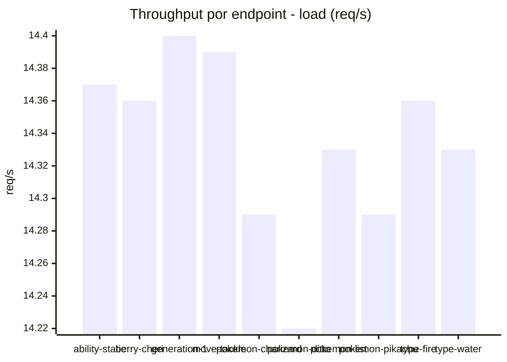
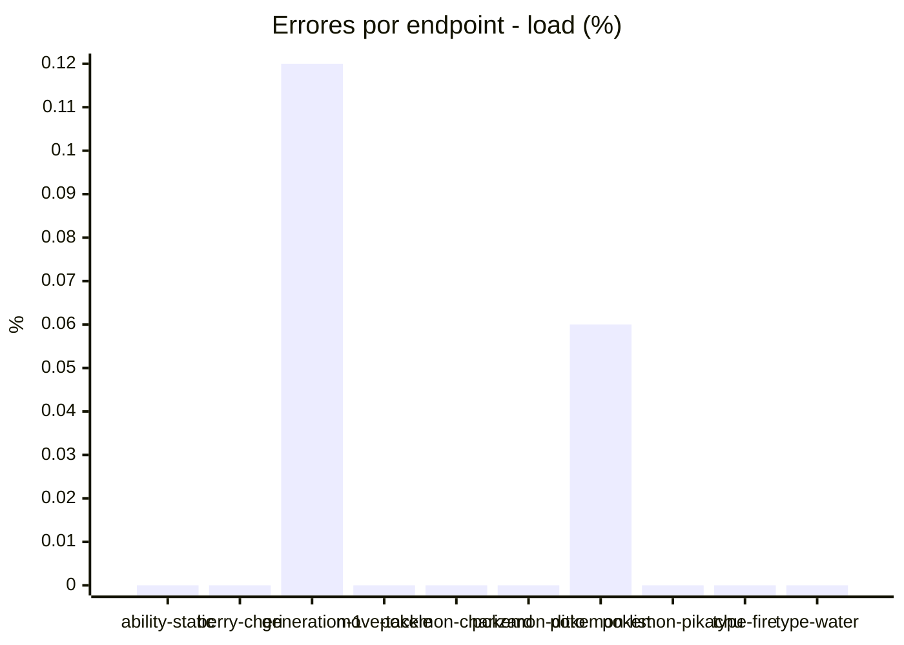
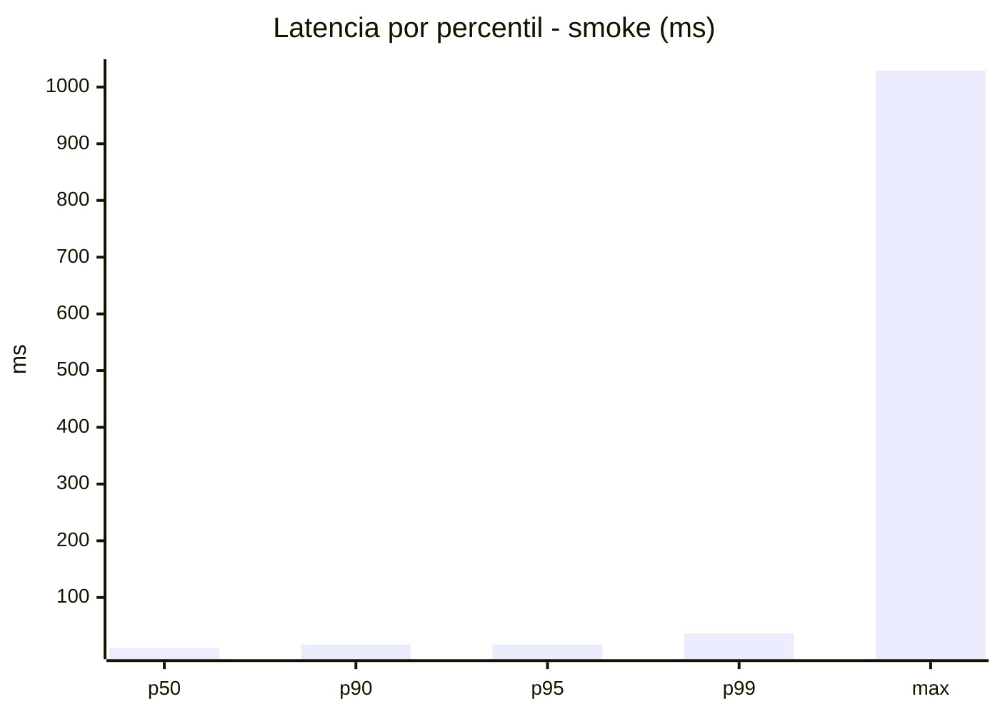
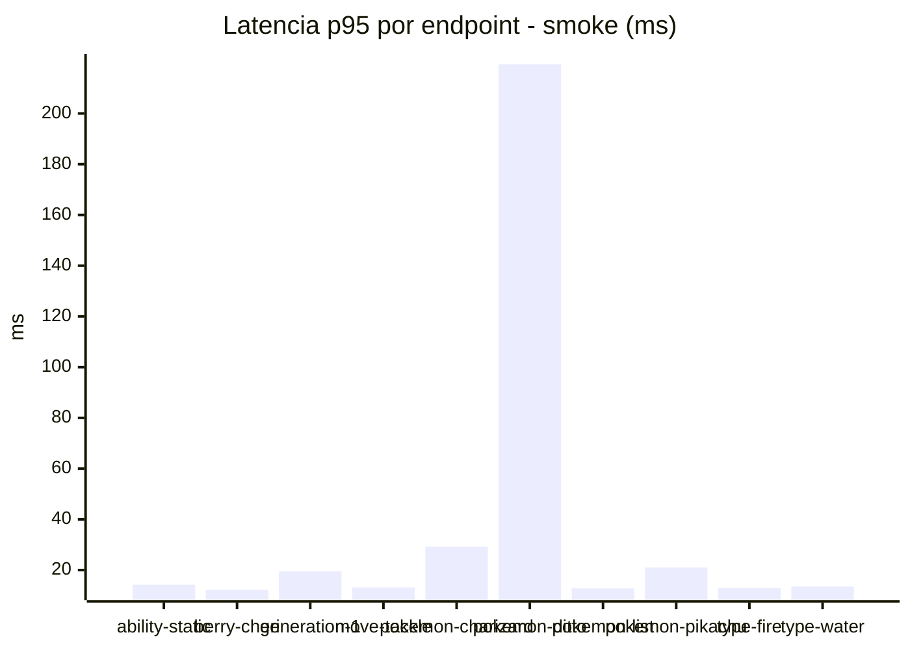
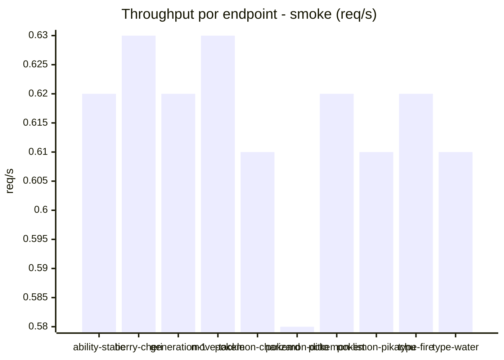
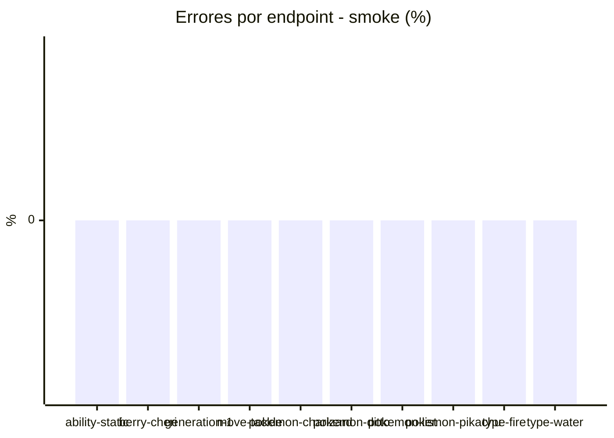

# Reporte de performance - PokeAPI

**Fecha:** 2026-08-06 15:13 UTC  
**Veredicto del agente:** `PASS`  
**Corrida:** [ver en GitHub Actions](https://github.com/lrbg/jmeter-pokeapi-lab/actions/runs/31114560302)  

## Validacion del agente de IA

PASS (fallback por umbrales)

- Error maximo: 0.02%
- p95 maximo: 17.0 ms

## Resultados

### Escenario: `load`

| Metrica | Valor |
| --- | --- |
| Muestras | 17002 |
| Errores | 3 (0.02%) |
| Latencia media | 9.0 ms |
| p50 / p90 / p95 / p99 | 8.0 / 11.0 / 12.0 / 20.0 ms |
| Min / Max | 5 / 3777 ms |
| Throughput | 142.15 req/s |
| Duracion | 119.6 s |

Detalle por endpoint

| Endpoint | Muestras | Error % | avg | p95 | p99 | req/s |
| --- | --- | --- | --- | --- | --- | --- |
| ability-static | 1701 | 0.0% | 8.6 | 12.0 | 20.0 | 14.37 |
| berry-cheri | 1699 | 0.0% | 8.2 | 12.0 | 16.0 | 14.36 |
| generation-1 | 1701 | 0.12% | 8.4 | 12.0 | 21.0 | 14.4 |
| move-tackle | 1699 | 0.0% | 8.7 | 12.0 | 26.0 | 14.39 |
| pokemon-charizard | 1700 | 0.0% | 10.0 | 14.0 | 27.0 | 14.29 |
| pokemon-ditto | 1701 | 0.0% | 8.8 | 12.0 | 20.0 | 14.22 |
| pokemon-list | 1700 | 0.06% | 8.2 | 11.0 | 16.0 | 14.33 |
| pokemon-pikachu | 1701 | 0.0% | 11.9 | 13.0 | 37.0 | 14.29 |
| type-fire | 1700 | 0.0% | 8.4 | 12.0 | 19.0 | 14.36 |
| type-water | 1700 | 0.0% | 8.6 | 12.0 | 18.0 | 14.33 |

### Escenario: `smoke`

| Metrica | Valor |
| --- | --- |
| Muestras | 161 |
| Errores | 0 (0.0%) |
| Latencia media | 18.0 ms |
| p50 / p90 / p95 / p99 | 11.0 / 17.0 / 17.0 / 36.6 ms |
| Min / Max | 7 / 1029 ms |
| Throughput | 5.52 req/s |
| Duracion | 29.2 s |

Detalle por endpoint

| Endpoint | Muestras | Error % | avg | p95 | p99 | req/s |
| --- | --- | --- | --- | --- | --- | --- |
| ability-static | 16 | 0.0% | 10.7 | 14.2 | 14.8 | 0.62 |
| berry-cheri | 16 | 0.0% | 8.9 | 12.2 | 12.8 | 0.63 |
| generation-1 | 16 | 0.0% | 11.4 | 19.5 | 25.5 | 0.62 |
| move-tackle | 16 | 0.0% | 10.8 | 13.2 | 13.8 | 0.63 |
| pokemon-charizard | 16 | 0.0% | 18.7 | 29.2 | 46.6 | 0.61 |
| pokemon-ditto | 17 | 0.0% | 70.8 | 219.4 | 867.1 | 0.58 |
| pokemon-list | 16 | 0.0% | 10.4 | 12.8 | 14.5 | 0.62 |
| pokemon-pikachu | 16 | 0.0% | 14.9 | 21.0 | 25.8 | 0.61 |
| type-fire | 16 | 0.0% | 10.2 | 13.0 | 13.0 | 0.62 |
| type-water | 16 | 0.0% | 10.2 | 13.5 | 14.7 | 0.61 |

