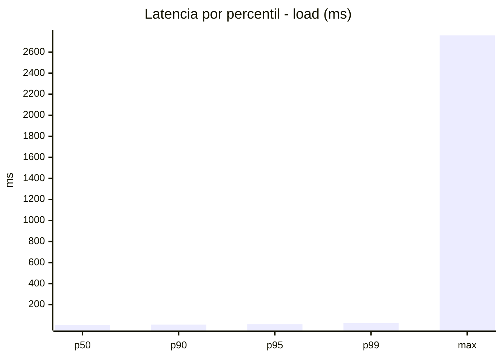
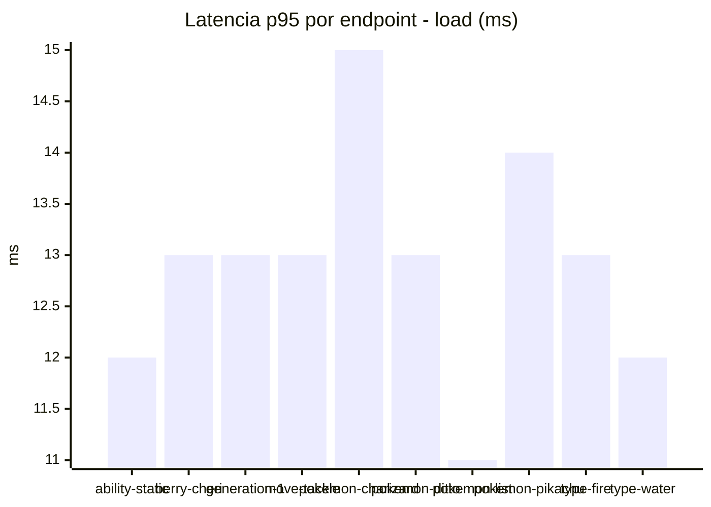
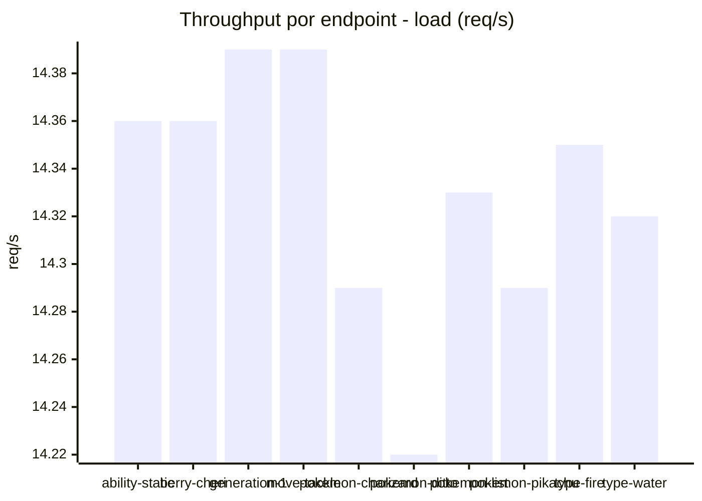
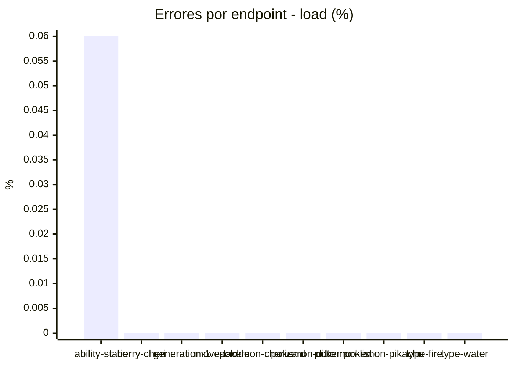
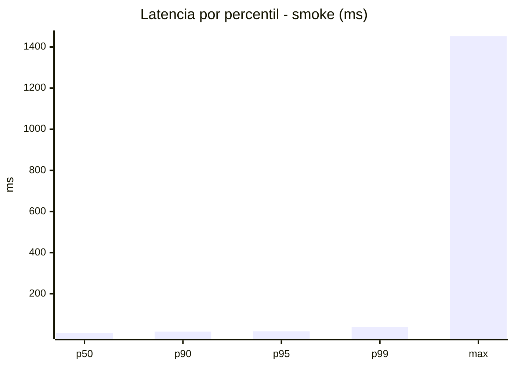
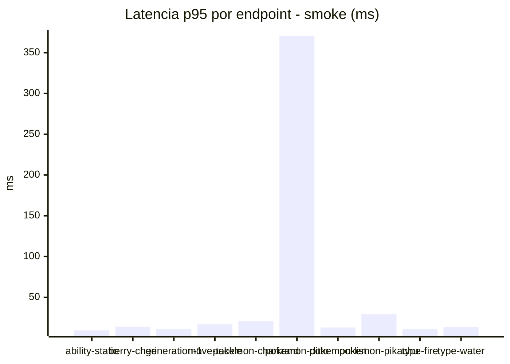
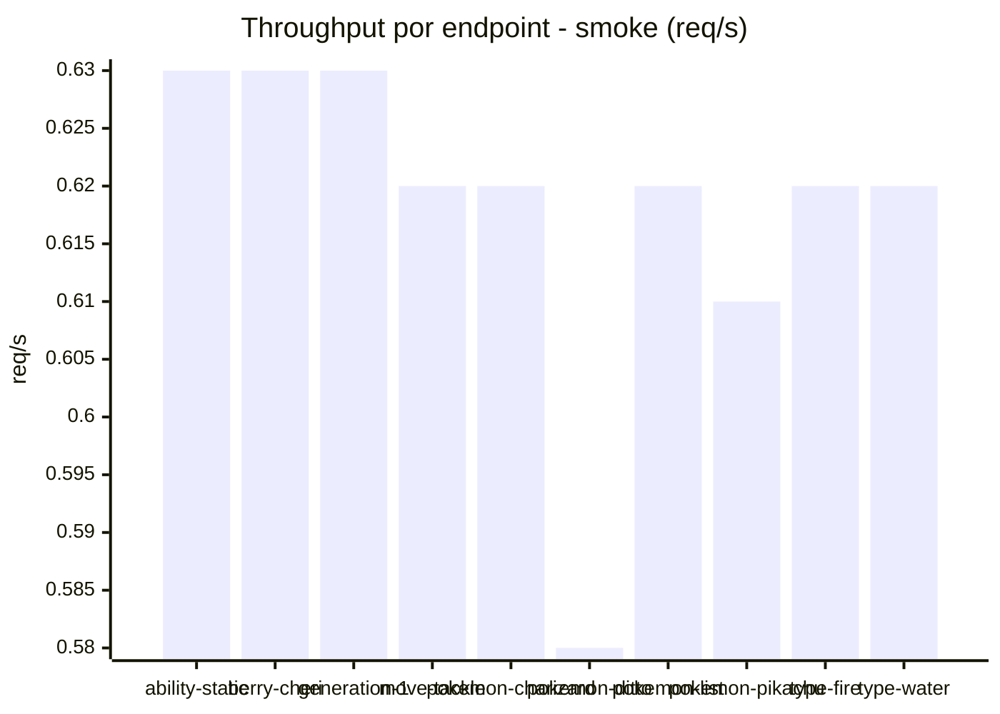
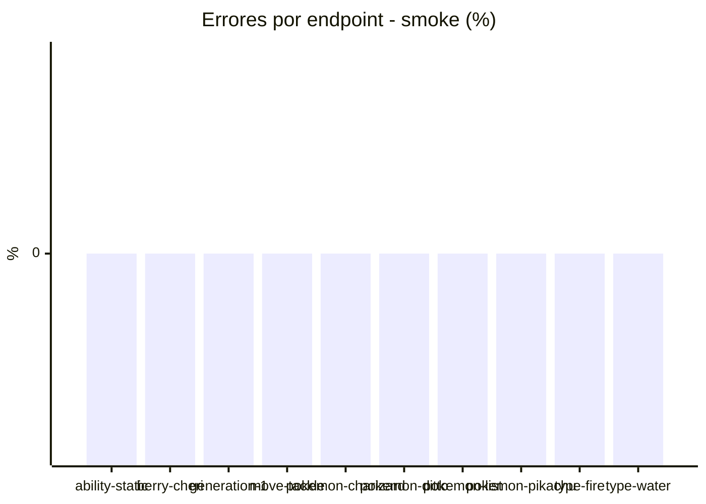

# Reporte de performance - PokeAPI

**Fecha:** 2026-08-07 14:13 UTC  
**Veredicto del agente:** `PASS`  
**Corrida:** [ver en GitHub Actions](https://github.com/lrbg/jmeter-pokeapi-lab/actions/runs/31186311828)  

## Validacion del agente de IA

PASS (fallback por umbrales)

- Error maximo: 0.01%
- p95 maximo: 17.0 ms

## Resultados

### Escenario: `load`

| Metrica | Valor |
| --- | --- |
| Muestras | 16998 |
| Errores | 1 (0.01%) |
| Latencia media | 9.1 ms |
| p50 / p90 / p95 / p99 | 8.0 / 11.0 / 13.0 / 24.0 ms |
| Min / Max | 5 / 2759 ms |
| Throughput | 142.12 req/s |
| Duracion | 119.6 s |

Detalle por endpoint

| Endpoint | Muestras | Error % | avg | p95 | p99 | req/s |
| --- | --- | --- | --- | --- | --- | --- |
| ability-static | 1700 | 0.06% | 8.7 | 12.0 | 23.0 | 14.36 |
| berry-cheri | 1699 | 0.0% | 10.1 | 13.0 | 21.0 | 14.36 |
| generation-1 | 1700 | 0.0% | 8.7 | 13.0 | 22.0 | 14.39 |
| move-tackle | 1699 | 0.0% | 9.0 | 13.0 | 22.0 | 14.39 |
| pokemon-charizard | 1700 | 0.0% | 9.9 | 15.0 | 25.0 | 14.29 |
| pokemon-ditto | 1700 | 0.0% | 8.8 | 13.0 | 20.0 | 14.22 |
| pokemon-list | 1700 | 0.0% | 8.1 | 11.0 | 18.0 | 14.33 |
| pokemon-pikachu | 1700 | 0.0% | 9.6 | 14.0 | 29.0 | 14.29 |
| type-fire | 1700 | 0.0% | 8.8 | 13.0 | 21.0 | 14.35 |
| type-water | 1700 | 0.0% | 8.8 | 12.0 | 22.0 | 14.32 |

### Escenario: `smoke`

| Metrica | Valor |
| --- | --- |
| Muestras | 159 |
| Errores | 0 (0.0%) |
| Latencia media | 19.8 ms |
| p50 / p90 / p95 / p99 | 9.0 / 16.0 / 17.0 / 38.1 ms |
| Min / Max | 6 / 1452 ms |
| Throughput | 5.51 req/s |
| Duracion | 28.8 s |

Detalle por endpoint

| Endpoint | Muestras | Error % | avg | p95 | p99 | req/s |
| --- | --- | --- | --- | --- | --- | --- |
| ability-static | 16 | 0.0% | 8.2 | 9.5 | 10.7 | 0.63 |
| berry-cheri | 16 | 0.0% | 9.2 | 14.0 | 14.0 | 0.63 |
| generation-1 | 15 | 0.0% | 9.1 | 11.3 | 11.9 | 0.63 |
| move-tackle | 16 | 0.0% | 10.9 | 16.8 | 28.1 | 0.62 |
| pokemon-charizard | 16 | 0.0% | 15.6 | 20.8 | 22.5 | 0.62 |
| pokemon-ditto | 16 | 0.0% | 98.8 | 370.5 | 1235.7 | 0.58 |
| pokemon-list | 16 | 0.0% | 8.9 | 13.0 | 15.4 | 0.62 |
| pokemon-pikachu | 16 | 0.0% | 17 | 29.2 | 44.2 | 0.61 |
| type-fire | 16 | 0.0% | 9.2 | 11.2 | 14.2 | 0.62 |
| type-water | 16 | 0.0% | 10.4 | 13.5 | 14.7 | 0.62 |

