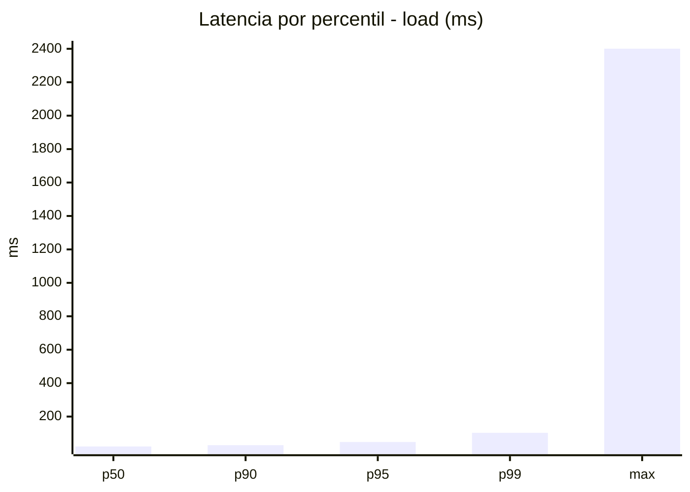
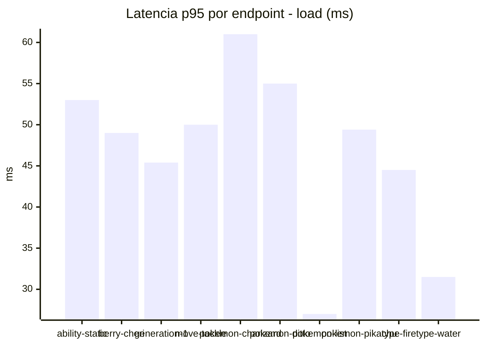
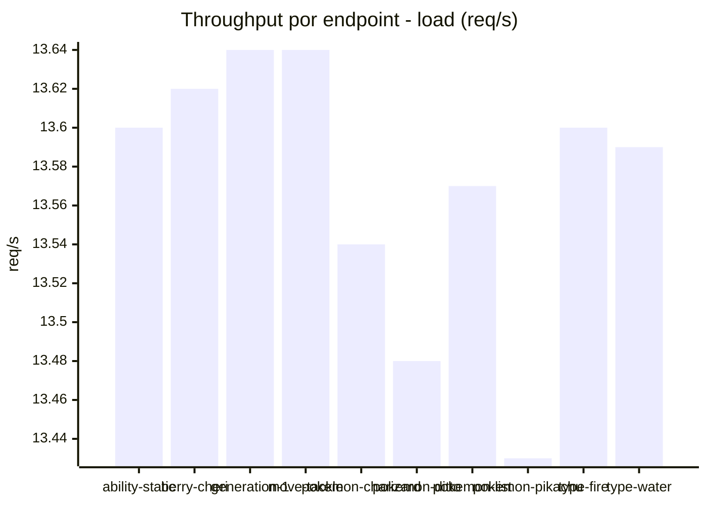
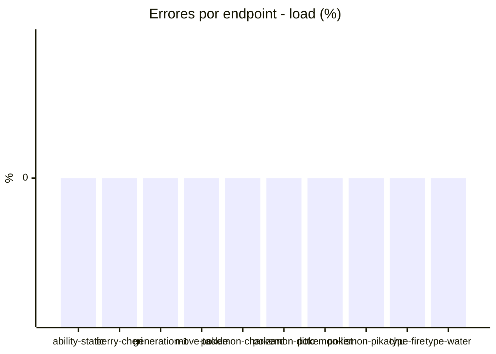
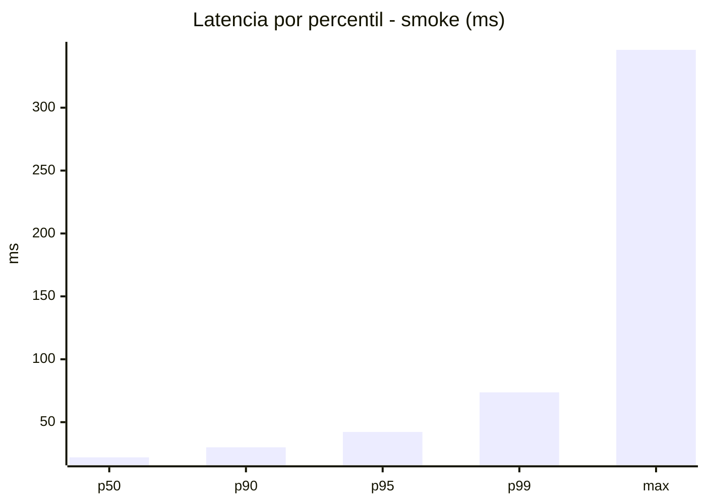
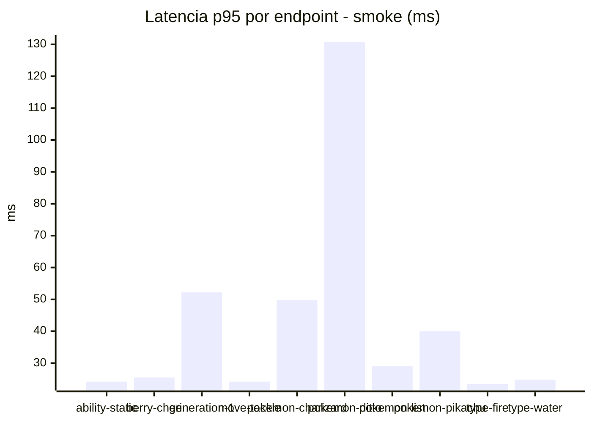
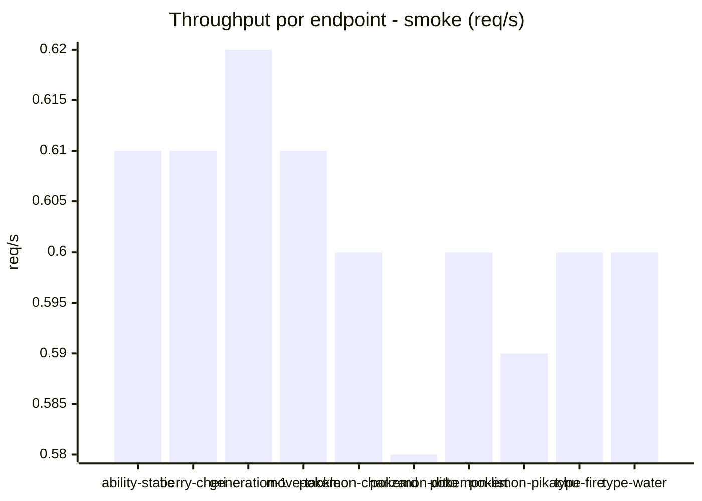

# Reporte de performance - PokeAPI

**Fecha:** 2026-08-08 13:45 UTC  
**Veredicto del agente:** `PASS`  
**Corrida:** [ver en GitHub Actions](https://github.com/lrbg/jmeter-pokeapi-lab/actions/runs/31260164192)  

## Validacion del agente de IA

PASS (fallback por umbrales)

- Error maximo: 0.0%
- p95 maximo: 48.0 ms

## Resultados

### Escenario: `load`

| Metrica | Valor |
| --- | --- |
| Muestras | 16116 |
| Errores | 0 (0.0%) |
| Latencia media | 26.1 ms |
| p50 / p90 / p95 / p99 | 21.0 / 29.0 / 48.0 / 102.9 ms |
| Min / Max | 13 / 2401 ms |
| Throughput | 133.66 req/s |
| Duracion | 120.6 s |

Detalle por endpoint

| Endpoint | Muestras | Error % | avg | p95 | p99 | req/s |
| --- | --- | --- | --- | --- | --- | --- |
| ability-static | 1611 | 0.0% | 24.0 | 53.0 | 99.0 | 13.6 |
| berry-cheri | 1612 | 0.0% | 22.5 | 49.0 | 72.9 | 13.62 |
| generation-1 | 1612 | 0.0% | 23.1 | 45.4 | 93.8 | 13.64 |
| move-tackle | 1612 | 0.0% | 24.3 | 50.0 | 82.0 | 13.64 |
| pokemon-charizard | 1611 | 0.0% | 40.2 | 61.0 | 472.0 | 13.54 |
| pokemon-ditto | 1613 | 0.0% | 24.2 | 55.0 | 109.5 | 13.48 |
| pokemon-list | 1611 | 0.0% | 21.9 | 27.0 | 67.0 | 13.57 |
| pokemon-pikachu | 1612 | 0.0% | 33.2 | 49.4 | 200.4 | 13.43 |
| type-fire | 1611 | 0.0% | 23.8 | 44.5 | 81.0 | 13.6 |
| type-water | 1611 | 0.0% | 24.4 | 31.5 | 98.7 | 13.59 |

### Escenario: `smoke`

| Metrica | Valor |
| --- | --- |
| Muestras | 159 |
| Errores | 0 (0.0%) |
| Latencia media | 25.0 ms |
| p50 / p90 / p95 / p99 | 22.0 / 30.0 / 42.2 / 73.7 ms |
| Min / Max | 14 / 346 ms |
| Throughput | 5.46 req/s |
| Duracion | 29.1 s |

Detalle por endpoint

| Endpoint | Muestras | Error % | avg | p95 | p99 | req/s |
| --- | --- | --- | --- | --- | --- | --- |
| ability-static | 16 | 0.0% | 20.8 | 24.2 | 24.9 | 0.61 |
| berry-cheri | 16 | 0.0% | 19.9 | 25.5 | 29.1 | 0.61 |
| generation-1 | 15 | 0.0% | 25.3 | 52.2 | 76.8 | 0.62 |
| move-tackle | 16 | 0.0% | 20.3 | 24.2 | 27.2 | 0.61 |
| pokemon-charizard | 16 | 0.0% | 32.8 | 49.8 | 61.1 | 0.6 |
| pokemon-ditto | 16 | 0.0% | 43.4 | 130.8 | 302.9 | 0.58 |
| pokemon-list | 16 | 0.0% | 20.6 | 29.0 | 41.0 | 0.6 |
| pokemon-pikachu | 16 | 0.0% | 27.6 | 40.0 | 61.6 | 0.59 |
| type-fire | 16 | 0.0% | 19.9 | 23.5 | 24.7 | 0.6 |
| type-water | 16 | 0.0% | 19.7 | 24.8 | 26.5 | 0.6 |

