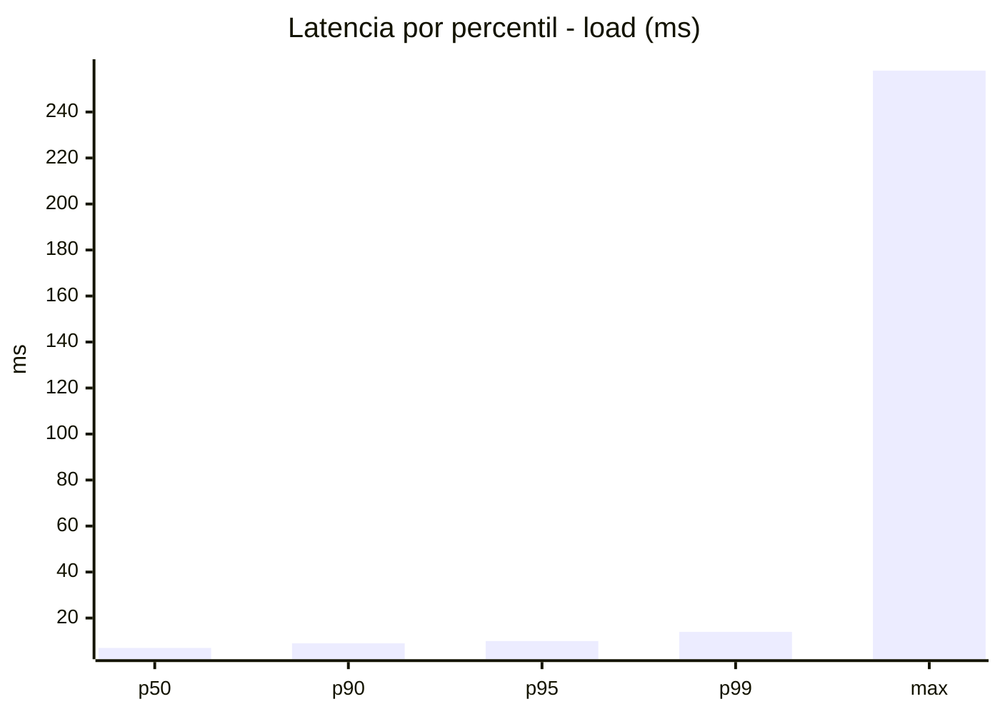
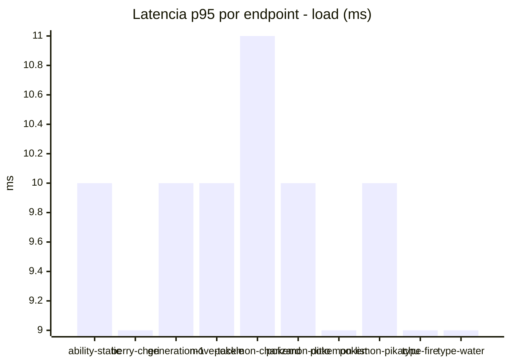
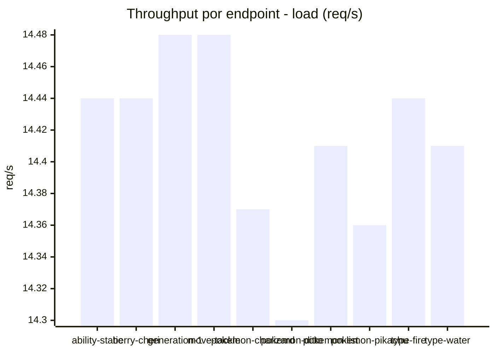
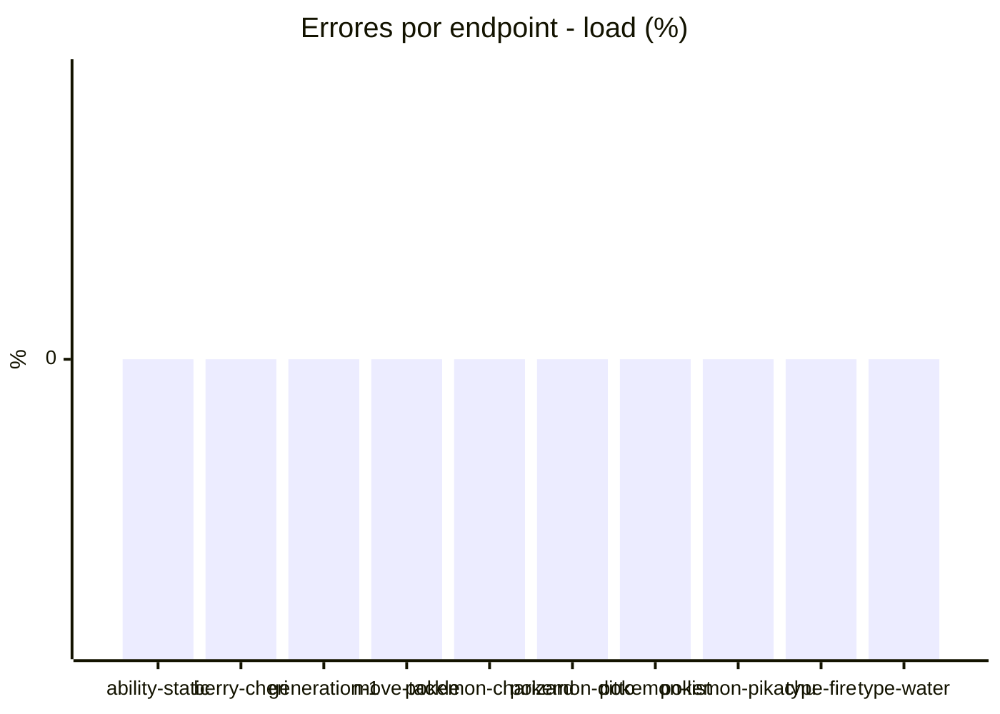
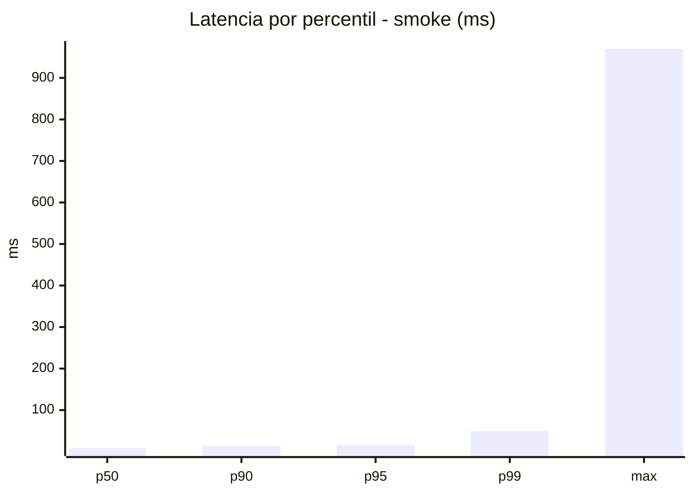
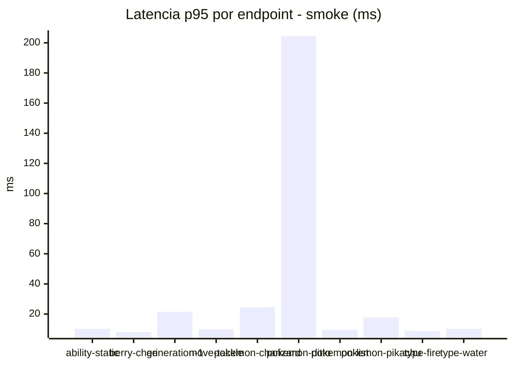
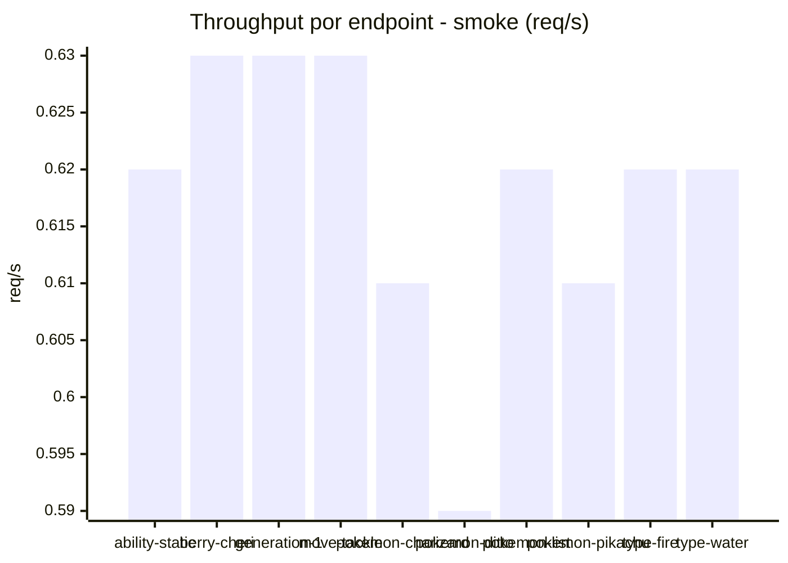

# Reporte de performance - PokeAPI

**Fecha:** 2026-08-09 13:48 UTC  
**Veredicto del agente:** `PASS`  
**Corrida:** [ver en GitHub Actions](https://github.com/lrbg/jmeter-pokeapi-lab/actions/runs/31316644510)  

## Validacion del agente de IA

PASS (fallback por umbrales)

- Error maximo: 0.0%
- p95 maximo: 16.0 ms

## Resultados

### Escenario: `load`

| Metrica | Valor |
| --- | --- |
| Muestras | 17100 |
| Errores | 0 (0.0%) |
| Latencia media | 7.3 ms |
| p50 / p90 / p95 / p99 | 7.0 / 9.0 / 10.0 / 14.0 ms |
| Min / Max | 4 / 258 ms |
| Throughput | 142.93 req/s |
| Duracion | 119.6 s |

Detalle por endpoint

| Endpoint | Muestras | Error % | avg | p95 | p99 | req/s |
| --- | --- | --- | --- | --- | --- | --- |
| ability-static | 1709 | 0.0% | 7.3 | 10.0 | 13.9 | 14.44 |
| berry-cheri | 1709 | 0.0% | 7.0 | 9.0 | 14.0 | 14.44 |
| generation-1 | 1710 | 0.0% | 7.2 | 10.0 | 14.0 | 14.48 |
| move-tackle | 1710 | 0.0% | 7.4 | 10.0 | 12.9 | 14.48 |
| pokemon-charizard | 1710 | 0.0% | 8.1 | 11.0 | 15.9 | 14.37 |
| pokemon-ditto | 1711 | 0.0% | 7.4 | 10.0 | 12.0 | 14.3 |
| pokemon-list | 1711 | 0.0% | 6.7 | 9.0 | 11.0 | 14.41 |
| pokemon-pikachu | 1710 | 0.0% | 7.9 | 10.0 | 16.9 | 14.36 |
| type-fire | 1710 | 0.0% | 7.0 | 9.0 | 14.0 | 14.44 |
| type-water | 1710 | 0.0% | 7.3 | 9.0 | 12.9 | 14.41 |

### Escenario: `smoke`

| Metrica | Valor |
| --- | --- |
| Muestras | 162 |
| Errores | 0 (0.0%) |
| Latencia media | 15.8 ms |
| p50 / p90 / p95 / p99 | 8.0 / 14.0 / 16.0 / 49.8 ms |
| Min / Max | 6 / 970 ms |
| Throughput | 5.56 req/s |
| Duracion | 29.1 s |

Detalle por endpoint

| Endpoint | Muestras | Error % | avg | p95 | p99 | req/s |
| --- | --- | --- | --- | --- | --- | --- |
| ability-static | 16 | 0.0% | 8.8 | 10.2 | 10.8 | 0.62 |
| berry-cheri | 16 | 0.0% | 7.3 | 8.0 | 8.0 | 0.63 |
| generation-1 | 16 | 0.0% | 11 | 21.5 | 51.5 | 0.63 |
| move-tackle | 16 | 0.0% | 8.5 | 10.0 | 10.0 | 0.63 |
| pokemon-charizard | 16 | 0.0% | 16.3 | 24.5 | 40.1 | 0.61 |
| pokemon-ditto | 17 | 0.0% | 65.4 | 204.4 | 816.9 | 0.59 |
| pokemon-list | 16 | 0.0% | 7.8 | 9.5 | 10.7 | 0.62 |
| pokemon-pikachu | 17 | 0.0% | 13.3 | 17.8 | 23.6 | 0.61 |
| type-fire | 16 | 0.0% | 7.6 | 8.8 | 10.5 | 0.62 |
| type-water | 16 | 0.0% | 8.7 | 10.2 | 10.8 | 0.62 |

