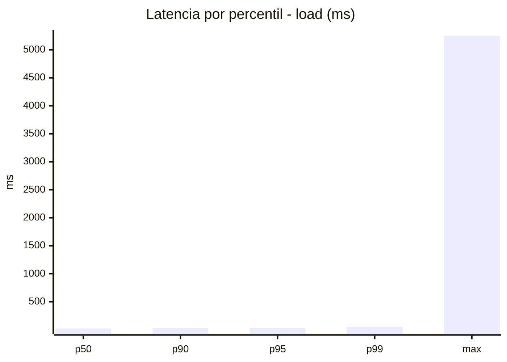
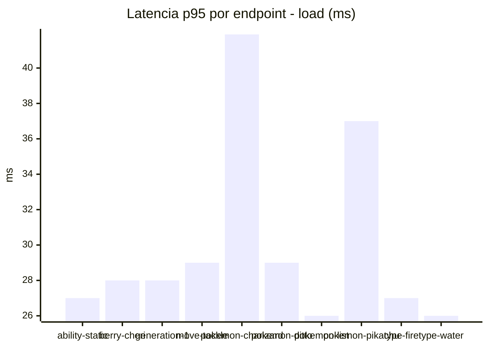
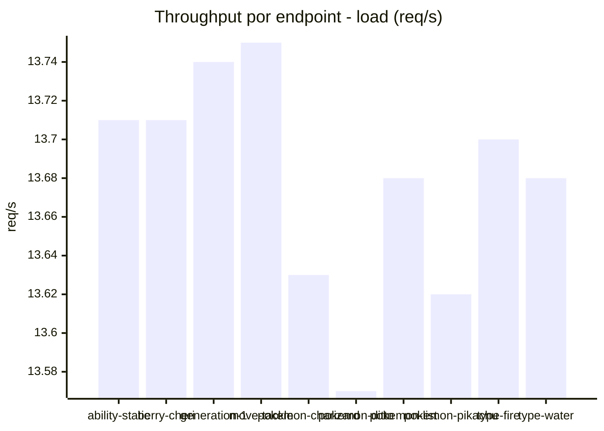
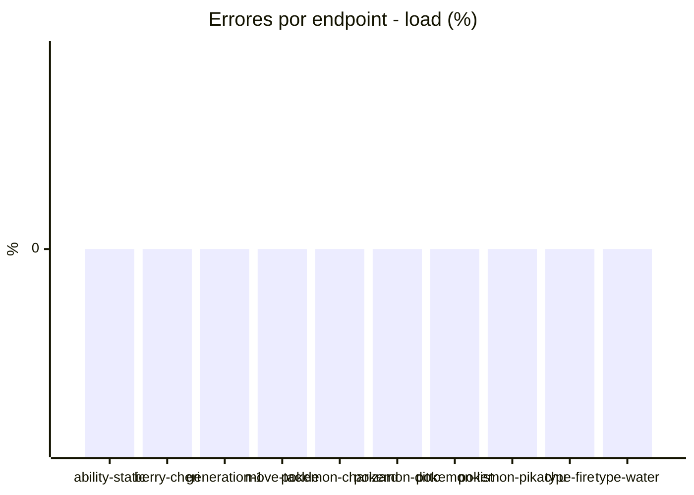
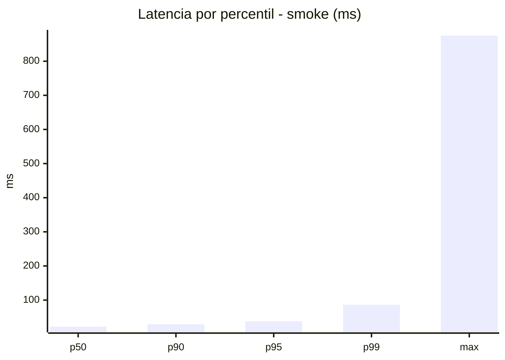
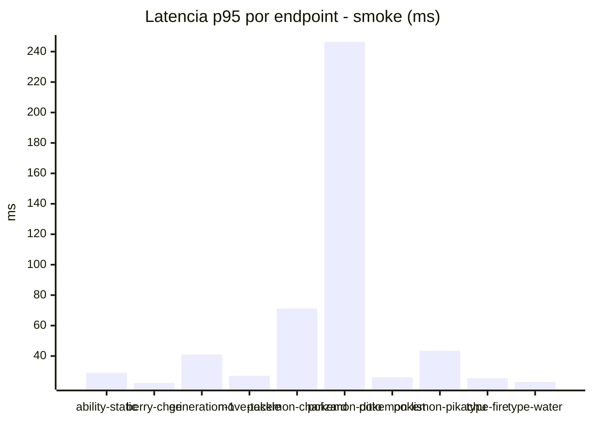
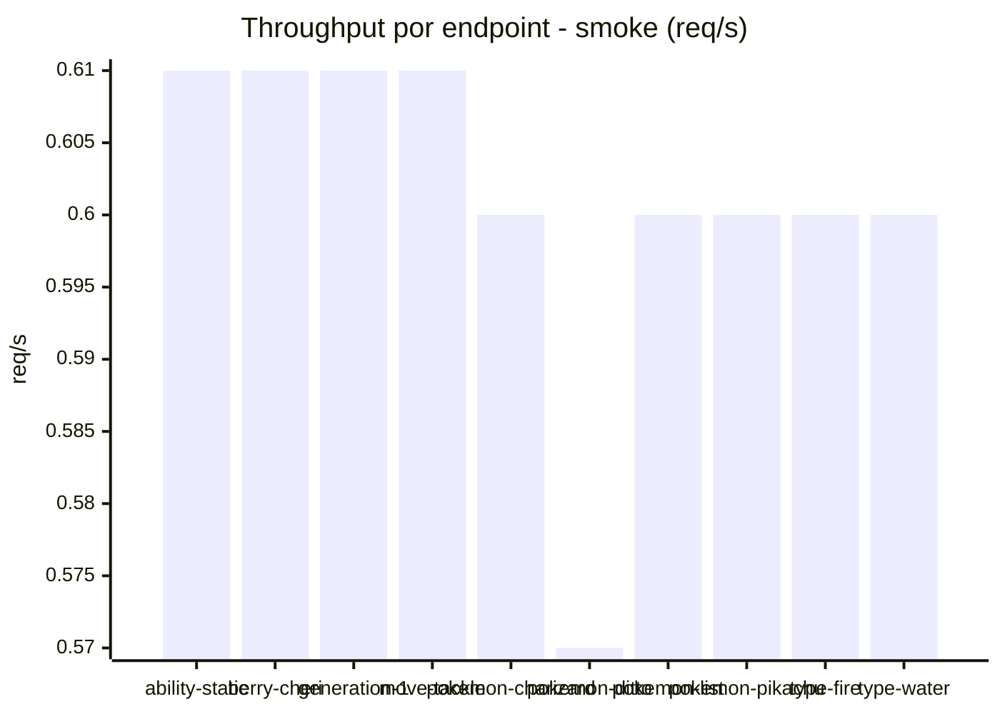

# Reporte de performance - PokeAPI

**Fecha:** 2026-08-10 14:21 UTC  
**Veredicto del agente:** `PASS`  
**Corrida:** [ver en GitHub Actions](https://github.com/lrbg/jmeter-pokeapi-lab/actions/runs/31397428370)  

## Validacion del agente de IA

PASS (fallback por umbrales)

- Error maximo: 0.0%
- p95 maximo: 38.2 ms

## Resultados

### Escenario: `load`

| Metrica | Valor |
| --- | --- |
| Muestras | 16223 |
| Errores | 0 (0.0%) |
| Latencia media | 23.9 ms |
| p50 / p90 / p95 / p99 | 22.0 / 28.0 / 30.0 / 53.8 ms |
| Min / Max | 16 / 5251 ms |
| Throughput | 135.62 req/s |
| Duracion | 119.6 s |

Detalle por endpoint

| Endpoint | Muestras | Error % | avg | p95 | p99 | req/s |
| --- | --- | --- | --- | --- | --- | --- |
| ability-static | 1622 | 0.0% | 22.6 | 27.0 | 39.8 | 13.71 |
| berry-cheri | 1622 | 0.0% | 22.6 | 28.0 | 49.4 | 13.71 |
| generation-1 | 1621 | 0.0% | 22.8 | 28.0 | 41.8 | 13.74 |
| move-tackle | 1623 | 0.0% | 23.3 | 29.0 | 52.6 | 13.75 |
| pokemon-charizard | 1622 | 0.0% | 29.3 | 41.9 | 70.0 | 13.63 |
| pokemon-ditto | 1622 | 0.0% | 23.1 | 29.0 | 52.0 | 13.57 |
| pokemon-list | 1623 | 0.0% | 21.7 | 26.0 | 32.8 | 13.68 |
| pokemon-pikachu | 1622 | 0.0% | 26.7 | 37.0 | 60.8 | 13.62 |
| type-fire | 1623 | 0.0% | 25.0 | 27.0 | 34.0 | 13.7 |
| type-water | 1623 | 0.0% | 21.6 | 26.0 | 34.6 | 13.68 |

### Escenario: `smoke`

| Metrica | Valor |
| --- | --- |
| Muestras | 157 |
| Errores | 0 (0.0%) |
| Latencia media | 30.0 ms |
| p50 / p90 / p95 / p99 | 22.0 / 29.0 / 38.2 / 86.2 ms |
| Min / Max | 17 / 875 ms |
| Throughput | 5.42 req/s |
| Duracion | 29.0 s |

Detalle por endpoint

| Endpoint | Muestras | Error % | avg | p95 | p99 | req/s |
| --- | --- | --- | --- | --- | --- | --- |
| ability-static | 16 | 0.0% | 22.5 | 29.0 | 29.0 | 0.61 |
| berry-cheri | 15 | 0.0% | 20.7 | 22.3 | 22.9 | 0.61 |
| generation-1 | 15 | 0.0% | 24.6 | 41.0 | 63.4 | 0.61 |
| move-tackle | 15 | 0.0% | 22.3 | 27.0 | 27.0 | 0.61 |
| pokemon-charizard | 16 | 0.0% | 37.2 | 71.2 | 100.6 | 0.6 |
| pokemon-ditto | 16 | 0.0% | 76.7 | 246.5 | 749.3 | 0.57 |
| pokemon-list | 16 | 0.0% | 21.5 | 26.0 | 26.0 | 0.6 |
| pokemon-pikachu | 16 | 0.0% | 30.2 | 43.5 | 54.3 | 0.6 |
| type-fire | 16 | 0.0% | 21.8 | 25.5 | 29.1 | 0.6 |
| type-water | 16 | 0.0% | 21.2 | 23.0 | 23.0 | 0.6 |

