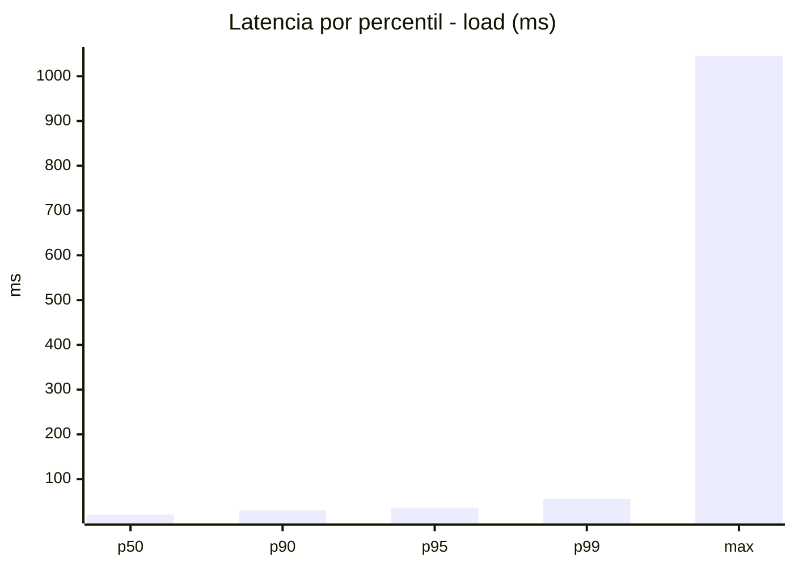
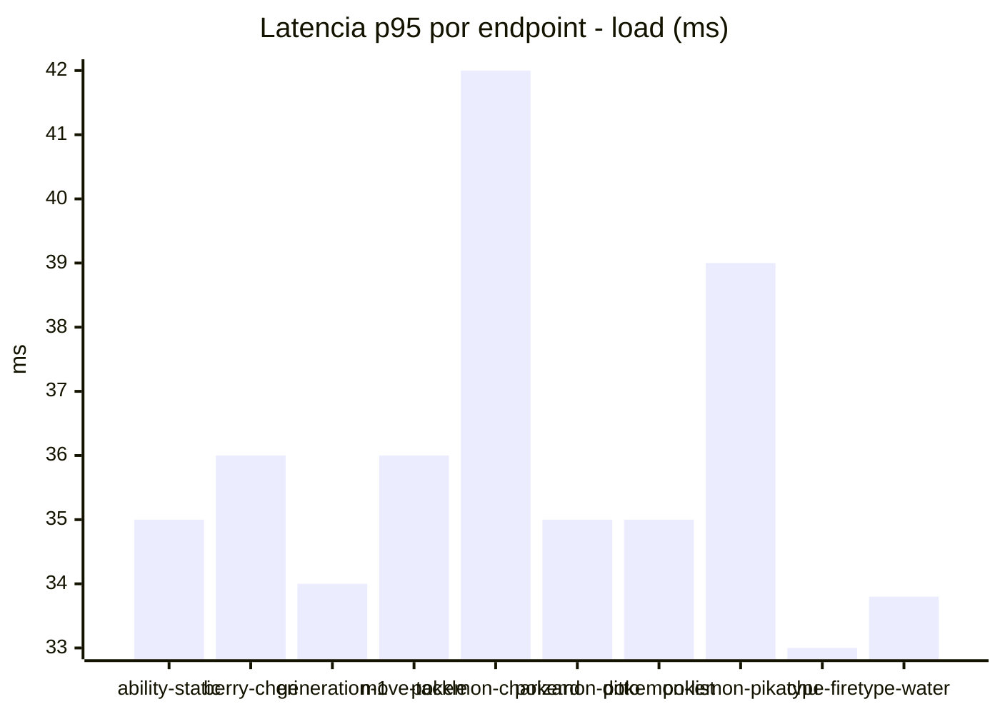
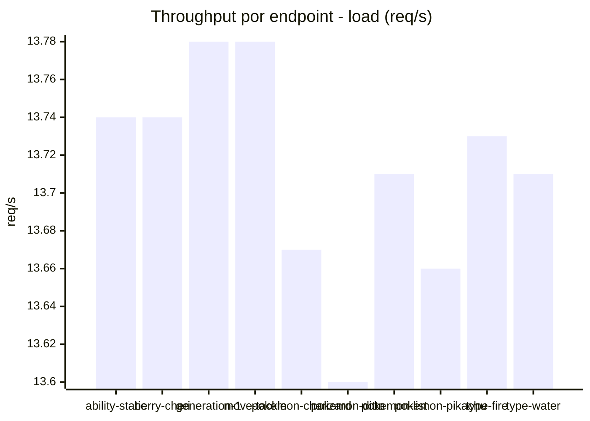
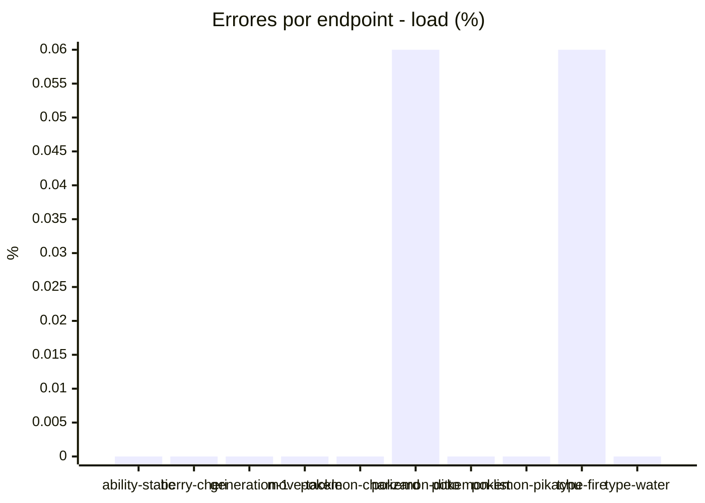
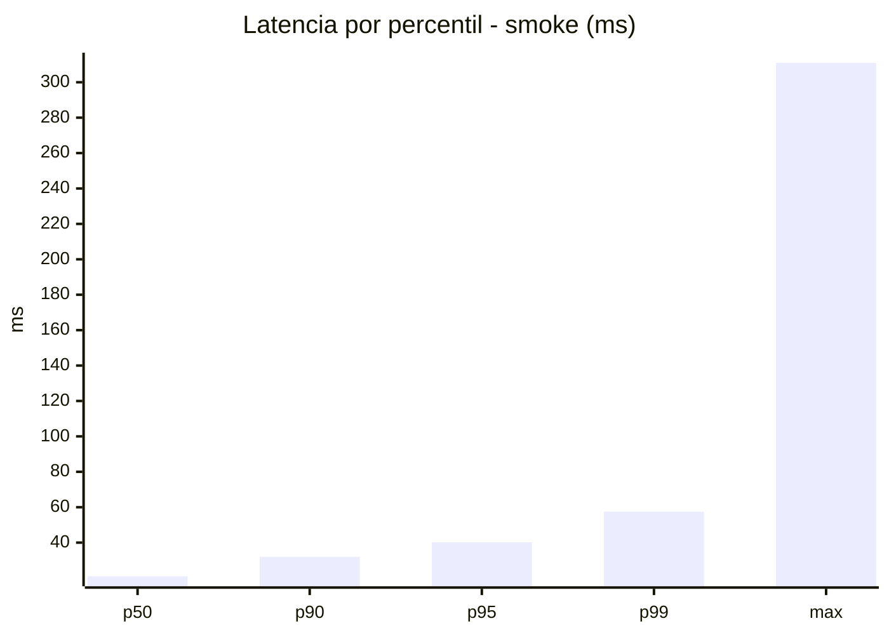
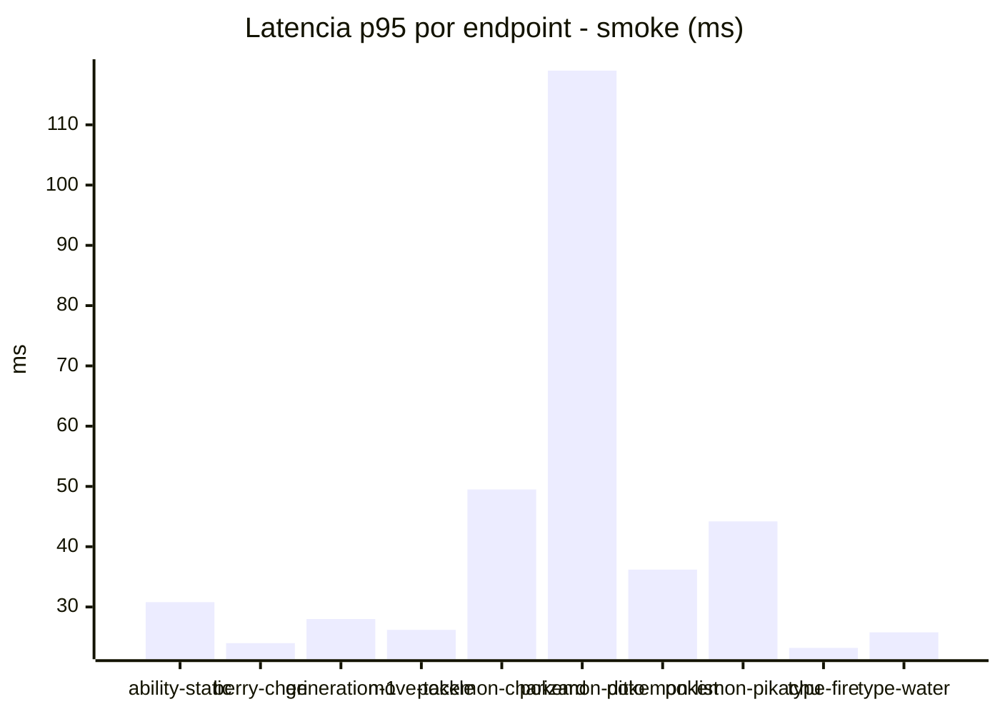
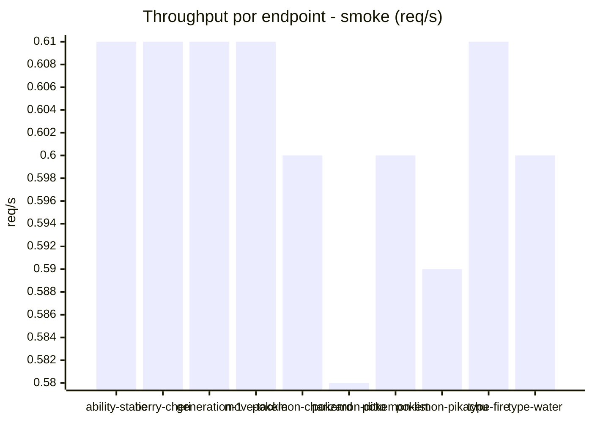
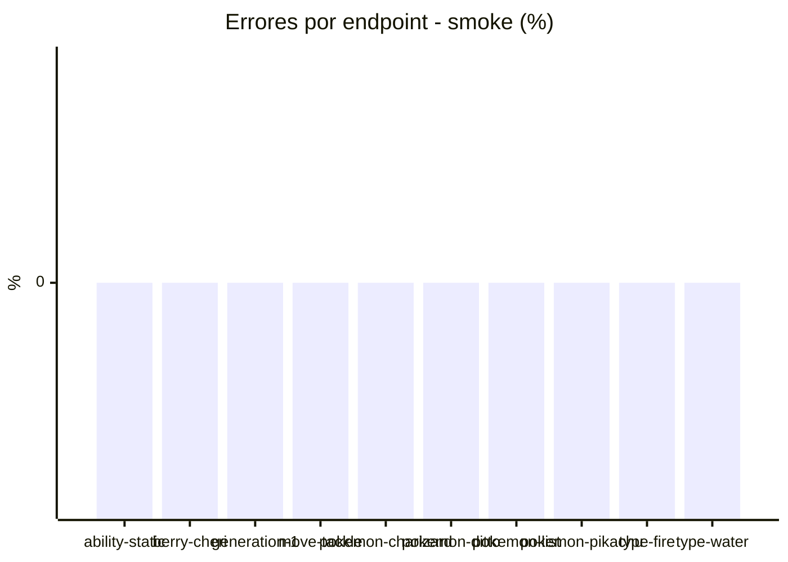

# Reporte de performance - PokeAPI

**Fecha:** 2026-08-11 14:20 UTC  
**Veredicto del agente:** `PASS`  
**Corrida:** [ver en GitHub Actions](https://github.com/lrbg/jmeter-pokeapi-lab/actions/runs/31500726710)  

## Validacion del agente de IA

PASS (fallback por umbrales)

- Error maximo: 0.01%
- p95 maximo: 40.2 ms

## Resultados

### Escenario: `load`

| Metrica | Valor |
| --- | --- |
| Muestras | 16262 |
| Errores | 2 (0.01%) |
| Latencia media | 23.2 ms |
| p50 / p90 / p95 / p99 | 21.0 / 30.0 / 36.0 / 56.0 ms |
| Min / Max | 13 / 1045 ms |
| Throughput | 135.93 req/s |
| Duracion | 119.6 s |

Detalle por endpoint

| Endpoint | Muestras | Error % | avg | p95 | p99 | req/s |
| --- | --- | --- | --- | --- | --- | --- |
| ability-static | 1625 | 0.0% | 23.0 | 35.0 | 53.0 | 13.74 |
| berry-cheri | 1626 | 0.0% | 22.2 | 36.0 | 55.0 | 13.74 |
| generation-1 | 1626 | 0.0% | 22.8 | 34.0 | 55.8 | 13.78 |
| move-tackle | 1627 | 0.0% | 23.4 | 36.0 | 55.0 | 13.78 |
| pokemon-charizard | 1626 | 0.0% | 26.8 | 42.0 | 67.0 | 13.67 |
| pokemon-ditto | 1627 | 0.06% | 22.7 | 35.0 | 55.7 | 13.6 |
| pokemon-list | 1626 | 0.0% | 22.2 | 35.0 | 50.0 | 13.71 |
| pokemon-pikachu | 1626 | 0.0% | 25.8 | 39.0 | 65.8 | 13.66 |
| type-fire | 1627 | 0.06% | 21.4 | 33.0 | 46.7 | 13.73 |
| type-water | 1626 | 0.0% | 21.7 | 33.8 | 51.8 | 13.71 |

### Escenario: `smoke`

| Metrica | Valor |
| --- | --- |
| Muestras | 160 |
| Errores | 0 (0.0%) |
| Latencia media | 25.0 ms |
| p50 / p90 / p95 / p99 | 21.0 / 32.0 / 40.2 / 57.5 ms |
| Min / Max | 15 / 311 ms |
| Throughput | 5.46 req/s |
| Duracion | 29.3 s |

Detalle por endpoint

| Endpoint | Muestras | Error % | avg | p95 | p99 | req/s |
| --- | --- | --- | --- | --- | --- | --- |
| ability-static | 16 | 0.0% | 23.1 | 30.8 | 34.9 | 0.61 |
| berry-cheri | 16 | 0.0% | 20.9 | 24.0 | 24.0 | 0.61 |
| generation-1 | 16 | 0.0% | 21.2 | 28.0 | 30.4 | 0.61 |
| move-tackle | 16 | 0.0% | 21.1 | 26.2 | 26.9 | 0.61 |
| pokemon-charizard | 16 | 0.0% | 30.4 | 49.5 | 53.1 | 0.6 |
| pokemon-ditto | 16 | 0.0% | 42.3 | 119.0 | 272.6 | 0.58 |
| pokemon-list | 16 | 0.0% | 22.5 | 36.2 | 56.0 | 0.6 |
| pokemon-pikachu | 16 | 0.0% | 30.1 | 44.2 | 44.9 | 0.59 |
| type-fire | 16 | 0.0% | 18.7 | 23.2 | 31.0 | 0.61 |
| type-water | 16 | 0.0% | 19.6 | 25.8 | 27.5 | 0.6 |

