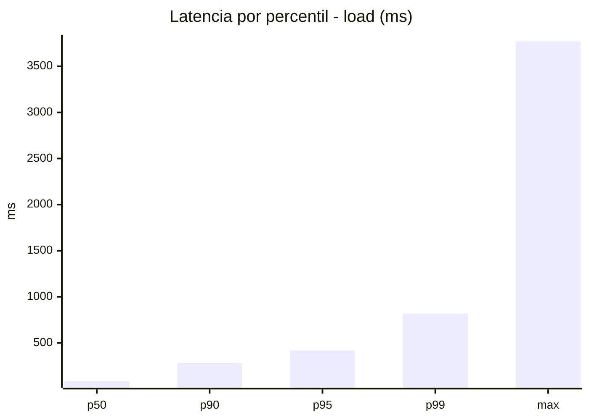
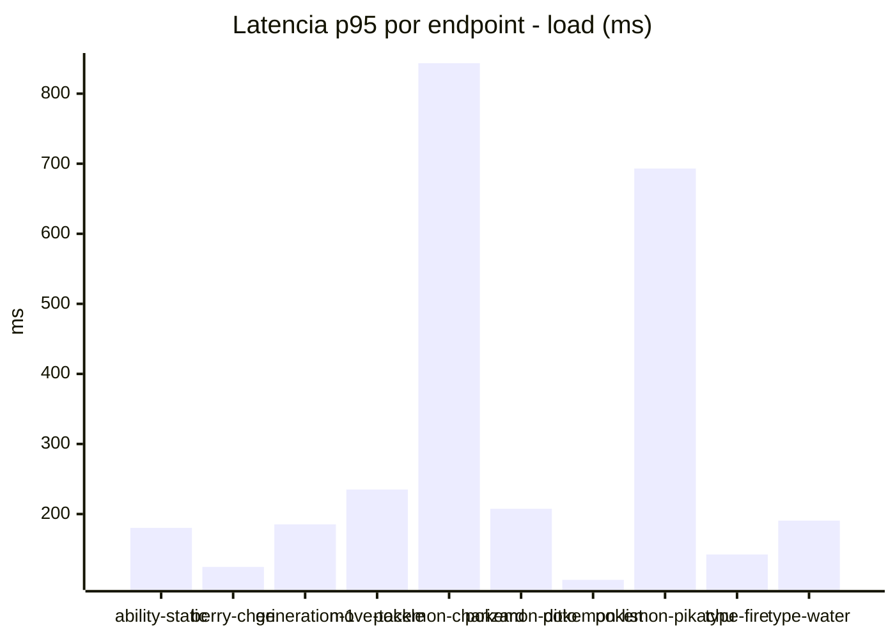
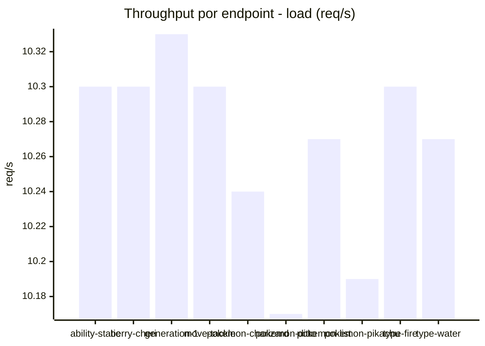
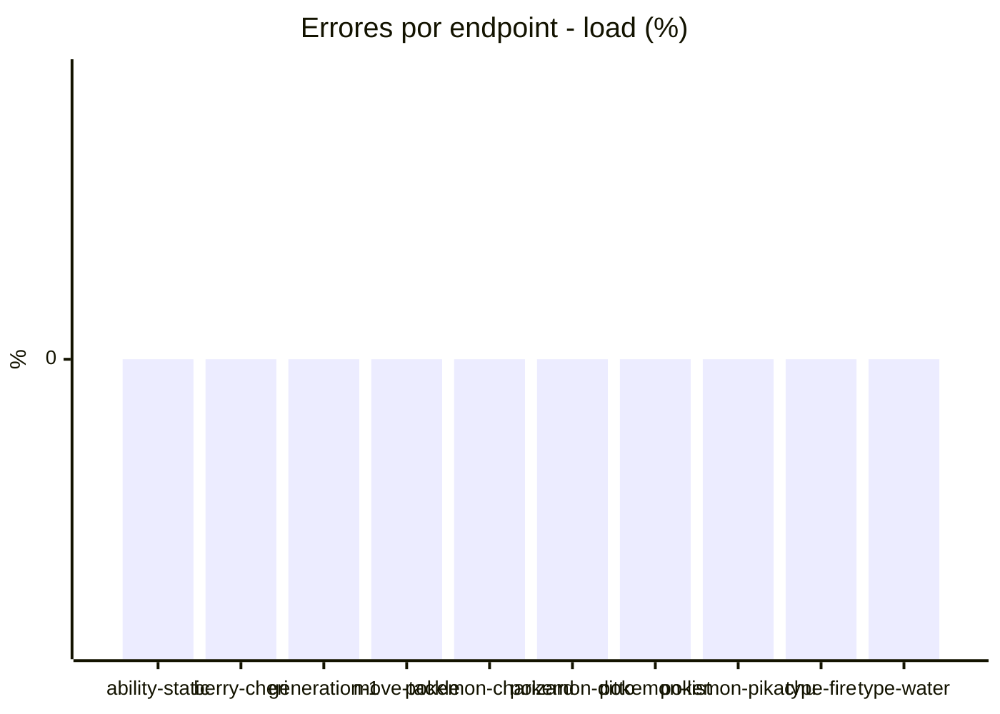
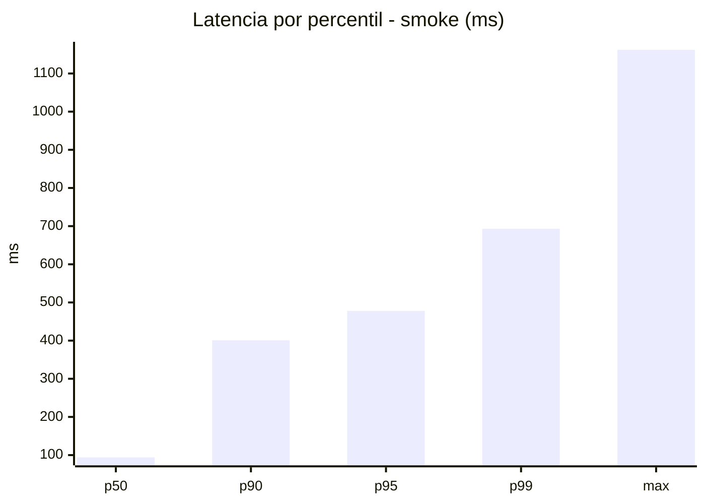
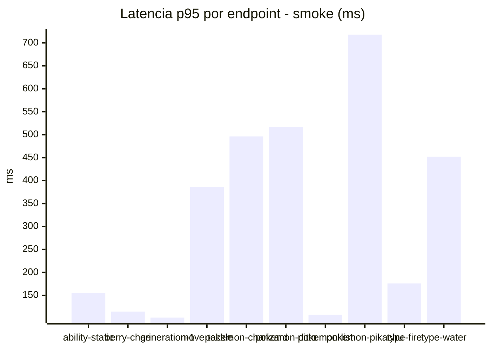
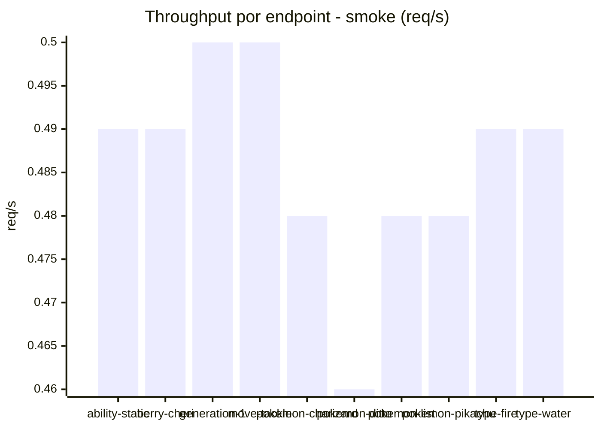

# Reporte de performance - PokeAPI

**Fecha:** 2026-08-12 14:21 UTC  
**Veredicto del agente:** `PASS`  
**Corrida:** [ver en GitHub Actions](https://github.com/lrbg/jmeter-pokeapi-lab/actions/runs/31606082368)  

## Validacion del agente de IA

PASS (fallback por umbrales)

- Error maximo: 0.0%
- p95 maximo: 478.0 ms

## Resultados

### Escenario: `load`

| Metrica | Valor |
| --- | --- |
| Muestras | 12156 |
| Errores | 0 (0.0%) |
| Latencia media | 132.5 ms |
| p50 / p90 / p95 / p99 | 85.0 / 281.0 / 418.0 / 818.0 ms |
| Min / Max | 23 / 3769 ms |
| Throughput | 101.41 req/s |
| Duracion | 119.9 s |

Detalle por endpoint

| Endpoint | Muestras | Error % | avg | p95 | p99 | req/s |
| --- | --- | --- | --- | --- | --- | --- |
| ability-static | 1216 | 0.0% | 94.8 | 180.2 | 501.4 | 10.3 |
| berry-cheri | 1216 | 0.0% | 74.4 | 124.5 | 265.6 | 10.3 |
| generation-1 | 1215 | 0.0% | 89.8 | 185.3 | 381.7 | 10.33 |
| move-tackle | 1215 | 0.0% | 111.4 | 235.0 | 562.3 | 10.3 |
| pokemon-charizard | 1216 | 0.0% | 325.6 | 843.5 | 1788.9 | 10.24 |
| pokemon-ditto | 1216 | 0.0% | 99.8 | 207.5 | 558.9 | 10.17 |
| pokemon-list | 1216 | 0.0% | 71.9 | 106.0 | 292.3 | 10.27 |
| pokemon-pikachu | 1216 | 0.0% | 274.7 | 693.2 | 1192.2 | 10.19 |
| type-fire | 1215 | 0.0% | 86.3 | 142.3 | 420.9 | 10.3 |
| type-water | 1215 | 0.0% | 96.6 | 190.6 | 463.3 | 10.27 |

### Escenario: `smoke`

| Metrica | Valor |
| --- | --- |
| Muestras | 127 |
| Errores | 0 (0.0%) |
| Latencia media | 162.5 ms |
| p50 / p90 / p95 / p99 | 94.0 / 400.8 / 478.0 / 693.1 ms |
| Min / Max | 28 / 1162 ms |
| Throughput | 4.34 req/s |
| Duracion | 29.3 s |

Detalle por endpoint

| Endpoint | Muestras | Error % | avg | p95 | p99 | req/s |
| --- | --- | --- | --- | --- | --- | --- |
| ability-static | 13 | 0.0% | 90.2 | 154.6 | 206.9 | 0.49 |
| berry-cheri | 12 | 0.0% | 74.1 | 114.5 | 122.9 | 0.49 |
| generation-1 | 12 | 0.0% | 77.1 | 101.5 | 105.9 | 0.5 |
| move-tackle | 12 | 0.0% | 161.8 | 386.1 | 640.4 | 0.5 |
| pokemon-charizard | 13 | 0.0% | 382.2 | 496.2 | 514.4 | 0.48 |
| pokemon-ditto | 13 | 0.0% | 158.8 | 517.4 | 520.3 | 0.46 |
| pokemon-list | 13 | 0.0% | 79.3 | 107.8 | 111.2 | 0.48 |
| pokemon-pikachu | 13 | 0.0% | 359.3 | 718.0 | 1073.2 | 0.48 |
| type-fire | 13 | 0.0% | 95.2 | 176.0 | 260.0 | 0.49 |
| type-water | 13 | 0.0% | 133.3 | 452.0 | 620.0 | 0.49 |

