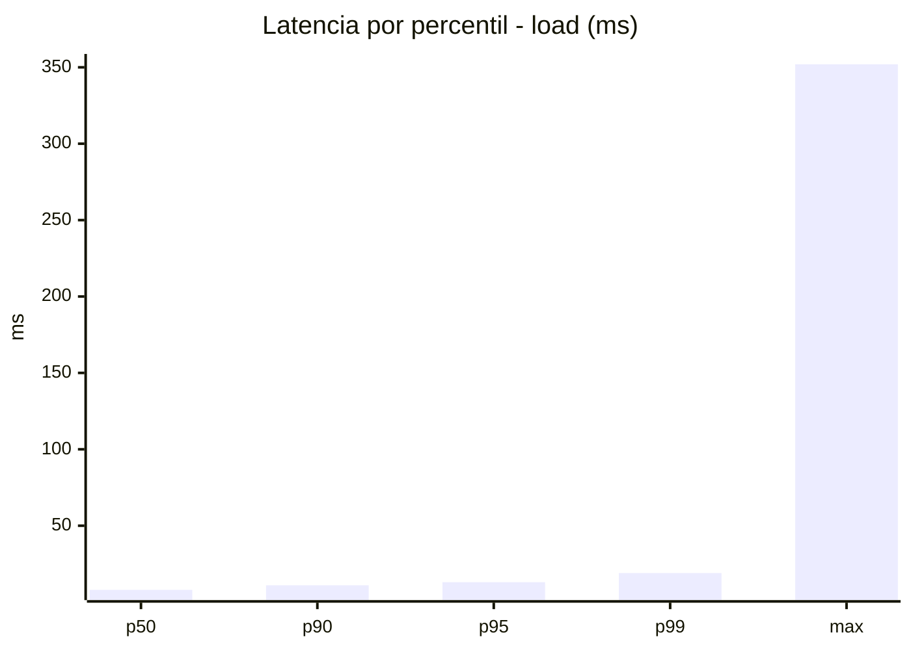
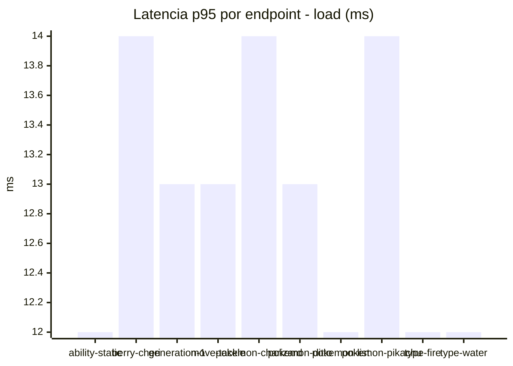
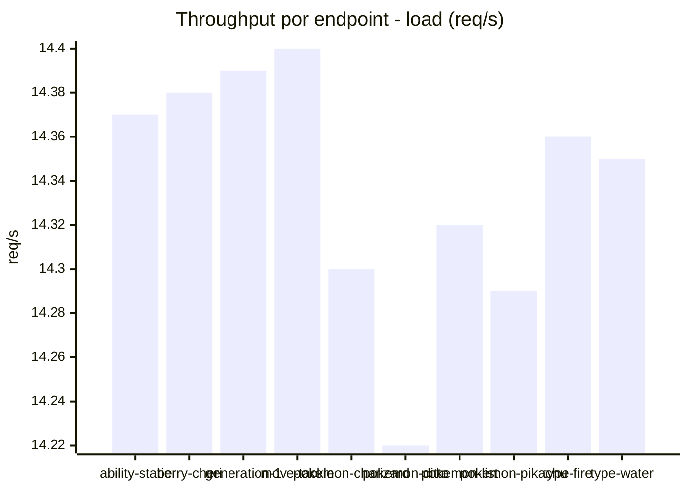
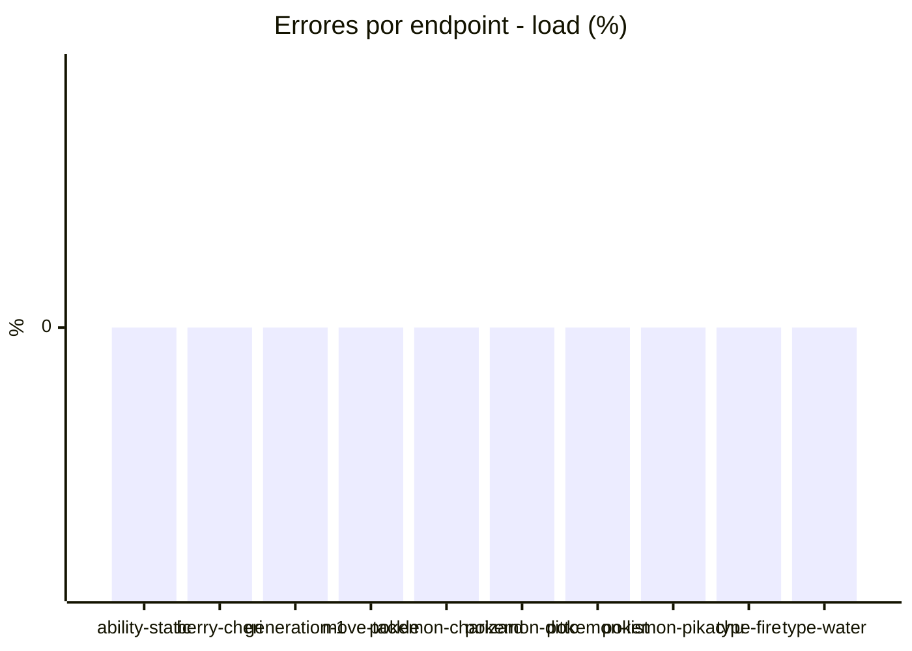
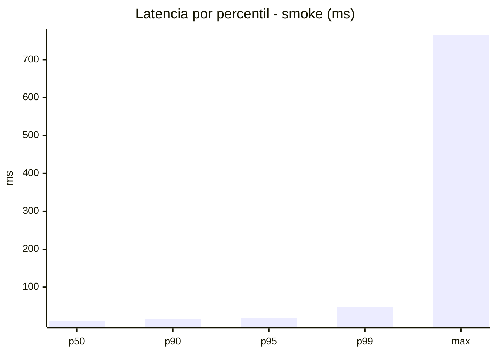
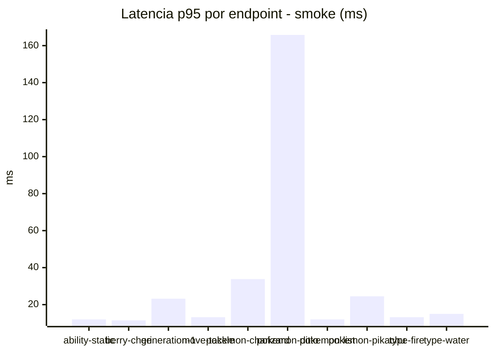
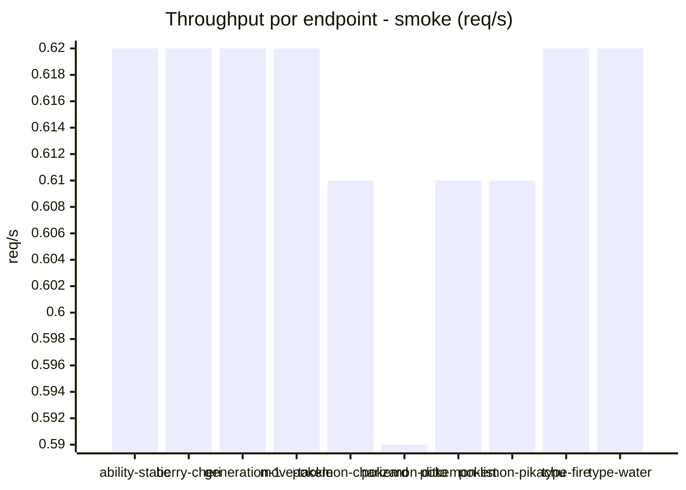

# Reporte de performance - PokeAPI

**Fecha:** 2026-08-13 14:23 UTC  
**Veredicto del agente:** `PASS`  
**Corrida:** [ver en GitHub Actions](https://github.com/lrbg/jmeter-pokeapi-lab/actions/runs/31709634804)  

## Validacion del agente de IA

PASS (fallback por umbrales)

- Error maximo: 0.0%
- p95 maximo: 19.0 ms

## Resultados

### Escenario: `load`

| Metrica | Valor |
| --- | --- |
| Muestras | 17003 |
| Errores | 0 (0.0%) |
| Latencia media | 9.0 ms |
| p50 / p90 / p95 / p99 | 8.0 / 11.0 / 13.0 / 19.0 ms |
| Min / Max | 5 / 352 ms |
| Throughput | 142.23 req/s |
| Duracion | 119.5 s |

Detalle por endpoint

| Endpoint | Muestras | Error % | avg | p95 | p99 | req/s |
| --- | --- | --- | --- | --- | --- | --- |
| ability-static | 1701 | 0.0% | 8.7 | 12.0 | 17.0 | 14.37 |
| berry-cheri | 1700 | 0.0% | 8.9 | 14.0 | 21.0 | 14.38 |
| generation-1 | 1699 | 0.0% | 9.2 | 13.0 | 20.0 | 14.39 |
| move-tackle | 1700 | 0.0% | 8.8 | 13.0 | 19.0 | 14.4 |
| pokemon-charizard | 1700 | 0.0% | 10.0 | 14.0 | 22.0 | 14.3 |
| pokemon-ditto | 1700 | 0.0% | 8.9 | 13.0 | 18.0 | 14.22 |
| pokemon-list | 1700 | 0.0% | 8.3 | 12.0 | 16.0 | 14.32 |
| pokemon-pikachu | 1701 | 0.0% | 9.6 | 14.0 | 20.0 | 14.29 |
| type-fire | 1701 | 0.0% | 8.7 | 12.0 | 18.0 | 14.36 |
| type-water | 1701 | 0.0% | 8.8 | 12.0 | 18.0 | 14.35 |

### Escenario: `smoke`

| Metrica | Valor |
| --- | --- |
| Muestras | 161 |
| Errores | 0 (0.0%) |
| Latencia media | 16.4 ms |
| p50 / p90 / p95 / p99 | 10.0 / 17.0 / 19.0 / 48.0 ms |
| Min / Max | 6 / 765 ms |
| Throughput | 5.56 req/s |
| Duracion | 29.0 s |

Detalle por endpoint

| Endpoint | Muestras | Error % | avg | p95 | p99 | req/s |
| --- | --- | --- | --- | --- | --- | --- |
| ability-static | 16 | 0.0% | 9.7 | 12.0 | 12.0 | 0.62 |
| berry-cheri | 16 | 0.0% | 9.4 | 11.5 | 12.7 | 0.62 |
| generation-1 | 16 | 0.0% | 11.8 | 23.2 | 38.2 | 0.62 |
| move-tackle | 16 | 0.0% | 10.4 | 13.2 | 13.8 | 0.62 |
| pokemon-charizard | 16 | 0.0% | 19.9 | 33.8 | 52.3 | 0.61 |
| pokemon-ditto | 17 | 0.0% | 54.9 | 165.8 | 645.2 | 0.59 |
| pokemon-list | 16 | 0.0% | 8.9 | 12.0 | 12.0 | 0.61 |
| pokemon-pikachu | 16 | 0.0% | 16.1 | 24.5 | 32.9 | 0.61 |
| type-fire | 16 | 0.0% | 10.4 | 13.2 | 16.2 | 0.62 |
| type-water | 16 | 0.0% | 10.6 | 15.0 | 17.4 | 0.62 |

