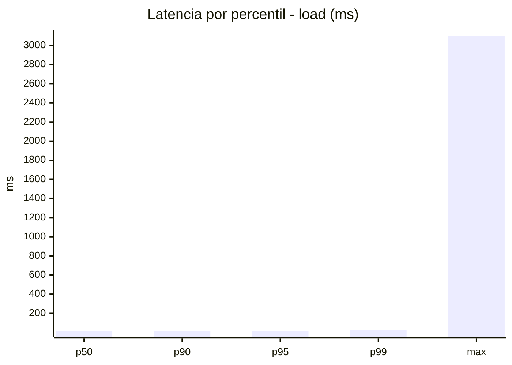
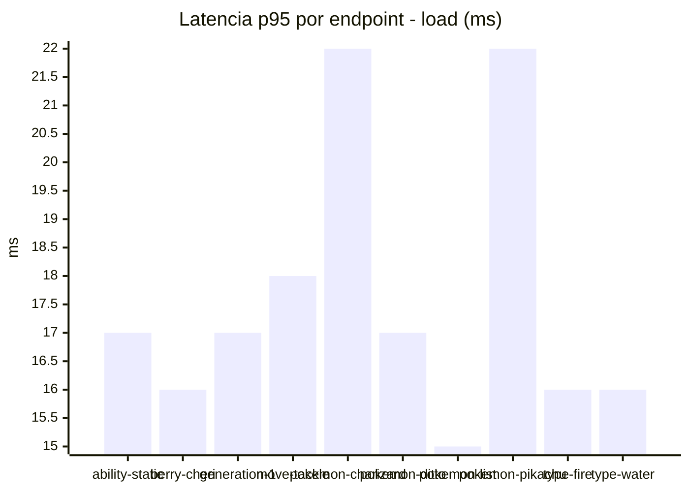
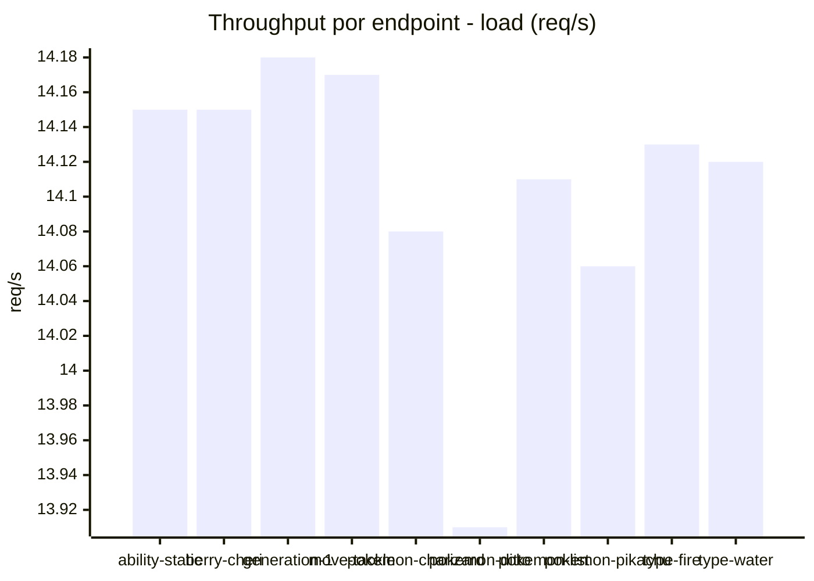
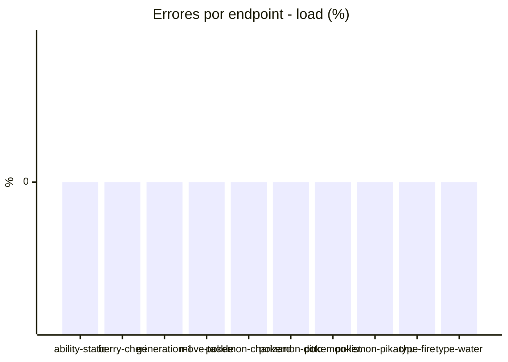
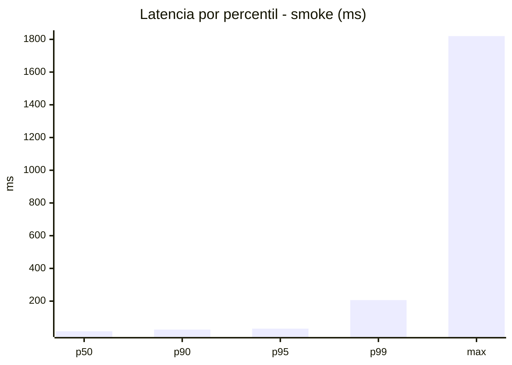
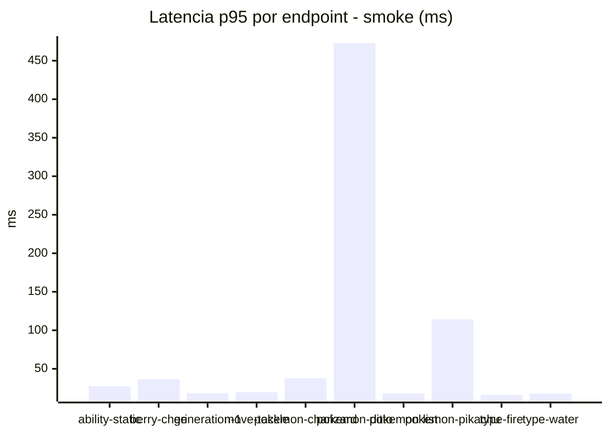
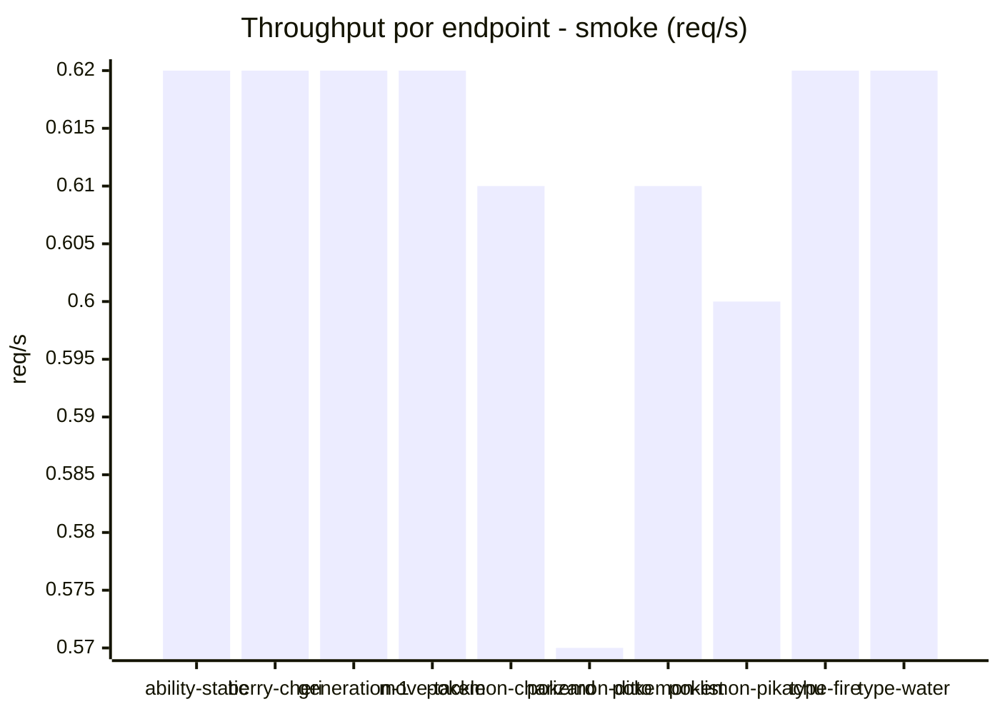

# Reporte de performance - PokeAPI

**Fecha:** 2026-08-14 14:17 UTC  
**Veredicto del agente:** `PASS`  
**Corrida:** [ver en GitHub Actions](https://github.com/lrbg/jmeter-pokeapi-lab/actions/runs/31808515577)  

## Validacion del agente de IA

PASS (fallback por umbrales)

- Error maximo: 0.0%
- p95 maximo: 32.0 ms

## Resultados

### Escenario: `load`

| Metrica | Valor |
| --- | --- |
| Muestras | 16732 |
| Errores | 0 (0.0%) |
| Latencia media | 14.0 ms |
| p50 / p90 / p95 / p99 | 13.0 / 16.0 / 18.0 / 27.0 ms |
| Min / Max | 9 / 3098 ms |
| Throughput | 139.14 req/s |
| Duracion | 120.3 s |

Detalle por endpoint

| Endpoint | Muestras | Error % | avg | p95 | p99 | req/s |
| --- | --- | --- | --- | --- | --- | --- |
| ability-static | 1673 | 0.0% | 13.8 | 17.0 | 25.6 | 14.15 |
| berry-cheri | 1674 | 0.0% | 13.2 | 16.0 | 20.0 | 14.15 |
| generation-1 | 1672 | 0.0% | 13.6 | 17.0 | 20.3 | 14.18 |
| move-tackle | 1673 | 0.0% | 13.8 | 18.0 | 24.3 | 14.17 |
| pokemon-charizard | 1673 | 0.0% | 16.2 | 22.0 | 32.3 | 14.08 |
| pokemon-ditto | 1673 | 0.0% | 15.4 | 17.0 | 26.0 | 13.91 |
| pokemon-list | 1673 | 0.0% | 12.3 | 15.0 | 20.0 | 14.11 |
| pokemon-pikachu | 1674 | 0.0% | 14.8 | 22.0 | 33.0 | 14.06 |
| type-fire | 1673 | 0.0% | 13.4 | 16.0 | 22.0 | 14.13 |
| type-water | 1674 | 0.0% | 13.1 | 16.0 | 21.3 | 14.12 |

### Escenario: `smoke`

| Metrica | Valor |
| --- | --- |
| Muestras | 154 |
| Errores | 0 (0.0%) |
| Latencia media | 31.5 ms |
| p50 / p90 / p95 / p99 | 16.0 / 26.0 / 32.0 / 206.1 ms |
| Min / Max | 11 / 1820 ms |
| Throughput | 5.4 req/s |
| Duracion | 28.5 s |

Detalle por endpoint

| Endpoint | Muestras | Error % | avg | p95 | p99 | req/s |
| --- | --- | --- | --- | --- | --- | --- |
| ability-static | 15 | 0.0% | 17.5 | 27.5 | 47.1 | 0.62 |
| berry-cheri | 15 | 0.0% | 18.2 | 36.5 | 72.9 | 0.62 |
| generation-1 | 15 | 0.0% | 15.4 | 18.2 | 20.4 | 0.62 |
| move-tackle | 15 | 0.0% | 16.2 | 19.9 | 21.6 | 0.62 |
| pokemon-charizard | 16 | 0.0% | 27.4 | 37.8 | 41.9 | 0.61 |
| pokemon-ditto | 16 | 0.0% | 128.2 | 473.0 | 1550.6 | 0.57 |
| pokemon-list | 16 | 0.0% | 14.2 | 18.0 | 18.0 | 0.61 |
| pokemon-pikachu | 16 | 0.0% | 42.9 | 114.2 | 299.6 | 0.6 |
| type-fire | 15 | 0.0% | 14.3 | 16.3 | 16.9 | 0.62 |
| type-water | 15 | 0.0% | 14.6 | 17.9 | 19.6 | 0.62 |

