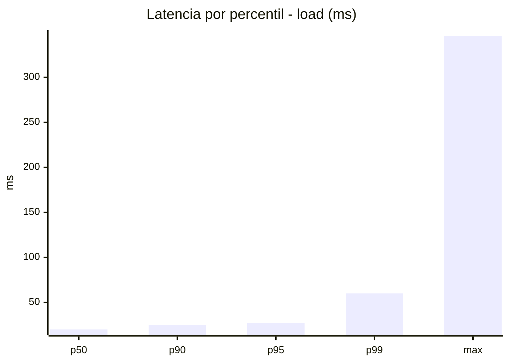
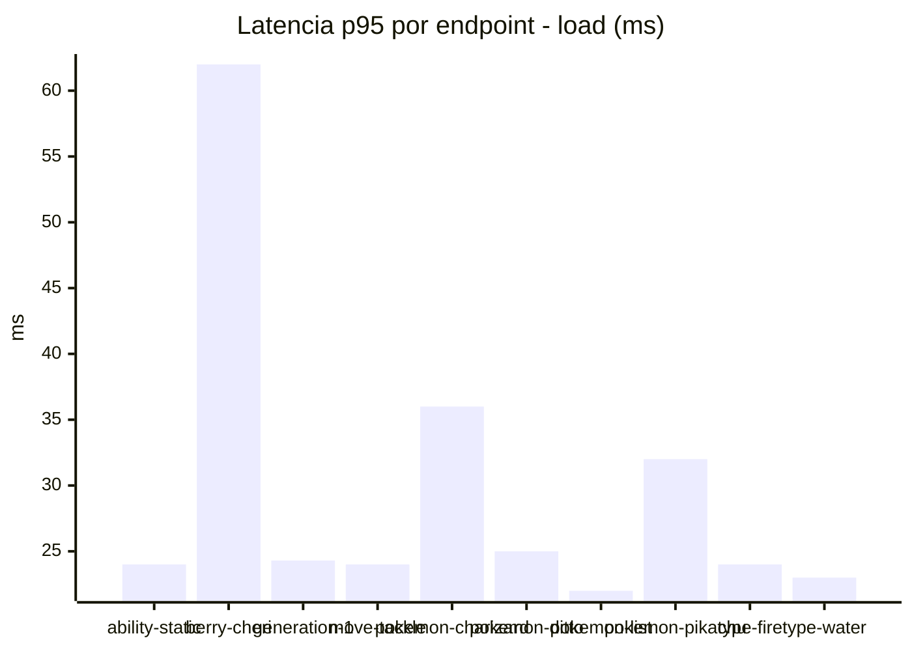
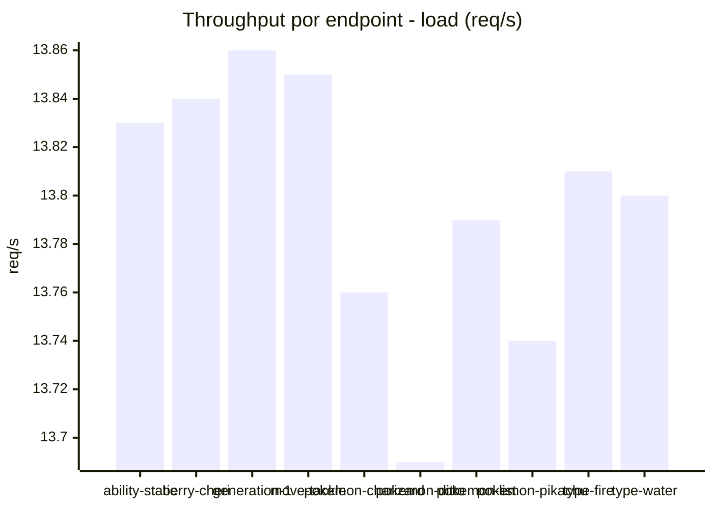
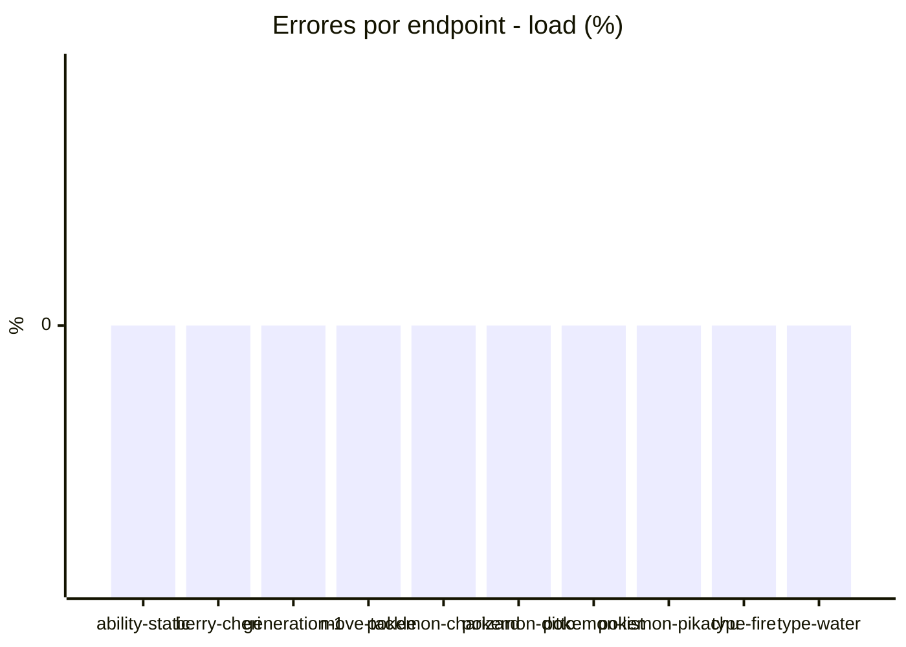
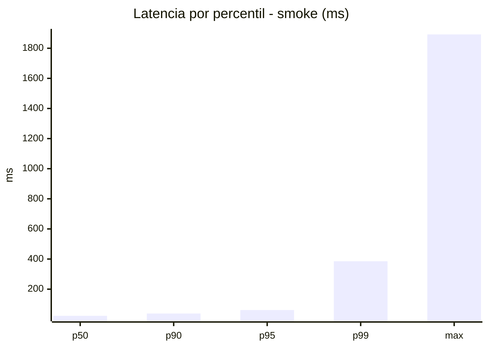
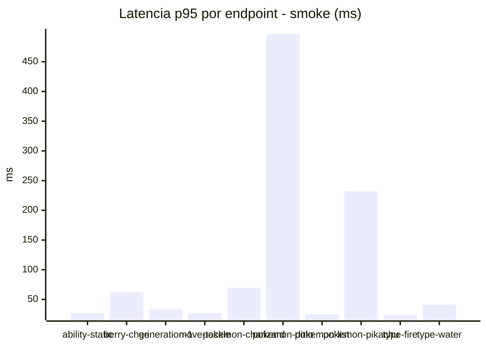
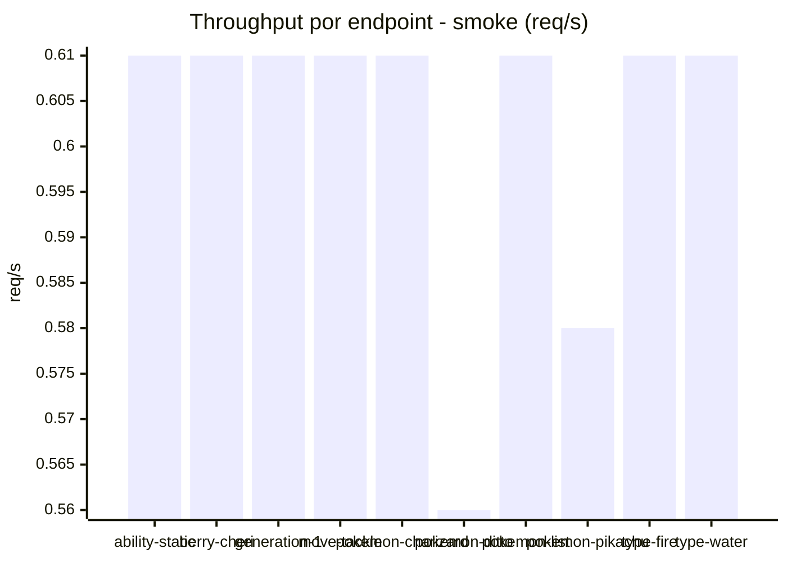

# Reporte de performance - PokeAPI

**Fecha:** 2026-08-15 13:29 UTC  
**Veredicto del agente:** `PASS`  
**Corrida:** [ver en GitHub Actions](https://github.com/lrbg/jmeter-pokeapi-lab/actions/runs/31887217018)  

## Validacion del agente de IA

PASS (fallback por umbrales)

- Error maximo: 0.0%
- p95 maximo: 61.4 ms

## Resultados

### Escenario: `load`

| Metrica | Valor |
| --- | --- |
| Muestras | 16351 |
| Errores | 0 (0.0%) |
| Latencia media | 21.3 ms |
| p50 / p90 / p95 / p99 | 20.0 / 25.0 / 27.0 / 60.0 ms |
| Min / Max | 15 / 346 ms |
| Throughput | 136.78 req/s |
| Duracion | 119.5 s |

Detalle por endpoint

| Endpoint | Muestras | Error % | avg | p95 | p99 | req/s |
| --- | --- | --- | --- | --- | --- | --- |
| ability-static | 1635 | 0.0% | 20.1 | 24.0 | 29.0 | 13.83 |
| berry-cheri | 1635 | 0.0% | 22.9 | 62.0 | 66.0 | 13.84 |
| generation-1 | 1634 | 0.0% | 20.2 | 24.3 | 29.0 | 13.86 |
| move-tackle | 1635 | 0.0% | 20.5 | 24.0 | 30.3 | 13.85 |
| pokemon-charizard | 1635 | 0.0% | 26.2 | 36.0 | 61.7 | 13.76 |
| pokemon-ditto | 1635 | 0.0% | 20.5 | 25.0 | 30.0 | 13.69 |
| pokemon-list | 1636 | 0.0% | 19.2 | 22.0 | 27.7 | 13.79 |
| pokemon-pikachu | 1635 | 0.0% | 24.1 | 32.0 | 54.7 | 13.74 |
| type-fire | 1635 | 0.0% | 19.8 | 24.0 | 29.0 | 13.81 |
| type-water | 1636 | 0.0% | 19.3 | 23.0 | 28.0 | 13.8 |

### Escenario: `smoke`

| Metrica | Valor |
| --- | --- |
| Muestras | 153 |
| Errores | 0 (0.0%) |
| Latencia media | 43.8 ms |
| p50 / p90 / p95 / p99 | 23.0 / 38.0 / 61.4 / 385.4 ms |
| Min / Max | 19 / 1892 ms |
| Throughput | 5.32 req/s |
| Duracion | 28.8 s |

Detalle por endpoint

| Endpoint | Muestras | Error % | avg | p95 | p99 | req/s |
| --- | --- | --- | --- | --- | --- | --- |
| ability-static | 15 | 0.0% | 23.5 | 27.0 | 27.0 | 0.61 |
| berry-cheri | 15 | 0.0% | 37.7 | 62.0 | 62.0 | 0.61 |
| generation-1 | 15 | 0.0% | 25.3 | 33.9 | 46.8 | 0.61 |
| move-tackle | 15 | 0.0% | 23.3 | 27.2 | 29.4 | 0.61 |
| pokemon-charizard | 16 | 0.0% | 36.1 | 69.5 | 70.7 | 0.61 |
| pokemon-ditto | 16 | 0.0% | 139.6 | 496.2 | 1612.8 | 0.56 |
| pokemon-list | 15 | 0.0% | 21.9 | 25.0 | 25.0 | 0.61 |
| pokemon-pikachu | 16 | 0.0% | 74.9 | 231.8 | 627.1 | 0.58 |
| type-fire | 15 | 0.0% | 22.2 | 24.0 | 24.0 | 0.61 |
| type-water | 15 | 0.0% | 25.9 | 41.3 | 64.3 | 0.61 |

