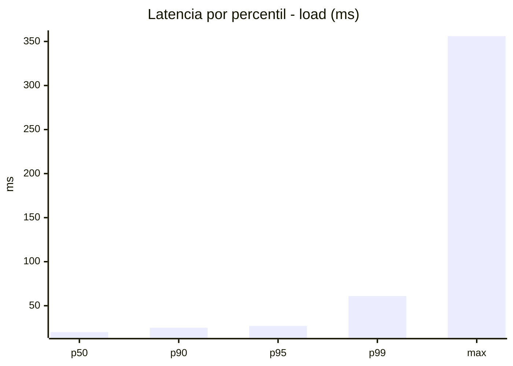
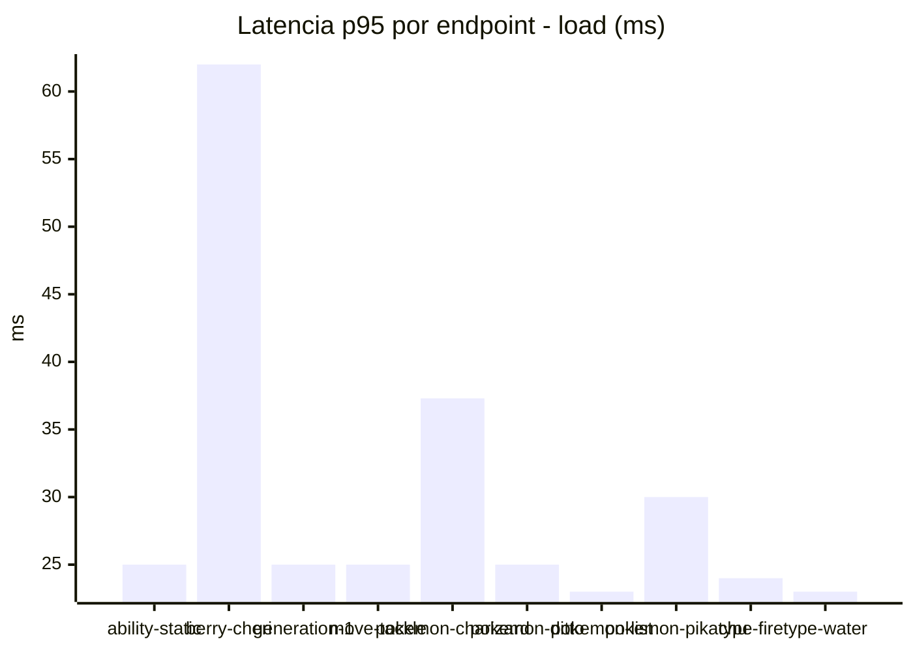
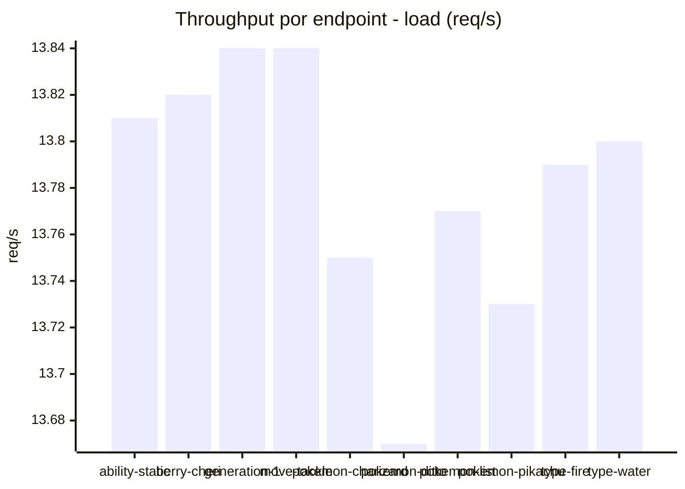
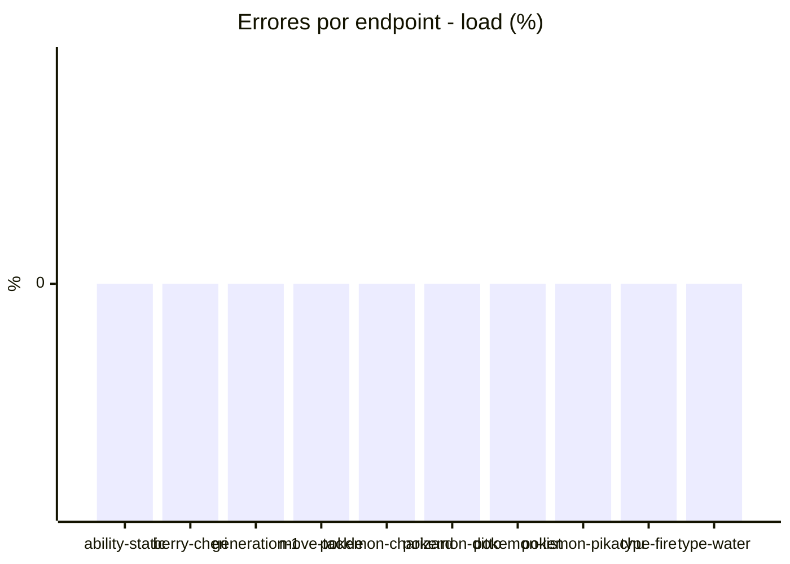
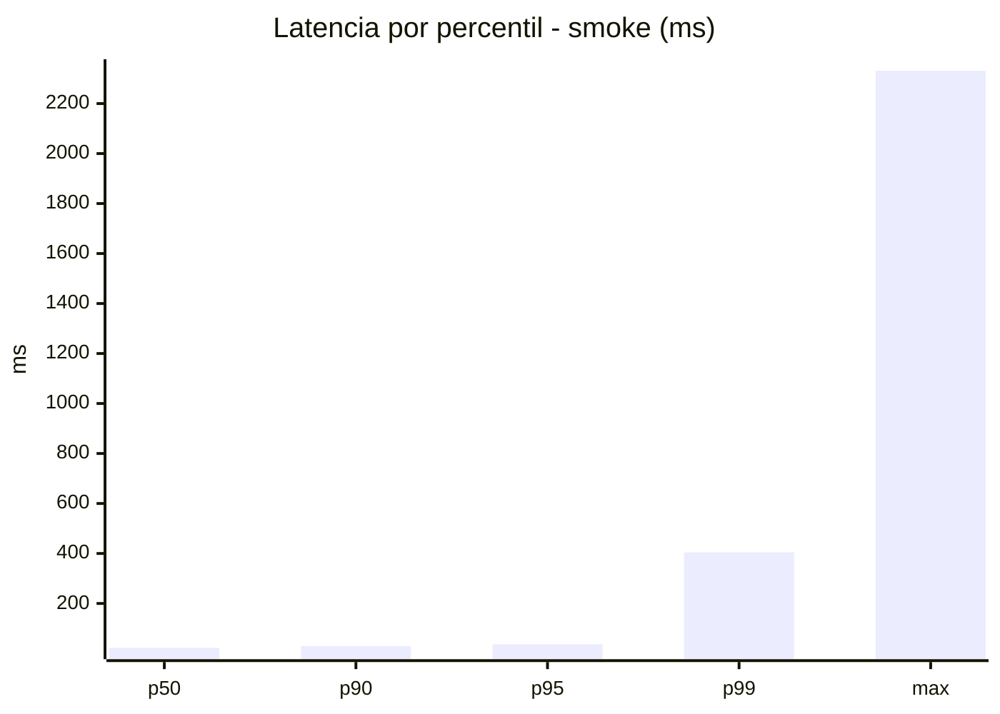
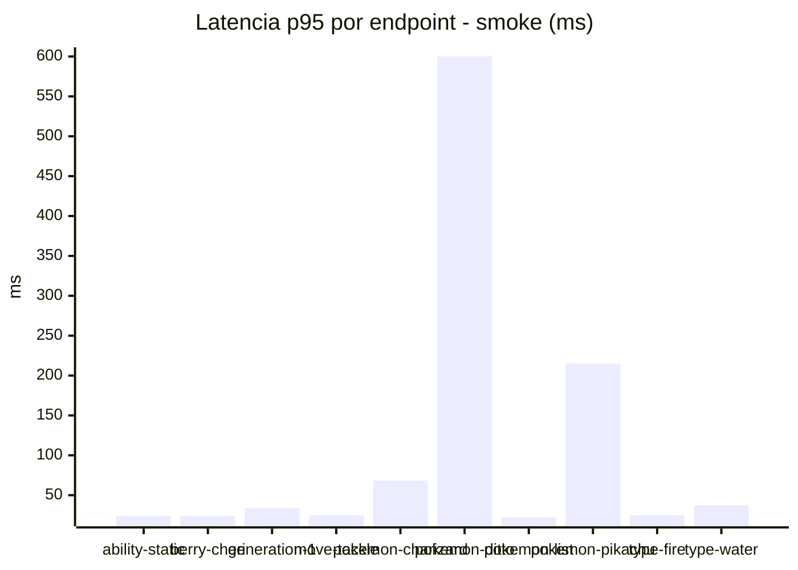
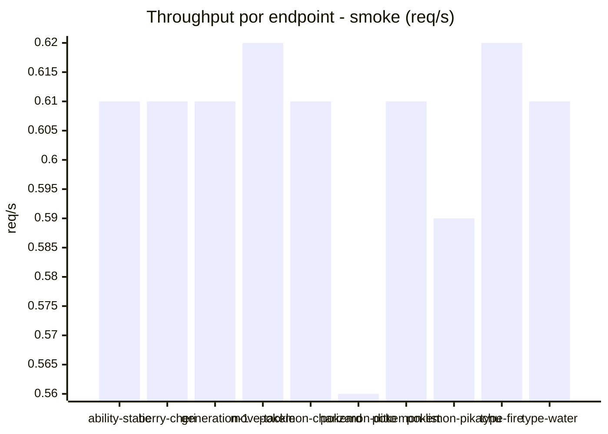

# Reporte de performance - PokeAPI

**Fecha:** 2026-08-16 13:30 UTC  
**Veredicto del agente:** `PASS`  
**Corrida:** [ver en GitHub Actions](https://github.com/lrbg/jmeter-pokeapi-lab/actions/runs/31949881418)  

## Validacion del agente de IA

PASS (fallback por umbrales)

- Error maximo: 0.0%
- p95 maximo: 36.9 ms

## Resultados

### Escenario: `load`

| Metrica | Valor |
| --- | --- |
| Muestras | 16343 |
| Errores | 0 (0.0%) |
| Latencia media | 21.6 ms |
| p50 / p90 / p95 / p99 | 20.0 / 25.0 / 27.0 / 61.0 ms |
| Min / Max | 15 / 356 ms |
| Throughput | 136.67 req/s |
| Duracion | 119.6 s |

Detalle por endpoint

| Endpoint | Muestras | Error % | avg | p95 | p99 | req/s |
| --- | --- | --- | --- | --- | --- | --- |
| ability-static | 1633 | 0.0% | 20.3 | 25.0 | 28.7 | 13.81 |
| berry-cheri | 1634 | 0.0% | 23.8 | 62.0 | 65.7 | 13.82 |
| generation-1 | 1634 | 0.0% | 20.2 | 25.0 | 30.0 | 13.84 |
| move-tackle | 1634 | 0.0% | 20.5 | 25.0 | 29.7 | 13.84 |
| pokemon-charizard | 1634 | 0.0% | 26.6 | 37.3 | 67.0 | 13.75 |
| pokemon-ditto | 1635 | 0.0% | 20.6 | 25.0 | 30.0 | 13.67 |
| pokemon-list | 1635 | 0.0% | 19.5 | 23.0 | 27.7 | 13.77 |
| pokemon-pikachu | 1635 | 0.0% | 24.1 | 30.0 | 57.7 | 13.73 |
| type-fire | 1633 | 0.0% | 20.4 | 24.0 | 29.0 | 13.79 |
| type-water | 1636 | 0.0% | 19.6 | 23.0 | 27.7 | 13.8 |

### Escenario: `smoke`

| Metrica | Valor |
| --- | --- |
| Muestras | 152 |
| Errores | 0 (0.0%) |
| Latencia media | 43.8 ms |
| p50 / p90 / p95 / p99 | 22.0 / 29.0 / 36.9 / 404.3 ms |
| Min / Max | 17 / 2332 ms |
| Throughput | 5.27 req/s |
| Duracion | 28.8 s |

Detalle por endpoint

| Endpoint | Muestras | Error % | avg | p95 | p99 | req/s |
| --- | --- | --- | --- | --- | --- | --- |
| ability-static | 15 | 0.0% | 21.4 | 23.6 | 24.7 | 0.61 |
| berry-cheri | 15 | 0.0% | 20.3 | 23.6 | 24.7 | 0.61 |
| generation-1 | 15 | 0.0% | 23.7 | 33.8 | 54.0 | 0.61 |
| move-tackle | 15 | 0.0% | 21.9 | 24.6 | 25.7 | 0.62 |
| pokemon-charizard | 15 | 0.0% | 35.1 | 68.3 | 74.5 | 0.61 |
| pokemon-ditto | 16 | 0.0% | 165.7 | 600.2 | 1985.6 | 0.56 |
| pokemon-list | 15 | 0.0% | 21 | 22.3 | 22.9 | 0.61 |
| pokemon-pikachu | 16 | 0.0% | 72.6 | 215.0 | 639.8 | 0.59 |
| type-fire | 15 | 0.0% | 22.1 | 24.9 | 26.6 | 0.62 |
| type-water | 15 | 0.0% | 23.9 | 37.2 | 67.4 | 0.61 |

