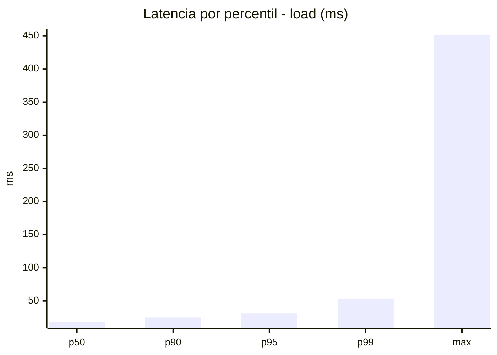
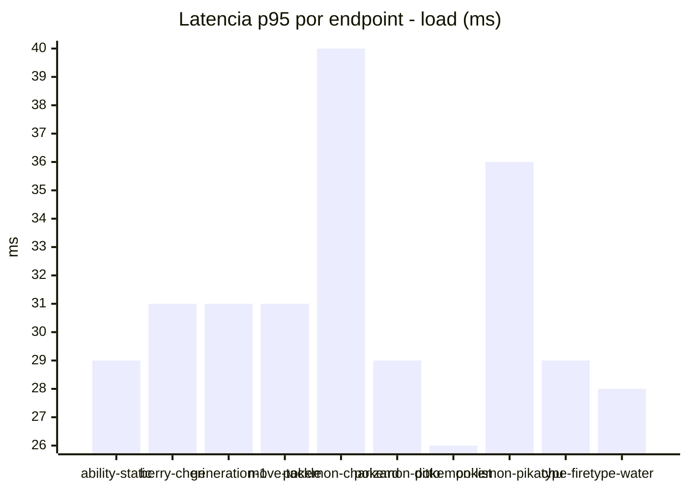
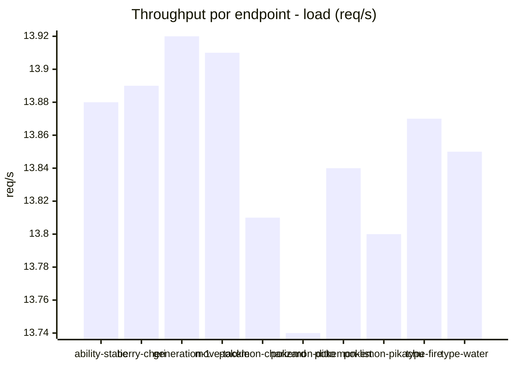
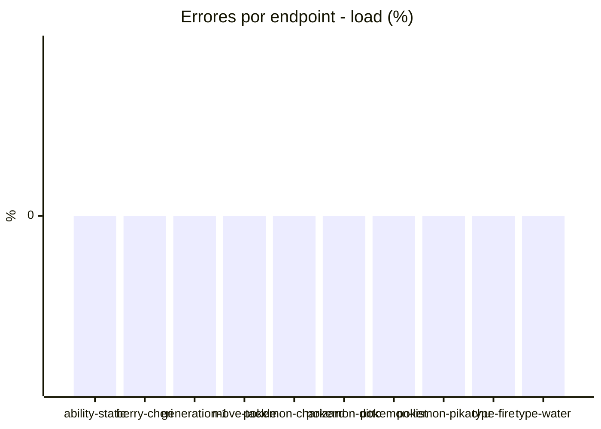
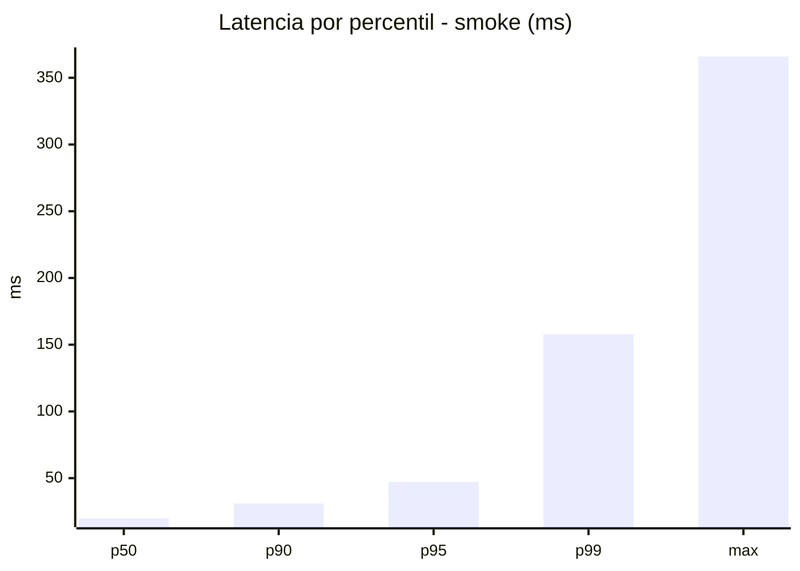
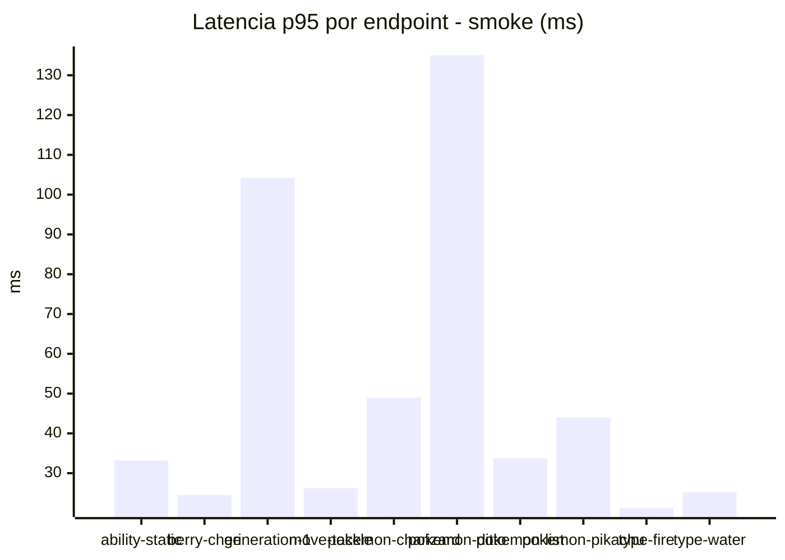
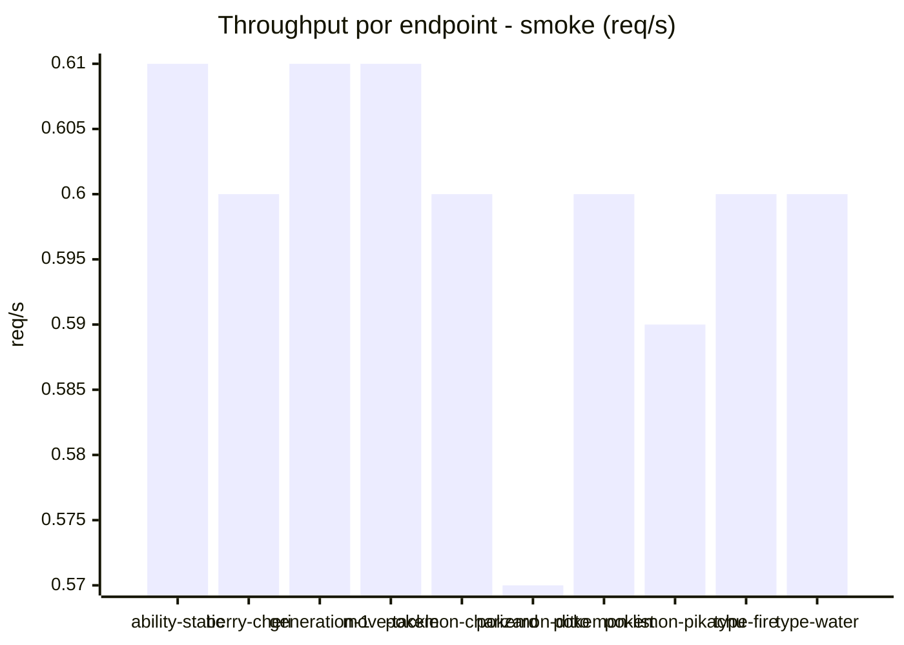

# Reporte de performance - PokeAPI

**Fecha:** 2026-08-17 13:39 UTC  
**Veredicto del agente:** `PASS`  
**Corrida:** [ver en GitHub Actions](https://github.com/lrbg/jmeter-pokeapi-lab/actions/runs/32035946815)  

## Validacion del agente de IA

PASS (fallback por umbrales)

- Error maximo: 0.0%
- p95 maximo: 47.2 ms

## Resultados

### Escenario: `load`

| Metrica | Valor |
| --- | --- |
| Muestras | 16429 |
| Errores | 0 (0.0%) |
| Latencia media | 20.0 ms |
| p50 / p90 / p95 / p99 | 18.0 / 25.0 / 31.0 / 53.0 ms |
| Min / Max | 13 / 451 ms |
| Throughput | 137.39 req/s |
| Duracion | 119.6 s |

Detalle por endpoint

| Endpoint | Muestras | Error % | avg | p95 | p99 | req/s |
| --- | --- | --- | --- | --- | --- | --- |
| ability-static | 1643 | 0.0% | 19.1 | 29.0 | 51.0 | 13.88 |
| berry-cheri | 1643 | 0.0% | 19.8 | 31.0 | 49.2 | 13.89 |
| generation-1 | 1642 | 0.0% | 19.1 | 31.0 | 49.6 | 13.92 |
| move-tackle | 1643 | 0.0% | 20.0 | 31.0 | 52.0 | 13.91 |
| pokemon-charizard | 1643 | 0.0% | 24.1 | 40.0 | 75.0 | 13.81 |
| pokemon-ditto | 1643 | 0.0% | 19.7 | 29.0 | 52.0 | 13.74 |
| pokemon-list | 1643 | 0.0% | 18.4 | 26.0 | 49.0 | 13.84 |
| pokemon-pikachu | 1643 | 0.0% | 22.2 | 36.0 | 72.5 | 13.8 |
| type-fire | 1643 | 0.0% | 18.8 | 29.0 | 50.0 | 13.87 |
| type-water | 1643 | 0.0% | 18.5 | 28.0 | 47.6 | 13.85 |

### Escenario: `smoke`

| Metrica | Valor |
| --- | --- |
| Muestras | 159 |
| Errores | 0 (0.0%) |
| Latencia media | 26.7 ms |
| p50 / p90 / p95 / p99 | 20.0 / 31.0 / 47.2 / 157.9 ms |
| Min / Max | 15 / 366 ms |
| Throughput | 5.45 req/s |
| Duracion | 29.2 s |

Detalle por endpoint

| Endpoint | Muestras | Error % | avg | p95 | p99 | req/s |
| --- | --- | --- | --- | --- | --- | --- |
| ability-static | 16 | 0.0% | 22.8 | 33.2 | 50.6 | 0.61 |
| berry-cheri | 16 | 0.0% | 20.1 | 24.5 | 25.7 | 0.6 |
| generation-1 | 15 | 0.0% | 37.9 | 104.2 | 252.0 | 0.61 |
| move-tackle | 16 | 0.0% | 21.1 | 26.2 | 29.2 | 0.61 |
| pokemon-charizard | 16 | 0.0% | 32.6 | 49.0 | 49.0 | 0.6 |
| pokemon-ditto | 16 | 0.0% | 44 | 135.0 | 319.8 | 0.57 |
| pokemon-list | 16 | 0.0% | 21.5 | 33.8 | 57.1 | 0.6 |
| pokemon-pikachu | 16 | 0.0% | 28.6 | 44.0 | 56.0 | 0.59 |
| type-fire | 16 | 0.0% | 18.7 | 21.2 | 21.9 | 0.6 |
| type-water | 16 | 0.0% | 20.1 | 25.2 | 30.6 | 0.6 |

