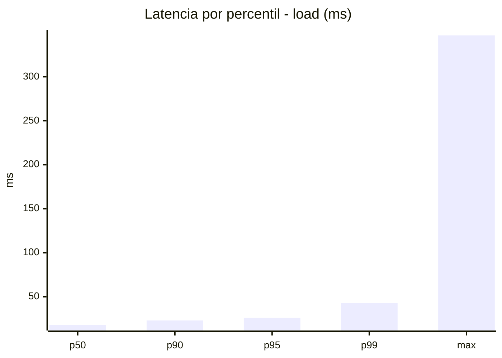
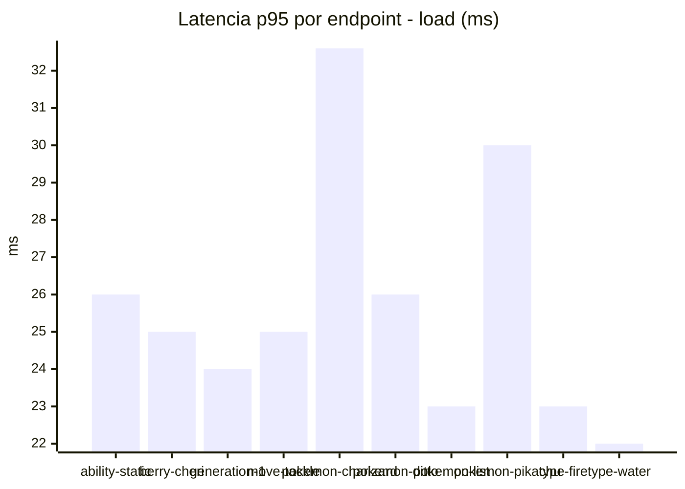
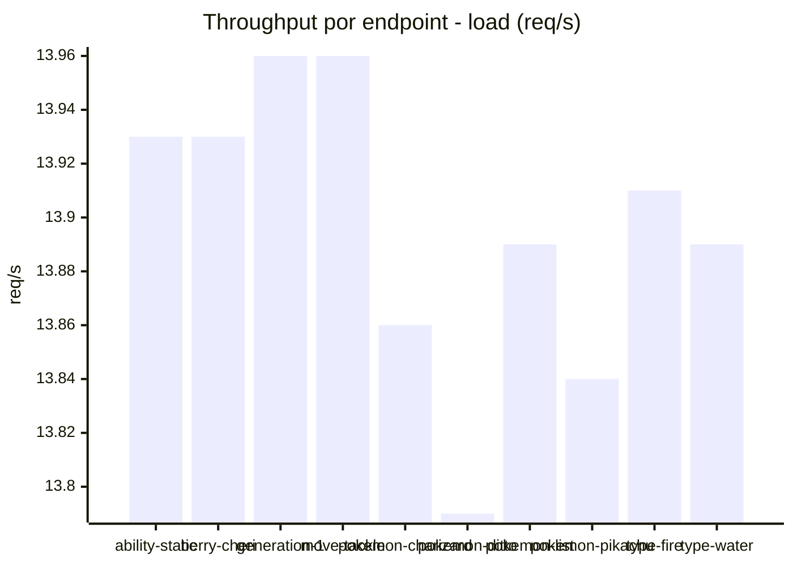
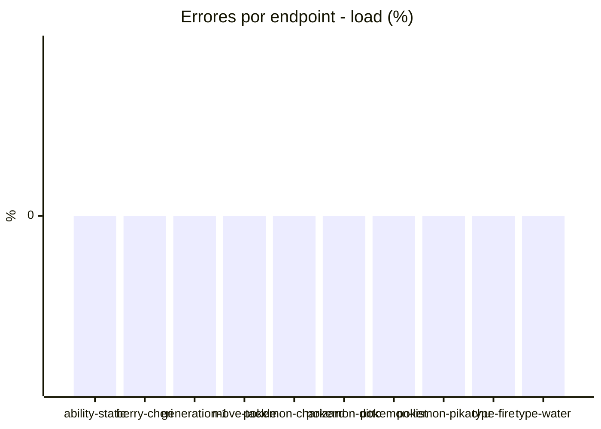
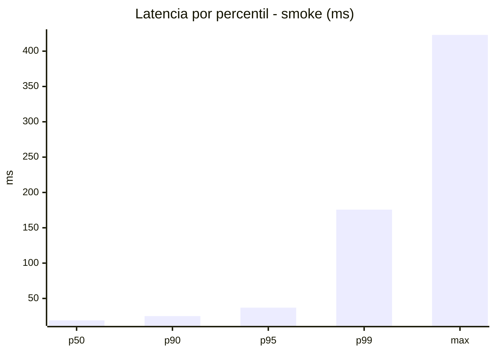
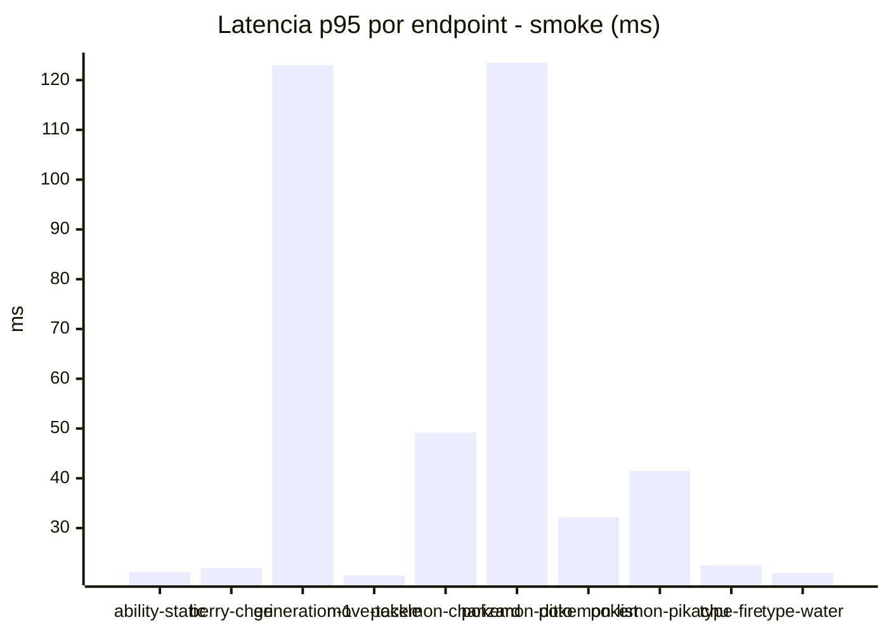
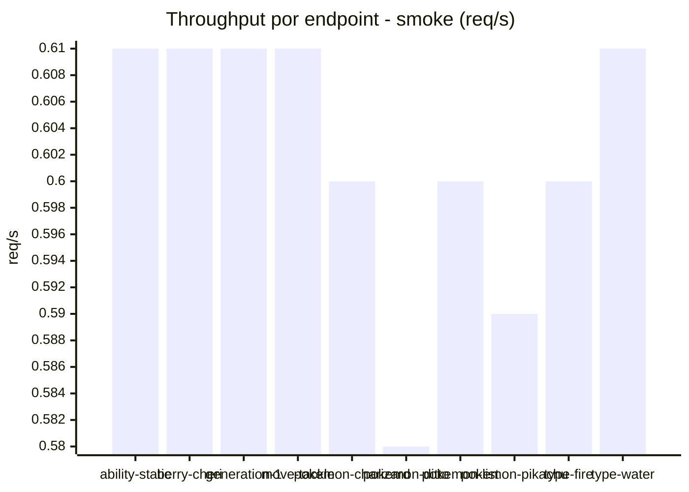

# Reporte de performance - PokeAPI

**Fecha:** 2026-08-18 13:41 UTC  
**Veredicto del agente:** `PASS`  
**Corrida:** [ver en GitHub Actions](https://github.com/lrbg/jmeter-pokeapi-lab/actions/runs/32143556449)  

## Validacion del agente de IA

PASS (fallback por umbrales)

- Error maximo: 0.0%
- p95 maximo: 37.0 ms

## Resultados

### Escenario: `load`

| Metrica | Valor |
| --- | --- |
| Muestras | 16476 |
| Errores | 0 (0.0%) |
| Latencia media | 18.8 ms |
| p50 / p90 / p95 / p99 | 18.0 / 23.0 / 26.0 / 43.0 ms |
| Min / Max | 12 / 347 ms |
| Throughput | 137.76 req/s |
| Duracion | 119.6 s |

Detalle por endpoint

| Endpoint | Muestras | Error % | avg | p95 | p99 | req/s |
| --- | --- | --- | --- | --- | --- | --- |
| ability-static | 1647 | 0.0% | 18.6 | 26.0 | 38.5 | 13.93 |
| berry-cheri | 1647 | 0.0% | 18.2 | 25.0 | 43.0 | 13.93 |
| generation-1 | 1647 | 0.0% | 18.2 | 24.0 | 42.5 | 13.96 |
| move-tackle | 1647 | 0.0% | 18.4 | 25.0 | 46.5 | 13.96 |
| pokemon-charizard | 1649 | 0.0% | 22.2 | 32.6 | 46.0 | 13.86 |
| pokemon-ditto | 1649 | 0.0% | 18.5 | 26.0 | 39.5 | 13.79 |
| pokemon-list | 1648 | 0.0% | 17.4 | 23.0 | 35.0 | 13.89 |
| pokemon-pikachu | 1648 | 0.0% | 21.2 | 30.0 | 52.2 | 13.84 |
| type-fire | 1647 | 0.0% | 17.8 | 23.0 | 41.5 | 13.91 |
| type-water | 1647 | 0.0% | 17.5 | 22.0 | 33.0 | 13.89 |

### Escenario: `smoke`

| Metrica | Valor |
| --- | --- |
| Muestras | 160 |
| Errores | 0 (0.0%) |
| Latencia media | 24.9 ms |
| p50 / p90 / p95 / p99 | 19.0 / 25.0 / 37.0 / 175.7 ms |
| Min / Max | 14 / 423 ms |
| Throughput | 5.46 req/s |
| Duracion | 29.3 s |

Detalle por endpoint

| Endpoint | Muestras | Error % | avg | p95 | p99 | req/s |
| --- | --- | --- | --- | --- | --- | --- |
| ability-static | 16 | 0.0% | 19.2 | 21.2 | 21.9 | 0.61 |
| berry-cheri | 16 | 0.0% | 18.2 | 22.0 | 22.0 | 0.61 |
| generation-1 | 16 | 0.0% | 43 | 123.0 | 363.0 | 0.61 |
| move-tackle | 16 | 0.0% | 17.1 | 20.5 | 21.7 | 0.61 |
| pokemon-charizard | 16 | 0.0% | 27.8 | 49.2 | 57.0 | 0.6 |
| pokemon-ditto | 16 | 0.0% | 42 | 123.5 | 295.1 | 0.58 |
| pokemon-list | 16 | 0.0% | 20.7 | 32.2 | 56.8 | 0.6 |
| pokemon-pikachu | 16 | 0.0% | 25.9 | 41.5 | 52.3 | 0.59 |
| type-fire | 16 | 0.0% | 18.1 | 22.5 | 26.1 | 0.6 |
| type-water | 16 | 0.0% | 17.4 | 21.0 | 23.4 | 0.61 |

