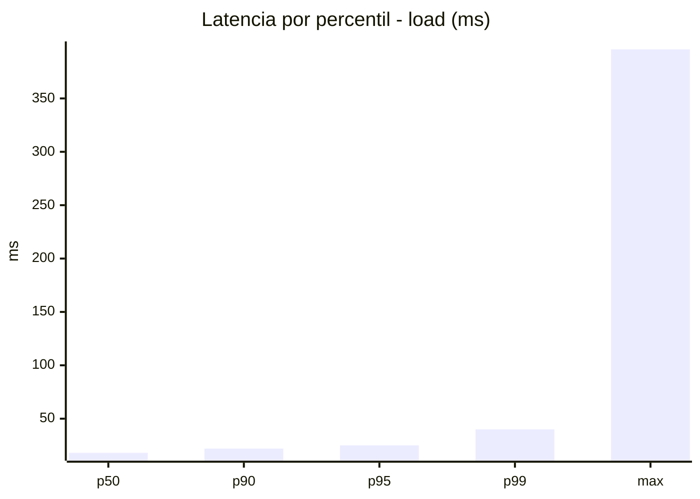
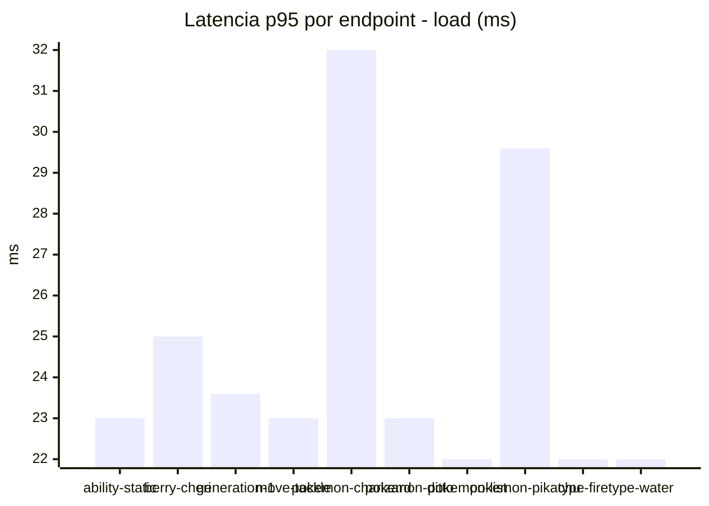
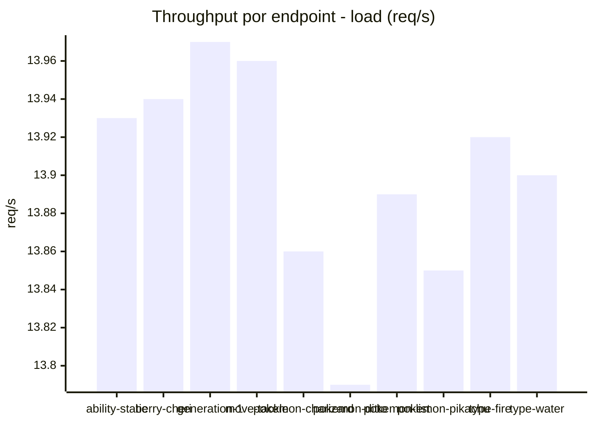
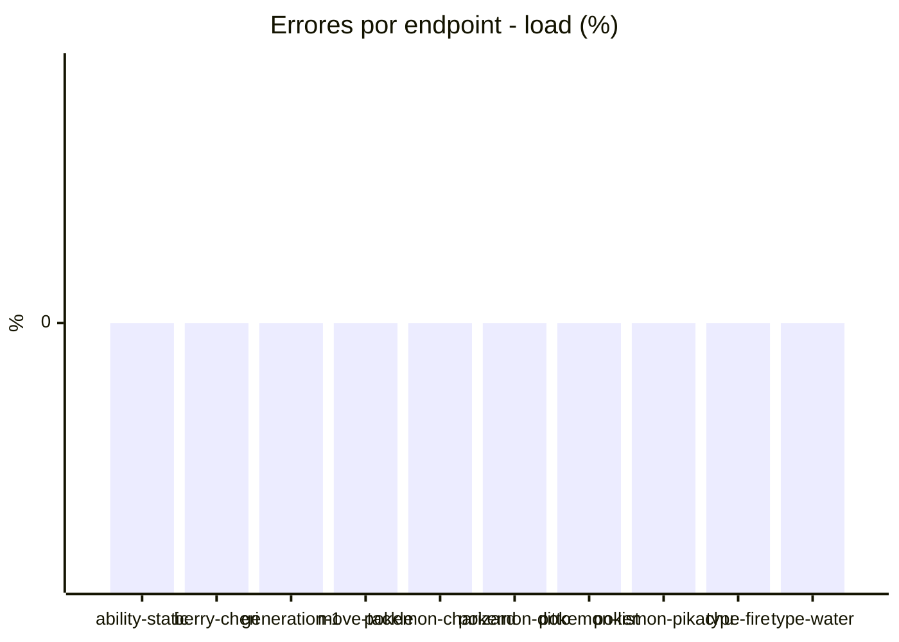
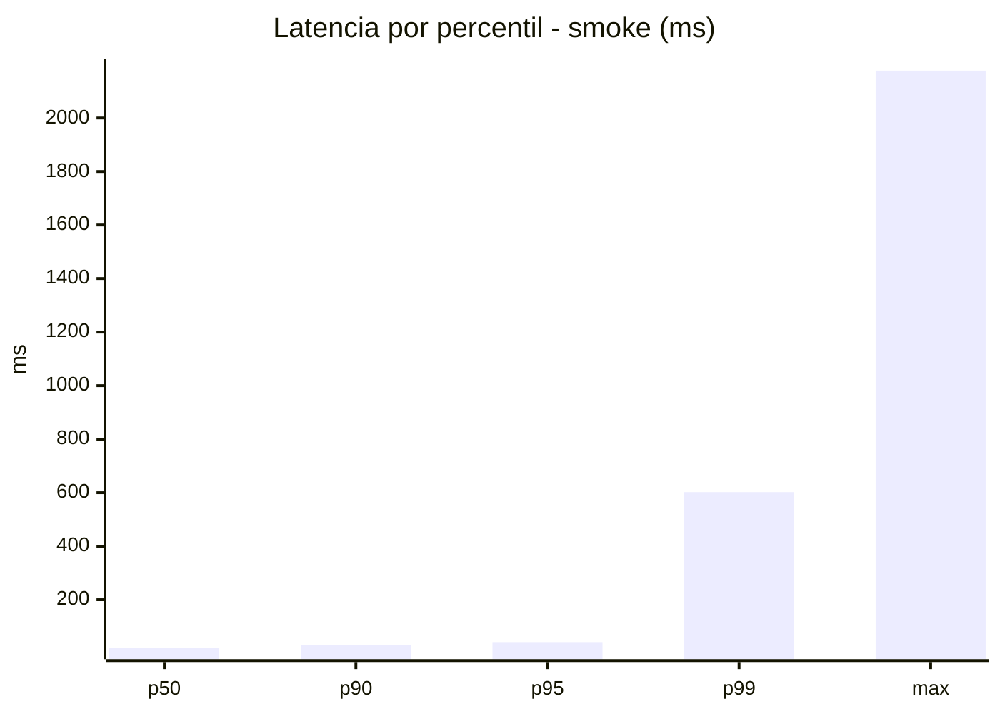
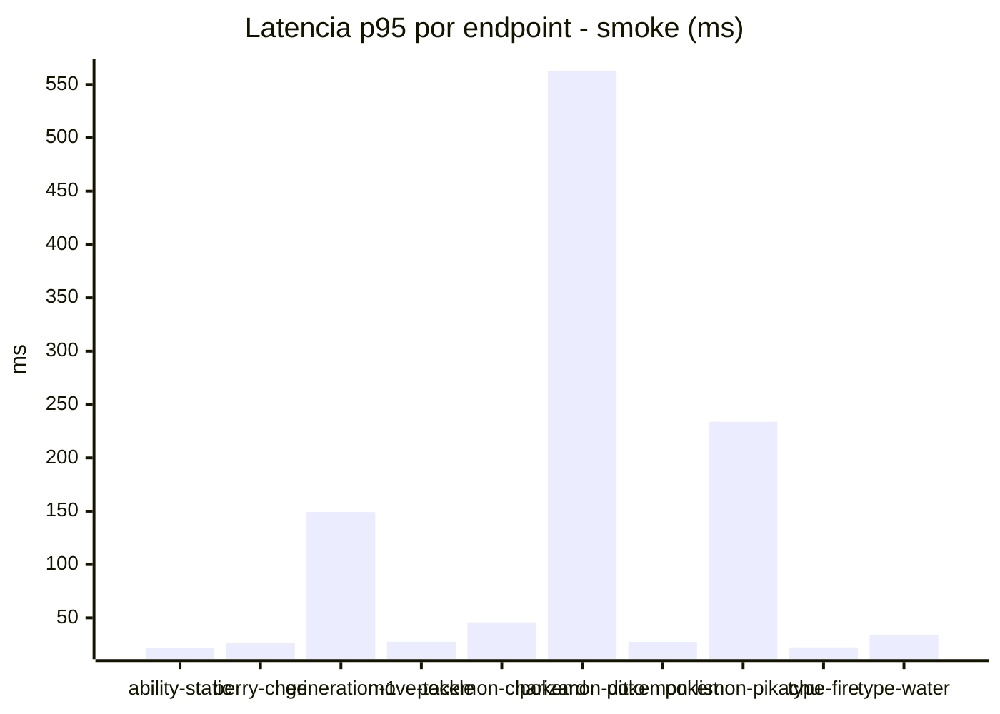
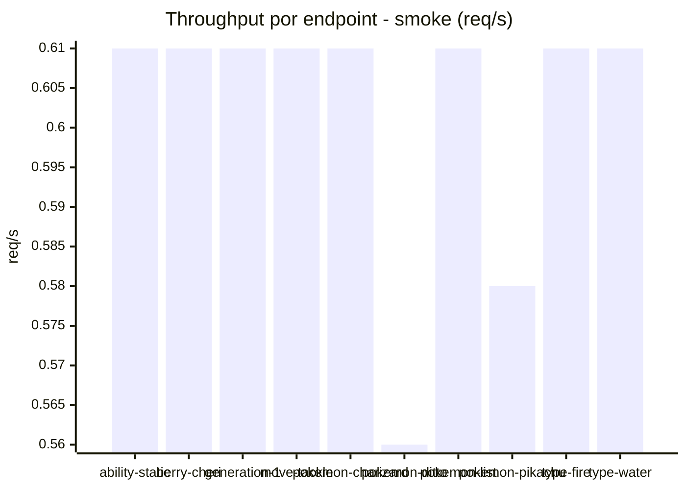

# Reporte de performance - PokeAPI

**Fecha:** 2026-08-19 13:44 UTC  
**Veredicto del agente:** `PASS`  
**Corrida:** [ver en GitHub Actions](https://github.com/lrbg/jmeter-pokeapi-lab/actions/runs/32259491108)  

## Validacion del agente de IA

PASS (fallback por umbrales)

- Error maximo: 0.0%
- p95 maximo: 41.6 ms

## Resultados

### Escenario: `load`

| Metrica | Valor |
| --- | --- |
| Muestras | 16485 |
| Errores | 0 (0.0%) |
| Latencia media | 18.8 ms |
| p50 / p90 / p95 / p99 | 18.0 / 22.0 / 25.0 / 40.0 ms |
| Min / Max | 13 / 396 ms |
| Throughput | 137.83 req/s |
| Duracion | 119.6 s |

Detalle por endpoint

| Endpoint | Muestras | Error % | avg | p95 | p99 | req/s |
| --- | --- | --- | --- | --- | --- | --- |
| ability-static | 1648 | 0.0% | 17.9 | 23.0 | 40.0 | 13.93 |
| berry-cheri | 1648 | 0.0% | 19.0 | 25.0 | 38.1 | 13.94 |
| generation-1 | 1648 | 0.0% | 18.1 | 23.6 | 32.0 | 13.97 |
| move-tackle | 1648 | 0.0% | 18.5 | 23.0 | 34.0 | 13.96 |
| pokemon-charizard | 1648 | 0.0% | 22.6 | 32.0 | 49.0 | 13.86 |
| pokemon-ditto | 1649 | 0.0% | 18.3 | 23.0 | 34.0 | 13.79 |
| pokemon-list | 1649 | 0.0% | 17.3 | 22.0 | 30.5 | 13.89 |
| pokemon-pikachu | 1649 | 0.0% | 21.3 | 29.6 | 56.8 | 13.85 |
| type-fire | 1649 | 0.0% | 17.4 | 22.0 | 37.5 | 13.92 |
| type-water | 1649 | 0.0% | 17.2 | 22.0 | 29.0 | 13.9 |

### Escenario: `smoke`

| Metrica | Valor |
| --- | --- |
| Muestras | 153 |
| Errores | 0 (0.0%) |
| Latencia media | 43.6 ms |
| p50 / p90 / p95 / p99 | 20.0 / 30.0 / 41.6 / 602.2 ms |
| Min / Max | 15 / 2177 ms |
| Throughput | 5.3 req/s |
| Duracion | 28.9 s |

Detalle por endpoint

| Endpoint | Muestras | Error % | avg | p95 | p99 | req/s |
| --- | --- | --- | --- | --- | --- | --- |
| ability-static | 15 | 0.0% | 18 | 21.8 | 25.2 | 0.61 |
| berry-cheri | 15 | 0.0% | 20 | 26.2 | 28.4 | 0.61 |
| generation-1 | 15 | 0.0% | 46.5 | 149.2 | 381.0 | 0.61 |
| move-tackle | 15 | 0.0% | 21.4 | 27.6 | 28.7 | 0.61 |
| pokemon-charizard | 16 | 0.0% | 30.1 | 45.8 | 49.9 | 0.61 |
| pokemon-ditto | 16 | 0.0% | 155.1 | 563.0 | 1854.2 | 0.56 |
| pokemon-list | 15 | 0.0% | 19.9 | 27.5 | 35.9 | 0.61 |
| pokemon-pikachu | 16 | 0.0% | 76.9 | 233.8 | 669.9 | 0.58 |
| type-fire | 15 | 0.0% | 18.5 | 22.3 | 22.9 | 0.61 |
| type-water | 15 | 0.0% | 20.9 | 34.1 | 54.8 | 0.61 |

