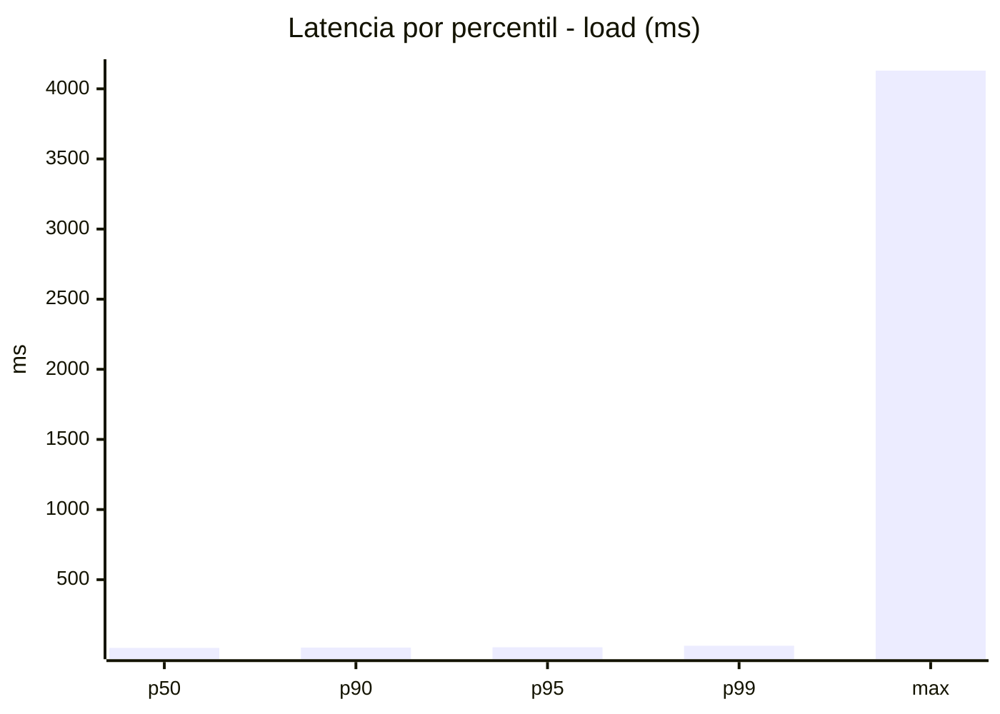
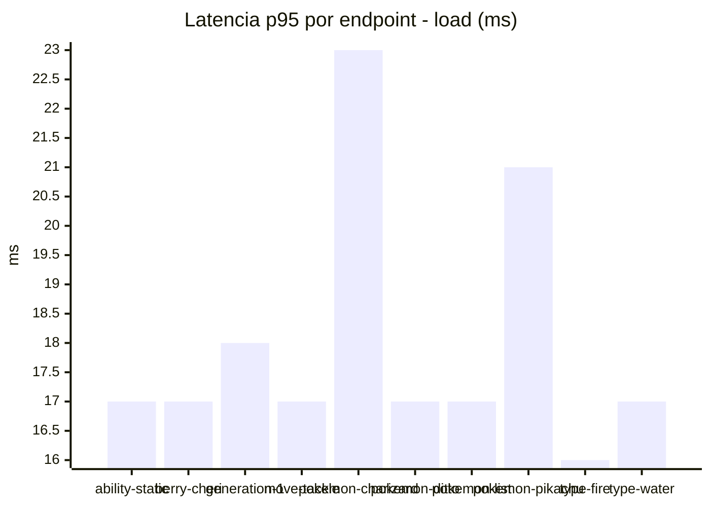
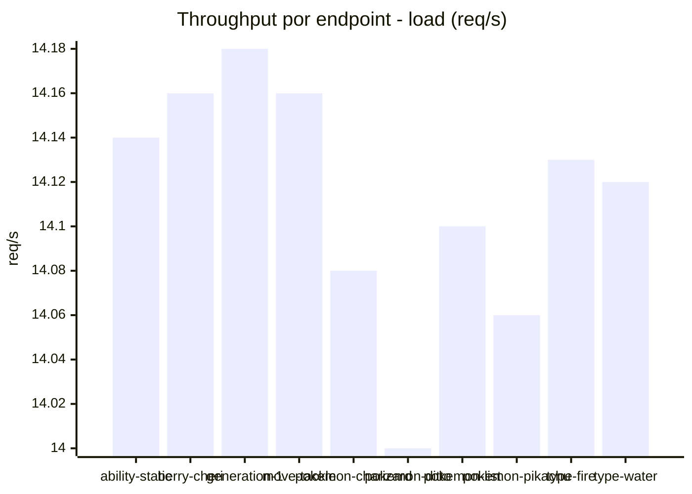
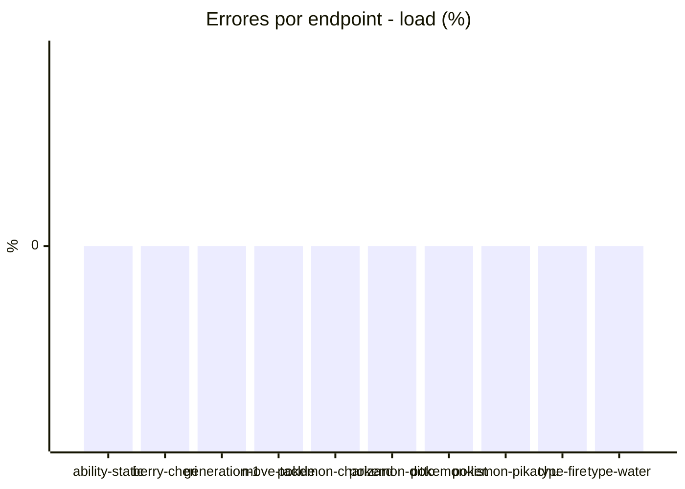
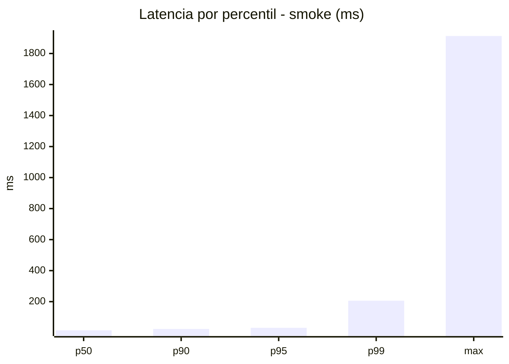
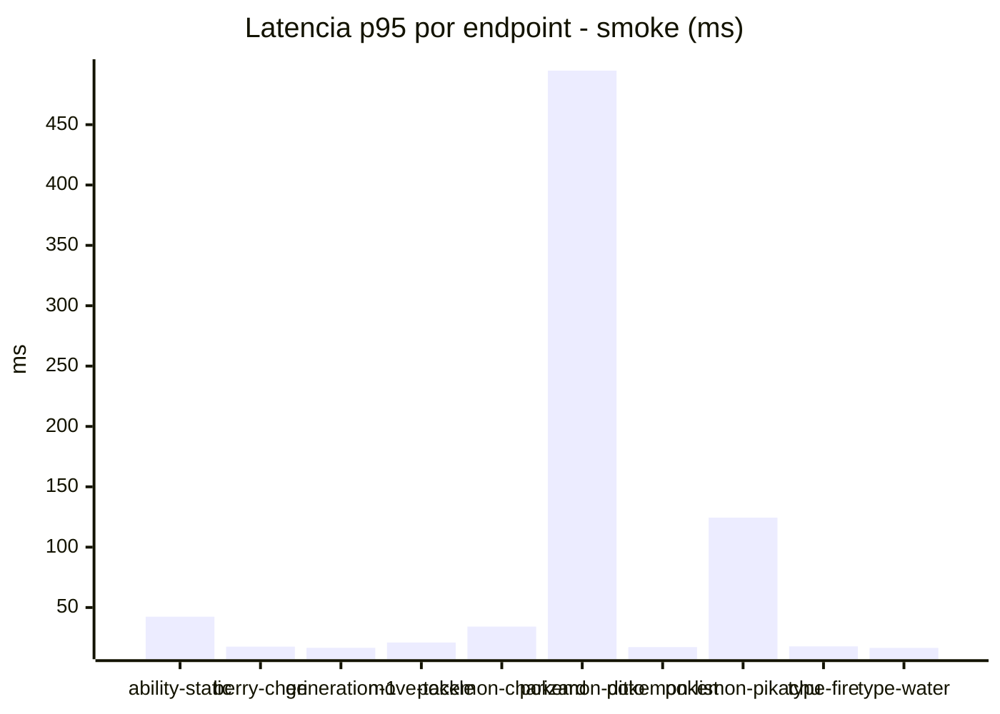
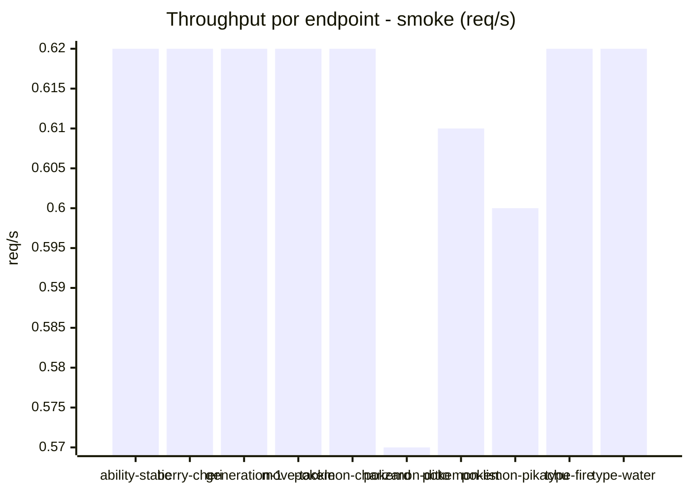

# Reporte de performance - PokeAPI

**Fecha:** 2026-08-20 13:45 UTC  
**Veredicto del agente:** `PASS`  
**Corrida:** [ver en GitHub Actions](https://github.com/lrbg/jmeter-pokeapi-lab/actions/runs/32375794728)  

## Validacion del agente de IA

PASS (fallback por umbrales)

- Error maximo: 0.0%
- p95 maximo: 31.2 ms

## Resultados

### Escenario: `load`

| Metrica | Valor |
| --- | --- |
| Muestras | 16723 |
| Errores | 0 (0.0%) |
| Latencia media | 14.1 ms |
| p50 / p90 / p95 / p99 | 13.0 / 16.0 / 18.0 / 29.0 ms |
| Min / Max | 9 / 4130 ms |
| Throughput | 139.92 req/s |
| Duracion | 119.5 s |

Detalle por endpoint

| Endpoint | Muestras | Error % | avg | p95 | p99 | req/s |
| --- | --- | --- | --- | --- | --- | --- |
| ability-static | 1672 | 0.0% | 13.1 | 17.0 | 27.3 | 14.14 |
| berry-cheri | 1672 | 0.0% | 12.7 | 17.0 | 25.0 | 14.16 |
| generation-1 | 1671 | 0.0% | 15.1 | 18.0 | 29.0 | 14.18 |
| move-tackle | 1671 | 0.0% | 13.3 | 17.0 | 23.0 | 14.16 |
| pokemon-charizard | 1673 | 0.0% | 17.5 | 23.0 | 34.0 | 14.08 |
| pokemon-ditto | 1673 | 0.0% | 13.1 | 17.0 | 25.3 | 14.0 |
| pokemon-list | 1673 | 0.0% | 15.0 | 17.0 | 25.0 | 14.1 |
| pokemon-pikachu | 1673 | 0.0% | 15.1 | 21.0 | 30.3 | 14.06 |
| type-fire | 1672 | 0.0% | 12.8 | 16.0 | 31.0 | 14.13 |
| type-water | 1673 | 0.0% | 12.9 | 17.0 | 21.0 | 14.12 |

### Escenario: `smoke`

| Metrica | Valor |
| --- | --- |
| Muestras | 156 |
| Errores | 0 (0.0%) |
| Latencia media | 31.4 ms |
| p50 / p90 / p95 / p99 | 15.0 / 24.0 / 31.2 / 205.9 ms |
| Min / Max | 12 / 1913 ms |
| Throughput | 5.39 req/s |
| Duracion | 28.9 s |

Detalle por endpoint

| Endpoint | Muestras | Error % | avg | p95 | p99 | req/s |
| --- | --- | --- | --- | --- | --- | --- |
| ability-static | 15 | 0.0% | 18.5 | 42.4 | 46.9 | 0.62 |
| berry-cheri | 15 | 0.0% | 14.3 | 17.6 | 18.7 | 0.62 |
| generation-1 | 15 | 0.0% | 14.7 | 16.6 | 17.7 | 0.62 |
| move-tackle | 15 | 0.0% | 16.4 | 21.0 | 26.6 | 0.62 |
| pokemon-charizard | 16 | 0.0% | 25.2 | 34.2 | 37.2 | 0.62 |
| pokemon-ditto | 16 | 0.0% | 133.5 | 494.8 | 1629.3 | 0.57 |
| pokemon-list | 16 | 0.0% | 13.9 | 17.2 | 20.2 | 0.61 |
| pokemon-pikachu | 16 | 0.0% | 44.1 | 124.5 | 344.1 | 0.6 |
| type-fire | 16 | 0.0% | 15 | 17.8 | 19.5 | 0.62 |
| type-water | 16 | 0.0% | 14.6 | 16.5 | 17.7 | 0.62 |

