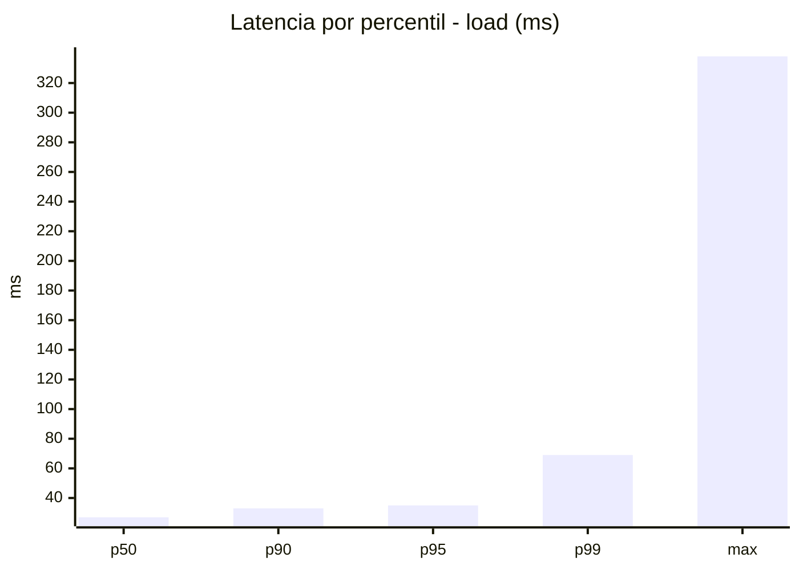
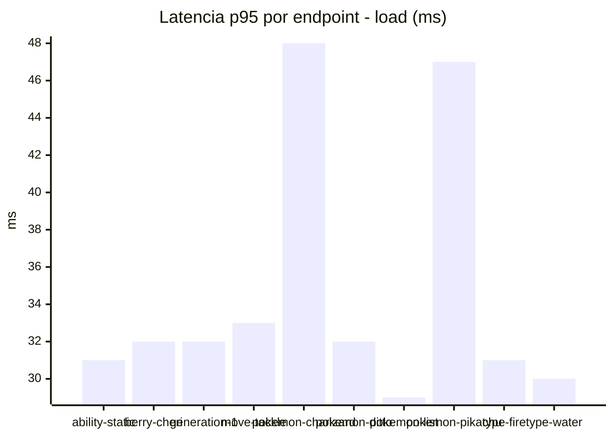
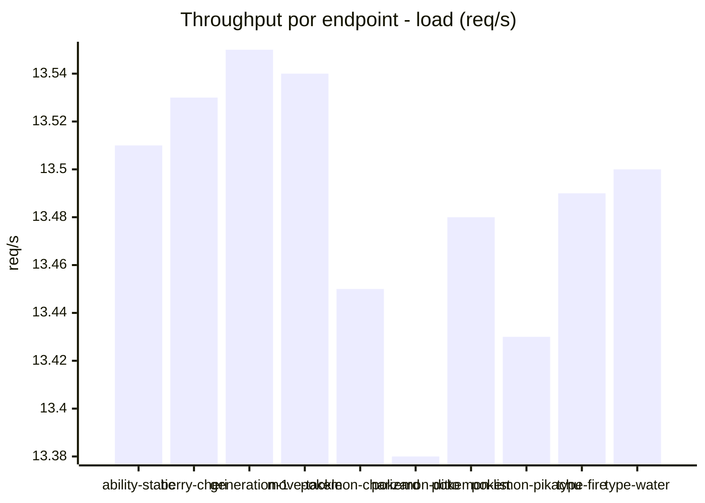
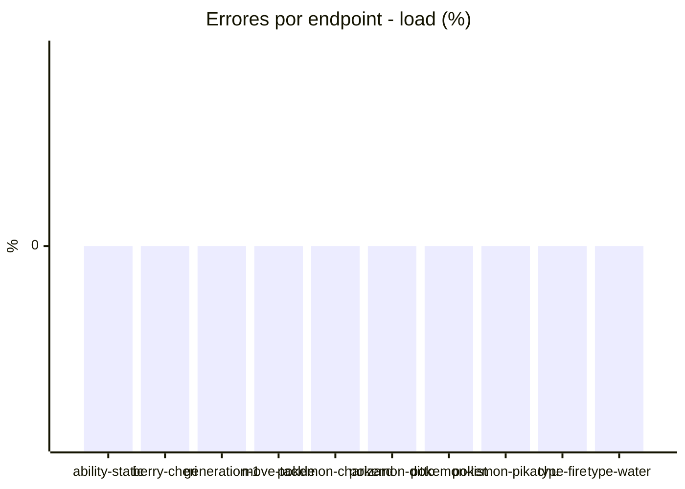
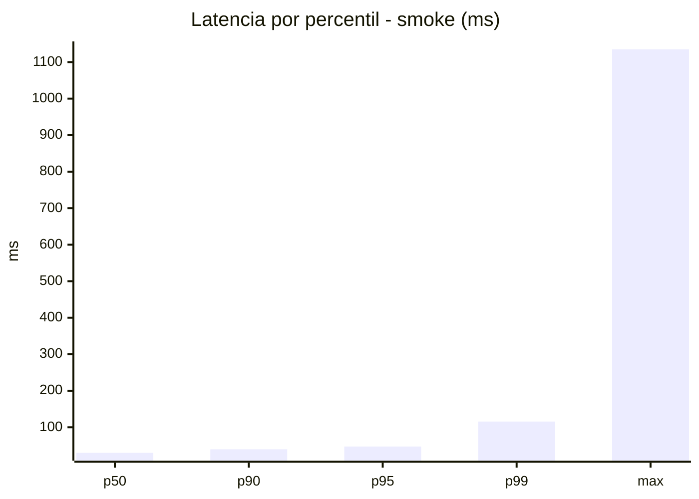
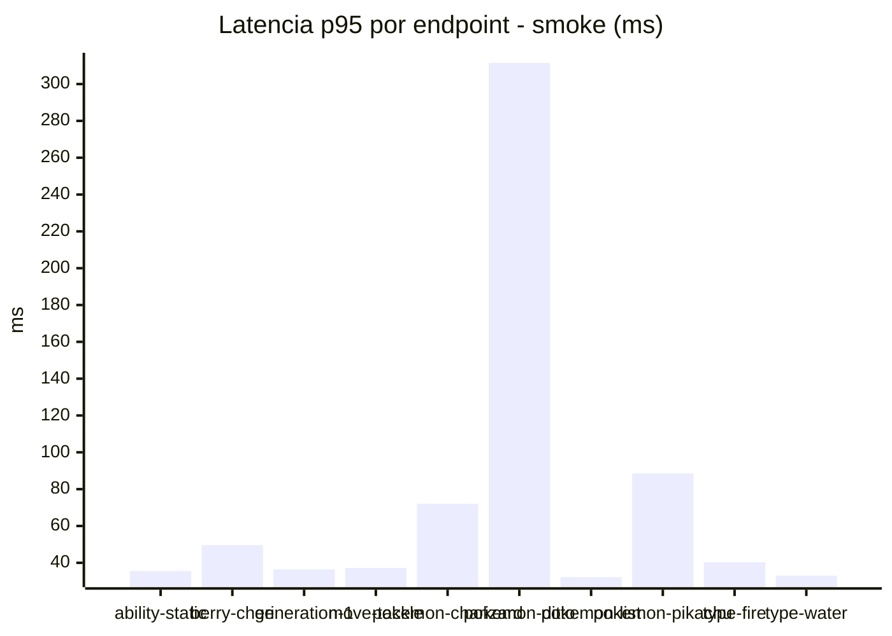
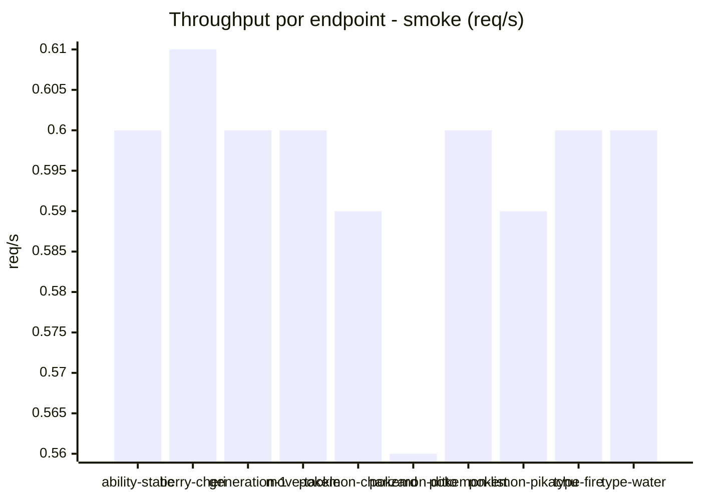

# Reporte de performance - PokeAPI

**Fecha:** 2026-08-21 13:44 UTC  
**Veredicto del agente:** `PASS`  
**Corrida:** [ver en GitHub Actions](https://github.com/lrbg/jmeter-pokeapi-lab/actions/runs/32488159910)  

## Validacion del agente de IA

PASS (fallback por umbrales)

- Error maximo: 0.0%
- p95 maximo: 47.4 ms

## Resultados

### Escenario: `load`

| Metrica | Valor |
| --- | --- |
| Muestras | 15985 |
| Errores | 0 (0.0%) |
| Latencia media | 28.7 ms |
| p50 / p90 / p95 / p99 | 27.0 / 33.0 / 35.0 / 69.0 ms |
| Min / Max | 22 / 338 ms |
| Throughput | 133.69 req/s |
| Duracion | 119.6 s |

Detalle por endpoint

| Endpoint | Muestras | Error % | avg | p95 | p99 | req/s |
| --- | --- | --- | --- | --- | --- | --- |
| ability-static | 1598 | 0.0% | 27.1 | 31.0 | 39.0 | 13.51 |
| berry-cheri | 1599 | 0.0% | 26.7 | 32.0 | 47.0 | 13.53 |
| generation-1 | 1598 | 0.0% | 27.6 | 32.0 | 68.0 | 13.55 |
| move-tackle | 1599 | 0.0% | 28.3 | 33.0 | 69.0 | 13.54 |
| pokemon-charizard | 1598 | 0.0% | 35.7 | 48.0 | 85.1 | 13.45 |
| pokemon-ditto | 1598 | 0.0% | 28.1 | 32.0 | 69.0 | 13.38 |
| pokemon-list | 1598 | 0.0% | 26.0 | 29.0 | 58.0 | 13.48 |
| pokemon-pikachu | 1599 | 0.0% | 34.2 | 47.0 | 78.1 | 13.43 |
| type-fire | 1598 | 0.0% | 27.1 | 31.0 | 54.0 | 13.49 |
| type-water | 1600 | 0.0% | 26.2 | 30.0 | 42.0 | 13.5 |

### Escenario: `smoke`

| Metrica | Valor |
| --- | --- |
| Muestras | 154 |
| Errores | 0 (0.0%) |
| Latencia media | 40.4 ms |
| p50 / p90 / p95 / p99 | 30.0 / 39.7 / 47.4 / 115.7 ms |
| Min / Max | 25 / 1135 ms |
| Throughput | 5.31 req/s |
| Duracion | 29.0 s |

Detalle por endpoint

| Endpoint | Muestras | Error % | avg | p95 | p99 | req/s |
| --- | --- | --- | --- | --- | --- | --- |
| ability-static | 15 | 0.0% | 30 | 35.6 | 36.7 | 0.6 |
| berry-cheri | 15 | 0.0% | 32.6 | 49.6 | 78.7 | 0.61 |
| generation-1 | 15 | 0.0% | 30 | 36.4 | 40.9 | 0.6 |
| move-tackle | 15 | 0.0% | 30.2 | 37.2 | 39.4 | 0.6 |
| pokemon-charizard | 16 | 0.0% | 44.9 | 72.0 | 91.2 | 0.59 |
| pokemon-ditto | 16 | 0.0% | 98.9 | 311.5 | 970.3 | 0.56 |
| pokemon-list | 16 | 0.0% | 28.2 | 32.2 | 32.9 | 0.6 |
| pokemon-pikachu | 16 | 0.0% | 44.5 | 88.5 | 128.1 | 0.59 |
| type-fire | 15 | 0.0% | 32 | 40.3 | 40.9 | 0.6 |
| type-water | 15 | 0.0% | 29.3 | 33.0 | 33.0 | 0.6 |

