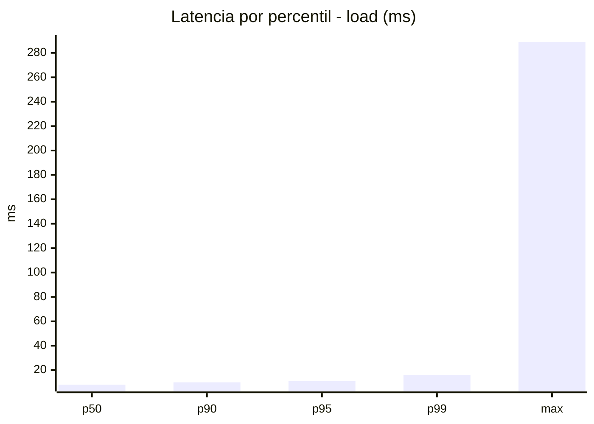
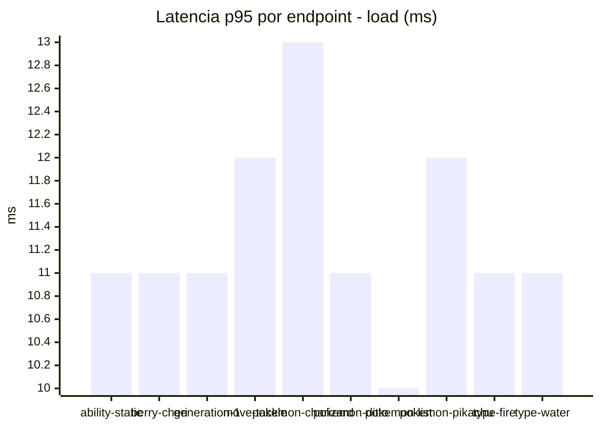
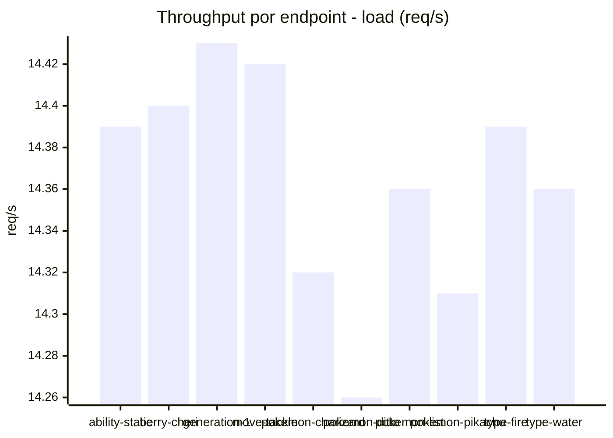
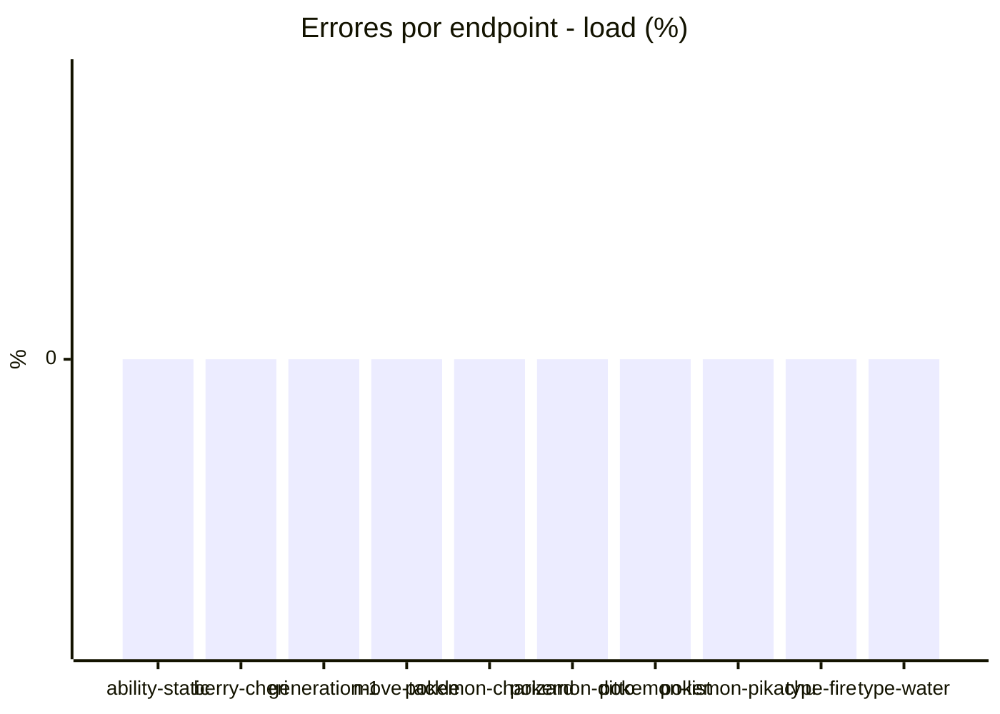
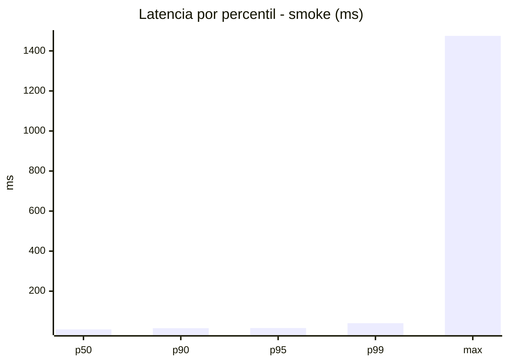
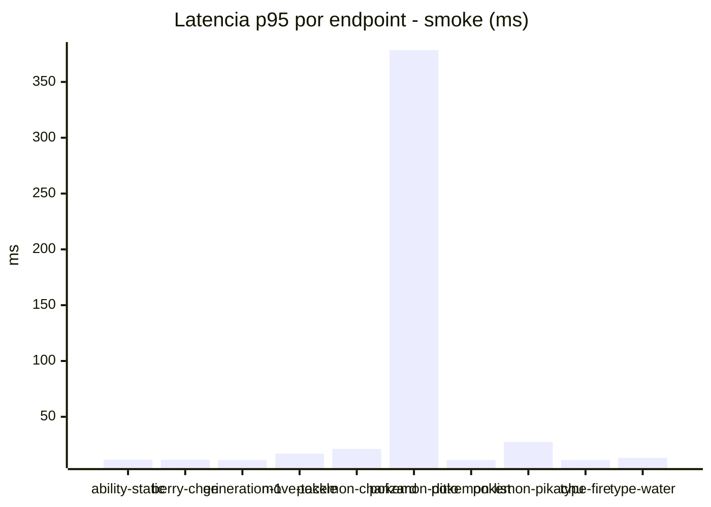
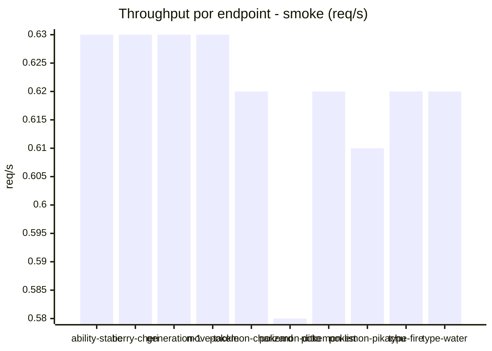

# Reporte de performance - PokeAPI

**Fecha:** 2026-08-22 13:30 UTC  
**Veredicto del agente:** `PASS`  
**Corrida:** [ver en GitHub Actions](https://github.com/lrbg/jmeter-pokeapi-lab/actions/runs/32575843280)  

## Validacion del agente de IA

PASS (fallback por umbrales)

- Error maximo: 0.0%
- p95 maximo: 16.0 ms

## Resultados

### Escenario: `load`

| Metrica | Valor |
| --- | --- |
| Muestras | 17043 |
| Errores | 0 (0.0%) |
| Latencia media | 8.4 ms |
| p50 / p90 / p95 / p99 | 8.0 / 10.0 / 11.0 / 16.0 ms |
| Min / Max | 5 / 289 ms |
| Throughput | 142.47 req/s |
| Duracion | 119.6 s |

Detalle por endpoint

| Endpoint | Muestras | Error % | avg | p95 | p99 | req/s |
| --- | --- | --- | --- | --- | --- | --- |
| ability-static | 1705 | 0.0% | 8.4 | 11.0 | 15.0 | 14.39 |
| berry-cheri | 1703 | 0.0% | 8.2 | 11.0 | 15.0 | 14.4 |
| generation-1 | 1704 | 0.0% | 8.3 | 11.0 | 15.0 | 14.43 |
| move-tackle | 1703 | 0.0% | 8.5 | 12.0 | 17.0 | 14.42 |
| pokemon-charizard | 1705 | 0.0% | 9.3 | 13.0 | 19.0 | 14.32 |
| pokemon-ditto | 1705 | 0.0% | 8.5 | 11.0 | 15.0 | 14.26 |
| pokemon-list | 1704 | 0.0% | 7.8 | 10.0 | 13.0 | 14.36 |
| pokemon-pikachu | 1705 | 0.0% | 9.0 | 12.0 | 16.0 | 14.31 |
| type-fire | 1705 | 0.0% | 8.1 | 11.0 | 16.0 | 14.39 |
| type-water | 1704 | 0.0% | 8.4 | 11.0 | 14.0 | 14.36 |

### Escenario: `smoke`

| Metrica | Valor |
| --- | --- |
| Muestras | 160 |
| Errores | 0 (0.0%) |
| Latencia media | 19.8 ms |
| p50 / p90 / p95 / p99 | 9.0 / 15.0 / 16.0 / 40.1 ms |
| Min / Max | 7 / 1475 ms |
| Throughput | 5.5 req/s |
| Duracion | 29.1 s |

Detalle por endpoint

| Endpoint | Muestras | Error % | avg | p95 | p99 | req/s |
| --- | --- | --- | --- | --- | --- | --- |
| ability-static | 16 | 0.0% | 9.4 | 11.5 | 12.7 | 0.63 |
| berry-cheri | 16 | 0.0% | 8.8 | 11.5 | 12.7 | 0.63 |
| generation-1 | 16 | 0.0% | 9 | 11.2 | 11.8 | 0.63 |
| move-tackle | 16 | 0.0% | 10.8 | 17.0 | 26.6 | 0.63 |
| pokemon-charizard | 16 | 0.0% | 15.3 | 21.2 | 24.2 | 0.62 |
| pokemon-ditto | 16 | 0.0% | 101.3 | 378.5 | 1255.7 | 0.58 |
| pokemon-list | 16 | 0.0% | 8.7 | 11.2 | 11.8 | 0.62 |
| pokemon-pikachu | 16 | 0.0% | 16.2 | 27.5 | 50.3 | 0.61 |
| type-fire | 16 | 0.0% | 8.5 | 11.2 | 11.8 | 0.62 |
| type-water | 16 | 0.0% | 10 | 13.2 | 13.8 | 0.62 |

