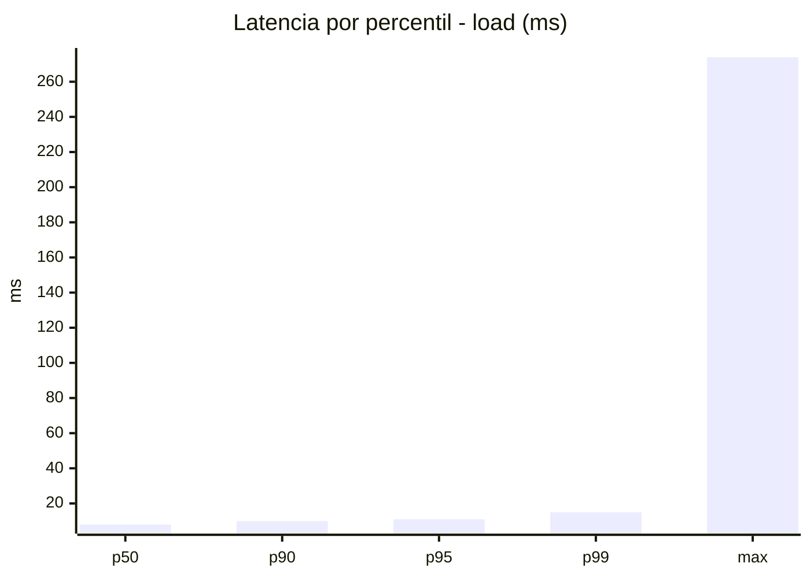
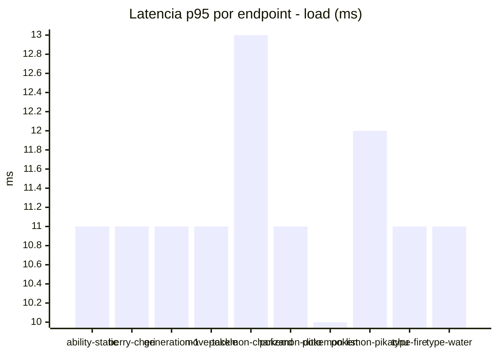
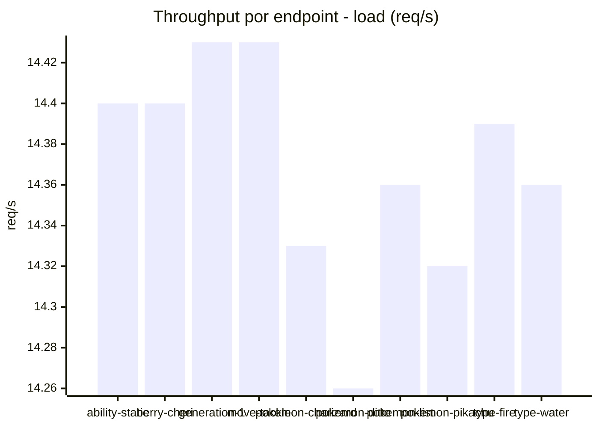
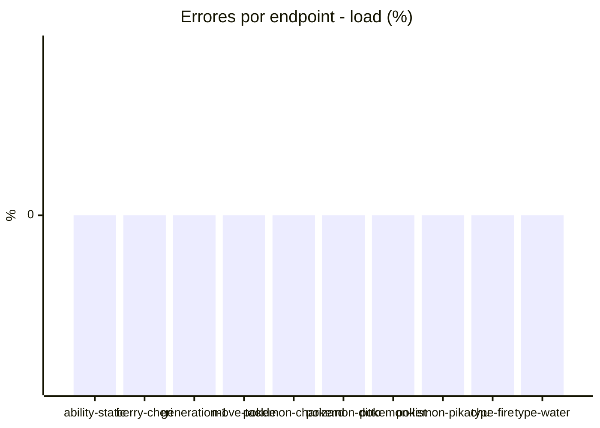
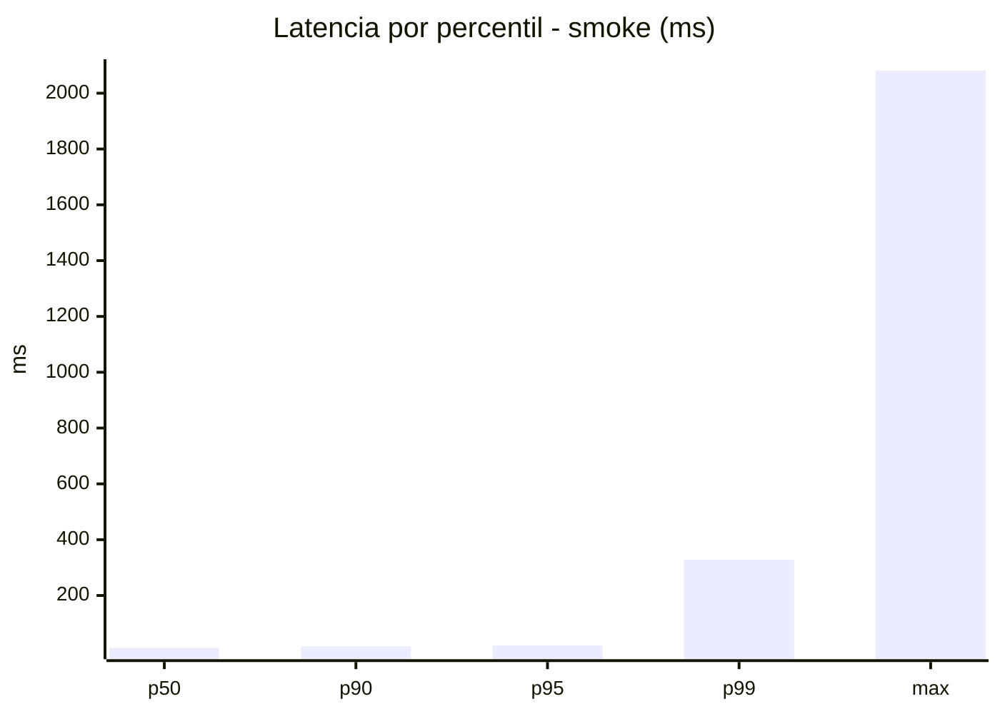
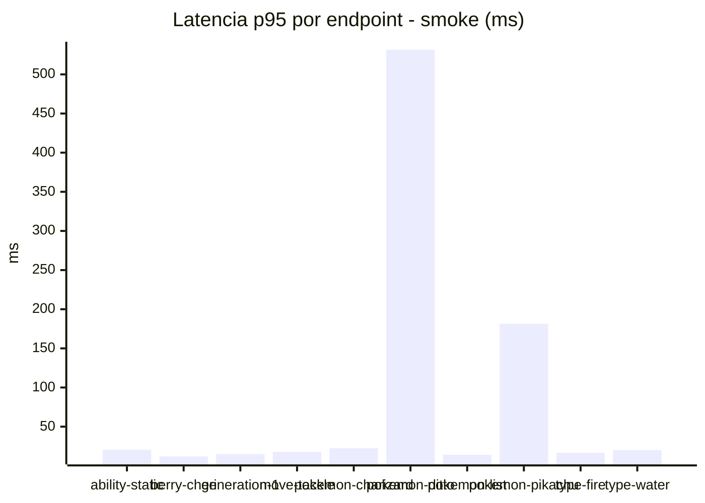
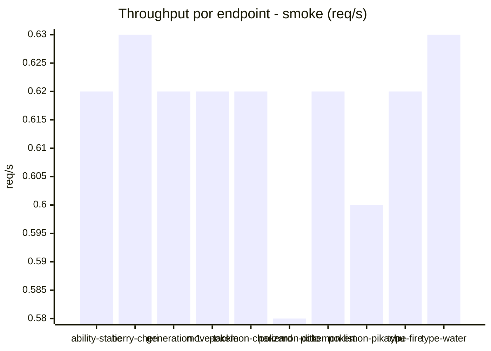

# Reporte de performance - PokeAPI

**Fecha:** 2026-08-23 13:31 UTC  
**Veredicto del agente:** `PASS`  
**Corrida:** [ver en GitHub Actions](https://github.com/lrbg/jmeter-pokeapi-lab/actions/runs/32642457394)  

## Validacion del agente de IA

PASS (fallback por umbrales)

- Error maximo: 0.0%
- p95 maximo: 20.3 ms

## Resultados

### Escenario: `load`

| Metrica | Valor |
| --- | --- |
| Muestras | 17040 |
| Errores | 0 (0.0%) |
| Latencia media | 8.3 ms |
| p50 / p90 / p95 / p99 | 8.0 / 10.0 / 11.0 / 15.0 ms |
| Min / Max | 4 / 274 ms |
| Throughput | 142.46 req/s |
| Duracion | 119.6 s |

Detalle por endpoint

| Endpoint | Muestras | Error % | avg | p95 | p99 | req/s |
| --- | --- | --- | --- | --- | --- | --- |
| ability-static | 1704 | 0.0% | 8.3 | 11.0 | 14.0 | 14.4 |
| berry-cheri | 1704 | 0.0% | 8.0 | 11.0 | 14.0 | 14.4 |
| generation-1 | 1703 | 0.0% | 8.2 | 11.0 | 15.0 | 14.43 |
| move-tackle | 1704 | 0.0% | 8.3 | 11.0 | 14.0 | 14.43 |
| pokemon-charizard | 1704 | 0.0% | 9.1 | 13.0 | 19.0 | 14.33 |
| pokemon-ditto | 1704 | 0.0% | 8.4 | 11.0 | 15.0 | 14.26 |
| pokemon-list | 1704 | 0.0% | 7.7 | 10.0 | 13.0 | 14.36 |
| pokemon-pikachu | 1704 | 0.0% | 9.0 | 12.0 | 17.0 | 14.32 |
| type-fire | 1705 | 0.0% | 7.9 | 11.0 | 15.0 | 14.39 |
| type-water | 1704 | 0.0% | 8.4 | 11.0 | 15.0 | 14.36 |

### Escenario: `smoke`

| Metrica | Valor |
| --- | --- |
| Muestras | 154 |
| Errores | 0 (0.0%) |
| Latencia media | 30.1 ms |
| p50 / p90 / p95 / p99 | 12.0 / 18.0 / 20.3 / 328.2 ms |
| Min / Max | 7 / 2081 ms |
| Throughput | 5.44 req/s |
| Duracion | 28.3 s |

Detalle por endpoint

| Endpoint | Muestras | Error % | avg | p95 | p99 | req/s |
| --- | --- | --- | --- | --- | --- | --- |
| ability-static | 15 | 0.0% | 12.9 | 20.5 | 23.3 | 0.62 |
| berry-cheri | 15 | 0.0% | 9.7 | 11.9 | 13.6 | 0.63 |
| generation-1 | 15 | 0.0% | 11.2 | 15.0 | 15.0 | 0.62 |
| move-tackle | 15 | 0.0% | 11.8 | 17.8 | 21.2 | 0.62 |
| pokemon-charizard | 16 | 0.0% | 18 | 22.5 | 26.1 | 0.62 |
| pokemon-ditto | 16 | 0.0% | 140.4 | 531.5 | 1771.1 | 0.58 |
| pokemon-list | 16 | 0.0% | 10.6 | 14.0 | 16.4 | 0.62 |
| pokemon-pikachu | 16 | 0.0% | 55.1 | 181.5 | 564.3 | 0.6 |
| type-fire | 15 | 0.0% | 11.9 | 16.5 | 19.3 | 0.62 |
| type-water | 15 | 0.0% | 12.3 | 20.0 | 31.2 | 0.63 |

