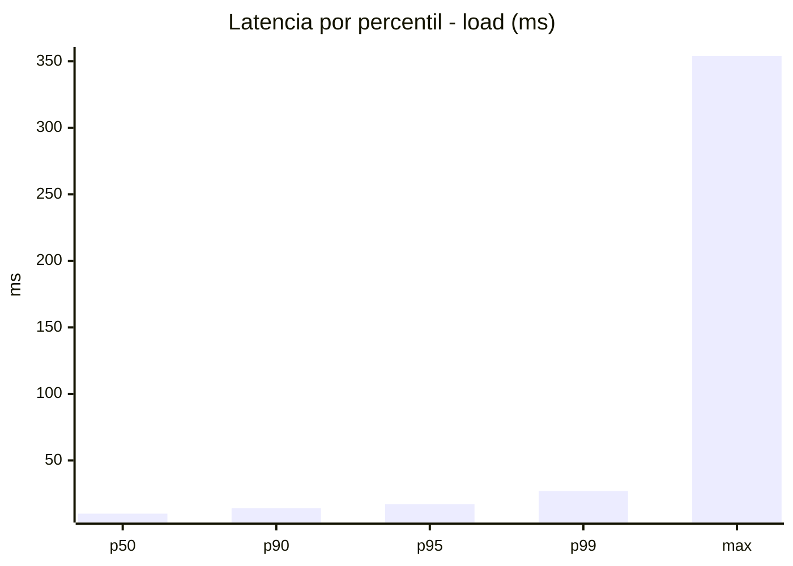
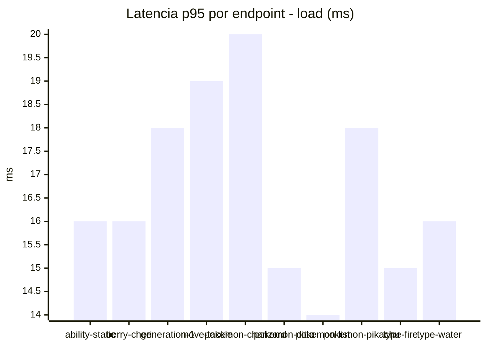
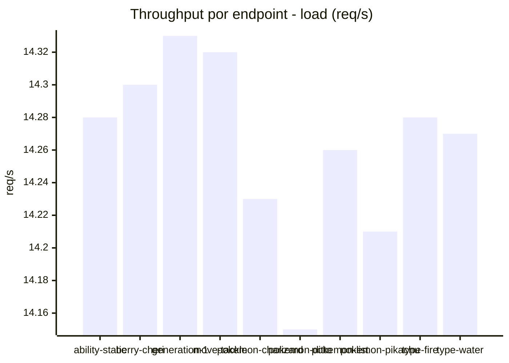
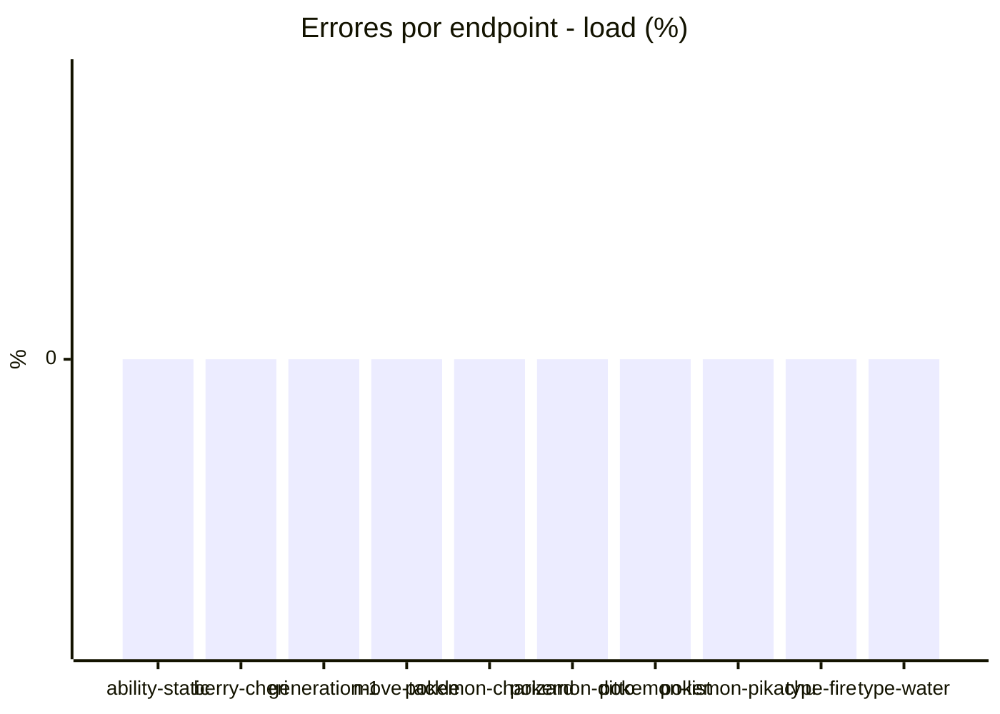
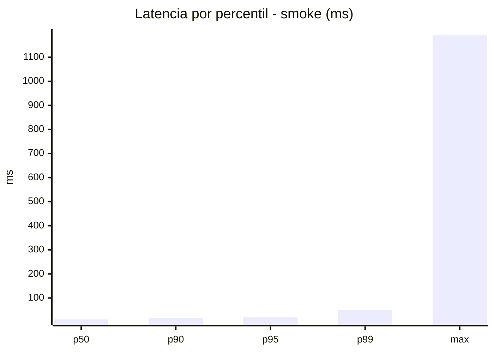
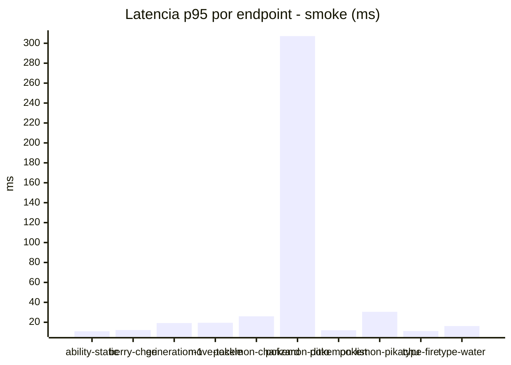
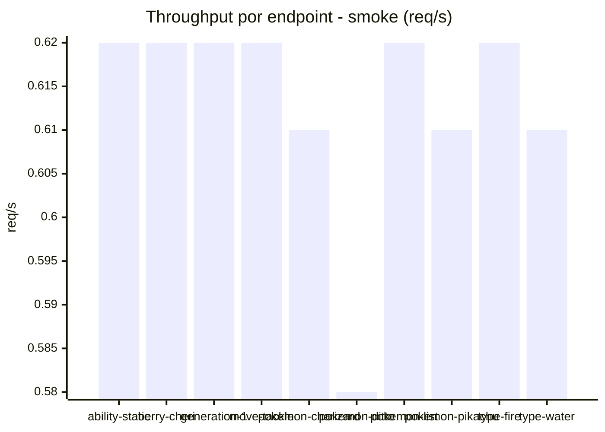

# Reporte de performance - PokeAPI

**Fecha:** 2026-08-24 13:50 UTC  
**Veredicto del agente:** `PASS`  
**Corrida:** [ver en GitHub Actions](https://github.com/lrbg/jmeter-pokeapi-lab/actions/runs/32734811887)  

## Validacion del agente de IA

PASS (fallback por umbrales)

- Error maximo: 0.0%
- p95 maximo: 20.0 ms

## Resultados

### Escenario: `load`

| Metrica | Valor |
| --- | --- |
| Muestras | 16915 |
| Errores | 0 (0.0%) |
| Latencia media | 10.7 ms |
| p50 / p90 / p95 / p99 | 10.0 / 14.0 / 17.0 / 27.0 ms |
| Min / Max | 5 / 354 ms |
| Throughput | 141.45 req/s |
| Duracion | 119.6 s |

Detalle por endpoint

| Endpoint | Muestras | Error % | avg | p95 | p99 | req/s |
| --- | --- | --- | --- | --- | --- | --- |
| ability-static | 1691 | 0.0% | 10.3 | 16.0 | 24.1 | 14.28 |
| berry-cheri | 1691 | 0.0% | 10.1 | 16.0 | 23.1 | 14.3 |
| generation-1 | 1691 | 0.0% | 10.8 | 18.0 | 28.0 | 14.33 |
| move-tackle | 1691 | 0.0% | 11.3 | 19.0 | 33.1 | 14.32 |
| pokemon-charizard | 1692 | 0.0% | 12.4 | 20.0 | 31.2 | 14.23 |
| pokemon-ditto | 1692 | 0.0% | 10.3 | 15.0 | 24.1 | 14.15 |
| pokemon-list | 1693 | 0.0% | 9.6 | 14.0 | 23.0 | 14.26 |
| pokemon-pikachu | 1691 | 0.0% | 11.5 | 18.0 | 27.1 | 14.21 |
| type-fire | 1691 | 0.0% | 10.2 | 15.0 | 24.0 | 14.28 |
| type-water | 1692 | 0.0% | 10.2 | 16.0 | 26.0 | 14.27 |

### Escenario: `smoke`

| Metrica | Valor |
| --- | --- |
| Muestras | 160 |
| Errores | 0 (0.0%) |
| Latencia media | 19.6 ms |
| p50 / p90 / p95 / p99 | 11.0 / 18.0 / 20.0 / 49.7 ms |
| Min / Max | 7 / 1193 ms |
| Throughput | 5.53 req/s |
| Duracion | 28.9 s |

Detalle por endpoint

| Endpoint | Muestras | Error % | avg | p95 | p99 | req/s |
| --- | --- | --- | --- | --- | --- | --- |
| ability-static | 16 | 0.0% | 9.8 | 11.0 | 11.0 | 0.62 |
| berry-cheri | 16 | 0.0% | 9.3 | 12.2 | 12.8 | 0.62 |
| generation-1 | 16 | 0.0% | 11.6 | 19.2 | 19.9 | 0.62 |
| move-tackle | 16 | 0.0% | 13.1 | 19.5 | 35.1 | 0.62 |
| pokemon-charizard | 16 | 0.0% | 19.3 | 26.0 | 30.8 | 0.61 |
| pokemon-ditto | 16 | 0.0% | 84 | 307.2 | 1015.8 | 0.58 |
| pokemon-list | 16 | 0.0% | 9.5 | 12.0 | 12.0 | 0.62 |
| pokemon-pikachu | 16 | 0.0% | 18.4 | 30.5 | 58.1 | 0.61 |
| type-fire | 16 | 0.0% | 9.8 | 11.2 | 11.8 | 0.62 |
| type-water | 16 | 0.0% | 11.6 | 16.2 | 16.9 | 0.61 |

