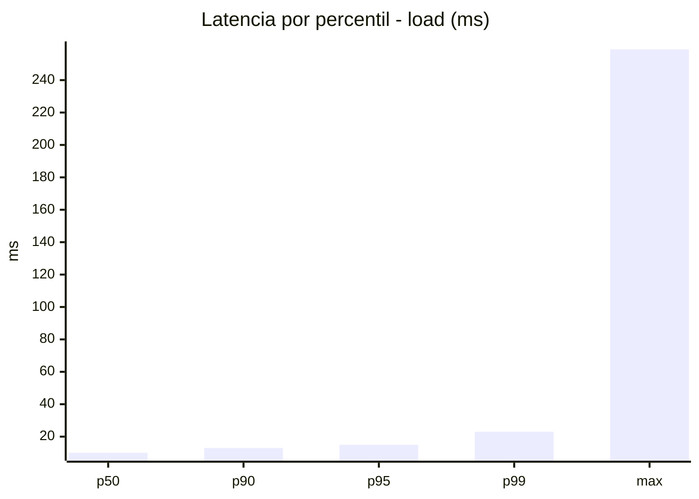
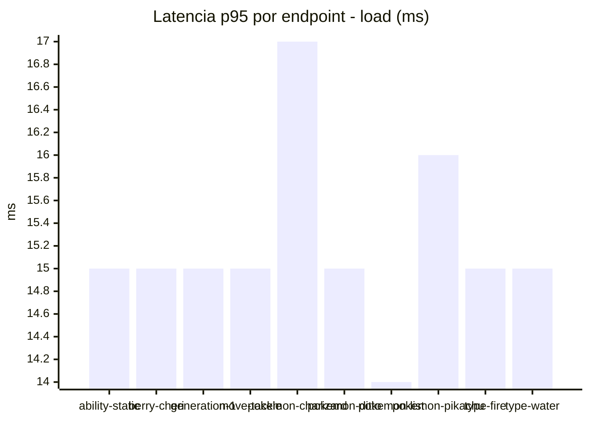
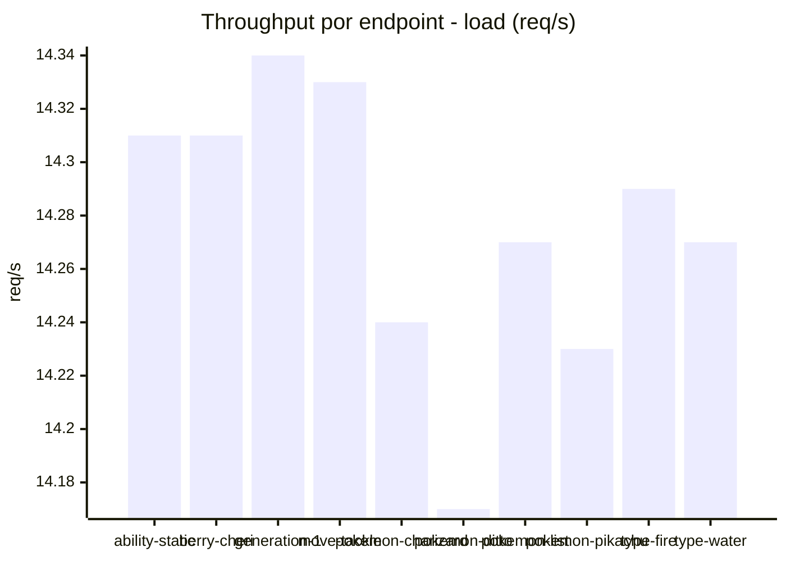
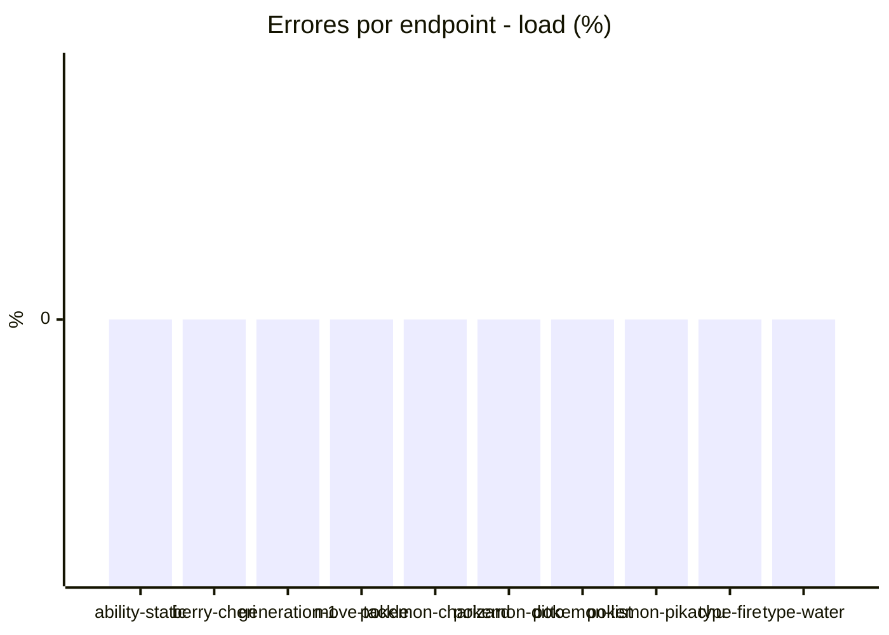
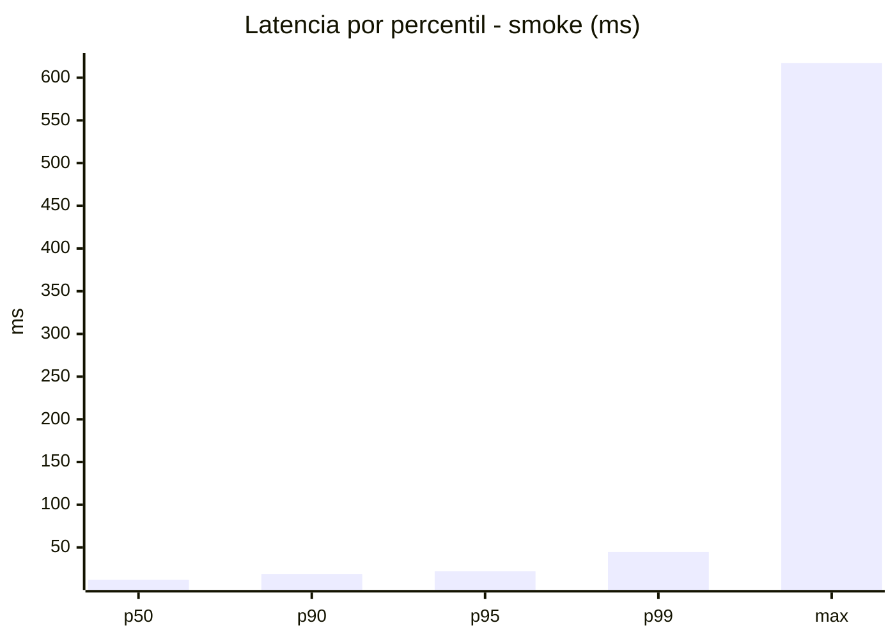
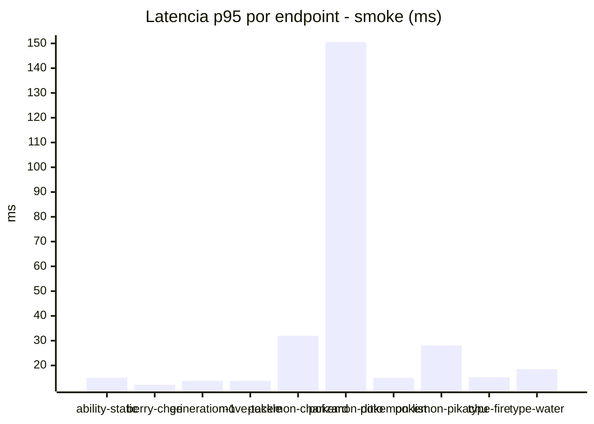
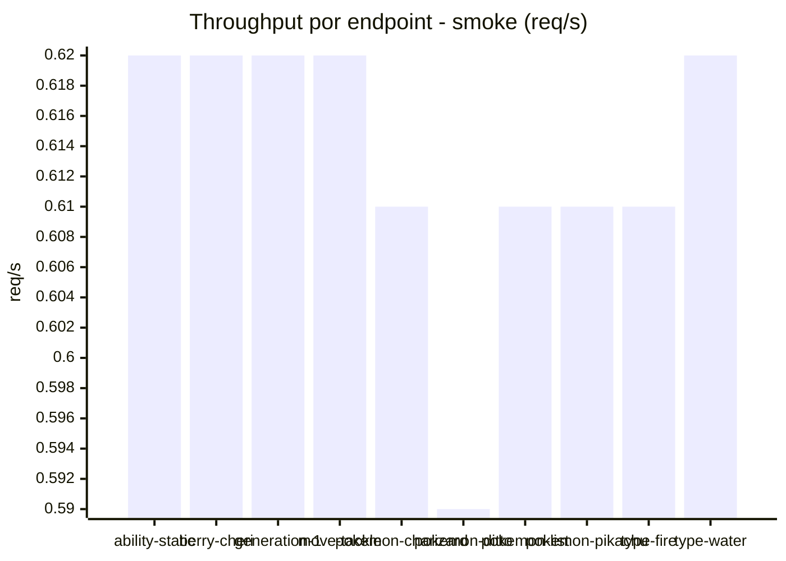

# Reporte de performance - PokeAPI

**Fecha:** 2026-08-25 13:48 UTC  
**Veredicto del agente:** `PASS`  
**Corrida:** [ver en GitHub Actions](https://github.com/lrbg/jmeter-pokeapi-lab/actions/runs/32855284729)  

## Validacion del agente de IA

PASS (fallback por umbrales)

- Error maximo: 0.0%
- p95 maximo: 22.0 ms

## Resultados

### Escenario: `load`

| Metrica | Valor |
| --- | --- |
| Muestras | 16937 |
| Errores | 0 (0.0%) |
| Latencia media | 10.3 ms |
| p50 / p90 / p95 / p99 | 10.0 / 13.0 / 15.0 / 23.0 ms |
| Min / Max | 5 / 259 ms |
| Throughput | 141.59 req/s |
| Duracion | 119.6 s |

Detalle por endpoint

| Endpoint | Muestras | Error % | avg | p95 | p99 | req/s |
| --- | --- | --- | --- | --- | --- | --- |
| ability-static | 1694 | 0.0% | 10.1 | 15.0 | 20.0 | 14.31 |
| berry-cheri | 1693 | 0.0% | 9.9 | 15.0 | 20.0 | 14.31 |
| generation-1 | 1693 | 0.0% | 10.3 | 15.0 | 23.0 | 14.34 |
| move-tackle | 1694 | 0.0% | 10.3 | 15.0 | 21.0 | 14.33 |
| pokemon-charizard | 1694 | 0.0% | 11.6 | 17.0 | 26.1 | 14.24 |
| pokemon-ditto | 1694 | 0.0% | 10.1 | 15.0 | 24.0 | 14.17 |
| pokemon-list | 1694 | 0.0% | 9.6 | 14.0 | 18.1 | 14.27 |
| pokemon-pikachu | 1694 | 0.0% | 11.1 | 16.0 | 24.0 | 14.23 |
| type-fire | 1694 | 0.0% | 10.0 | 15.0 | 23.1 | 14.29 |
| type-water | 1693 | 0.0% | 10.2 | 15.0 | 22.0 | 14.27 |

### Escenario: `smoke`

| Metrica | Valor |
| --- | --- |
| Muestras | 161 |
| Errores | 0 (0.0%) |
| Latencia media | 17.2 ms |
| p50 / p90 / p95 / p99 | 12.0 / 19.0 / 22.0 / 44.6 ms |
| Min / Max | 8 / 617 ms |
| Throughput | 5.57 req/s |
| Duracion | 28.9 s |

Detalle por endpoint

| Endpoint | Muestras | Error % | avg | p95 | p99 | req/s |
| --- | --- | --- | --- | --- | --- | --- |
| ability-static | 16 | 0.0% | 11.8 | 15.0 | 15.0 | 0.62 |
| berry-cheri | 16 | 0.0% | 10.8 | 12.2 | 12.8 | 0.62 |
| generation-1 | 16 | 0.0% | 11.3 | 13.8 | 15.5 | 0.62 |
| move-tackle | 16 | 0.0% | 11.5 | 13.8 | 15.5 | 0.62 |
| pokemon-charizard | 16 | 0.0% | 21.1 | 32.0 | 51.2 | 0.61 |
| pokemon-ditto | 17 | 0.0% | 50.1 | 150.6 | 523.7 | 0.59 |
| pokemon-list | 16 | 0.0% | 11.8 | 15.0 | 15.0 | 0.61 |
| pokemon-pikachu | 16 | 0.0% | 18 | 28.0 | 35.2 | 0.61 |
| type-fire | 16 | 0.0% | 11.4 | 15.2 | 15.8 | 0.61 |
| type-water | 16 | 0.0% | 12.6 | 18.5 | 19.7 | 0.62 |

