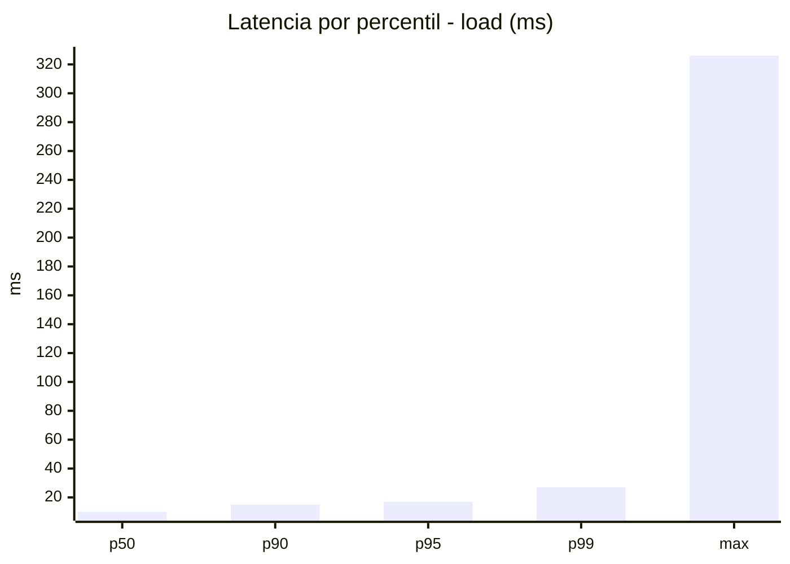
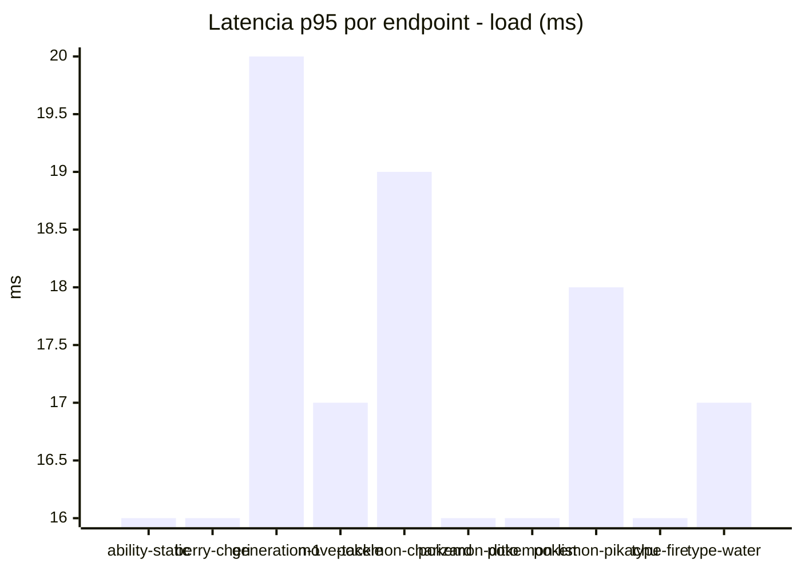
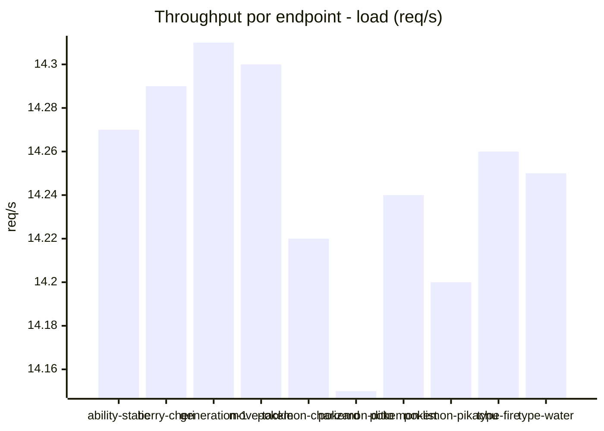
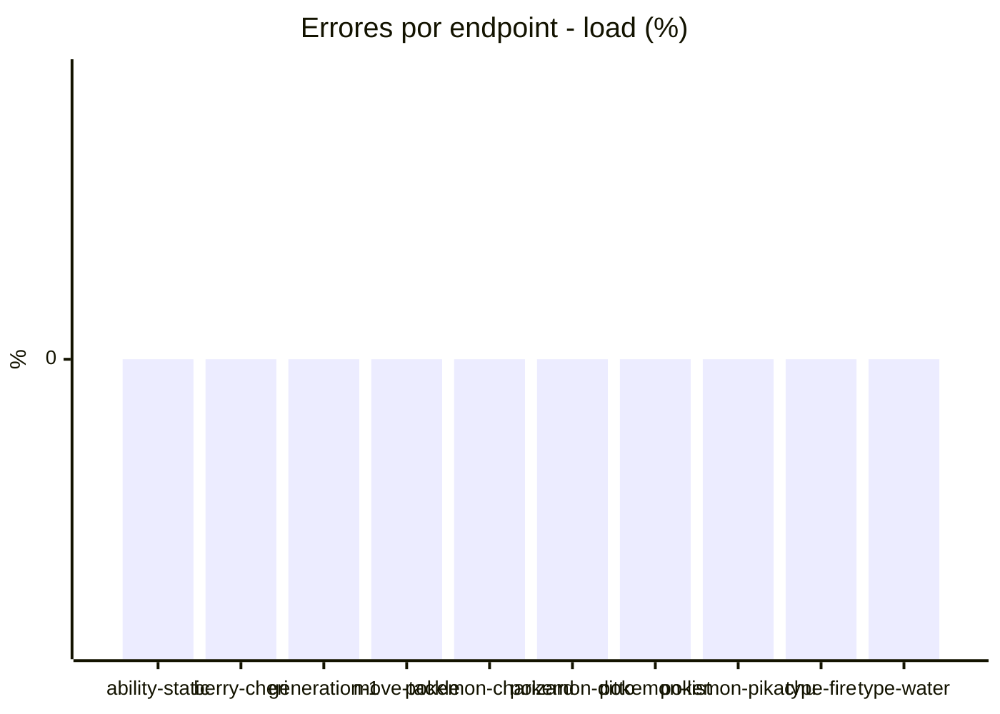
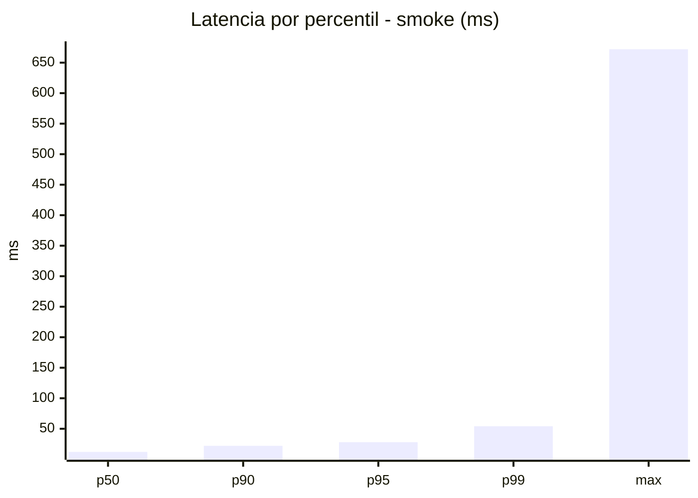
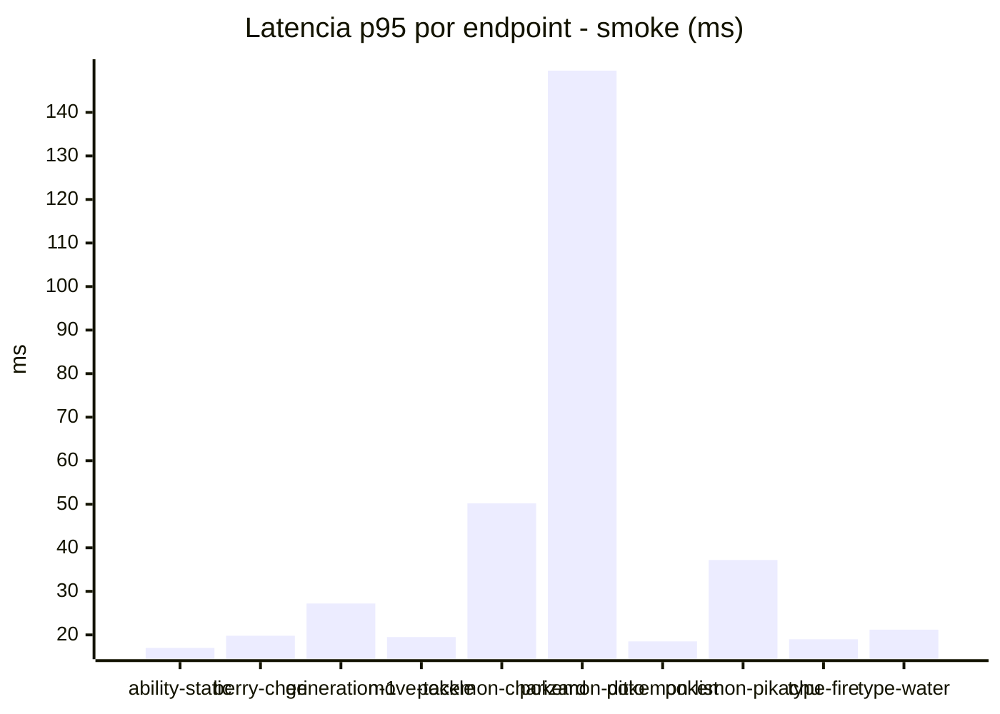
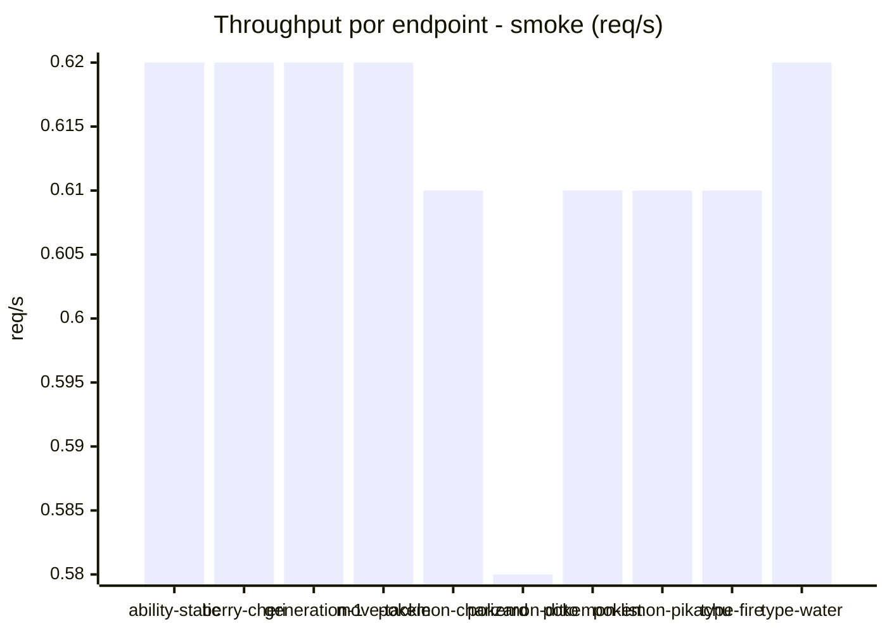

# Reporte de performance - PokeAPI

**Fecha:** 2026-08-26 13:54 UTC  
**Veredicto del agente:** `PASS`  
**Corrida:** [ver en GitHub Actions](https://github.com/lrbg/jmeter-pokeapi-lab/actions/runs/32976742969)  

## Validacion del agente de IA

PASS (fallback por umbrales)

- Error maximo: 0.0%
- p95 maximo: 28.0 ms

## Resultados

### Escenario: `load`

| Metrica | Valor |
| --- | --- |
| Muestras | 16893 |
| Errores | 0 (0.0%) |
| Latencia media | 11.0 ms |
| p50 / p90 / p95 / p99 | 10.0 / 15.0 / 17.0 / 27.0 ms |
| Min / Max | 6 / 326 ms |
| Throughput | 141.32 req/s |
| Duracion | 119.5 s |

Detalle por endpoint

| Endpoint | Muestras | Error % | avg | p95 | p99 | req/s |
| --- | --- | --- | --- | --- | --- | --- |
| ability-static | 1689 | 0.0% | 10.4 | 16.0 | 24.1 | 14.27 |
| berry-cheri | 1690 | 0.0% | 10.4 | 16.0 | 27.0 | 14.29 |
| generation-1 | 1688 | 0.0% | 11.7 | 20.0 | 32.0 | 14.31 |
| move-tackle | 1688 | 0.0% | 10.9 | 17.0 | 27.0 | 14.3 |
| pokemon-charizard | 1690 | 0.0% | 12.0 | 19.0 | 29.0 | 14.22 |
| pokemon-ditto | 1691 | 0.0% | 10.5 | 16.0 | 24.0 | 14.15 |
| pokemon-list | 1690 | 0.0% | 10.4 | 16.0 | 25.0 | 14.24 |
| pokemon-pikachu | 1690 | 0.0% | 11.8 | 18.0 | 30.0 | 14.2 |
| type-fire | 1688 | 0.0% | 10.4 | 16.0 | 25.0 | 14.26 |
| type-water | 1689 | 0.0% | 11.0 | 17.0 | 25.1 | 14.25 |

### Escenario: `smoke`

| Metrica | Valor |
| --- | --- |
| Muestras | 161 |
| Errores | 0 (0.0%) |
| Latencia media | 19.0 ms |
| p50 / p90 / p95 / p99 | 12.0 / 22.0 / 28.0 / 54.0 ms |
| Min / Max | 8 / 672 ms |
| Throughput | 5.53 req/s |
| Duracion | 29.1 s |

Detalle por endpoint

| Endpoint | Muestras | Error % | avg | p95 | p99 | req/s |
| --- | --- | --- | --- | --- | --- | --- |
| ability-static | 16 | 0.0% | 11.6 | 17.0 | 17.0 | 0.62 |
| berry-cheri | 16 | 0.0% | 12.2 | 19.8 | 28.7 | 0.62 |
| generation-1 | 16 | 0.0% | 13.9 | 27.2 | 39.8 | 0.62 |
| move-tackle | 16 | 0.0% | 13.9 | 19.5 | 23.1 | 0.62 |
| pokemon-charizard | 16 | 0.0% | 25.6 | 50.2 | 65.2 | 0.61 |
| pokemon-ditto | 17 | 0.0% | 51.2 | 149.6 | 567.5 | 0.58 |
| pokemon-list | 16 | 0.0% | 11.5 | 18.5 | 19.7 | 0.61 |
| pokemon-pikachu | 16 | 0.0% | 21.7 | 37.2 | 40.2 | 0.61 |
| type-fire | 16 | 0.0% | 12.2 | 19.0 | 21.4 | 0.61 |
| type-water | 16 | 0.0% | 14 | 21.2 | 21.9 | 0.62 |

