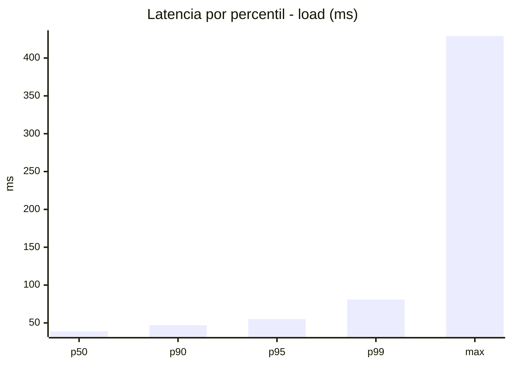
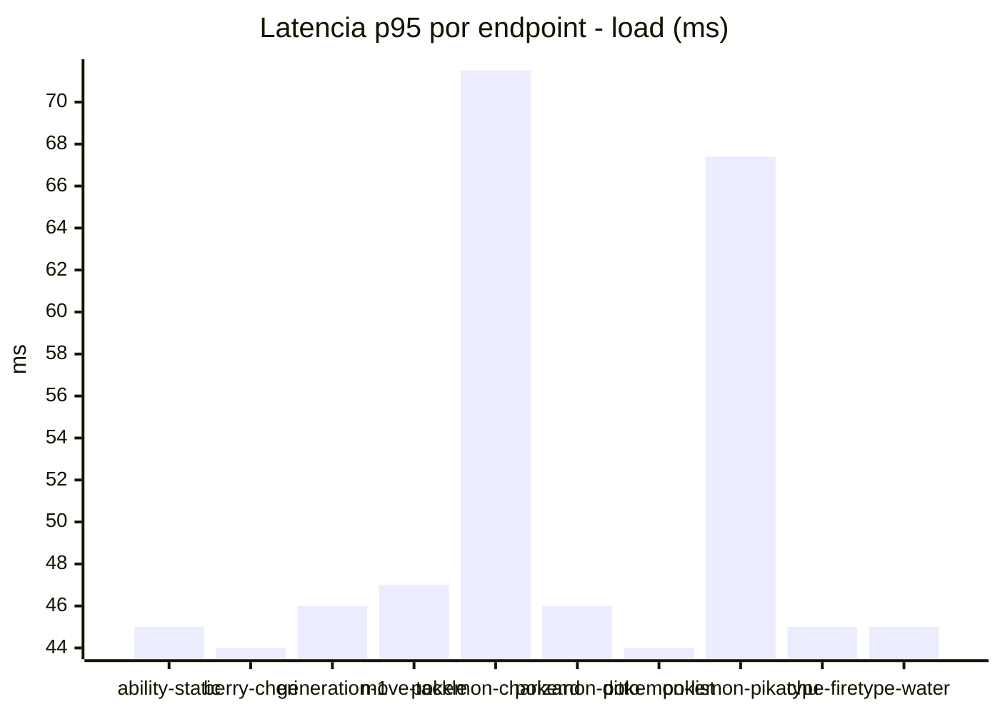
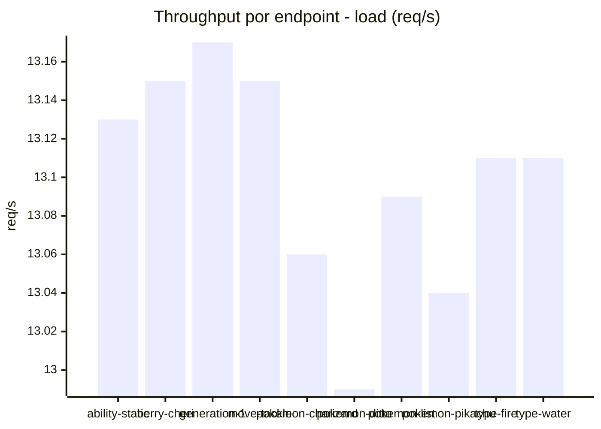
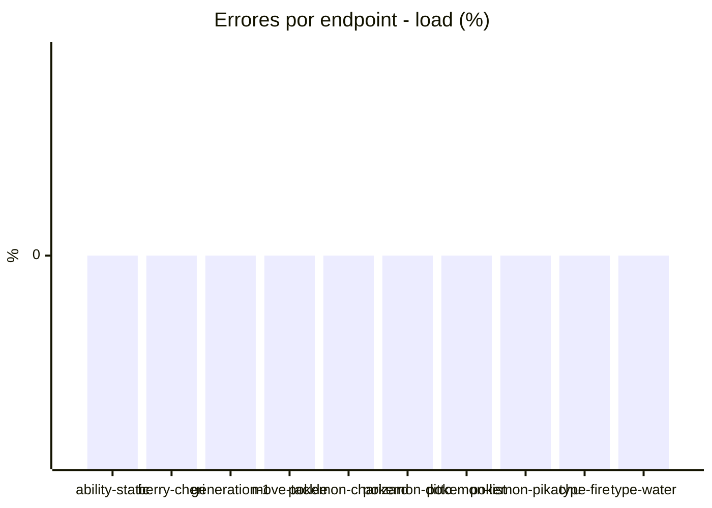
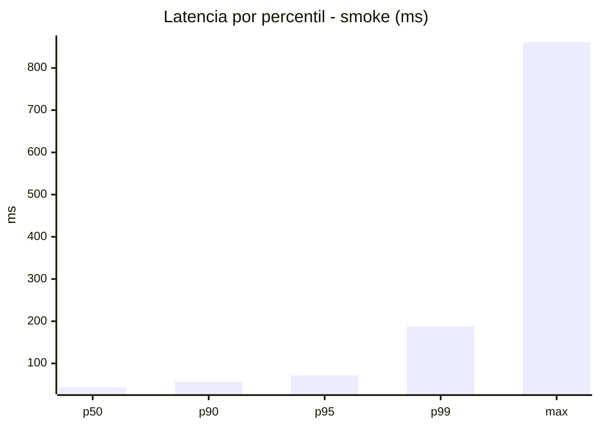
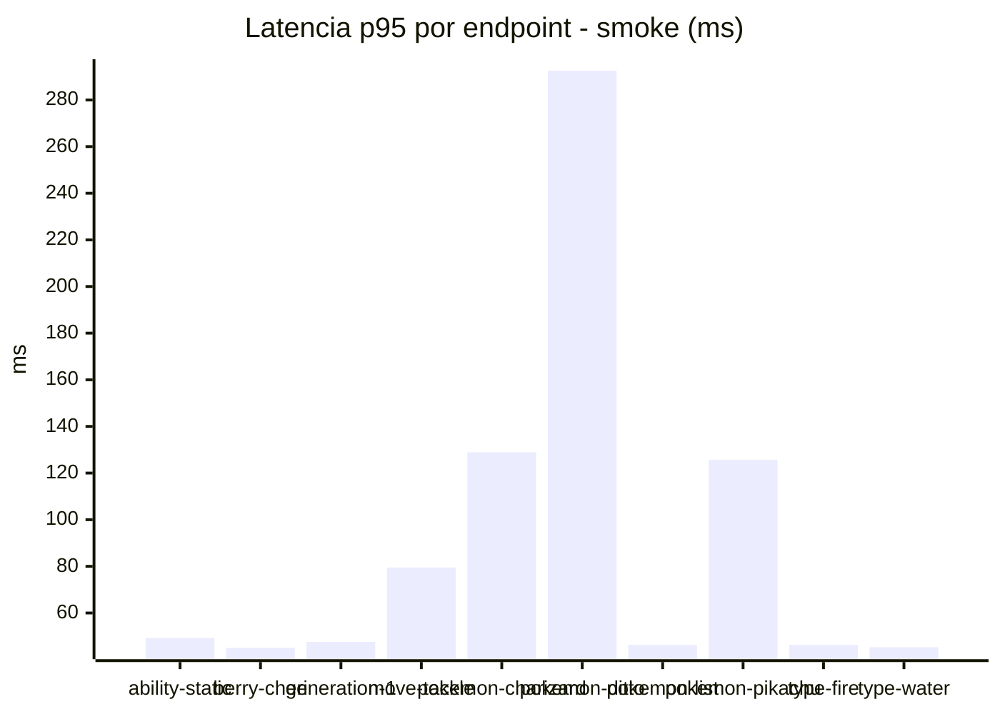
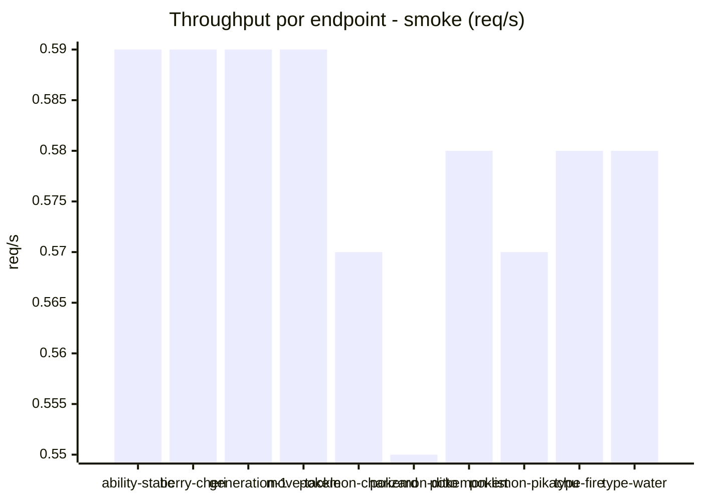

# Reporte de performance - PokeAPI

**Fecha:** 2026-08-27 22:47 UTC  
**Veredicto del agente:** `PASS`  
**Corrida:** [ver en GitHub Actions](https://github.com/lrbg/jmeter-pokeapi-lab/actions/runs/33123729812)  

## Validacion del agente de IA

PASS (fallback por umbrales)

- Error maximo: 0.0%
- p95 maximo: 71.5 ms

## Resultados

### Escenario: `load`

| Metrica | Valor |
| --- | --- |
| Muestras | 15520 |
| Errores | 0 (0.0%) |
| Latencia media | 38.6 ms |
| p50 / p90 / p95 / p99 | 39.0 / 47.0 / 55.0 / 81.0 ms |
| Min / Max | 22 / 429 ms |
| Throughput | 129.75 req/s |
| Duracion | 119.6 s |

Detalle por endpoint

| Endpoint | Muestras | Error % | avg | p95 | p99 | req/s |
| --- | --- | --- | --- | --- | --- | --- |
| ability-static | 1551 | 0.0% | 37.5 | 45.0 | 55.0 | 13.13 |
| berry-cheri | 1551 | 0.0% | 37.0 | 44.0 | 53.0 | 13.15 |
| generation-1 | 1552 | 0.0% | 37.2 | 46.0 | 53.0 | 13.17 |
| move-tackle | 1552 | 0.0% | 38.3 | 47.0 | 53.5 | 13.15 |
| pokemon-charizard | 1551 | 0.0% | 47.0 | 71.5 | 136.0 | 13.06 |
| pokemon-ditto | 1553 | 0.0% | 36.8 | 46.0 | 52.0 | 12.99 |
| pokemon-list | 1552 | 0.0% | 34.6 | 44.0 | 56.0 | 13.09 |
| pokemon-pikachu | 1553 | 0.0% | 44.2 | 67.4 | 123.5 | 13.04 |
| type-fire | 1552 | 0.0% | 36.9 | 45.0 | 54.0 | 13.11 |
| type-water | 1553 | 0.0% | 36.4 | 45.0 | 55.0 | 13.11 |

### Escenario: `smoke`

| Metrica | Valor |
| --- | --- |
| Muestras | 150 |
| Errores | 0 (0.0%) |
| Latencia media | 53.4 ms |
| p50 / p90 / p95 / p99 | 43.0 / 56.3 / 71.5 / 188.3 ms |
| Min / Max | 37 / 861 ms |
| Throughput | 5.18 req/s |
| Duracion | 29.0 s |

Detalle por endpoint

| Endpoint | Muestras | Error % | avg | p95 | p99 | req/s |
| --- | --- | --- | --- | --- | --- | --- |
| ability-static | 15 | 0.0% | 42.1 | 49.3 | 49.9 | 0.59 |
| berry-cheri | 15 | 0.0% | 41.9 | 45.0 | 45.0 | 0.59 |
| generation-1 | 15 | 0.0% | 42.1 | 47.6 | 48.7 | 0.59 |
| move-tackle | 15 | 0.0% | 50.7 | 79.5 | 132.7 | 0.59 |
| pokemon-charizard | 15 | 0.0% | 71.6 | 128.9 | 209.0 | 0.57 |
| pokemon-ditto | 15 | 0.0% | 96 | 292.6 | 747.3 | 0.55 |
| pokemon-list | 15 | 0.0% | 40.9 | 46.3 | 46.9 | 0.58 |
| pokemon-pikachu | 15 | 0.0% | 65.8 | 125.7 | 130.7 | 0.57 |
| type-fire | 15 | 0.0% | 42.4 | 46.3 | 46.9 | 0.58 |
| type-water | 15 | 0.0% | 40.7 | 45.3 | 45.9 | 0.58 |

