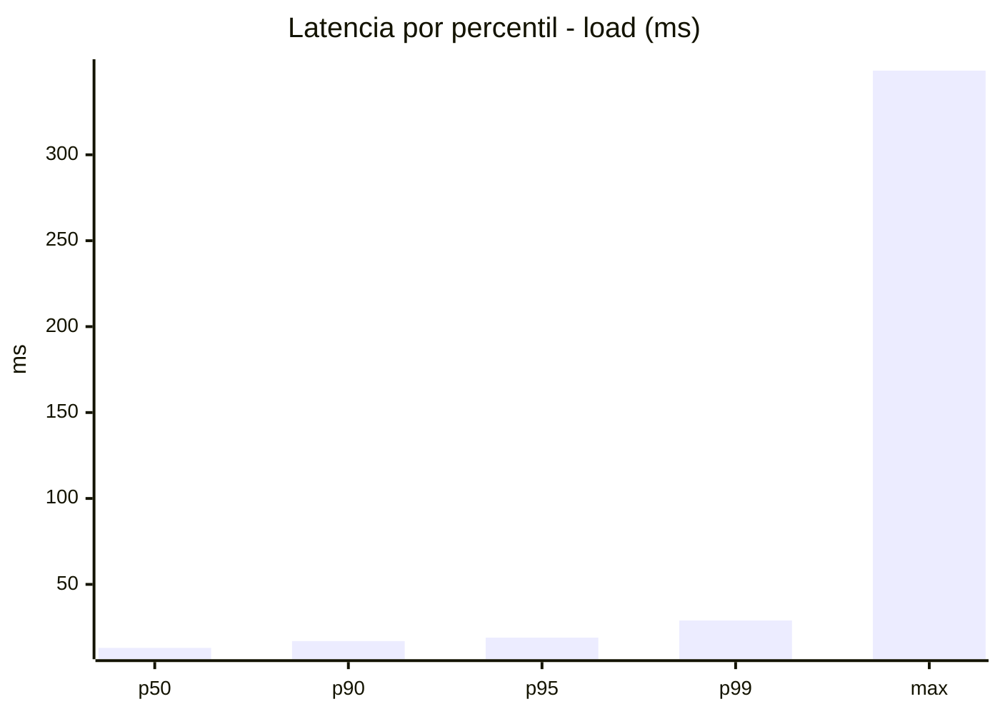
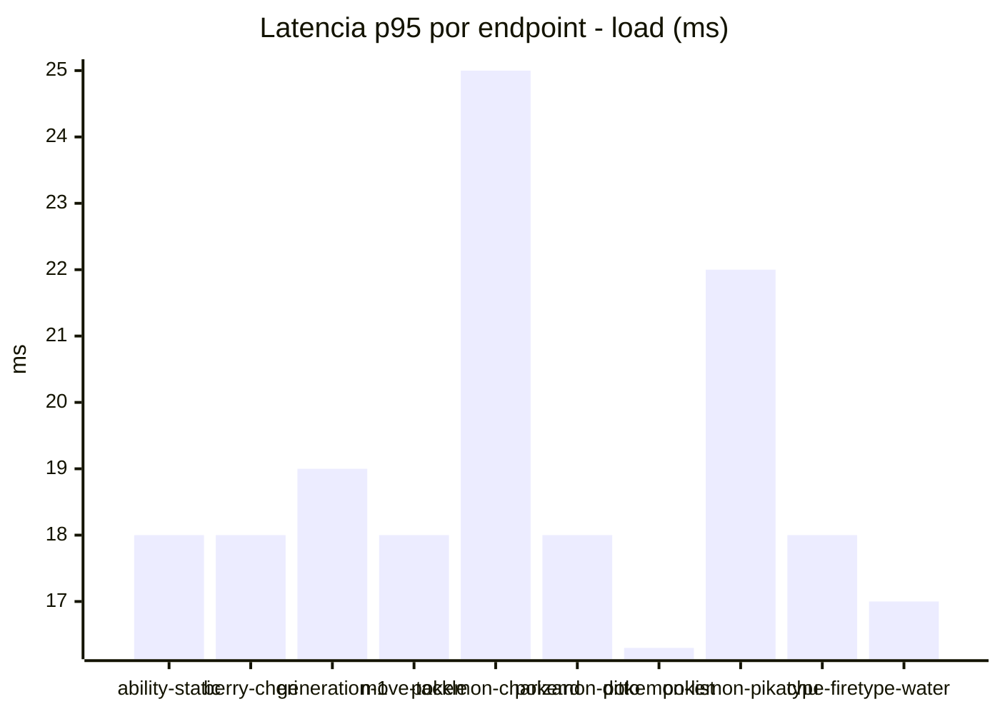
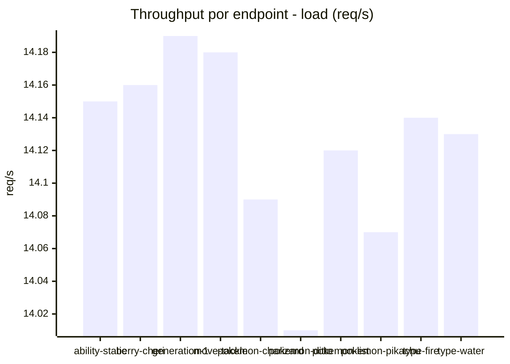
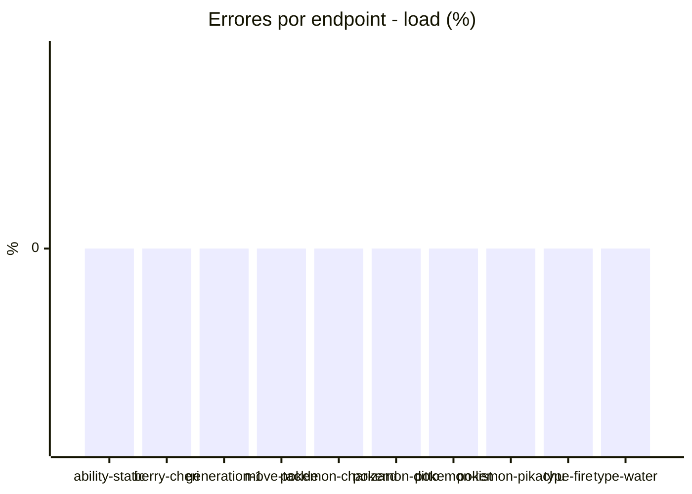
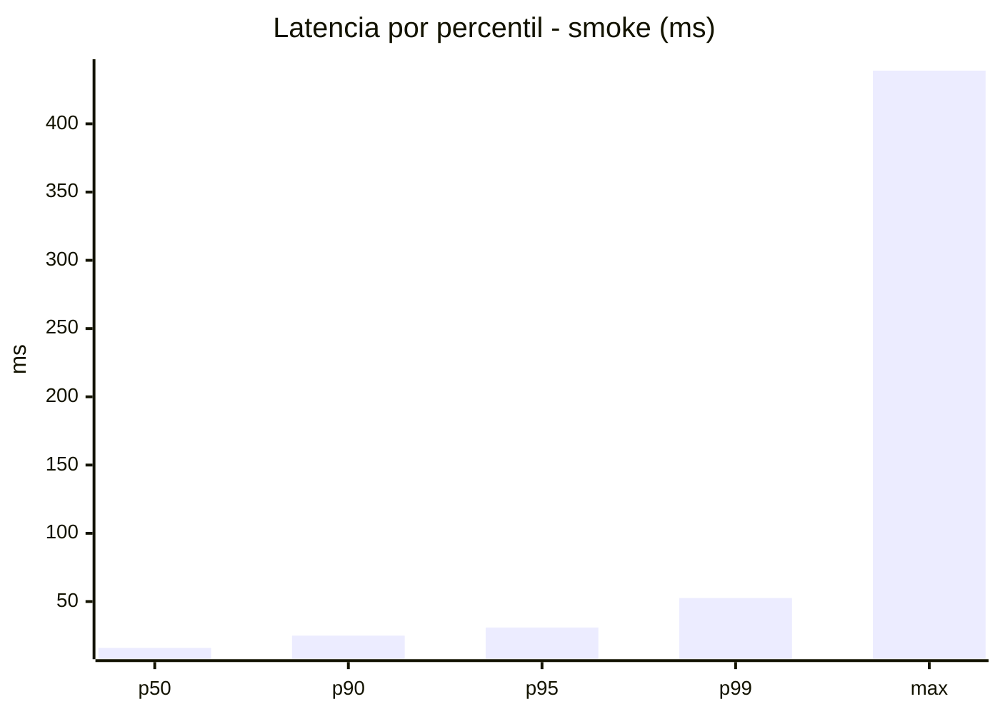
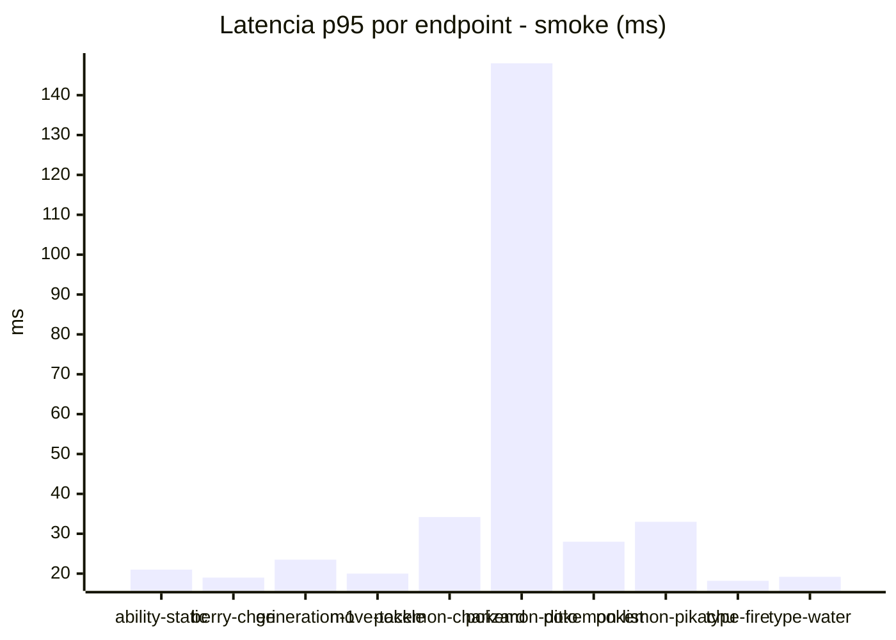
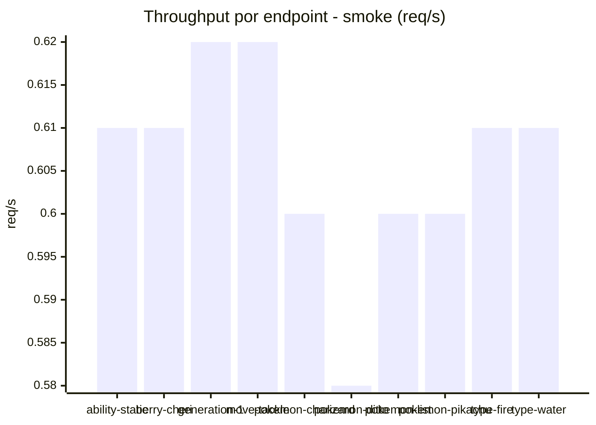

# Reporte de performance - PokeAPI

**Fecha:** 2026-08-28 22:54 UTC  
**Veredicto del agente:** `PASS`  
**Corrida:** [ver en GitHub Actions](https://github.com/lrbg/jmeter-pokeapi-lab/actions/runs/33218387884)  

## Validacion del agente de IA

PASS (fallback por umbrales)

- Error maximo: 0.0%
- p95 maximo: 31.0 ms

## Resultados

### Escenario: `load`

| Metrica | Valor |
| --- | --- |
| Muestras | 16741 |
| Errores | 0 (0.0%) |
| Latencia media | 13.7 ms |
| p50 / p90 / p95 / p99 | 13.0 / 17.0 / 19.0 / 29.0 ms |
| Min / Max | 9 / 349 ms |
| Throughput | 140.07 req/s |
| Duracion | 119.5 s |

Detalle por endpoint

| Endpoint | Muestras | Error % | avg | p95 | p99 | req/s |
| --- | --- | --- | --- | --- | --- | --- |
| ability-static | 1674 | 0.0% | 13.2 | 18.0 | 26.0 | 14.15 |
| berry-cheri | 1674 | 0.0% | 13.2 | 18.0 | 25.3 | 14.16 |
| generation-1 | 1673 | 0.0% | 14.4 | 19.0 | 43.3 | 14.19 |
| move-tackle | 1673 | 0.0% | 13.5 | 18.0 | 24.0 | 14.18 |
| pokemon-charizard | 1675 | 0.0% | 16.0 | 25.0 | 47.0 | 14.09 |
| pokemon-ditto | 1675 | 0.0% | 13.4 | 18.0 | 25.0 | 14.01 |
| pokemon-list | 1674 | 0.0% | 12.3 | 16.3 | 23.3 | 14.12 |
| pokemon-pikachu | 1674 | 0.0% | 15.0 | 22.0 | 31.3 | 14.07 |
| type-fire | 1675 | 0.0% | 13.1 | 18.0 | 28.3 | 14.14 |
| type-water | 1674 | 0.0% | 12.8 | 17.0 | 22.3 | 14.13 |

### Escenario: `smoke`

| Metrica | Valor |
| --- | --- |
| Muestras | 160 |
| Errores | 0 (0.0%) |
| Latencia media | 20.5 ms |
| p50 / p90 / p95 / p99 | 16.0 / 25.0 / 31.0 / 52.6 ms |
| Min / Max | 11 / 439 ms |
| Throughput | 5.49 req/s |
| Duracion | 29.1 s |

Detalle por endpoint

| Endpoint | Muestras | Error % | avg | p95 | p99 | req/s |
| --- | --- | --- | --- | --- | --- | --- |
| ability-static | 16 | 0.0% | 16.4 | 21.0 | 23.4 | 0.61 |
| berry-cheri | 16 | 0.0% | 14.7 | 19.0 | 21.4 | 0.61 |
| generation-1 | 16 | 0.0% | 17.2 | 23.5 | 29.5 | 0.62 |
| move-tackle | 16 | 0.0% | 16.4 | 20.0 | 24.8 | 0.62 |
| pokemon-charizard | 16 | 0.0% | 25.3 | 34.2 | 34.9 | 0.6 |
| pokemon-ditto | 16 | 0.0% | 44.4 | 148.0 | 380.8 | 0.58 |
| pokemon-list | 16 | 0.0% | 17.2 | 28.0 | 49.6 | 0.6 |
| pokemon-pikachu | 16 | 0.0% | 22.8 | 33.0 | 42.6 | 0.6 |
| type-fire | 16 | 0.0% | 15.2 | 18.2 | 18.9 | 0.61 |
| type-water | 16 | 0.0% | 15.4 | 19.2 | 19.9 | 0.61 |

