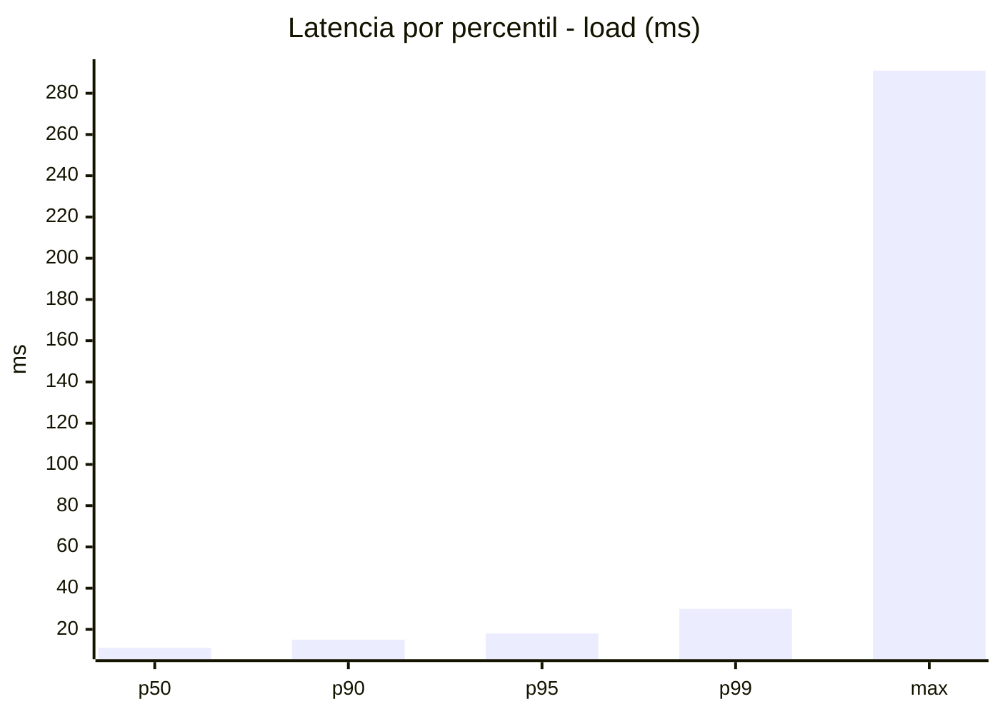
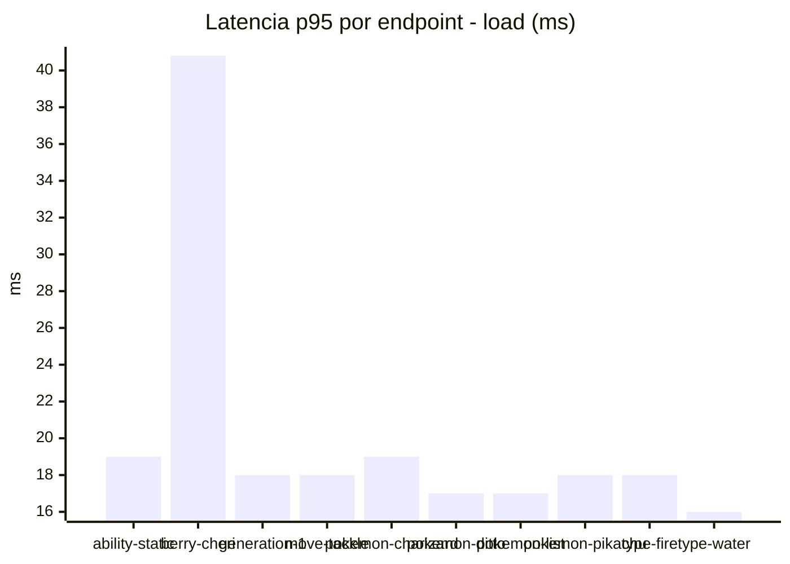
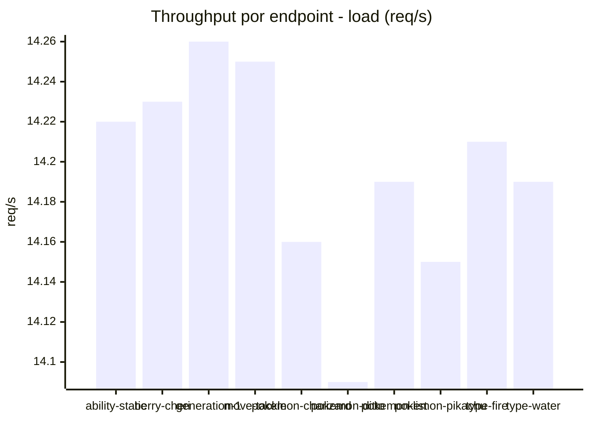
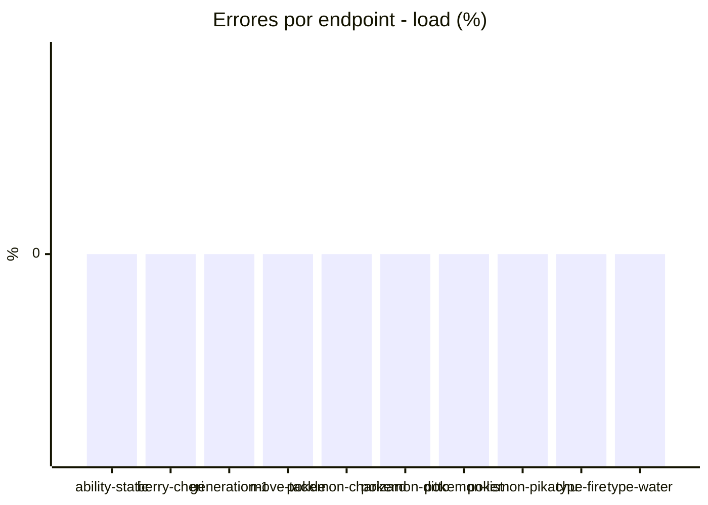
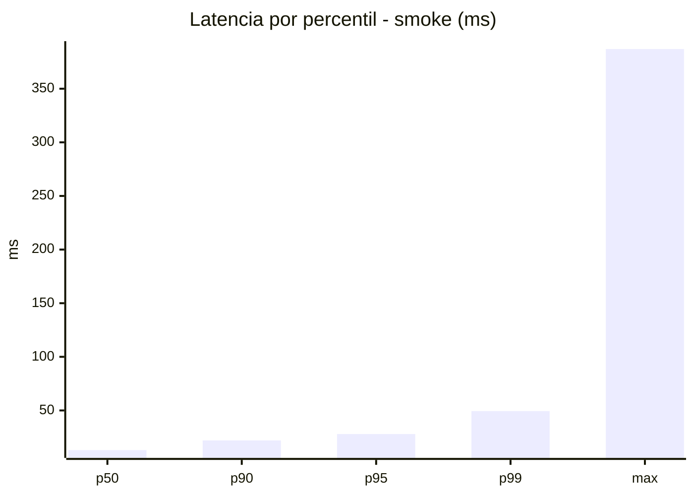
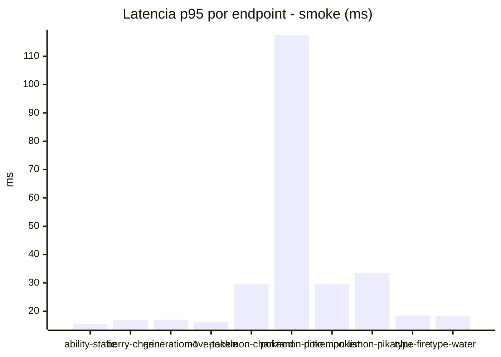
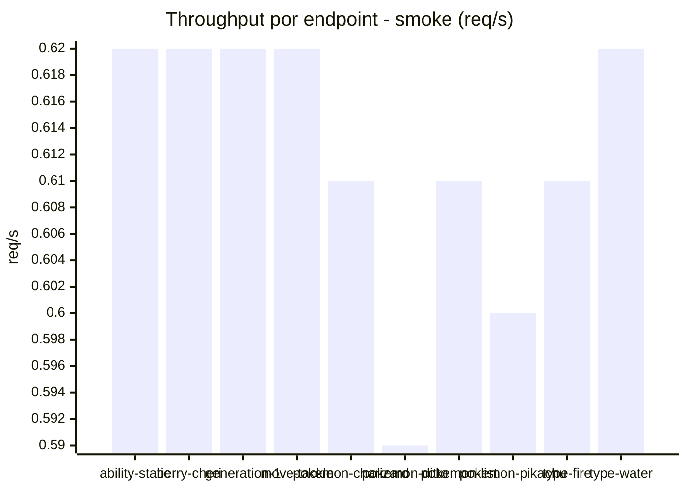

# Reporte de performance - PokeAPI

**Fecha:** 2026-08-29 16:59 UTC  
**Veredicto del agente:** `PASS`  
**Corrida:** [ver en GitHub Actions](https://github.com/lrbg/jmeter-pokeapi-lab/actions/runs/33264336401)  

## Validacion del agente de IA

PASS (fallback por umbrales)

- Error maximo: 0.0%
- p95 maximo: 28.0 ms

## Resultados

### Escenario: `load`

| Metrica | Valor |
| --- | --- |
| Muestras | 16833 |
| Errores | 0 (0.0%) |
| Latencia media | 12.1 ms |
| p50 / p90 / p95 / p99 | 11.0 / 15.0 / 18.0 / 30.0 ms |
| Min / Max | 6 / 291 ms |
| Throughput | 140.8 req/s |
| Duracion | 119.6 s |

Detalle por endpoint

| Endpoint | Muestras | Error % | avg | p95 | p99 | req/s |
| --- | --- | --- | --- | --- | --- | --- |
| ability-static | 1682 | 0.0% | 12.0 | 19.0 | 26.0 | 14.22 |
| berry-cheri | 1683 | 0.0% | 13.4 | 40.8 | 58.0 | 14.23 |
| generation-1 | 1683 | 0.0% | 11.7 | 18.0 | 28.2 | 14.26 |
| move-tackle | 1683 | 0.0% | 11.4 | 18.0 | 23.2 | 14.25 |
| pokemon-charizard | 1683 | 0.0% | 13.2 | 19.0 | 28.2 | 14.16 |
| pokemon-ditto | 1685 | 0.0% | 11.8 | 17.0 | 24.2 | 14.09 |
| pokemon-list | 1684 | 0.0% | 11.6 | 17.0 | 24.2 | 14.19 |
| pokemon-pikachu | 1684 | 0.0% | 12.6 | 18.0 | 29.2 | 14.15 |
| type-fire | 1683 | 0.0% | 11.9 | 18.0 | 25.0 | 14.21 |
| type-water | 1683 | 0.0% | 11.2 | 16.0 | 23.0 | 14.19 |

### Escenario: `smoke`

| Metrica | Valor |
| --- | --- |
| Muestras | 161 |
| Errores | 0 (0.0%) |
| Latencia media | 17.2 ms |
| p50 / p90 / p95 / p99 | 13.0 / 22.0 / 28.0 / 49.4 ms |
| Min / Max | 8 / 387 ms |
| Throughput | 5.56 req/s |
| Duracion | 28.9 s |

Detalle por endpoint

| Endpoint | Muestras | Error % | avg | p95 | p99 | req/s |
| --- | --- | --- | --- | --- | --- | --- |
| ability-static | 16 | 0.0% | 11.6 | 15.5 | 16.7 | 0.62 |
| berry-cheri | 16 | 0.0% | 11.9 | 16.8 | 20.9 | 0.62 |
| generation-1 | 16 | 0.0% | 12.9 | 17.0 | 19.4 | 0.62 |
| move-tackle | 16 | 0.0% | 12.8 | 16.2 | 16.9 | 0.62 |
| pokemon-charizard | 16 | 0.0% | 21.8 | 29.5 | 30.7 | 0.61 |
| pokemon-ditto | 17 | 0.0% | 37.1 | 117.4 | 333.1 | 0.59 |
| pokemon-list | 16 | 0.0% | 15.2 | 29.5 | 45.1 | 0.61 |
| pokemon-pikachu | 16 | 0.0% | 20.2 | 33.5 | 37.1 | 0.6 |
| type-fire | 16 | 0.0% | 14.2 | 18.5 | 19.7 | 0.61 |
| type-water | 16 | 0.0% | 13.1 | 18.2 | 18.9 | 0.62 |

