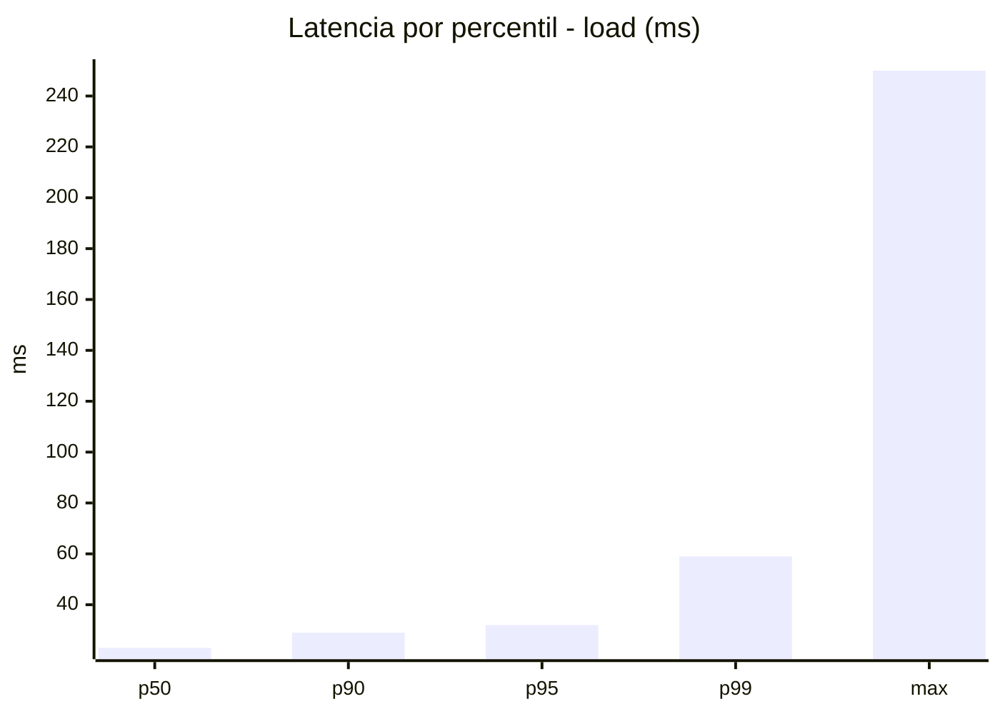
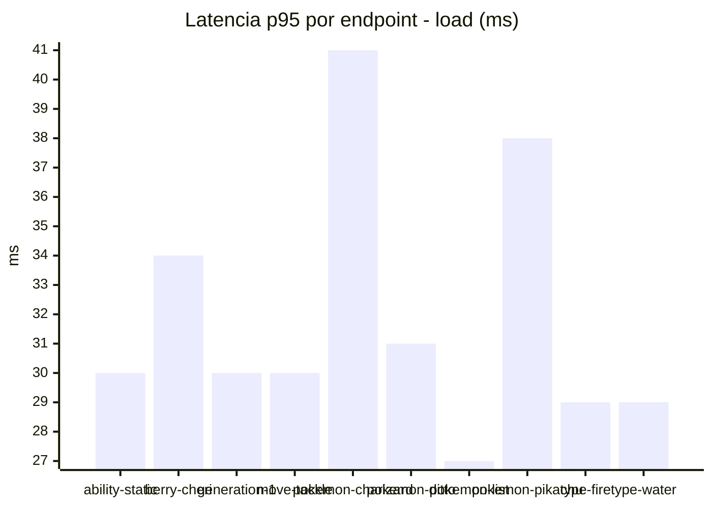
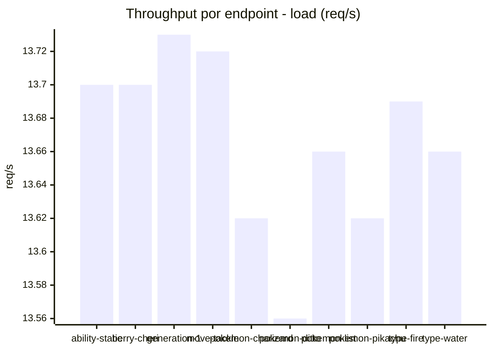
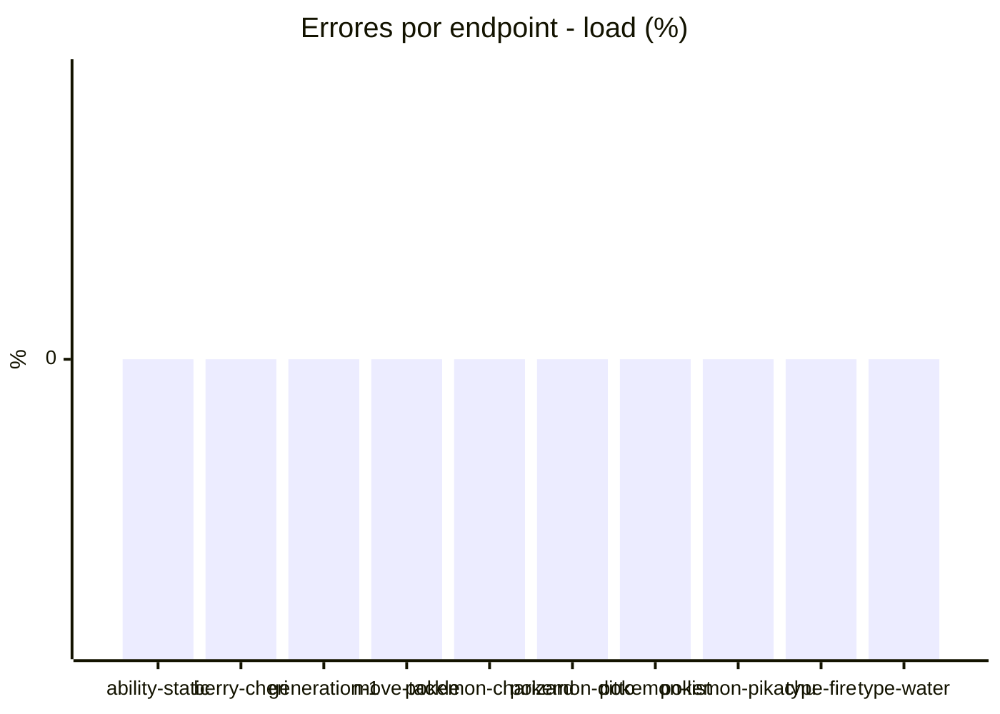
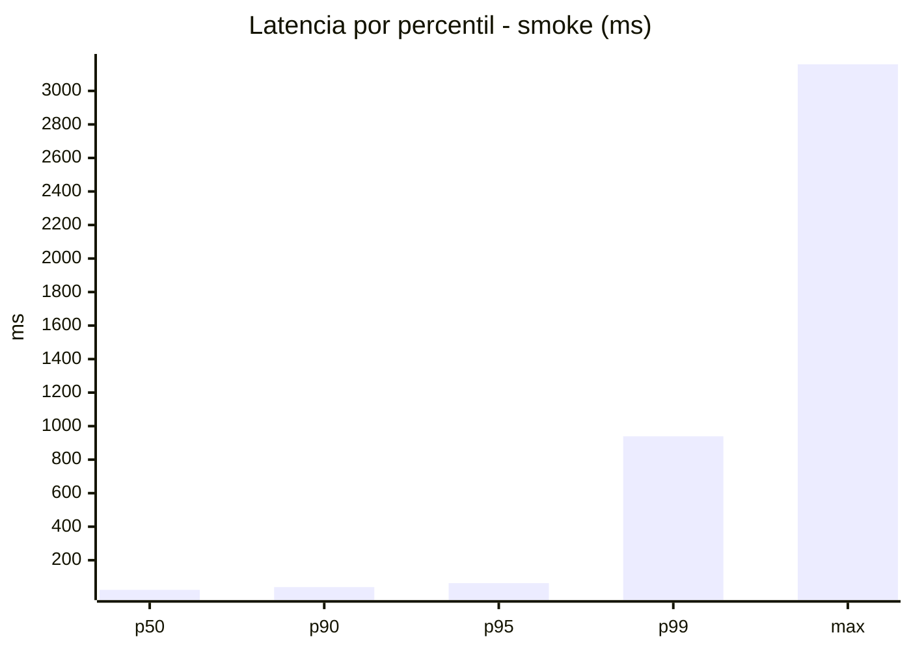
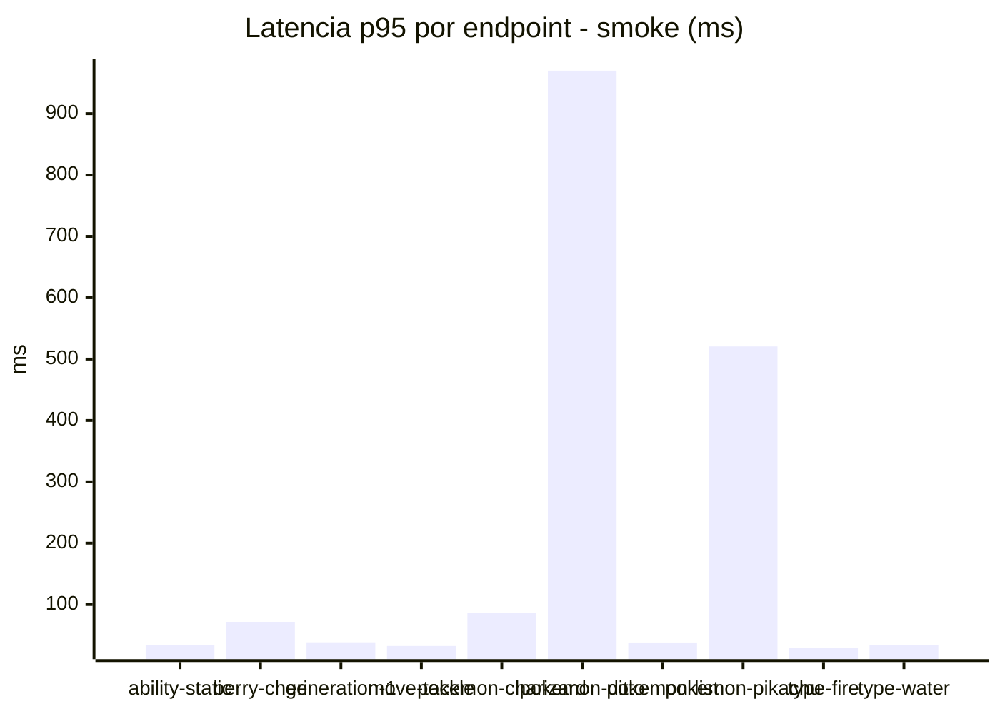
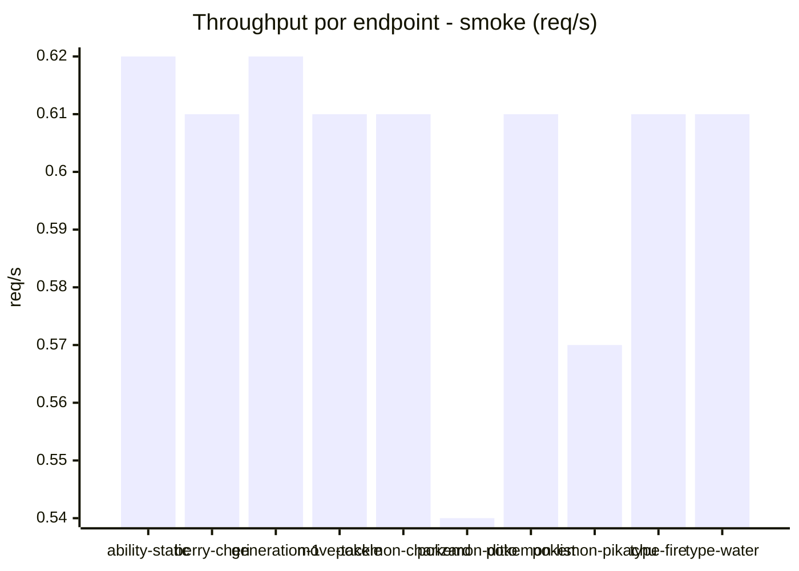

# Reporte de performance - PokeAPI

**Fecha:** 2026-08-30 17:13 UTC  
**Veredicto del agente:** `PASS`  
**Corrida:** [ver en GitHub Actions](https://github.com/lrbg/jmeter-pokeapi-lab/actions/runs/33324522409)  

## Validacion del agente de IA

PASS (fallback por umbrales)

- Error maximo: 0.0%
- p95 maximo: 63.0 ms

## Resultados

### Escenario: `load`

| Metrica | Valor |
| --- | --- |
| Muestras | 16216 |
| Errores | 0 (0.0%) |
| Latencia media | 24.1 ms |
| p50 / p90 / p95 / p99 | 23.0 / 29.0 / 32.0 / 59.0 ms |
| Min / Max | 16 / 250 ms |
| Throughput | 135.49 req/s |
| Duracion | 119.7 s |

Detalle por endpoint

| Endpoint | Muestras | Error % | avg | p95 | p99 | req/s |
| --- | --- | --- | --- | --- | --- | --- |
| ability-static | 1622 | 0.0% | 23.5 | 30.0 | 39.8 | 13.7 |
| berry-cheri | 1622 | 0.0% | 24.3 | 34.0 | 68.0 | 13.7 |
| generation-1 | 1621 | 0.0% | 23.4 | 30.0 | 43.8 | 13.73 |
| move-tackle | 1621 | 0.0% | 23.5 | 30.0 | 37.8 | 13.72 |
| pokemon-charizard | 1622 | 0.0% | 28.9 | 41.0 | 65.6 | 13.62 |
| pokemon-ditto | 1621 | 0.0% | 23.4 | 31.0 | 47.2 | 13.56 |
| pokemon-list | 1622 | 0.0% | 21.9 | 27.0 | 35.0 | 13.66 |
| pokemon-pikachu | 1621 | 0.0% | 26.9 | 38.0 | 85.0 | 13.62 |
| type-fire | 1622 | 0.0% | 23.1 | 29.0 | 42.0 | 13.69 |
| type-water | 1622 | 0.0% | 22.5 | 29.0 | 37.8 | 13.66 |

### Escenario: `smoke`

| Metrica | Valor |
| --- | --- |
| Muestras | 146 |
| Errores | 0 (0.0%) |
| Latencia media | 59.7 ms |
| p50 / p90 / p95 / p99 | 23.0 / 39.5 / 63.0 / 939.1 ms |
| Min / Max | 18 / 3159 ms |
| Throughput | 5.13 req/s |
| Duracion | 28.4 s |

Detalle por endpoint

| Endpoint | Muestras | Error % | avg | p95 | p99 | req/s |
| --- | --- | --- | --- | --- | --- | --- |
| ability-static | 14 | 0.0% | 23.9 | 33.4 | 33.9 | 0.62 |
| berry-cheri | 14 | 0.0% | 36.5 | 71.8 | 74.3 | 0.61 |
| generation-1 | 14 | 0.0% | 25.3 | 38.4 | 42.1 | 0.62 |
| move-tackle | 14 | 0.0% | 24.4 | 32.4 | 32.9 | 0.61 |
| pokemon-charizard | 15 | 0.0% | 40.3 | 86.5 | 94.9 | 0.61 |
| pokemon-ditto | 15 | 0.0% | 231.9 | 970.1 | 2721.2 | 0.54 |
| pokemon-list | 15 | 0.0% | 23.9 | 38.1 | 42.0 | 0.61 |
| pokemon-pikachu | 15 | 0.0% | 136.2 | 520.6 | 1406.5 | 0.57 |
| type-fire | 15 | 0.0% | 23.7 | 29.3 | 29.9 | 0.61 |
| type-water | 15 | 0.0% | 22.5 | 33.6 | 34.7 | 0.61 |

