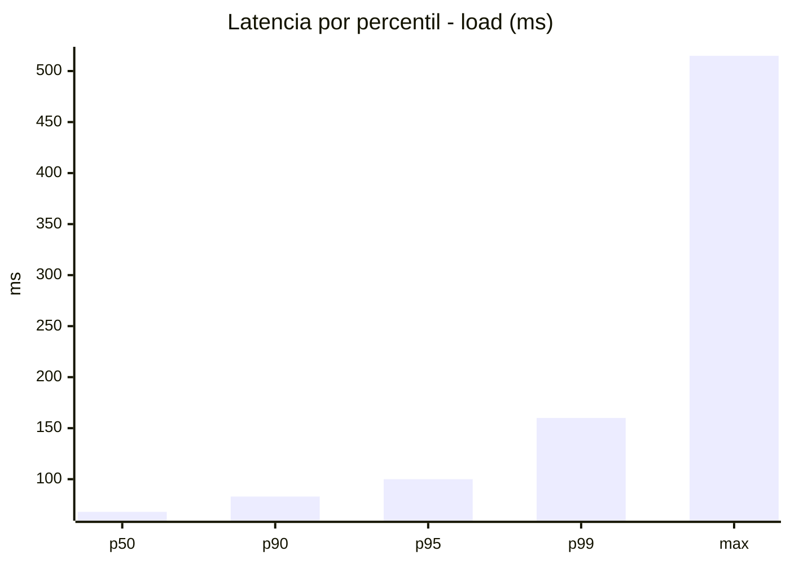
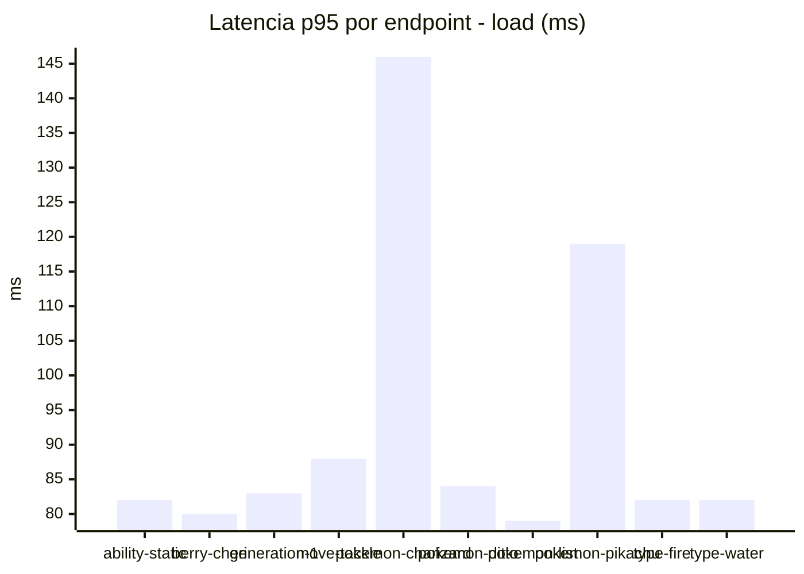
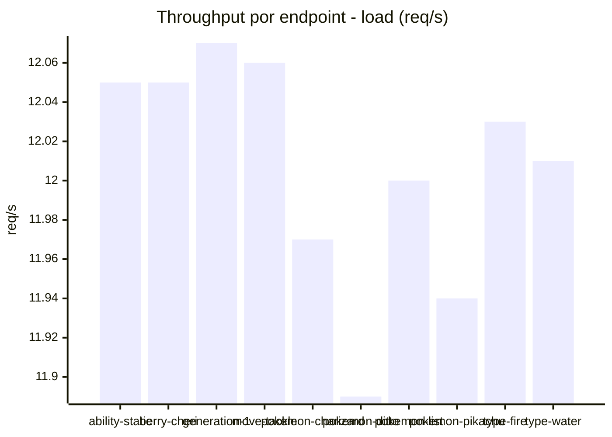
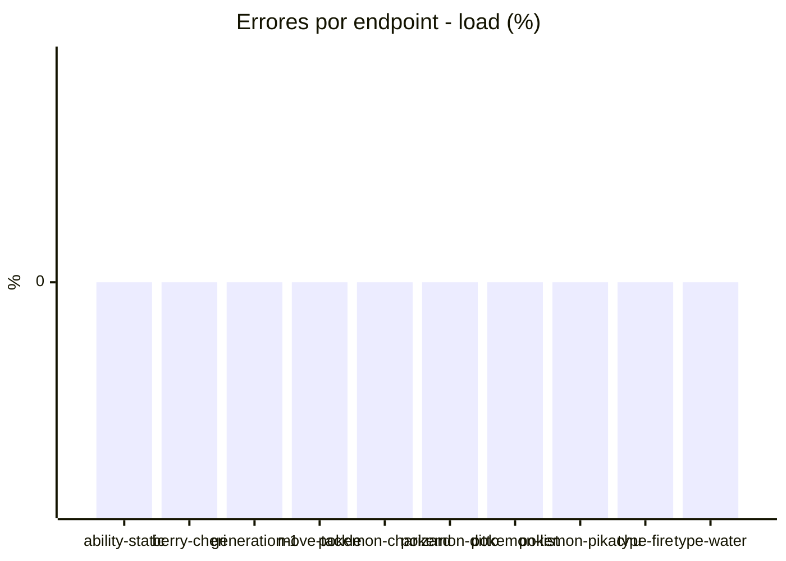
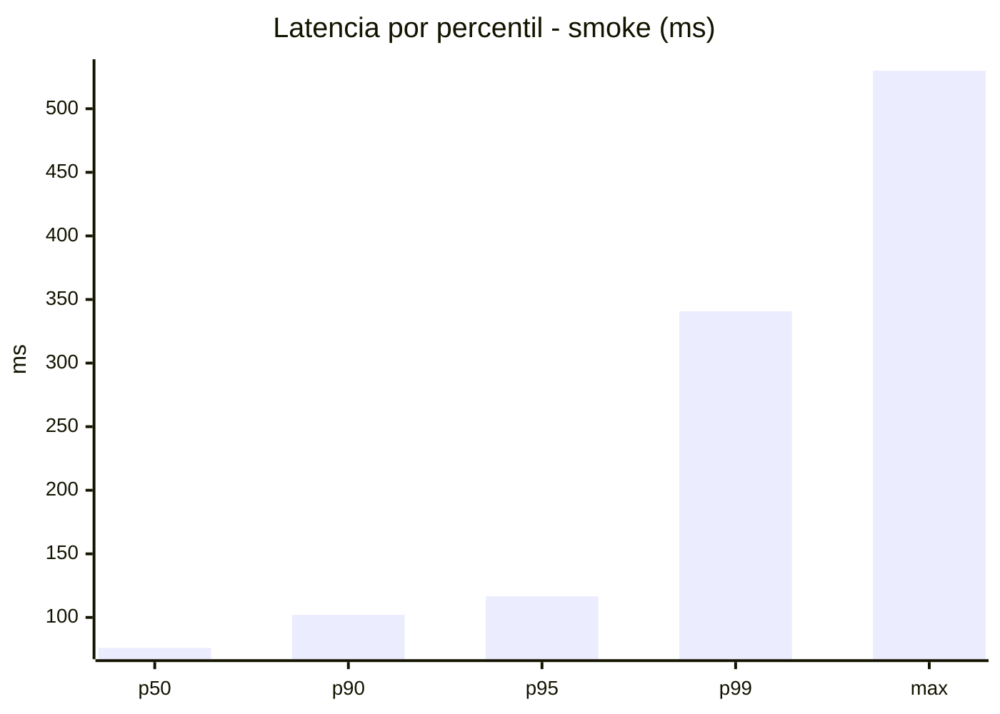
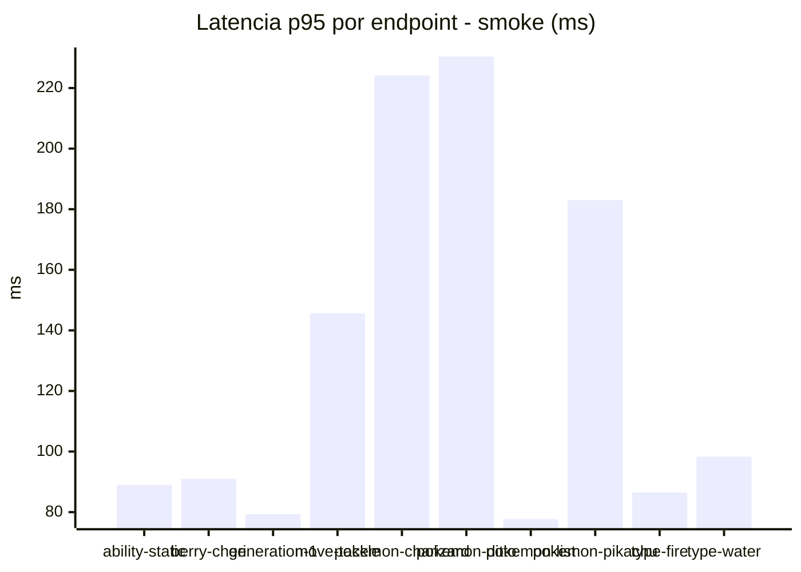
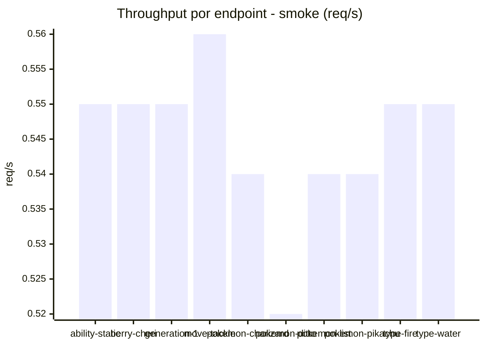

# Reporte de performance - PokeAPI

**Fecha:** 2026-08-31 19:24 UTC  
**Veredicto del agente:** `PASS`  
**Corrida:** [ver en GitHub Actions](https://github.com/lrbg/jmeter-pokeapi-lab/actions/runs/33430132260)  

## Validacion del agente de IA

PASS (fallback por umbrales)

- Error maximo: 0.0%
- p95 maximo: 116.6 ms

## Resultados

### Escenario: `load`

| Metrica | Valor |
| --- | --- |
| Muestras | 14217 |
| Errores | 0 (0.0%) |
| Latencia media | 69.7 ms |
| p50 / p90 / p95 / p99 | 68.0 / 83.0 / 100.0 / 160.0 ms |
| Min / Max | 46 / 515 ms |
| Throughput | 118.83 req/s |
| Duracion | 119.6 s |

Detalle por endpoint

| Endpoint | Muestras | Error % | avg | p95 | p99 | req/s |
| --- | --- | --- | --- | --- | --- | --- |
| ability-static | 1422 | 0.0% | 66.0 | 82.0 | 98.8 | 12.05 |
| berry-cheri | 1422 | 0.0% | 65.2 | 80.0 | 99.0 | 12.05 |
| generation-1 | 1421 | 0.0% | 66.6 | 83.0 | 135.0 | 12.07 |
| move-tackle | 1421 | 0.0% | 69.3 | 88.0 | 114.2 | 12.06 |
| pokemon-charizard | 1422 | 0.0% | 89.3 | 146.0 | 277.6 | 11.97 |
| pokemon-ditto | 1423 | 0.0% | 66.2 | 84.0 | 141.3 | 11.89 |
| pokemon-list | 1421 | 0.0% | 60.8 | 79.0 | 118.8 | 12.0 |
| pokemon-pikachu | 1422 | 0.0% | 83.9 | 119.0 | 245.9 | 11.94 |
| type-fire | 1422 | 0.0% | 65.7 | 82.0 | 125.9 | 12.03 |
| type-water | 1421 | 0.0% | 63.7 | 82.0 | 97.0 | 12.01 |

### Escenario: `smoke`

| Metrica | Valor |
| --- | --- |
| Muestras | 143 |
| Errores | 0 (0.0%) |
| Latencia media | 85.7 ms |
| p50 / p90 / p95 / p99 | 76.0 / 102.0 / 116.6 / 340.7 ms |
| Min / Max | 55 / 530 ms |
| Throughput | 4.87 req/s |
| Duracion | 29.4 s |

Detalle por endpoint

| Endpoint | Muestras | Error % | avg | p95 | p99 | req/s |
| --- | --- | --- | --- | --- | --- | --- |
| ability-static | 14 | 0.0% | 73.6 | 89.0 | 89.0 | 0.55 |
| berry-cheri | 14 | 0.0% | 72.7 | 91.0 | 111.8 | 0.55 |
| generation-1 | 14 | 0.0% | 69.4 | 79.3 | 79.9 | 0.55 |
| move-tackle | 14 | 0.0% | 87.1 | 145.6 | 216.3 | 0.56 |
| pokemon-charizard | 15 | 0.0% | 120.8 | 224.1 | 379.2 | 0.54 |
| pokemon-ditto | 15 | 0.0% | 102.3 | 230.4 | 470.1 | 0.52 |
| pokemon-list | 14 | 0.0% | 67.9 | 77.7 | 78.7 | 0.54 |
| pokemon-pikachu | 15 | 0.0% | 109.2 | 183.0 | 216.6 | 0.54 |
| type-fire | 14 | 0.0% | 75.1 | 86.5 | 91.7 | 0.55 |
| type-water | 14 | 0.0% | 73.1 | 98.3 | 98.9 | 0.55 |

