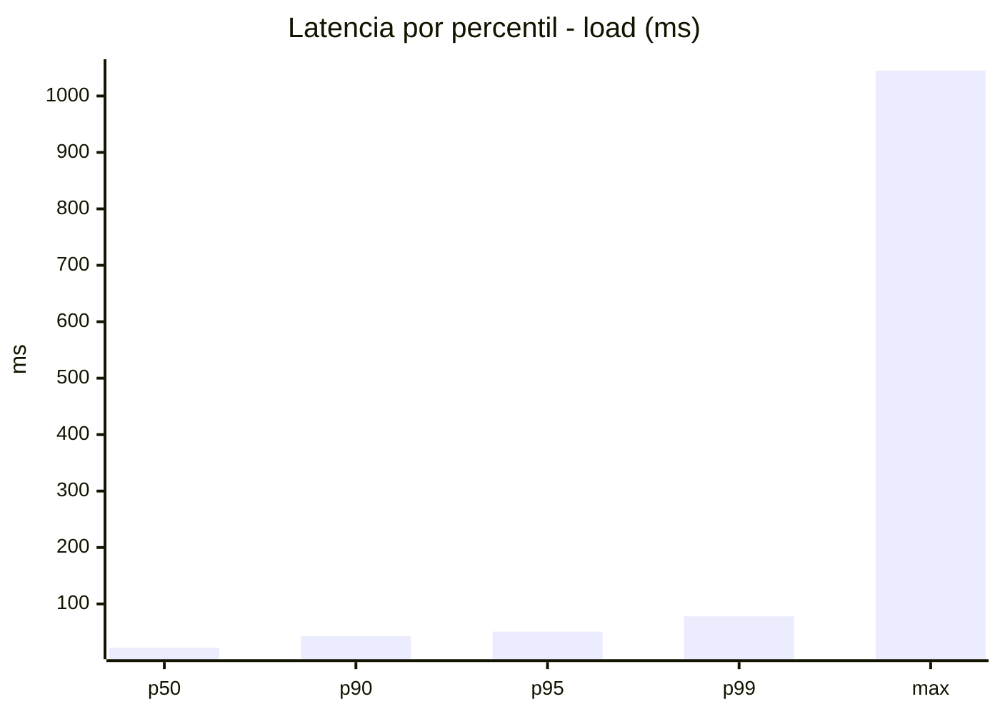
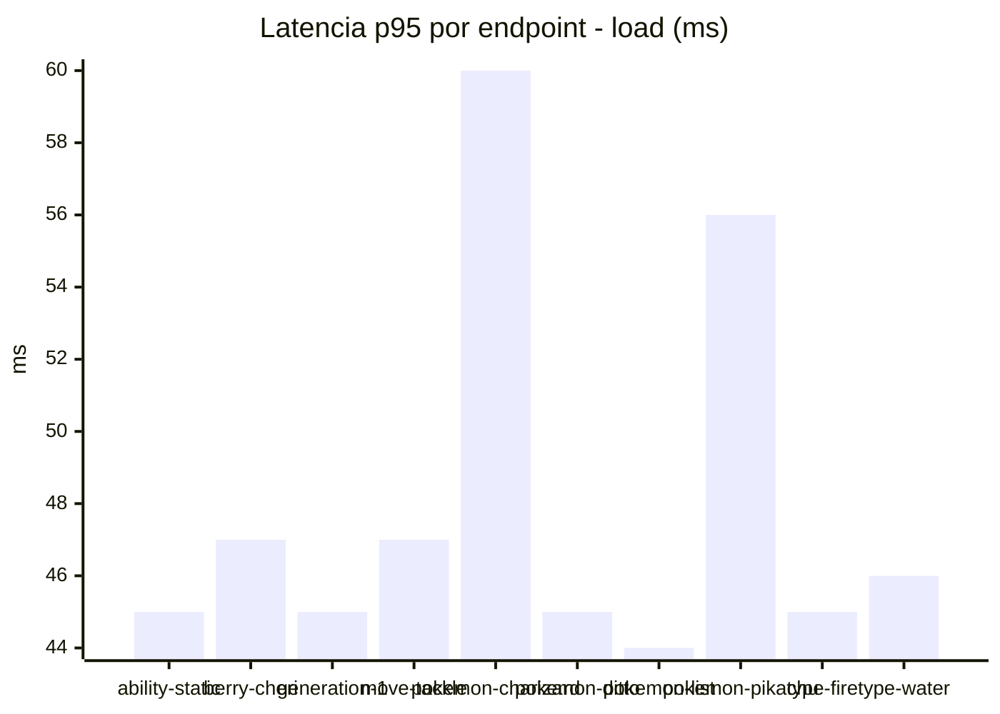
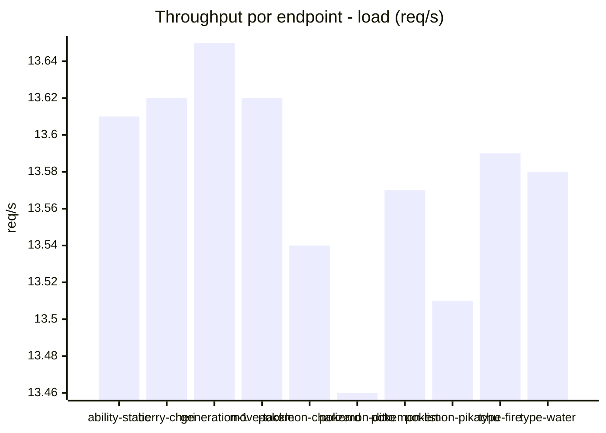
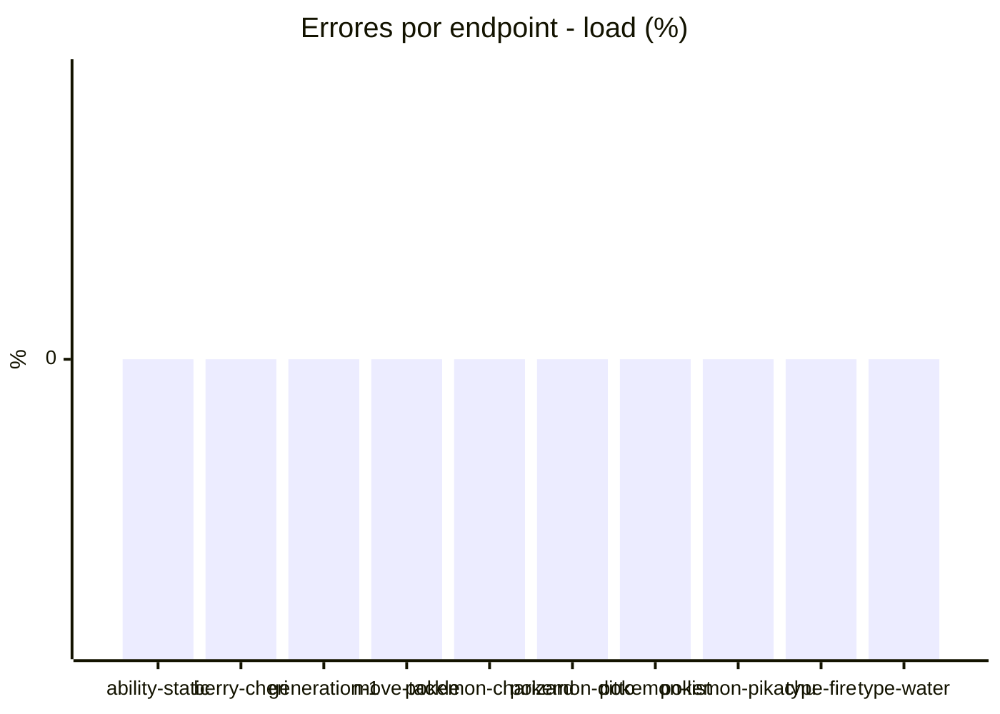
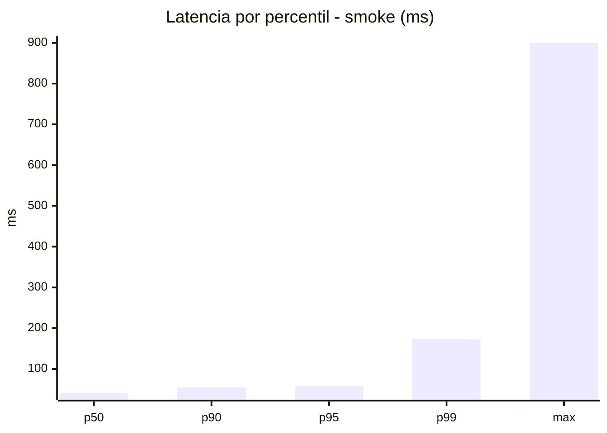
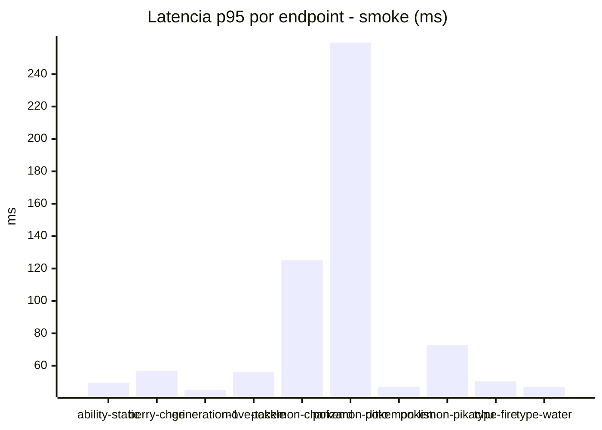
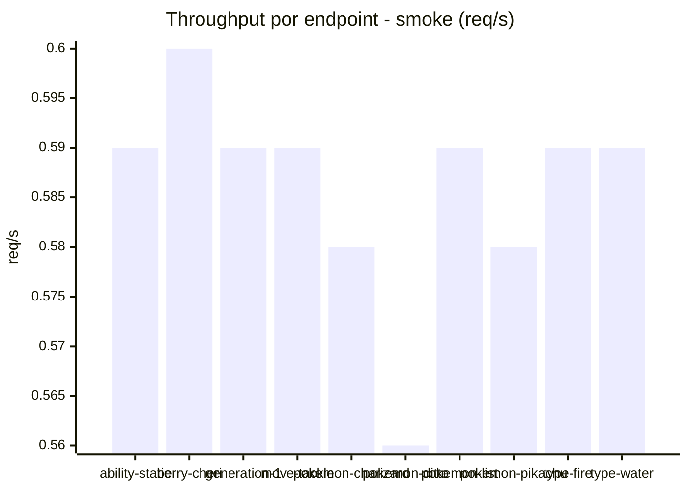

# Reporte de performance - PokeAPI

**Fecha:** 2026-09-01 17:10 UTC  
**Veredicto del agente:** `PASS`  
**Corrida:** [ver en GitHub Actions](https://github.com/lrbg/jmeter-pokeapi-lab/actions/runs/33535930786)  

## Validacion del agente de IA

PASS (fallback por umbrales)

- Error maximo: 0.0%
- p95 maximo: 57.4 ms

## Resultados

### Escenario: `load`

| Metrica | Valor |
| --- | --- |
| Muestras | 16082 |
| Errores | 0 (0.0%) |
| Latencia media | 26.7 ms |
| p50 / p90 / p95 / p99 | 22.0 / 43.0 / 51.0 / 78.0 ms |
| Min / Max | 6 / 1045 ms |
| Throughput | 134.53 req/s |
| Duracion | 119.5 s |

Detalle por endpoint

| Endpoint | Muestras | Error % | avg | p95 | p99 | req/s |
| --- | --- | --- | --- | --- | --- | --- |
| ability-static | 1608 | 0.0% | 25.8 | 45.0 | 66.7 | 13.61 |
| berry-cheri | 1608 | 0.0% | 26.8 | 47.0 | 91.9 | 13.62 |
| generation-1 | 1608 | 0.0% | 25.3 | 45.0 | 63.0 | 13.65 |
| move-tackle | 1608 | 0.0% | 26.5 | 47.0 | 69.0 | 13.62 |
| pokemon-charizard | 1608 | 0.0% | 31.3 | 60.0 | 101.9 | 13.54 |
| pokemon-ditto | 1608 | 0.0% | 25.9 | 45.0 | 67.0 | 13.46 |
| pokemon-list | 1608 | 0.0% | 24.0 | 44.0 | 69.0 | 13.57 |
| pokemon-pikachu | 1608 | 0.0% | 30.3 | 56.0 | 107.5 | 13.51 |
| type-fire | 1609 | 0.0% | 25.2 | 45.0 | 67.8 | 13.59 |
| type-water | 1609 | 0.0% | 25.6 | 46.0 | 68.9 | 13.58 |

### Escenario: `smoke`

| Metrica | Valor |
| --- | --- |
| Muestras | 152 |
| Errores | 0 (0.0%) |
| Latencia media | 46.2 ms |
| p50 / p90 / p95 / p99 | 41.0 / 55.0 / 57.4 / 172.9 ms |
| Min / Max | 16 / 900 ms |
| Throughput | 5.24 req/s |
| Duracion | 29.0 s |

Detalle por endpoint

| Endpoint | Muestras | Error % | avg | p95 | p99 | req/s |
| --- | --- | --- | --- | --- | --- | --- |
| ability-static | 15 | 0.0% | 36.1 | 49.4 | 53.9 | 0.59 |
| berry-cheri | 15 | 0.0% | 41.3 | 56.9 | 75.4 | 0.6 |
| generation-1 | 15 | 0.0% | 34.8 | 44.9 | 46.6 | 0.59 |
| move-tackle | 15 | 0.0% | 39 | 56.1 | 65.6 | 0.59 |
| pokemon-charizard | 15 | 0.0% | 61.6 | 125.1 | 207.4 | 0.58 |
| pokemon-ditto | 16 | 0.0% | 91.2 | 259.5 | 771.9 | 0.56 |
| pokemon-list | 15 | 0.0% | 35.5 | 47.0 | 47.0 | 0.59 |
| pokemon-pikachu | 16 | 0.0% | 47.9 | 72.8 | 110.5 | 0.58 |
| type-fire | 15 | 0.0% | 36.1 | 50.3 | 50.9 | 0.59 |
| type-water | 15 | 0.0% | 35.2 | 46.9 | 48.6 | 0.59 |

