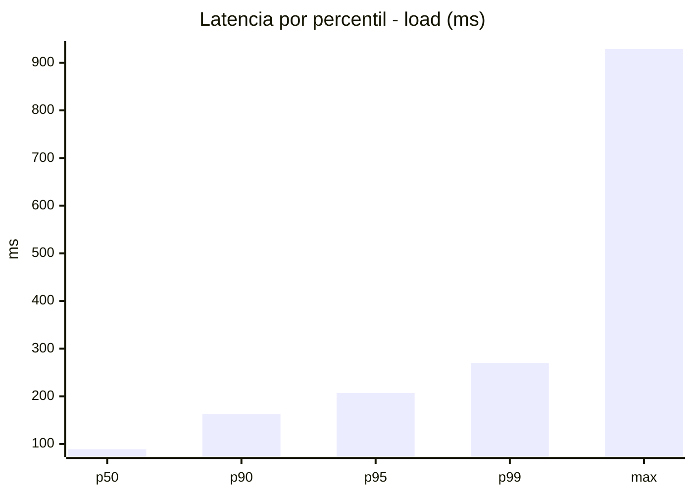
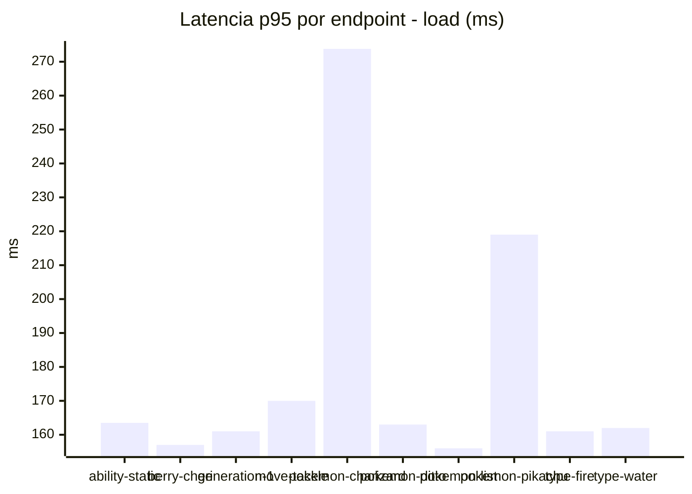
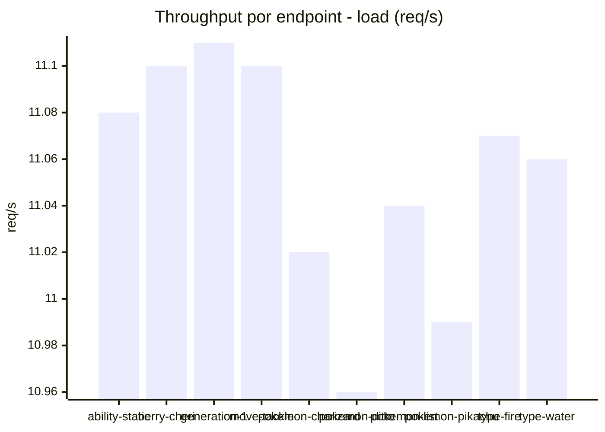
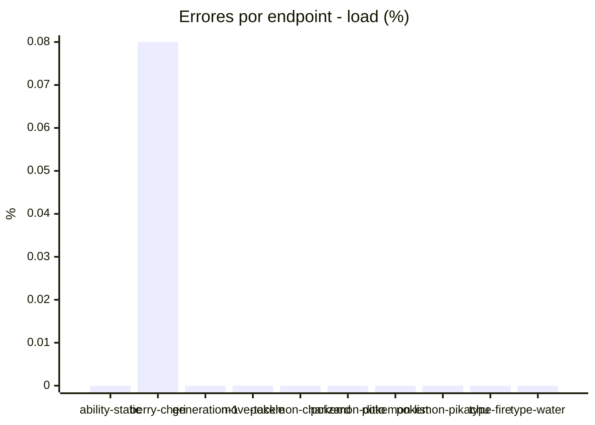
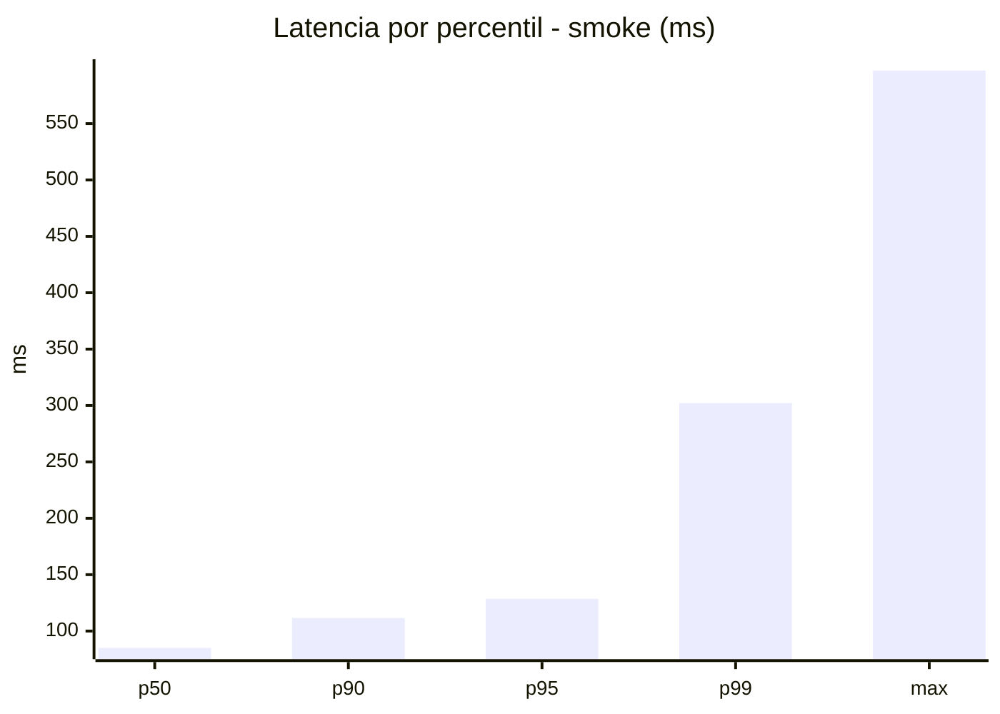
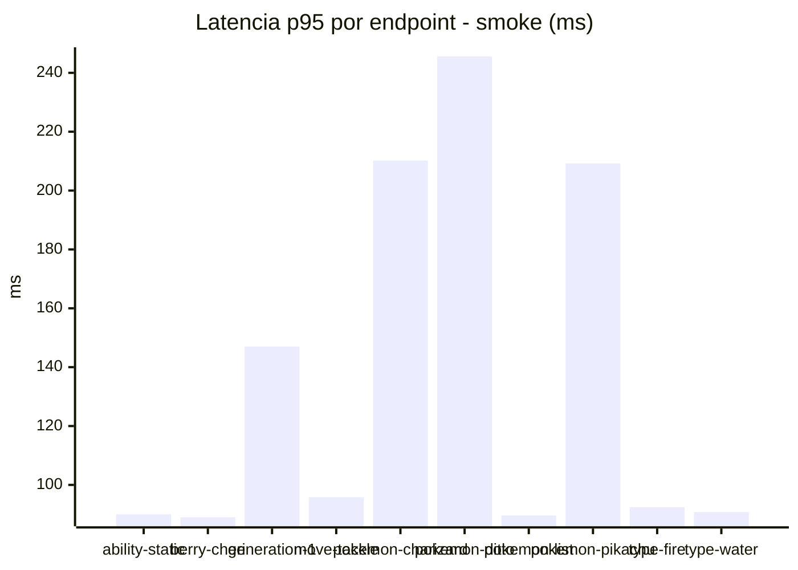
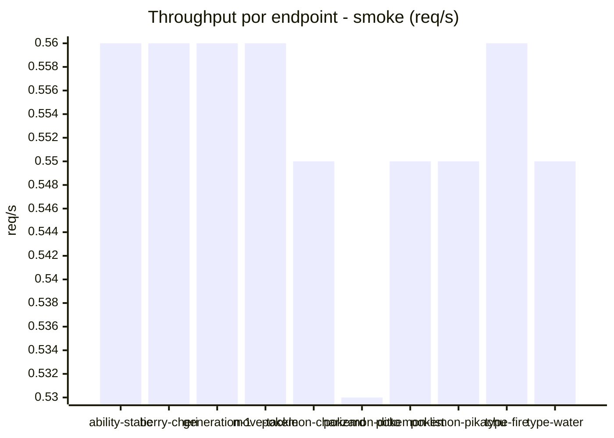
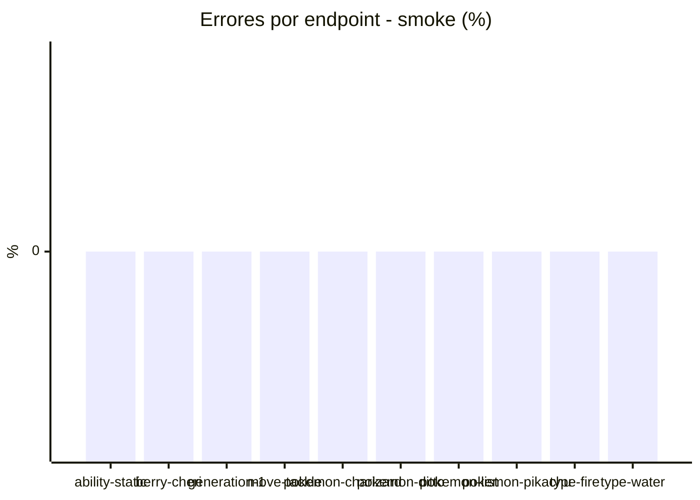

# Reporte de performance - PokeAPI

**Fecha:** 2026-09-02 17:00 UTC  
**Veredicto del agente:** `PASS`  
**Corrida:** [ver en GitHub Actions](https://github.com/lrbg/jmeter-pokeapi-lab/actions/runs/33658108586)  

## Validacion del agente de IA

PASS (fallback por umbrales)

- Error maximo: 0.01%
- p95 maximo: 207.0 ms

## Resultados

### Escenario: `load`

| Metrica | Valor |
| --- | --- |
| Muestras | 13097 |
| Errores | 1 (0.01%) |
| Latencia media | 101.2 ms |
| p50 / p90 / p95 / p99 | 89.0 / 163.0 / 207.0 / 270.0 ms |
| Min / Max | 6 / 929 ms |
| Throughput | 109.43 req/s |
| Duracion | 119.7 s |

Detalle por endpoint

| Endpoint | Muestras | Error % | avg | p95 | p99 | req/s |
| --- | --- | --- | --- | --- | --- | --- |
| ability-static | 1310 | 0.0% | 95.5 | 163.5 | 184.8 | 11.08 |
| berry-cheri | 1309 | 0.08% | 92.9 | 157.0 | 202.6 | 11.1 |
| generation-1 | 1309 | 0.0% | 92.3 | 161.0 | 173.0 | 11.11 |
| move-tackle | 1309 | 0.0% | 96.7 | 170.0 | 191.8 | 11.1 |
| pokemon-charizard | 1310 | 0.0% | 141.4 | 273.8 | 537.2 | 11.02 |
| pokemon-ditto | 1310 | 0.0% | 92.9 | 163.0 | 171.9 | 10.96 |
| pokemon-list | 1310 | 0.0% | 89.3 | 156.0 | 167.7 | 11.04 |
| pokemon-pikachu | 1310 | 0.0% | 124.6 | 219.0 | 465.6 | 10.99 |
| type-fire | 1310 | 0.0% | 93.3 | 161.0 | 178.9 | 11.07 |
| type-water | 1310 | 0.0% | 93.2 | 162.0 | 174.0 | 11.06 |

### Escenario: `smoke`

| Metrica | Valor |
| --- | --- |
| Muestras | 145 |
| Errores | 0 (0.0%) |
| Latencia media | 76.2 ms |
| p50 / p90 / p95 / p99 | 85.0 / 111.6 / 128.6 / 302.2 ms |
| Min / Max | 11 / 597 ms |
| Throughput | 4.97 req/s |
| Duracion | 29.2 s |

Detalle por endpoint

| Endpoint | Muestras | Error % | avg | p95 | p99 | req/s |
| --- | --- | --- | --- | --- | --- | --- |
| ability-static | 14 | 0.0% | 67.6 | 90.0 | 90.0 | 0.56 |
| berry-cheri | 14 | 0.0% | 58.8 | 89.0 | 90.6 | 0.56 |
| generation-1 | 14 | 0.0% | 82.4 | 147.0 | 230.2 | 0.56 |
| move-tackle | 14 | 0.0% | 64.6 | 95.8 | 100.0 | 0.56 |
| pokemon-charizard | 15 | 0.0% | 98.8 | 210.2 | 296.4 | 0.55 |
| pokemon-ditto | 15 | 0.0% | 95.7 | 245.6 | 526.7 | 0.53 |
| pokemon-list | 15 | 0.0% | 68.1 | 89.6 | 90.7 | 0.55 |
| pokemon-pikachu | 15 | 0.0% | 106 | 209.2 | 267.4 | 0.55 |
| type-fire | 14 | 0.0% | 53.9 | 92.4 | 94.5 | 0.56 |
| type-water | 15 | 0.0% | 63 | 90.8 | 94.2 | 0.55 |

