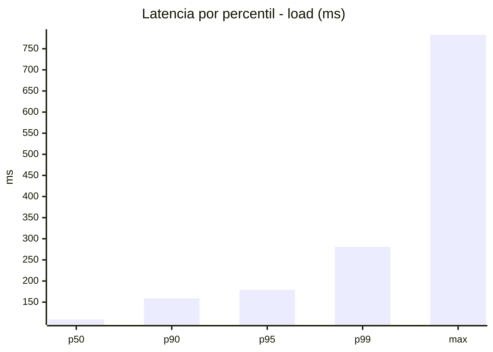
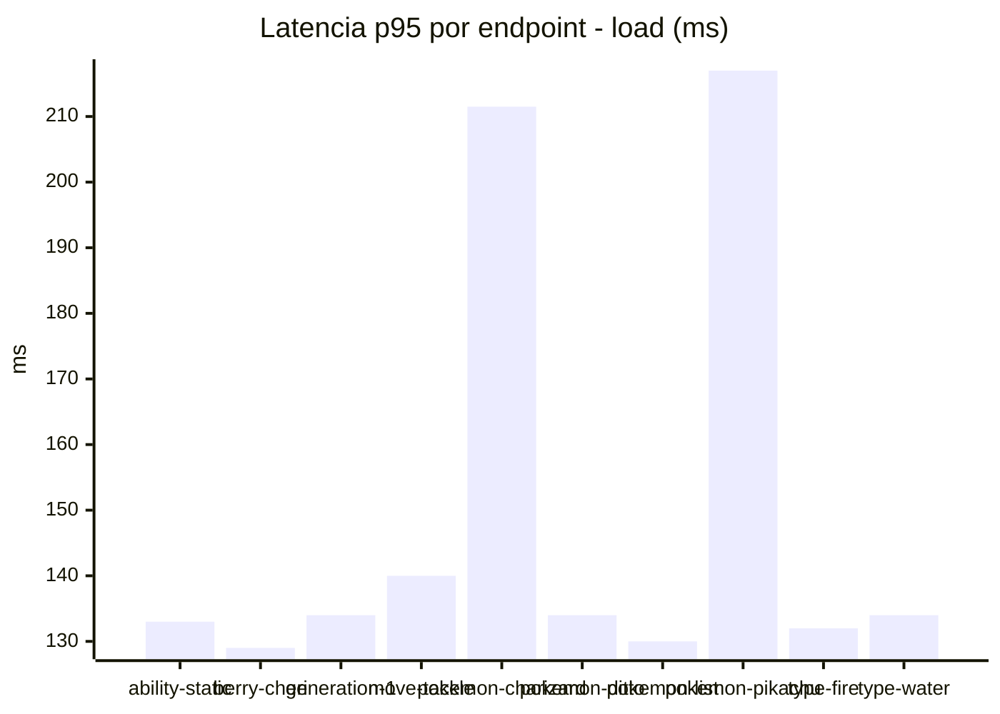
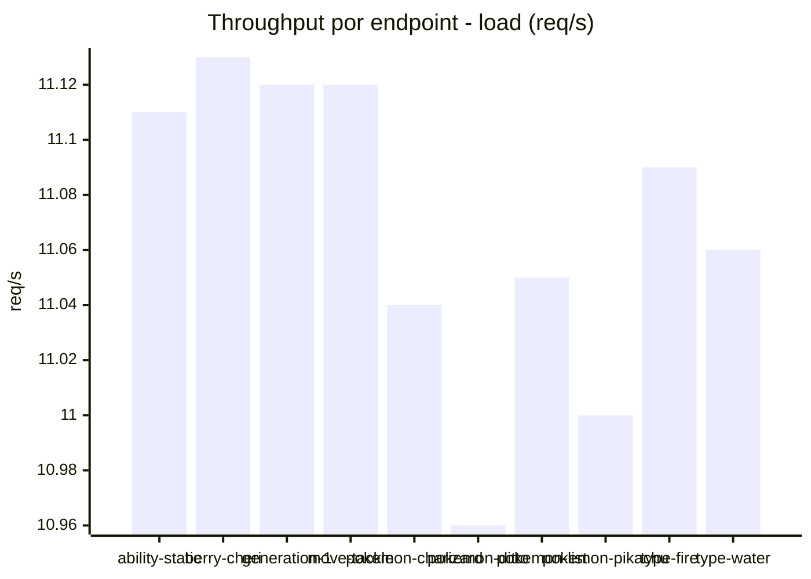
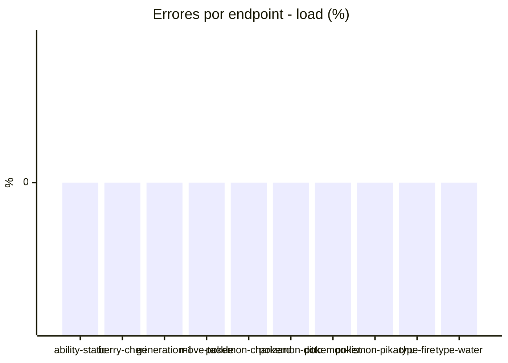
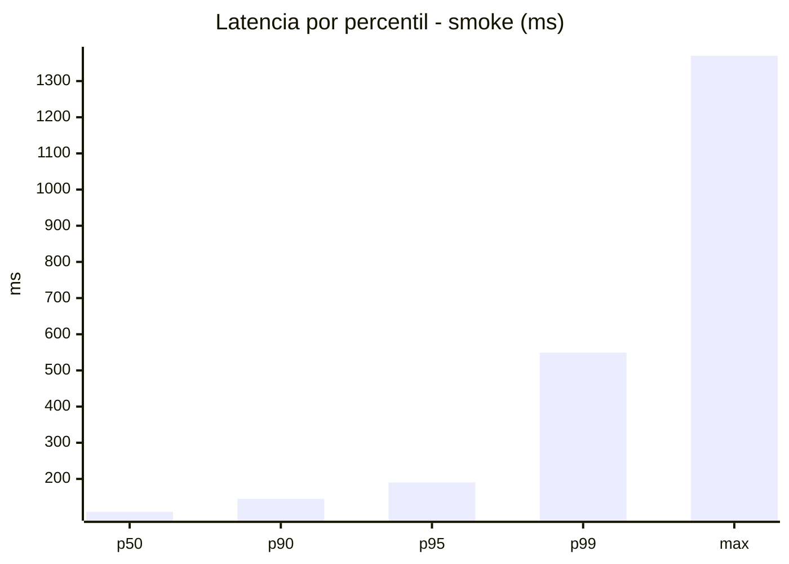
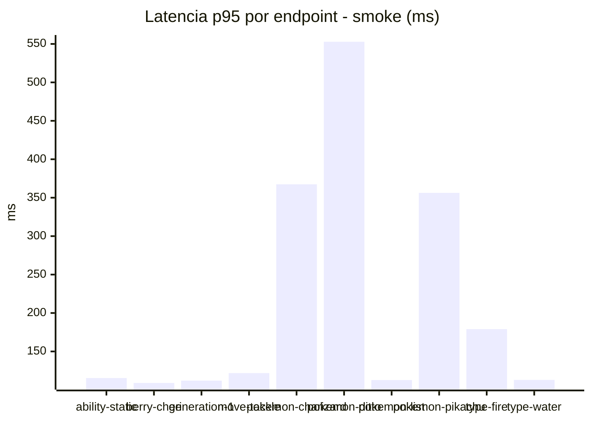
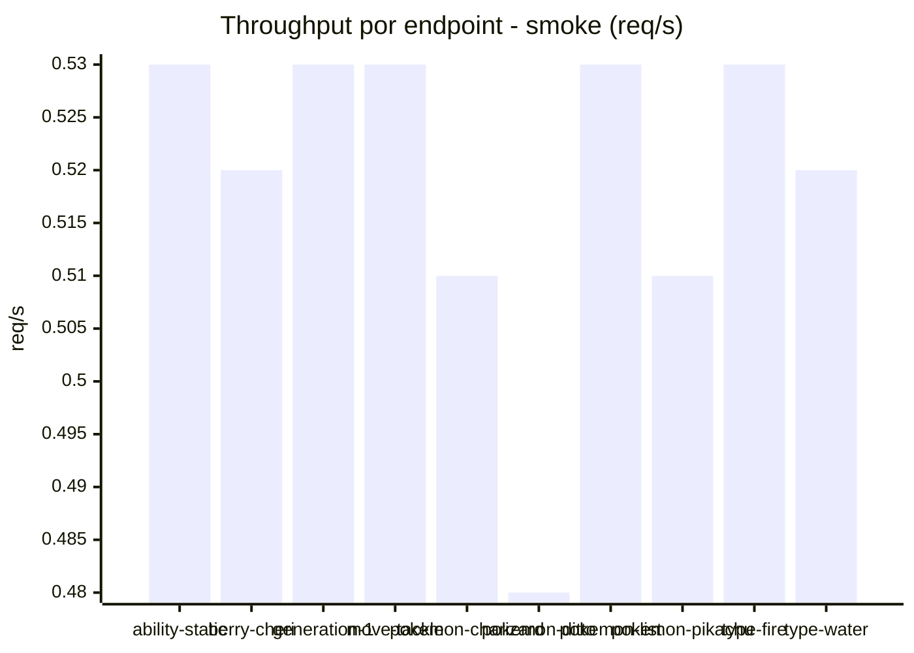

# Reporte de performance - PokeAPI

**Fecha:** 2026-09-03 16:56 UTC  
**Veredicto del agente:** `PASS`  
**Corrida:** [ver en GitHub Actions](https://github.com/lrbg/jmeter-pokeapi-lab/actions/runs/33781345572)  

## Validacion del agente de IA

PASS (fallback por umbrales)

- Error maximo: 0.0%
- p95 maximo: 190.3 ms

## Resultados

### Escenario: `load`

| Metrica | Valor |
| --- | --- |
| Muestras | 13111 |
| Errores | 0 (0.0%) |
| Latencia media | 100.8 ms |
| p50 / p90 / p95 / p99 | 109.0 / 159.0 / 179.0 / 280.9 ms |
| Min / Max | 19 / 783 ms |
| Throughput | 109.54 req/s |
| Duracion | 119.7 s |

Detalle por endpoint

| Endpoint | Muestras | Error % | avg | p95 | p99 | req/s |
| --- | --- | --- | --- | --- | --- | --- |
| ability-static | 1311 | 0.0% | 89.4 | 133.0 | 141.9 | 11.11 |
| berry-cheri | 1311 | 0.0% | 87.4 | 129.0 | 144.8 | 11.13 |
| generation-1 | 1311 | 0.0% | 91.9 | 134.0 | 142.0 | 11.12 |
| move-tackle | 1311 | 0.0% | 97.4 | 140.0 | 156.8 | 11.12 |
| pokemon-charizard | 1311 | 0.0% | 140.6 | 211.5 | 424.4 | 11.04 |
| pokemon-ditto | 1312 | 0.0% | 95.6 | 134.0 | 260.1 | 10.96 |
| pokemon-list | 1311 | 0.0% | 89.5 | 130.0 | 137.9 | 11.05 |
| pokemon-pikachu | 1311 | 0.0% | 135.5 | 217.0 | 414.9 | 11.0 |
| type-fire | 1311 | 0.0% | 88.8 | 132.0 | 140.9 | 11.09 |
| type-water | 1311 | 0.0% | 92.2 | 134.0 | 149.7 | 11.06 |

### Escenario: `smoke`

| Metrica | Valor |
| --- | --- |
| Muestras | 132 |
| Errores | 0 (0.0%) |
| Latencia media | 130.2 ms |
| p50 / p90 / p95 / p99 | 109.0 / 145.0 / 190.3 / 549.1 ms |
| Min / Max | 90 / 1370 ms |
| Throughput | 4.55 req/s |
| Duracion | 29.0 s |

Detalle por endpoint

| Endpoint | Muestras | Error % | avg | p95 | p99 | req/s |
| --- | --- | --- | --- | --- | --- | --- |
| ability-static | 13 | 0.0% | 103.7 | 115.4 | 118.3 | 0.53 |
| berry-cheri | 13 | 0.0% | 102.1 | 109.0 | 109.0 | 0.52 |
| generation-1 | 13 | 0.0% | 102.3 | 112.0 | 112.0 | 0.53 |
| move-tackle | 13 | 0.0% | 110.6 | 121.8 | 125.2 | 0.53 |
| pokemon-charizard | 13 | 0.0% | 183.5 | 367.4 | 391.9 | 0.51 |
| pokemon-ditto | 14 | 0.0% | 193.9 | 552.9 | 1206.6 | 0.48 |
| pokemon-list | 13 | 0.0% | 102.9 | 112.8 | 113.8 | 0.53 |
| pokemon-pikachu | 14 | 0.0% | 173.3 | 356.3 | 564.9 | 0.51 |
| type-fire | 13 | 0.0% | 117.3 | 179.0 | 258.2 | 0.53 |
| type-water | 13 | 0.0% | 104.1 | 113.0 | 115.4 | 0.52 |

