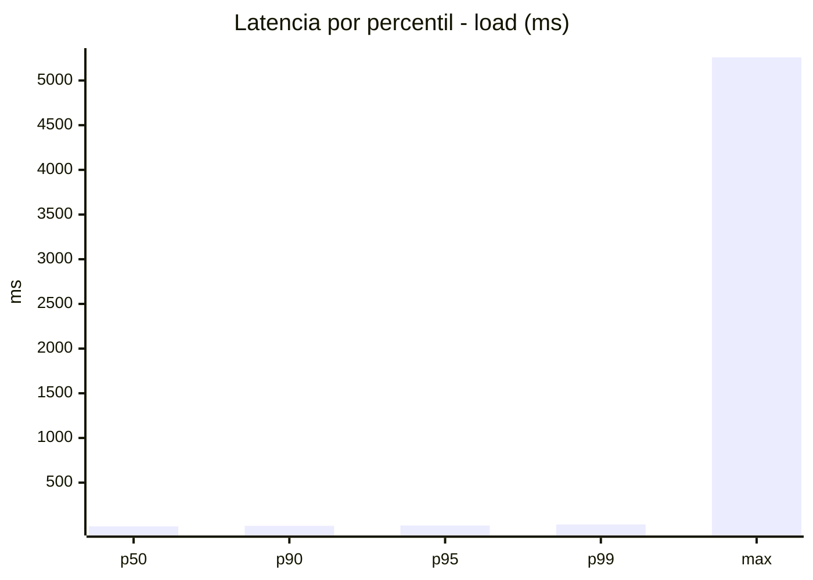
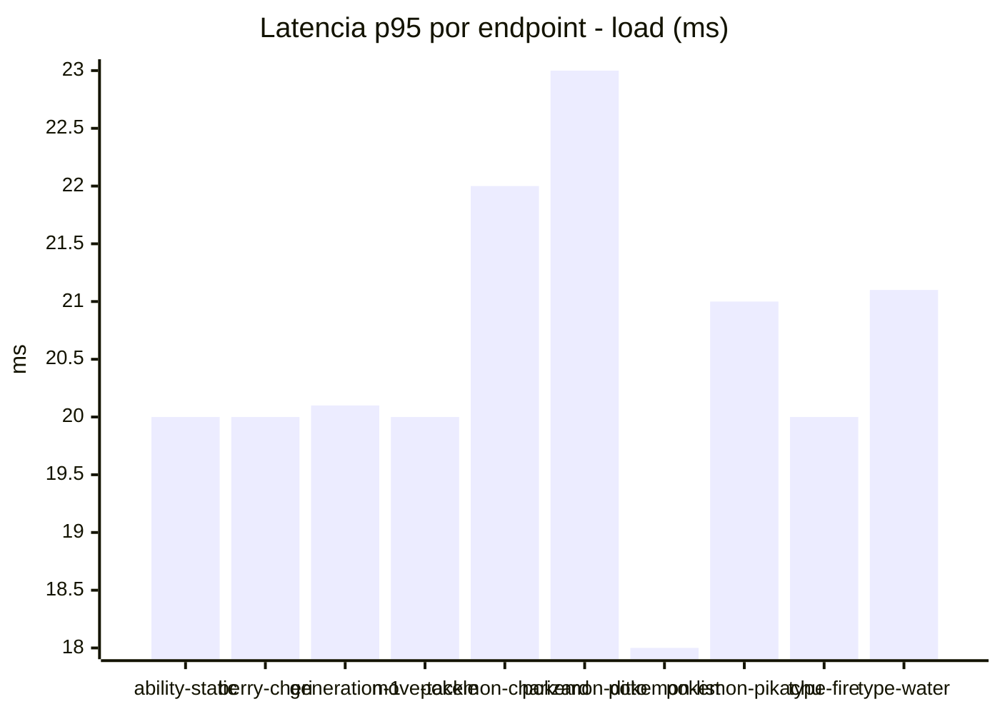
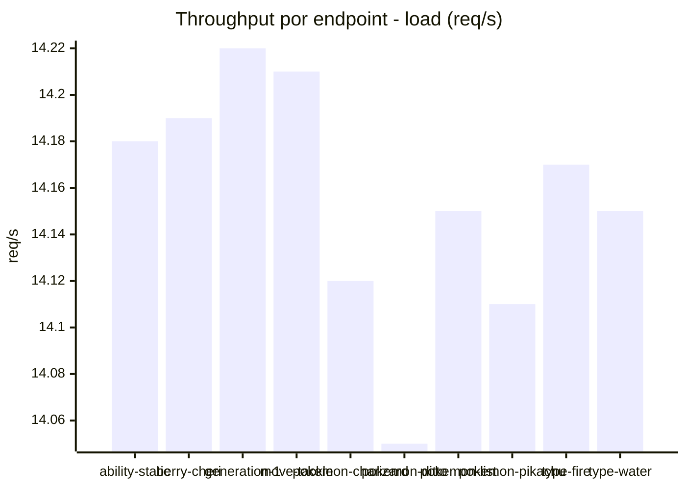
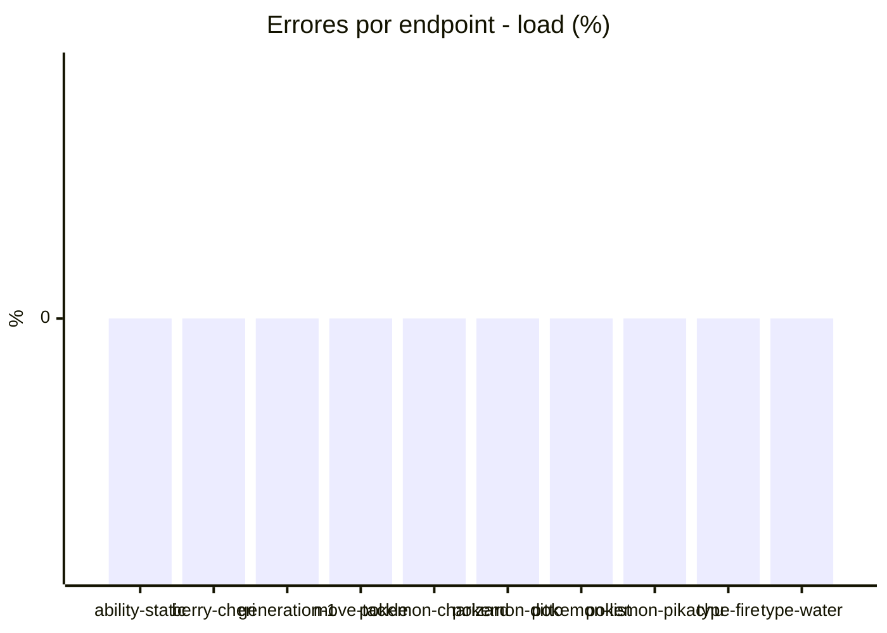
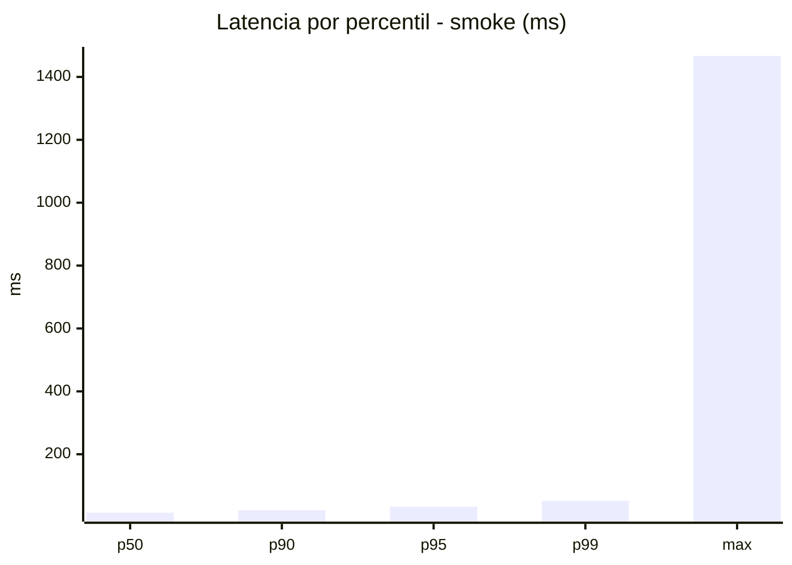
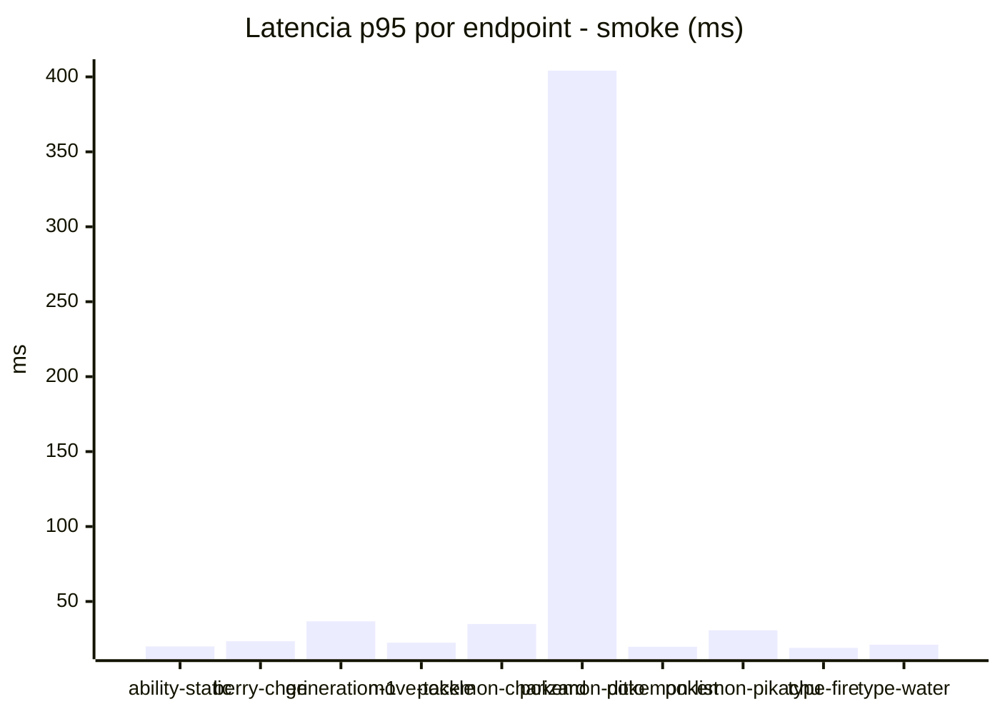
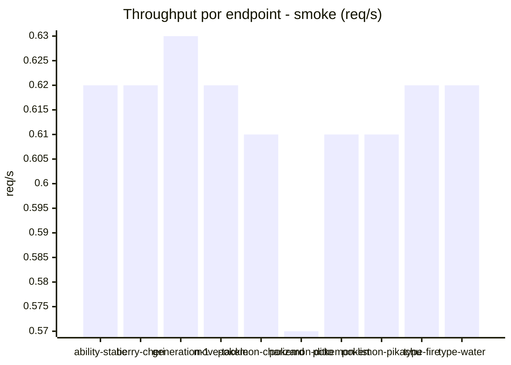

# Reporte de performance - PokeAPI

**Fecha:** 2026-09-04 16:45 UTC  
**Veredicto del agente:** `PASS`  
**Corrida:** [ver en GitHub Actions](https://github.com/lrbg/jmeter-pokeapi-lab/actions/runs/33896612922)  

## Validacion del agente de IA

PASS (fallback por umbrales)

- Error maximo: 0.0%
- p95 maximo: 33.3 ms

## Resultados

### Escenario: `load`

| Metrica | Valor |
| --- | --- |
| Muestras | 16786 |
| Errores | 0 (0.0%) |
| Latencia media | 12.9 ms |
| p50 / p90 / p95 / p99 | 11.0 / 17.0 / 21.0 / 32.0 ms |
| Min / Max | 6 / 5259 ms |
| Throughput | 140.39 req/s |
| Duracion | 119.6 s |

Detalle por endpoint

| Endpoint | Muestras | Error % | avg | p95 | p99 | req/s |
| --- | --- | --- | --- | --- | --- | --- |
| ability-static | 1678 | 0.0% | 12.5 | 20.0 | 29.0 | 14.18 |
| berry-cheri | 1678 | 0.0% | 12.0 | 20.0 | 30.0 | 14.19 |
| generation-1 | 1678 | 0.0% | 12.2 | 20.1 | 30.0 | 14.22 |
| move-tackle | 1679 | 0.0% | 12.5 | 20.0 | 31.2 | 14.21 |
| pokemon-charizard | 1679 | 0.0% | 13.1 | 22.0 | 33.0 | 14.12 |
| pokemon-ditto | 1679 | 0.0% | 13.3 | 23.0 | 36.2 | 14.05 |
| pokemon-list | 1680 | 0.0% | 11.9 | 18.0 | 27.0 | 14.15 |
| pokemon-pikachu | 1679 | 0.0% | 16.3 | 21.0 | 35.2 | 14.11 |
| type-fire | 1678 | 0.0% | 12.3 | 20.0 | 32.0 | 14.17 |
| type-water | 1678 | 0.0% | 13.1 | 21.1 | 31.0 | 14.15 |

### Escenario: `smoke`

| Metrica | Valor |
| --- | --- |
| Muestras | 158 |
| Errores | 0 (0.0%) |
| Latencia media | 25.3 ms |
| p50 / p90 / p95 / p99 | 14.0 / 22.0 / 33.3 / 51.7 ms |
| Min / Max | 9 / 1467 ms |
| Throughput | 5.45 req/s |
| Duracion | 29.0 s |

Detalle por endpoint

| Endpoint | Muestras | Error % | avg | p95 | p99 | req/s |
| --- | --- | --- | --- | --- | --- | --- |
| ability-static | 16 | 0.0% | 14.2 | 20.0 | 24.8 | 0.62 |
| berry-cheri | 16 | 0.0% | 14.4 | 23.5 | 34.3 | 0.62 |
| generation-1 | 15 | 0.0% | 16.5 | 36.8 | 40.2 | 0.63 |
| move-tackle | 15 | 0.0% | 15.7 | 22.5 | 30.9 | 0.62 |
| pokemon-charizard | 16 | 0.0% | 22.2 | 35.0 | 35.0 | 0.61 |
| pokemon-ditto | 16 | 0.0% | 106.9 | 404.2 | 1254.4 | 0.57 |
| pokemon-list | 16 | 0.0% | 13.8 | 19.8 | 21.5 | 0.61 |
| pokemon-pikachu | 16 | 0.0% | 19.8 | 30.8 | 49.3 | 0.61 |
| type-fire | 16 | 0.0% | 13.8 | 19.0 | 19.0 | 0.62 |
| type-water | 16 | 0.0% | 14.6 | 21.2 | 24.2 | 0.62 |

