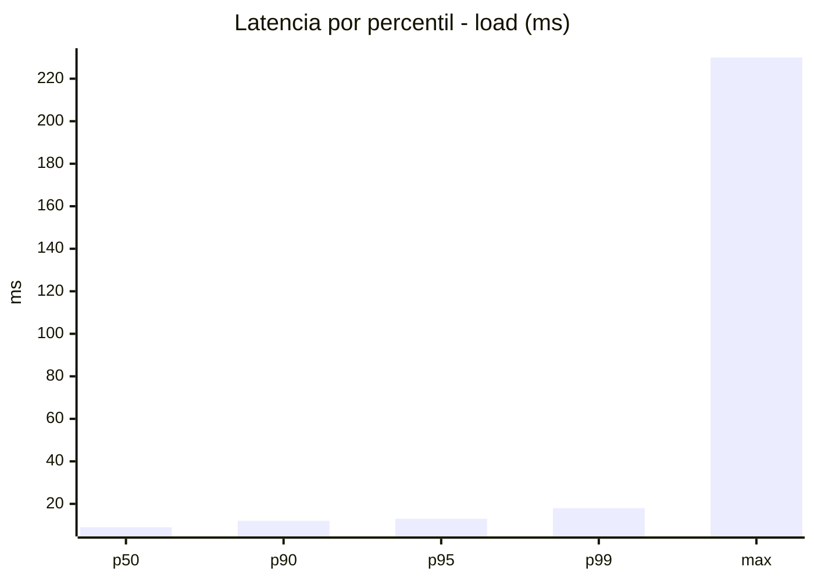
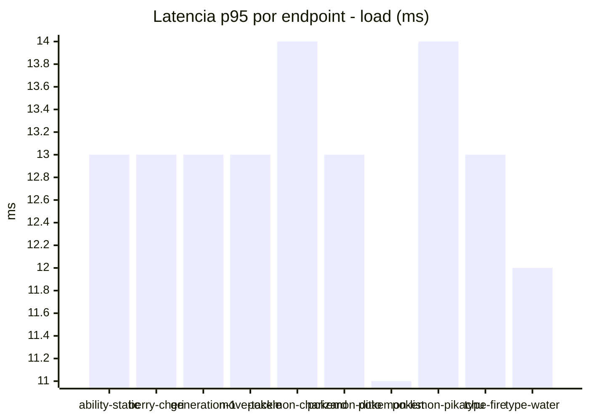
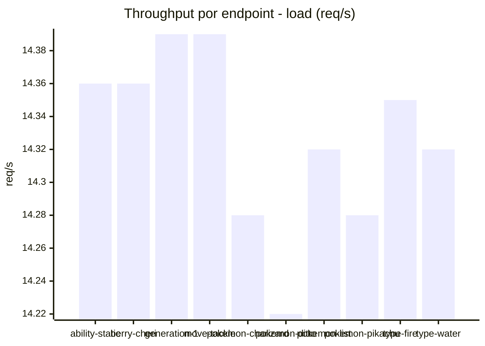
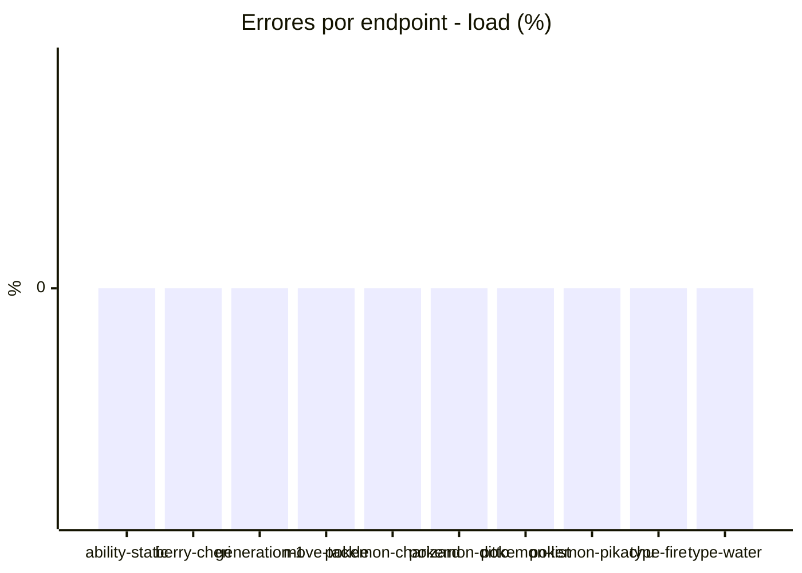
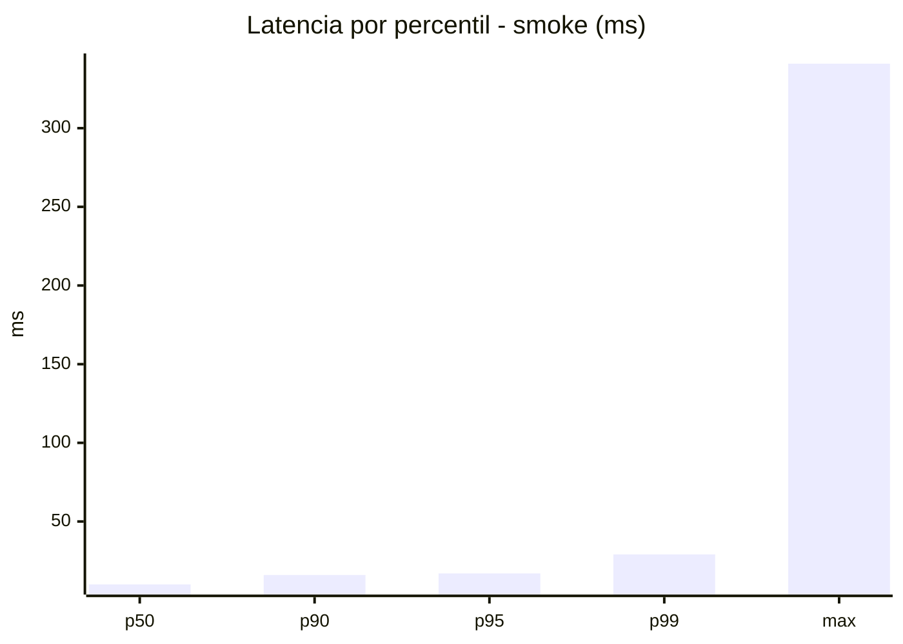
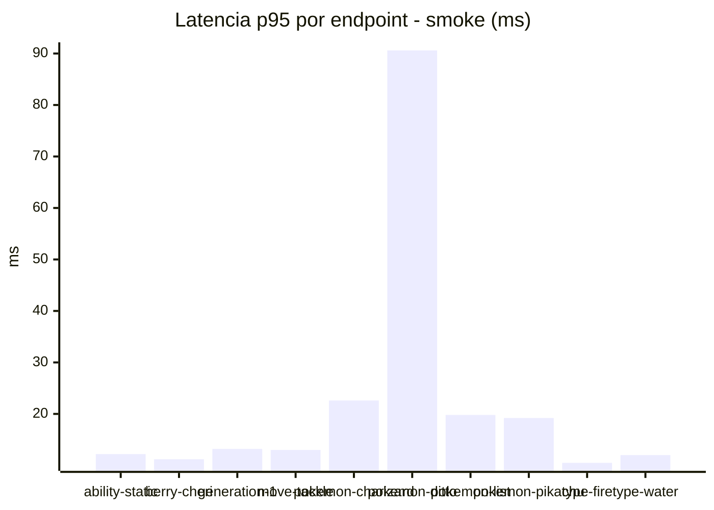
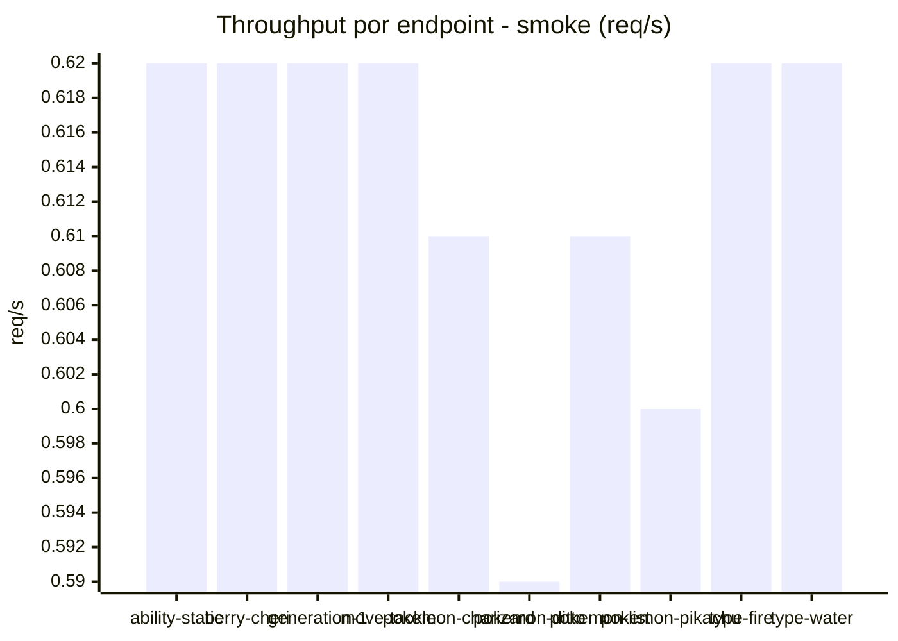

# Reporte de performance - PokeAPI

**Fecha:** 2026-09-05 15:48 UTC  
**Veredicto del agente:** `PASS`  
**Corrida:** [ver en GitHub Actions](https://github.com/lrbg/jmeter-pokeapi-lab/actions/runs/33975762063)  

## Validacion del agente de IA

PASS (fallback por umbrales)

- Error maximo: 0.0%
- p95 maximo: 17.0 ms

## Resultados

### Escenario: `load`

| Metrica | Valor |
| --- | --- |
| Muestras | 16999 |
| Errores | 0 (0.0%) |
| Latencia media | 9.1 ms |
| p50 / p90 / p95 / p99 | 9.0 / 12.0 / 13.0 / 18.0 ms |
| Min / Max | 5 / 230 ms |
| Throughput | 142.11 req/s |
| Duracion | 119.6 s |

Detalle por endpoint

| Endpoint | Muestras | Error % | avg | p95 | p99 | req/s |
| --- | --- | --- | --- | --- | --- | --- |
| ability-static | 1699 | 0.0% | 8.9 | 13.0 | 17.0 | 14.36 |
| berry-cheri | 1700 | 0.0% | 8.8 | 13.0 | 18.0 | 14.36 |
| generation-1 | 1699 | 0.0% | 9.1 | 13.0 | 19.0 | 14.39 |
| move-tackle | 1699 | 0.0% | 9.1 | 13.0 | 18.0 | 14.39 |
| pokemon-charizard | 1701 | 0.0% | 10.1 | 14.0 | 19.0 | 14.28 |
| pokemon-ditto | 1701 | 0.0% | 9.0 | 13.0 | 18.0 | 14.22 |
| pokemon-list | 1701 | 0.0% | 8.3 | 11.0 | 15.0 | 14.32 |
| pokemon-pikachu | 1700 | 0.0% | 9.8 | 14.0 | 24.0 | 14.28 |
| type-fire | 1699 | 0.0% | 9.0 | 13.0 | 18.0 | 14.35 |
| type-water | 1700 | 0.0% | 8.9 | 12.0 | 16.0 | 14.32 |

### Escenario: `smoke`

| Metrica | Valor |
| --- | --- |
| Muestras | 163 |
| Errores | 0 (0.0%) |
| Latencia media | 13.4 ms |
| p50 / p90 / p95 / p99 | 10.0 / 16.0 / 17.0 / 29.1 ms |
| Min / Max | 7 / 341 ms |
| Throughput | 5.57 req/s |
| Duracion | 29.3 s |

Detalle por endpoint

| Endpoint | Muestras | Error % | avg | p95 | p99 | req/s |
| --- | --- | --- | --- | --- | --- | --- |
| ability-static | 16 | 0.0% | 9.9 | 12.2 | 12.8 | 0.62 |
| berry-cheri | 16 | 0.0% | 9.8 | 11.2 | 11.8 | 0.62 |
| generation-1 | 16 | 0.0% | 9.9 | 13.2 | 13.8 | 0.62 |
| move-tackle | 16 | 0.0% | 10.6 | 13.0 | 13.0 | 0.62 |
| pokemon-charizard | 17 | 0.0% | 16.9 | 22.6 | 24.5 | 0.61 |
| pokemon-ditto | 17 | 0.0% | 30.5 | 90.6 | 290.9 | 0.59 |
| pokemon-list | 16 | 0.0% | 11.1 | 19.8 | 28.7 | 0.61 |
| pokemon-pikachu | 17 | 0.0% | 14.8 | 19.2 | 26.2 | 0.6 |
| type-fire | 16 | 0.0% | 9.6 | 10.5 | 11.7 | 0.62 |
| type-water | 16 | 0.0% | 9.6 | 12.0 | 12.0 | 0.62 |

