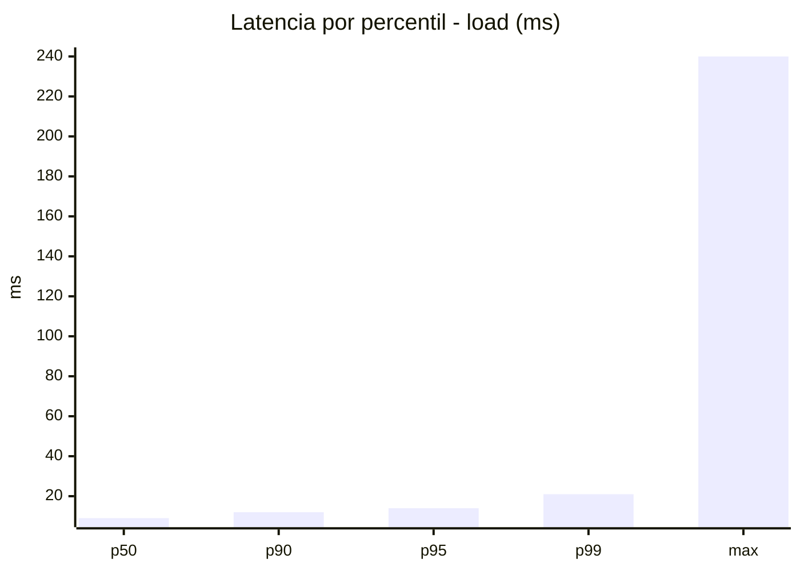
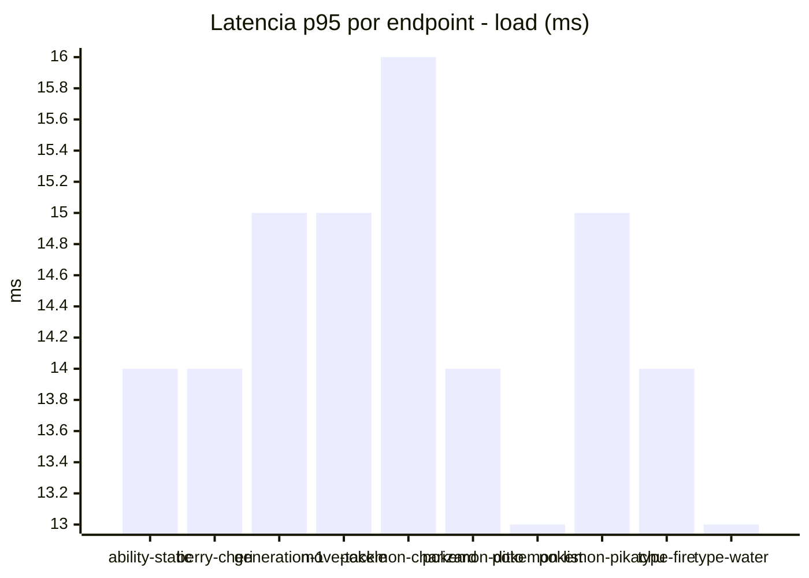
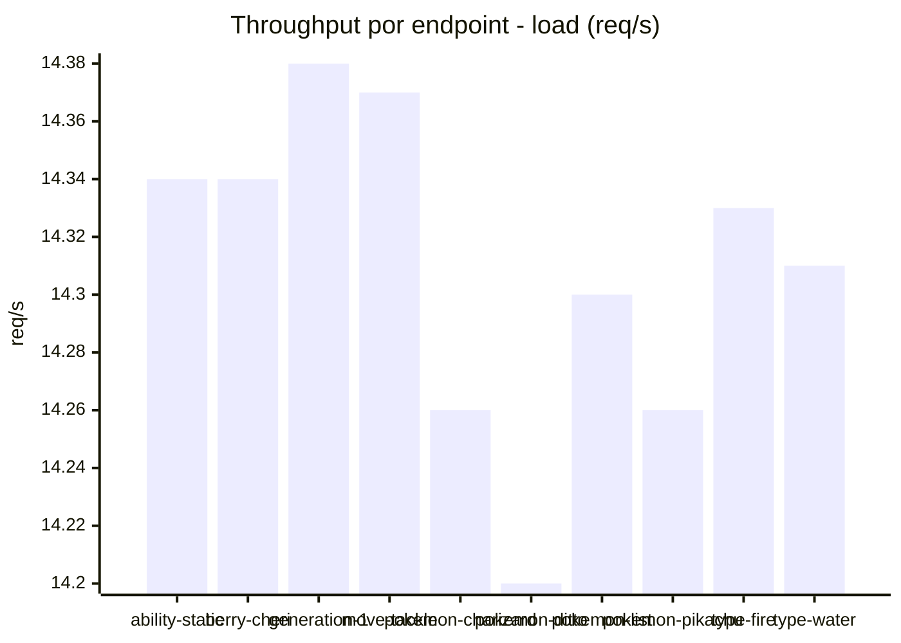
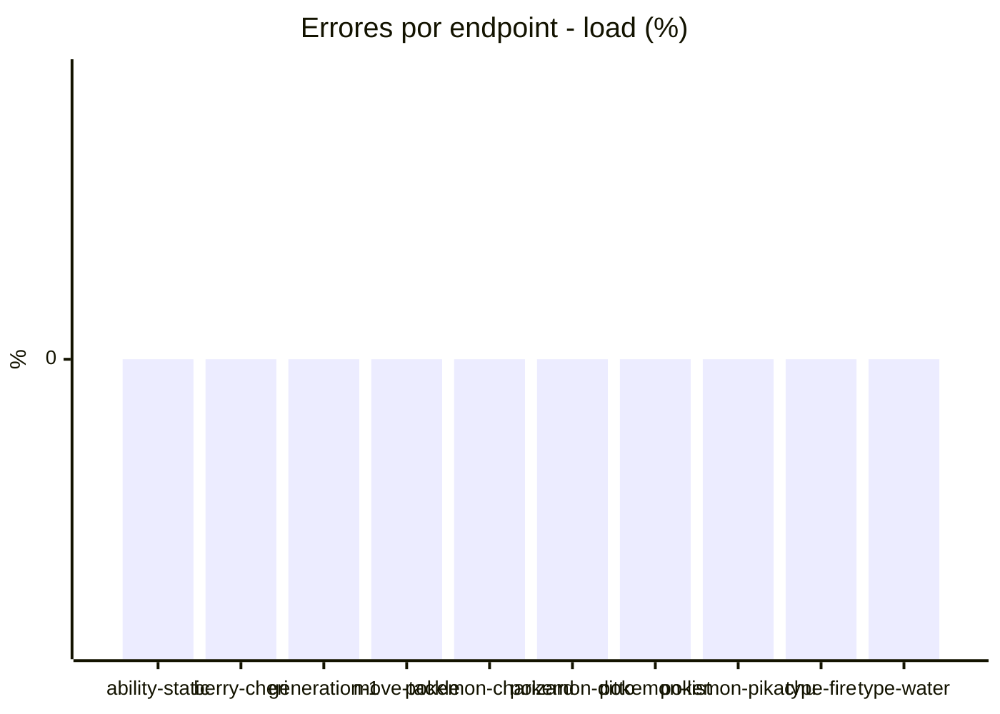
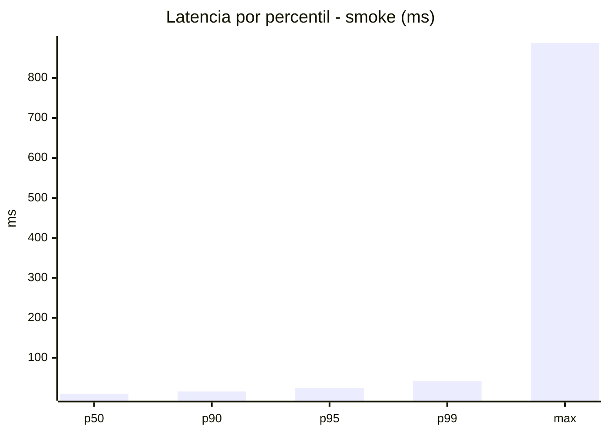
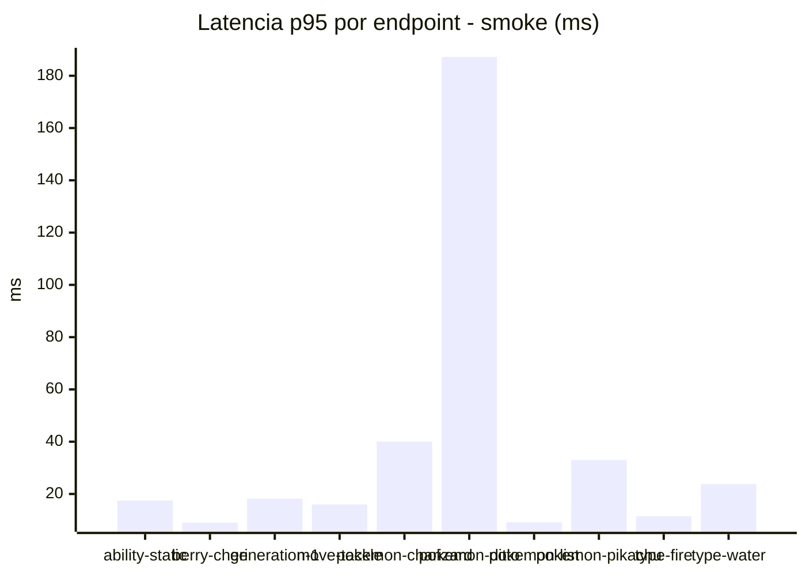
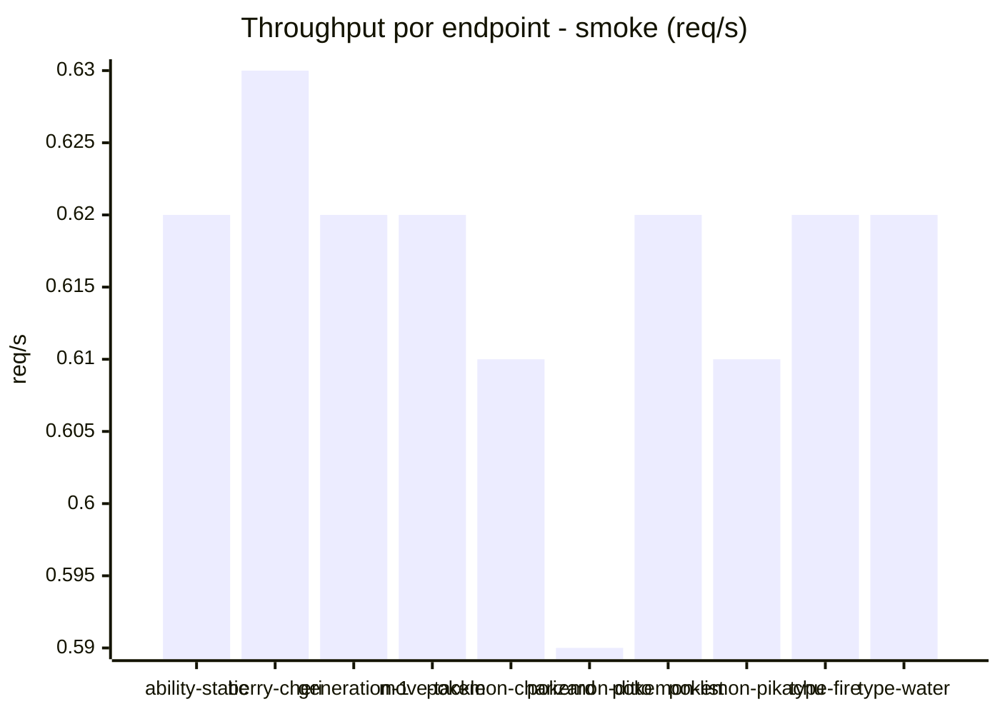

# Reporte de performance - PokeAPI

**Fecha:** 2026-09-06 16:00 UTC  
**Veredicto del agente:** `PASS`  
**Corrida:** [ver en GitHub Actions](https://github.com/lrbg/jmeter-pokeapi-lab/actions/runs/34043934026)  

## Validacion del agente de IA

PASS (fallback por umbrales)

- Error maximo: 0.0%
- p95 maximo: 25.0 ms

## Resultados

### Escenario: `load`

| Metrica | Valor |
| --- | --- |
| Muestras | 16976 |
| Errores | 0 (0.0%) |
| Latencia media | 9.6 ms |
| p50 / p90 / p95 / p99 | 9.0 / 12.0 / 14.0 / 21.0 ms |
| Min / Max | 6 / 240 ms |
| Throughput | 141.9 req/s |
| Duracion | 119.6 s |

Detalle por endpoint

| Endpoint | Muestras | Error % | avg | p95 | p99 | req/s |
| --- | --- | --- | --- | --- | --- | --- |
| ability-static | 1698 | 0.0% | 9.5 | 14.0 | 20.0 | 14.34 |
| berry-cheri | 1698 | 0.0% | 9.3 | 14.0 | 20.0 | 14.34 |
| generation-1 | 1697 | 0.0% | 9.6 | 15.0 | 23.0 | 14.38 |
| move-tackle | 1697 | 0.0% | 9.8 | 15.0 | 20.0 | 14.37 |
| pokemon-charizard | 1697 | 0.0% | 10.8 | 16.0 | 26.0 | 14.26 |
| pokemon-ditto | 1697 | 0.0% | 9.4 | 14.0 | 19.0 | 14.2 |
| pokemon-list | 1697 | 0.0% | 8.7 | 13.0 | 19.0 | 14.3 |
| pokemon-pikachu | 1698 | 0.0% | 10.2 | 15.0 | 24.0 | 14.26 |
| type-fire | 1699 | 0.0% | 9.4 | 14.0 | 19.0 | 14.33 |
| type-water | 1698 | 0.0% | 9.2 | 13.0 | 19.0 | 14.31 |

### Escenario: `smoke`

| Metrica | Valor |
| --- | --- |
| Muestras | 161 |
| Errores | 0 (0.0%) |
| Latencia media | 17.0 ms |
| p50 / p90 / p95 / p99 | 10.0 / 16.0 / 25.0 / 41.8 ms |
| Min / Max | 7 / 888 ms |
| Throughput | 5.55 req/s |
| Duracion | 29.0 s |

Detalle por endpoint

| Endpoint | Muestras | Error % | avg | p95 | p99 | req/s |
| --- | --- | --- | --- | --- | --- | --- |
| ability-static | 16 | 0.0% | 11.5 | 17.5 | 25.9 | 0.62 |
| berry-cheri | 16 | 0.0% | 8.7 | 9.0 | 9.0 | 0.63 |
| generation-1 | 16 | 0.0% | 12.1 | 18.2 | 26.0 | 0.62 |
| move-tackle | 16 | 0.0% | 10.8 | 16.0 | 23.2 | 0.62 |
| pokemon-charizard | 16 | 0.0% | 18 | 40.0 | 47.2 | 0.61 |
| pokemon-ditto | 17 | 0.0% | 61.2 | 187.2 | 747.8 | 0.59 |
| pokemon-list | 16 | 0.0% | 8.4 | 9.2 | 9.8 | 0.62 |
| pokemon-pikachu | 16 | 0.0% | 16 | 33.0 | 35.4 | 0.61 |
| type-fire | 16 | 0.0% | 9.4 | 11.5 | 12.7 | 0.62 |
| type-water | 16 | 0.0% | 10.9 | 23.8 | 27.9 | 0.62 |

