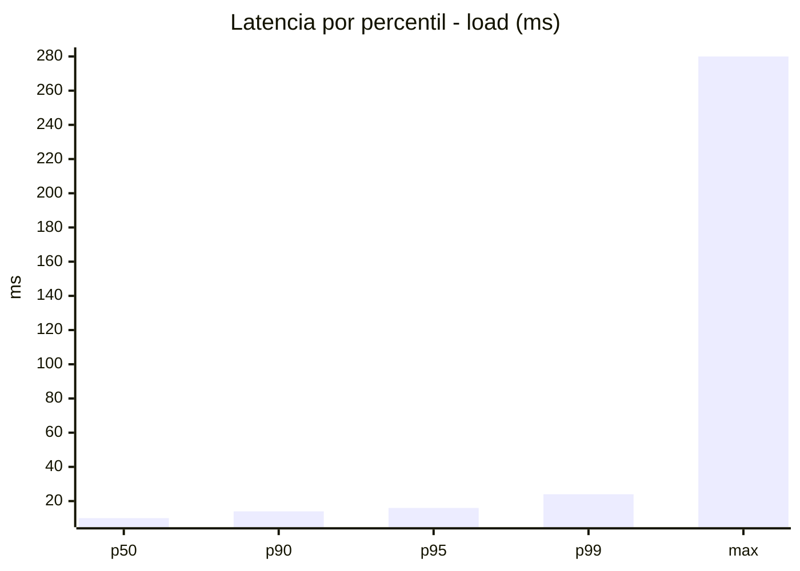
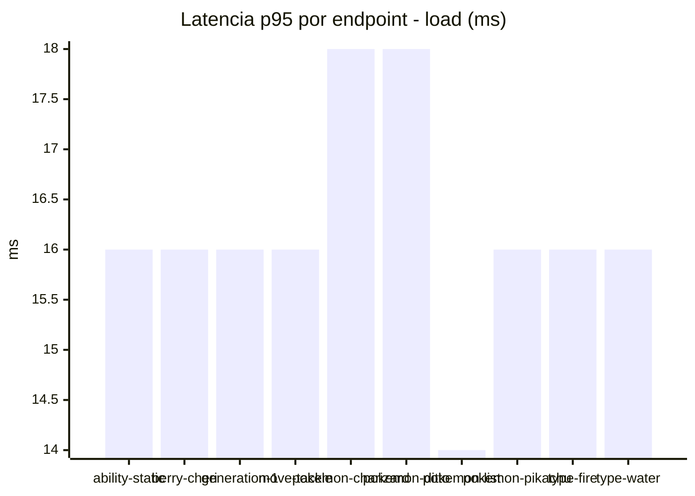
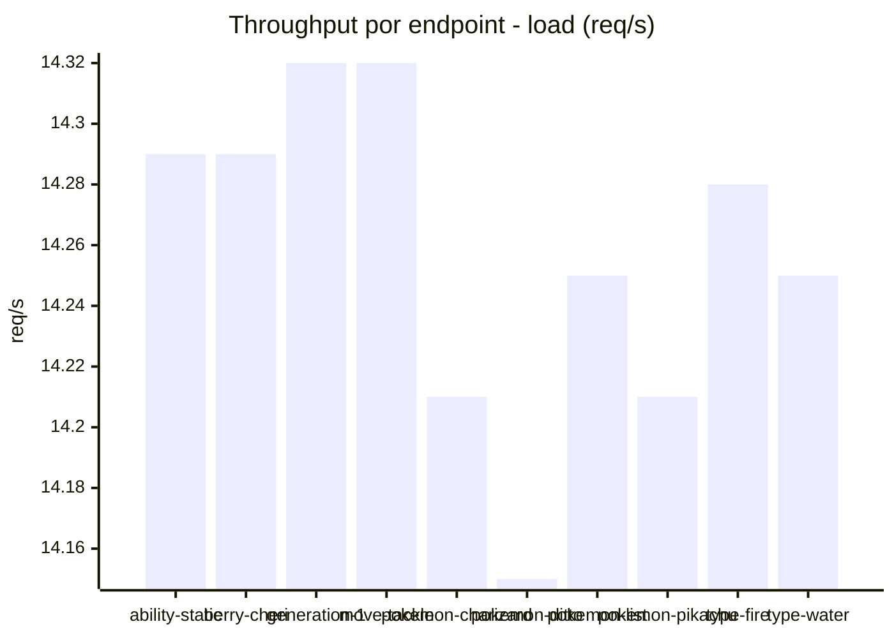
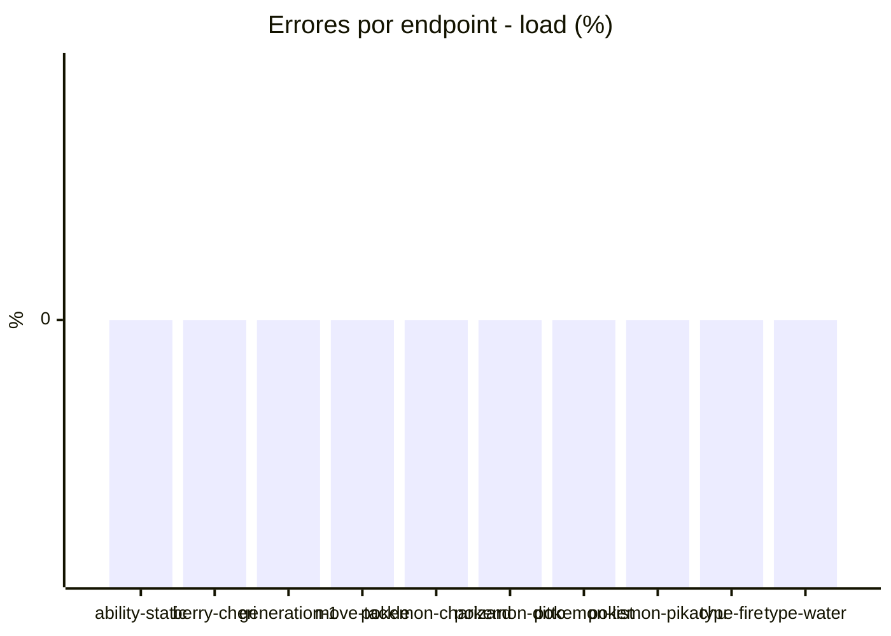
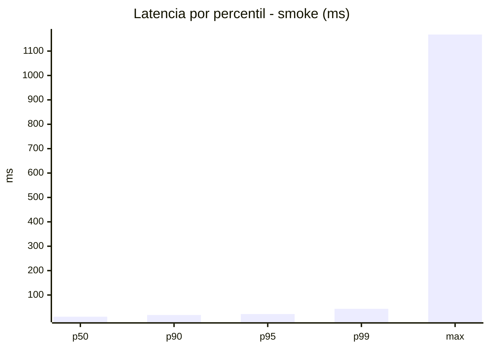
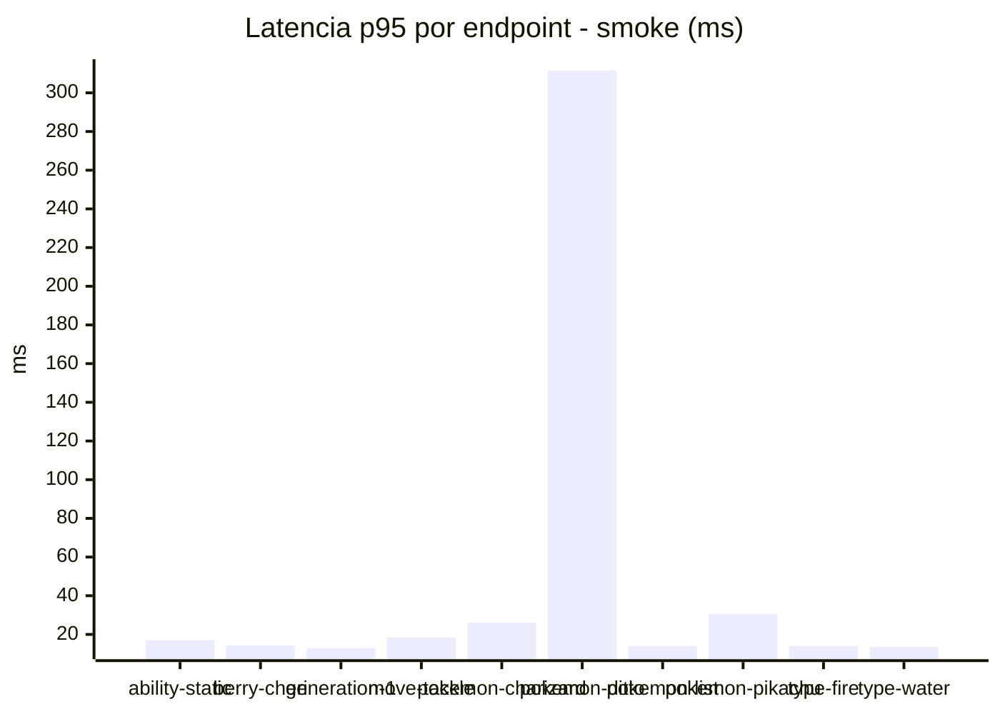
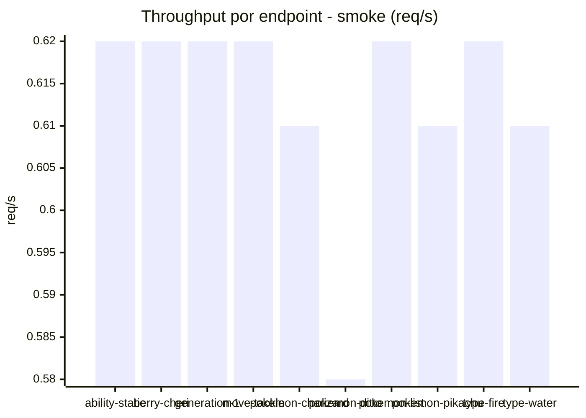

# Reporte de performance - PokeAPI

**Fecha:** 2026-09-07 18:07 UTC  
**Veredicto del agente:** `PASS`  
**Corrida:** [ver en GitHub Actions](https://github.com/lrbg/jmeter-pokeapi-lab/actions/runs/34150141494)  

## Validacion del agente de IA

PASS (fallback por umbrales)

- Error maximo: 0.0%
- p95 maximo: 22.0 ms

## Resultados

### Escenario: `load`

| Metrica | Valor |
| --- | --- |
| Muestras | 16915 |
| Errores | 0 (0.0%) |
| Latencia media | 10.7 ms |
| p50 / p90 / p95 / p99 | 10.0 / 14.0 / 16.0 / 24.0 ms |
| Min / Max | 6 / 280 ms |
| Throughput | 141.38 req/s |
| Duracion | 119.6 s |

Detalle por endpoint

| Endpoint | Muestras | Error % | avg | p95 | p99 | req/s |
| --- | --- | --- | --- | --- | --- | --- |
| ability-static | 1691 | 0.0% | 10.6 | 16.0 | 21.0 | 14.29 |
| berry-cheri | 1691 | 0.0% | 10.2 | 16.0 | 21.0 | 14.29 |
| generation-1 | 1691 | 0.0% | 10.6 | 16.0 | 24.0 | 14.32 |
| move-tackle | 1692 | 0.0% | 10.8 | 16.0 | 23.1 | 14.32 |
| pokemon-charizard | 1692 | 0.0% | 11.7 | 18.0 | 27.0 | 14.21 |
| pokemon-ditto | 1692 | 0.0% | 11.4 | 18.0 | 27.1 | 14.15 |
| pokemon-list | 1691 | 0.0% | 9.7 | 14.0 | 20.0 | 14.25 |
| pokemon-pikachu | 1692 | 0.0% | 11.2 | 16.0 | 28.0 | 14.21 |
| type-fire | 1691 | 0.0% | 10.2 | 16.0 | 24.1 | 14.28 |
| type-water | 1692 | 0.0% | 10.6 | 16.0 | 21.1 | 14.25 |

### Escenario: `smoke`

| Metrica | Valor |
| --- | --- |
| Muestras | 160 |
| Errores | 0 (0.0%) |
| Latencia media | 20.4 ms |
| p50 / p90 / p95 / p99 | 11.0 / 18.0 / 22.0 / 43.5 ms |
| Min / Max | 8 / 1168 ms |
| Throughput | 5.53 req/s |
| Duracion | 28.9 s |

Detalle por endpoint

| Endpoint | Muestras | Error % | avg | p95 | p99 | req/s |
| --- | --- | --- | --- | --- | --- | --- |
| ability-static | 16 | 0.0% | 11.6 | 17.0 | 17.0 | 0.62 |
| berry-cheri | 16 | 0.0% | 10.3 | 14.2 | 17.2 | 0.62 |
| generation-1 | 16 | 0.0% | 10.9 | 13.0 | 15.4 | 0.62 |
| move-tackle | 16 | 0.0% | 12.6 | 18.5 | 29.3 | 0.62 |
| pokemon-charizard | 16 | 0.0% | 18.8 | 26.2 | 36.4 | 0.61 |
| pokemon-ditto | 16 | 0.0% | 87.7 | 311.5 | 996.7 | 0.58 |
| pokemon-list | 16 | 0.0% | 11.1 | 14.0 | 18.8 | 0.62 |
| pokemon-pikachu | 16 | 0.0% | 18.6 | 30.5 | 46.1 | 0.61 |
| type-fire | 16 | 0.0% | 10.8 | 14.0 | 16.4 | 0.62 |
| type-water | 16 | 0.0% | 11.4 | 13.5 | 14.7 | 0.61 |

