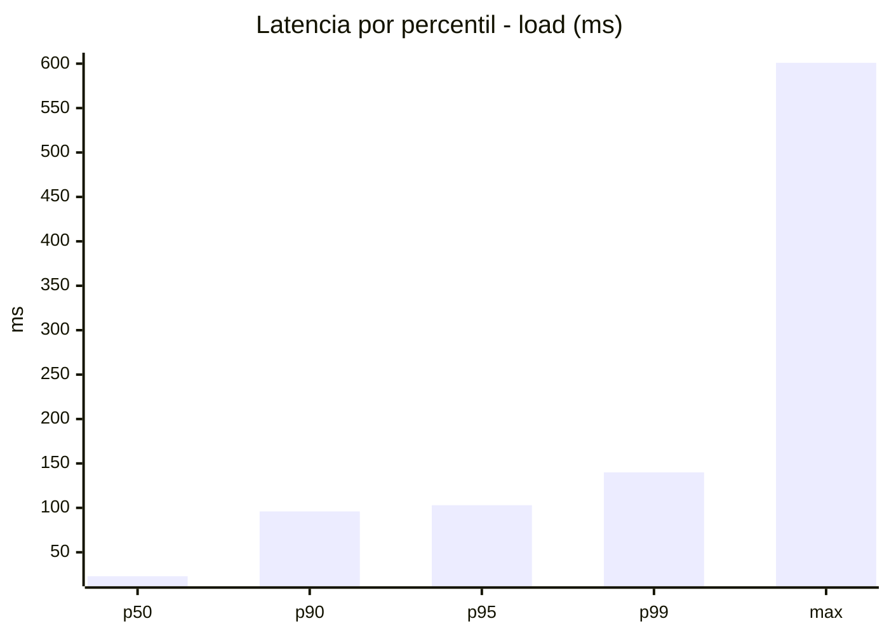
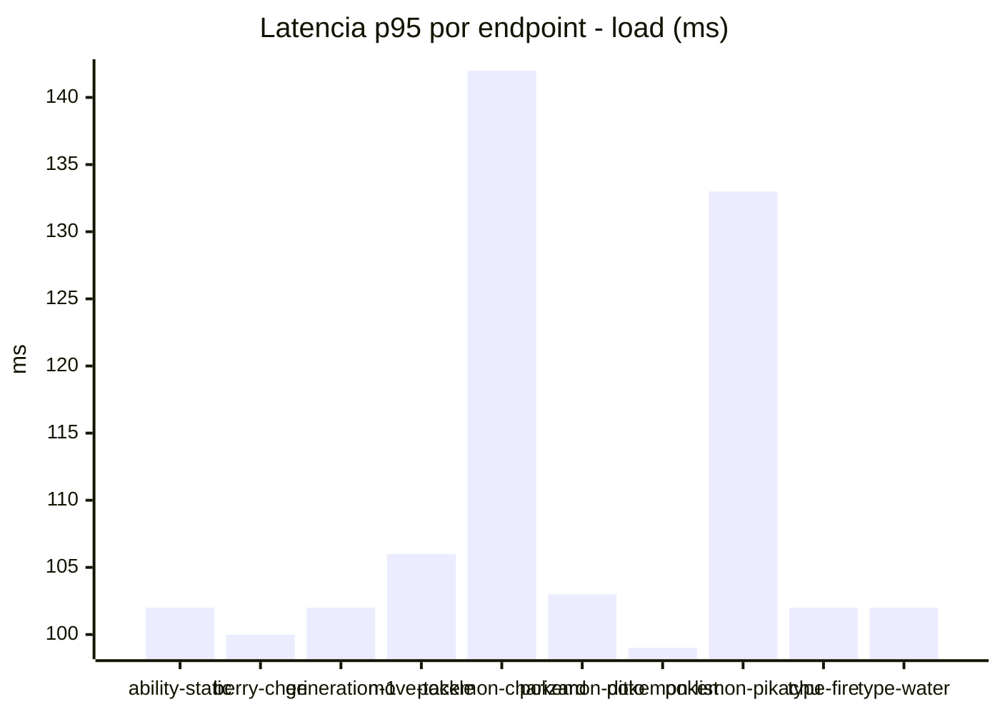
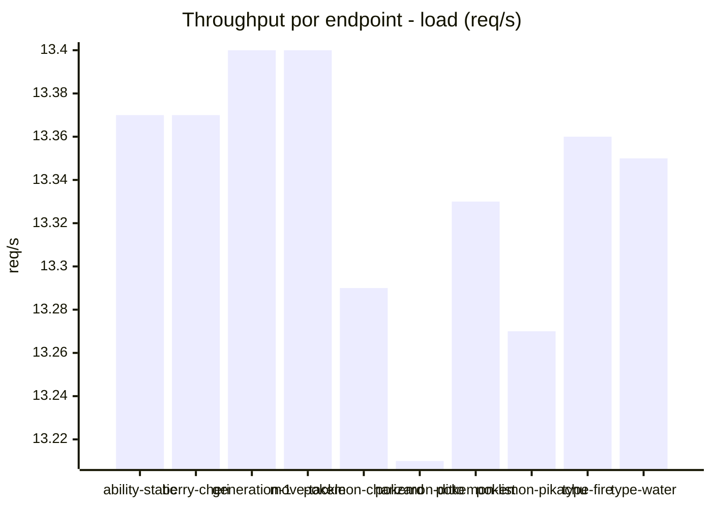
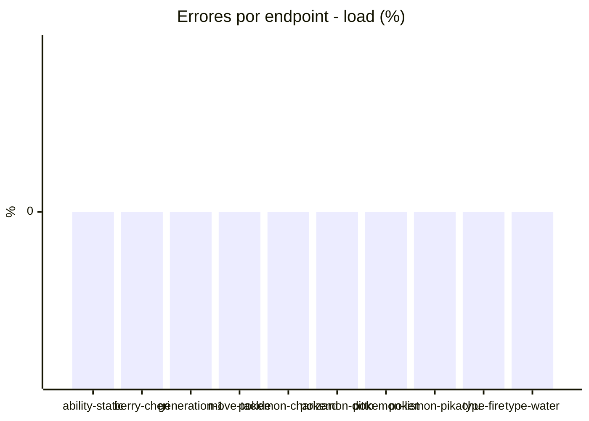
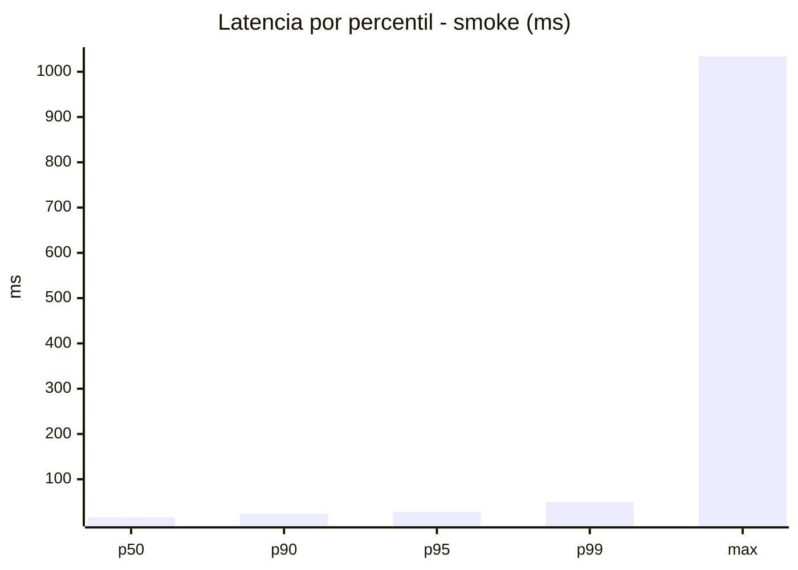
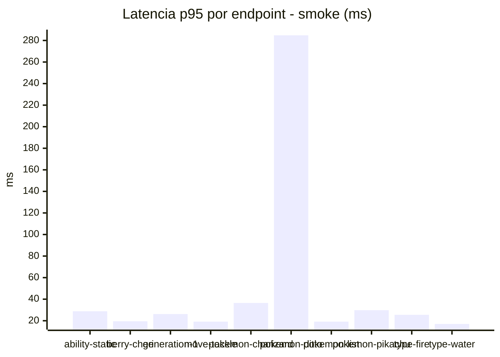
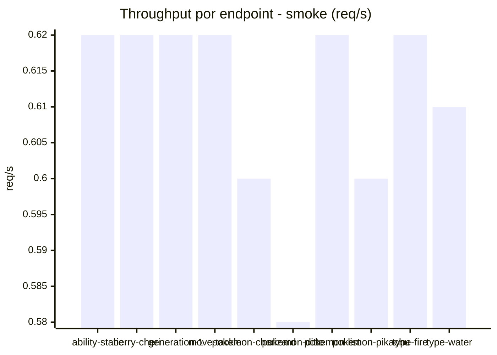

# Reporte de performance - PokeAPI

**Fecha:** 2026-09-08 17:05 UTC  
**Veredicto del agente:** `PASS`  
**Corrida:** [ver en GitHub Actions](https://github.com/lrbg/jmeter-pokeapi-lab/actions/runs/34254729000)  

## Validacion del agente de IA

PASS (fallback por umbrales)

- Error maximo: 0.0%
- p95 maximo: 103.0 ms

## Resultados

### Escenario: `load`

| Metrica | Valor |
| --- | --- |
| Muestras | 15802 |
| Errores | 0 (0.0%) |
| Latencia media | 32.6 ms |
| p50 / p90 / p95 / p99 | 23.0 / 96.0 / 103.0 / 140.0 ms |
| Min / Max | 7 / 601 ms |
| Throughput | 132.09 req/s |
| Duracion | 119.6 s |

Detalle por endpoint

| Endpoint | Muestras | Error % | avg | p95 | p99 | req/s |
| --- | --- | --- | --- | --- | --- | --- |
| ability-static | 1580 | 0.0% | 31.7 | 102.0 | 106.0 | 13.37 |
| berry-cheri | 1580 | 0.0% | 33.1 | 100.0 | 103.0 | 13.37 |
| generation-1 | 1580 | 0.0% | 30.5 | 102.0 | 106.0 | 13.4 |
| move-tackle | 1580 | 0.0% | 32.1 | 106.0 | 113.0 | 13.4 |
| pokemon-charizard | 1580 | 0.0% | 40.4 | 142.0 | 159.2 | 13.29 |
| pokemon-ditto | 1580 | 0.0% | 30.3 | 103.0 | 107.0 | 13.21 |
| pokemon-list | 1580 | 0.0% | 29.1 | 99.0 | 103.0 | 13.33 |
| pokemon-pikachu | 1580 | 0.0% | 38.4 | 133.0 | 163.2 | 13.27 |
| type-fire | 1581 | 0.0% | 30.5 | 102.0 | 105.2 | 13.36 |
| type-water | 1581 | 0.0% | 29.8 | 102.0 | 106.0 | 13.35 |

### Escenario: `smoke`

| Metrica | Valor |
| --- | --- |
| Muestras | 160 |
| Errores | 0 (0.0%) |
| Latencia media | 23.5 ms |
| p50 / p90 / p95 / p99 | 16.0 / 24.1 / 28.0 / 49.6 ms |
| Min / Max | 9 / 1034 ms |
| Throughput | 5.5 req/s |
| Duracion | 29.1 s |

Detalle por endpoint

| Endpoint | Muestras | Error % | avg | p95 | p99 | req/s |
| --- | --- | --- | --- | --- | --- | --- |
| ability-static | 16 | 0.0% | 17.2 | 28.8 | 30.5 | 0.62 |
| berry-cheri | 16 | 0.0% | 14.8 | 19.5 | 20.7 | 0.62 |
| generation-1 | 16 | 0.0% | 17.8 | 26.2 | 29.2 | 0.62 |
| move-tackle | 16 | 0.0% | 14.6 | 19.2 | 19.9 | 0.62 |
| pokemon-charizard | 16 | 0.0% | 24.9 | 36.5 | 56.9 | 0.6 |
| pokemon-ditto | 16 | 0.0% | 80.4 | 284.8 | 884.1 | 0.58 |
| pokemon-list | 16 | 0.0% | 14.2 | 19.2 | 22.2 | 0.62 |
| pokemon-pikachu | 16 | 0.0% | 20 | 29.8 | 38.7 | 0.6 |
| type-fire | 16 | 0.0% | 17.3 | 25.5 | 31.5 | 0.62 |
| type-water | 16 | 0.0% | 13.6 | 17.0 | 17.0 | 0.61 |

