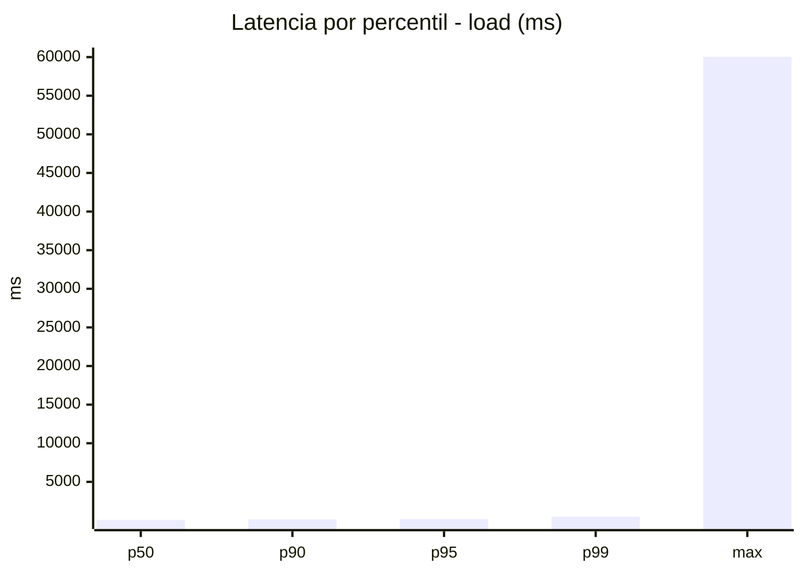
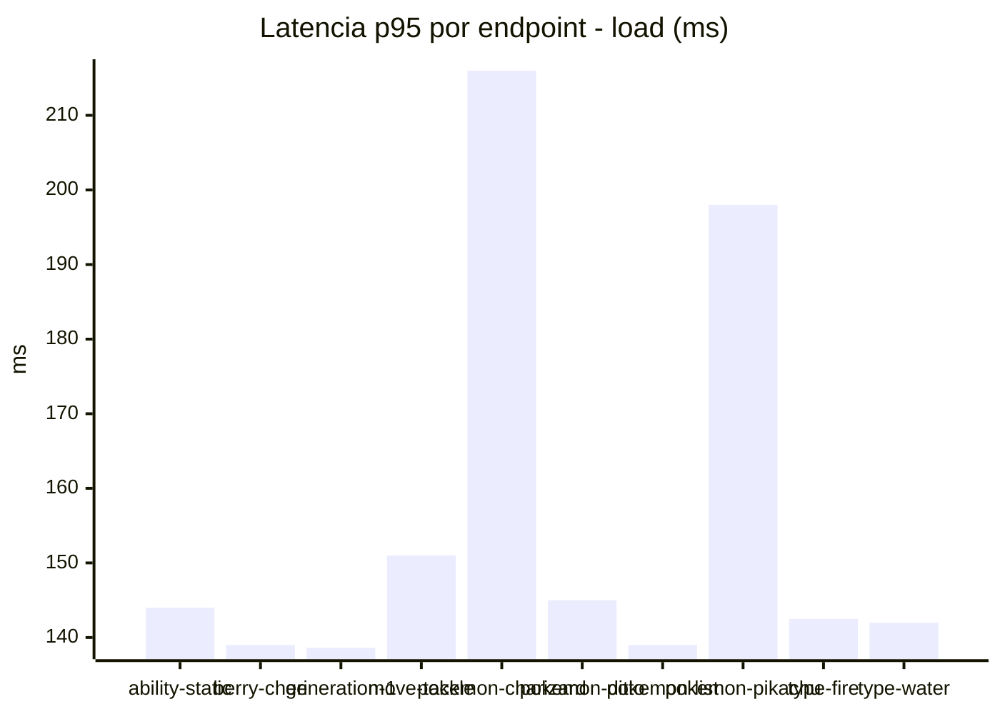
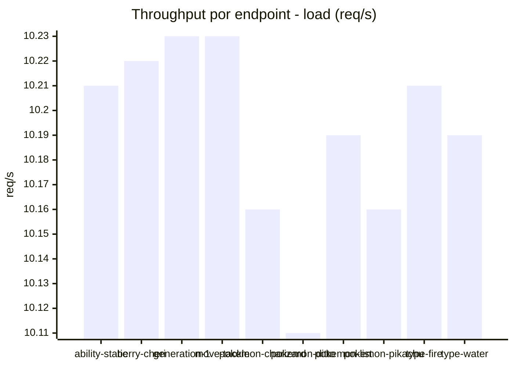
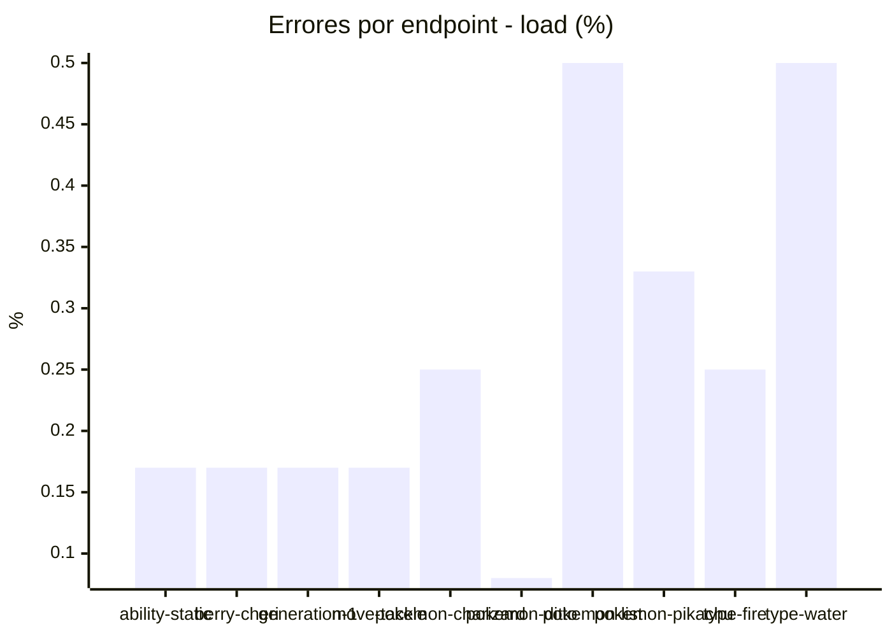
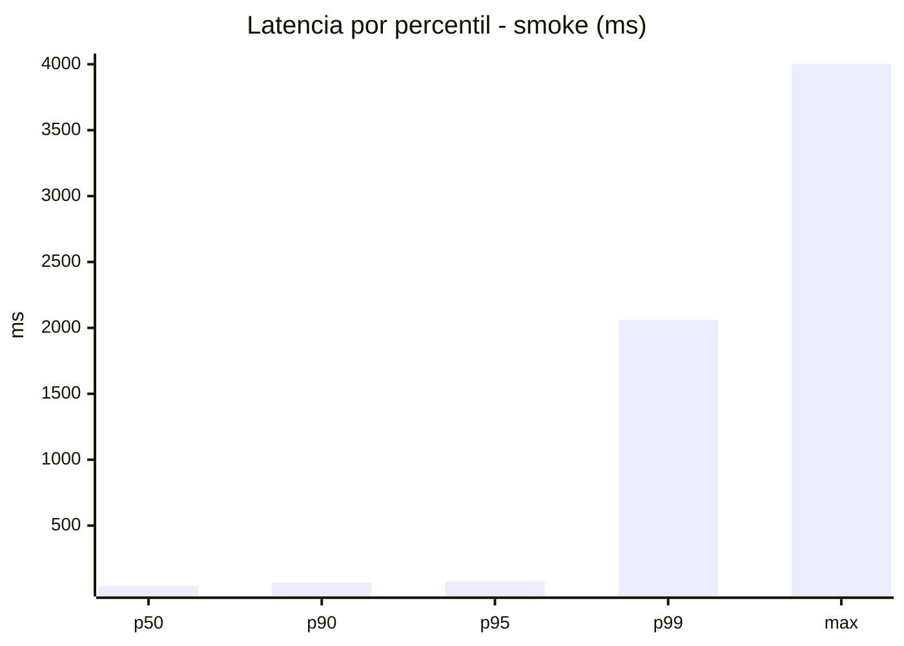
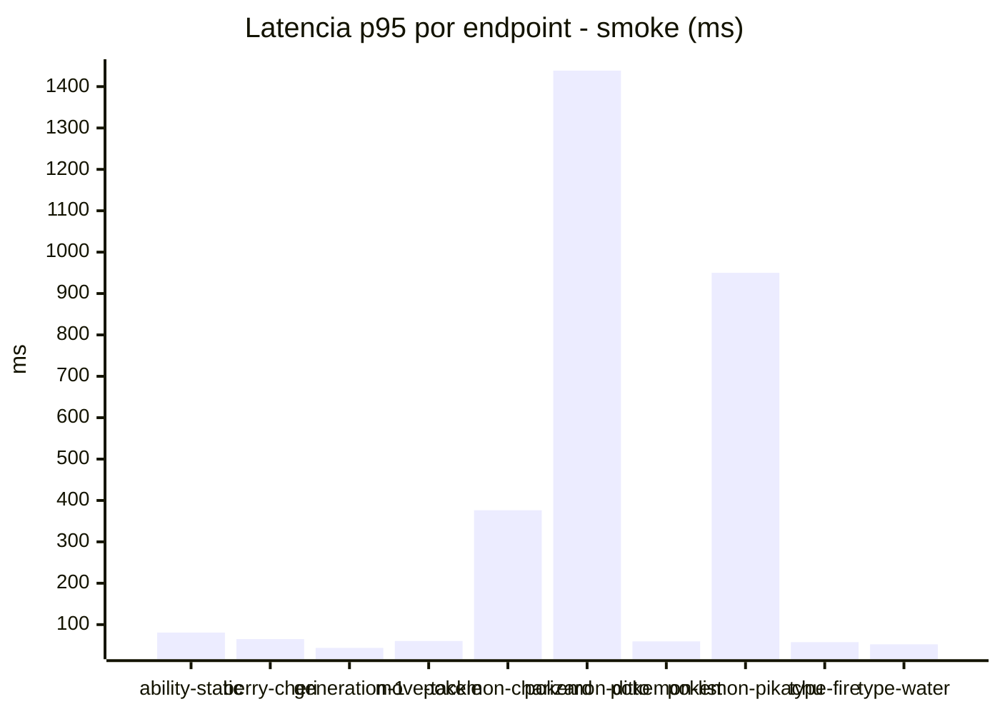
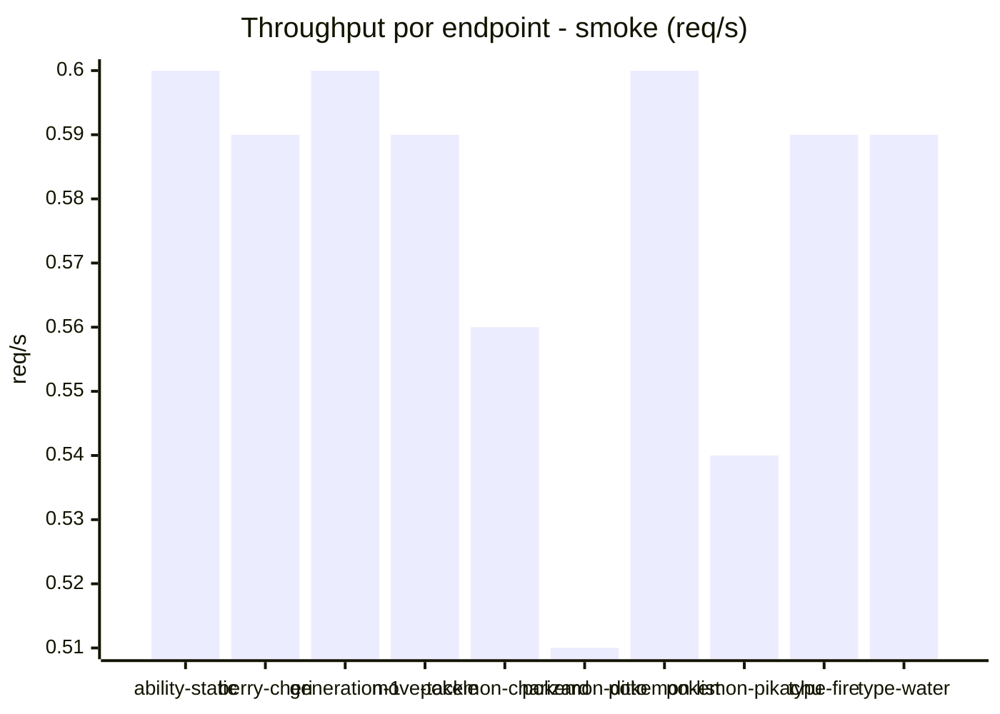
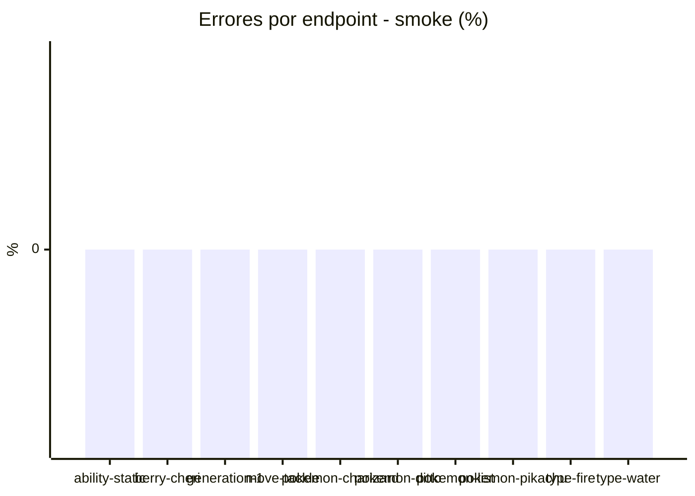

# Reporte de performance - PokeAPI

**Fecha:** 2026-09-09 17:03 UTC  
**Veredicto del agente:** `WARN`  
**Corrida:** [ver en GitHub Actions](https://github.com/lrbg/jmeter-pokeapi-lab/actions/runs/34380242777)  

## Validacion del agente de IA

WARN (fallback por umbrales)

- Error maximo: 0.26%
- p95 maximo: 181.0 ms

## Resultados

### Escenario: `load`

| Metrica | Valor |
| --- | --- |
| Muestras | 12092 |
| Errores | 31 (0.26%) |
| Latencia media | 134.8 ms |
| p50 / p90 / p95 / p99 | 61.0 / 140.0 / 181.0 / 473.0 ms |
| Min / Max | 1 / 60059 ms |
| Throughput | 101.0 req/s |
| Duracion | 119.7 s |

Detalle por endpoint

| Endpoint | Muestras | Error % | avg | p95 | p99 | req/s |
| --- | --- | --- | --- | --- | --- | --- |
| ability-static | 1209 | 0.17% | 101.3 | 144.0 | 395.9 | 10.21 |
| berry-cheri | 1209 | 0.17% | 129.2 | 139.0 | 376.0 | 10.22 |
| generation-1 | 1208 | 0.17% | 131.7 | 138.6 | 169.2 | 10.23 |
| move-tackle | 1209 | 0.17% | 102.4 | 151.0 | 454.6 | 10.23 |
| pokemon-charizard | 1209 | 0.25% | 173.1 | 216.0 | 587.6 | 10.16 |
| pokemon-ditto | 1209 | 0.08% | 97.2 | 145.0 | 259.6 | 10.11 |
| pokemon-list | 1209 | 0.5% | 172.9 | 139.0 | 330.9 | 10.19 |
| pokemon-pikachu | 1210 | 0.33% | 157.1 | 198.0 | 458.9 | 10.16 |
| type-fire | 1210 | 0.25% | 79.9 | 142.5 | 384.1 | 10.21 |
| type-water | 1210 | 0.5% | 203.1 | 142.0 | 519.4 | 10.19 |

### Escenario: `smoke`

| Metrica | Valor |
| --- | --- |
| Muestras | 133 |
| Errores | 0 (0.0%) |
| Latencia media | 99.7 ms |
| p50 / p90 / p95 / p99 | 40.0 / 66.8 / 76.0 / 2060.7 ms |
| Min / Max | 26 / 4003 ms |
| Throughput | 4.76 req/s |
| Duracion | 27.9 s |

Detalle por endpoint

| Endpoint | Muestras | Error % | avg | p95 | p99 | req/s |
| --- | --- | --- | --- | --- | --- | --- |
| ability-static | 13 | 0.0% | 46.5 | 80.8 | 86.6 | 0.6 |
| berry-cheri | 13 | 0.0% | 41.5 | 65.0 | 79.4 | 0.59 |
| generation-1 | 13 | 0.0% | 36.8 | 43.6 | 45.5 | 0.6 |
| move-tackle | 13 | 0.0% | 42.8 | 60.4 | 72.9 | 0.59 |
| pokemon-charizard | 14 | 0.0% | 121.7 | 376.3 | 824.1 | 0.56 |
| pokemon-ditto | 14 | 0.0% | 321.4 | 1438.7 | 3490.1 | 0.51 |
| pokemon-list | 13 | 0.0% | 40.7 | 59.4 | 74.3 | 0.6 |
| pokemon-pikachu | 14 | 0.0% | 233.9 | 950.0 | 2262.0 | 0.54 |
| type-fire | 13 | 0.0% | 41.2 | 57.6 | 69.1 | 0.59 |
| type-water | 13 | 0.0% | 41.2 | 52.4 | 52.9 | 0.59 |

