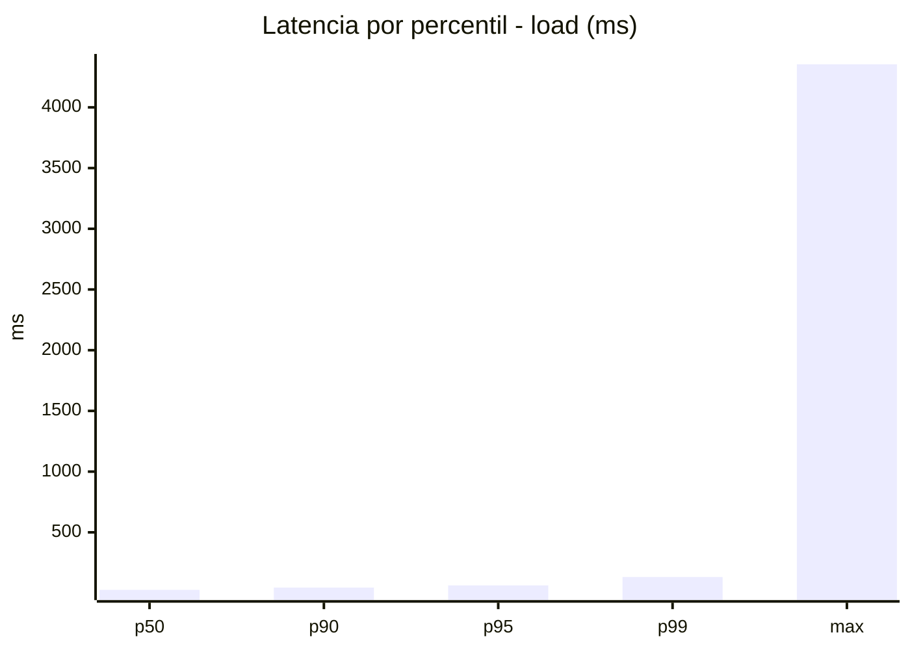
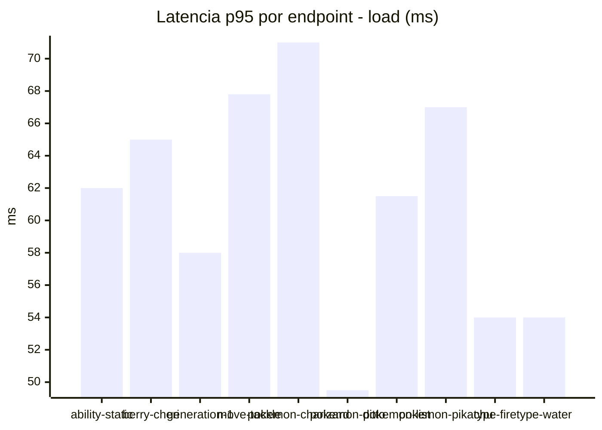
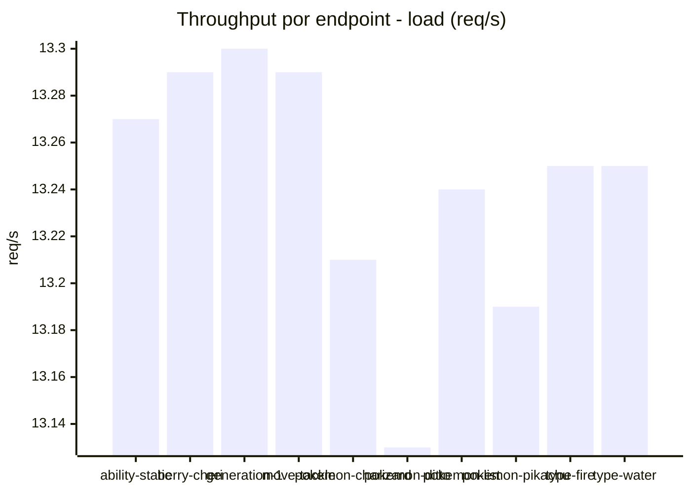
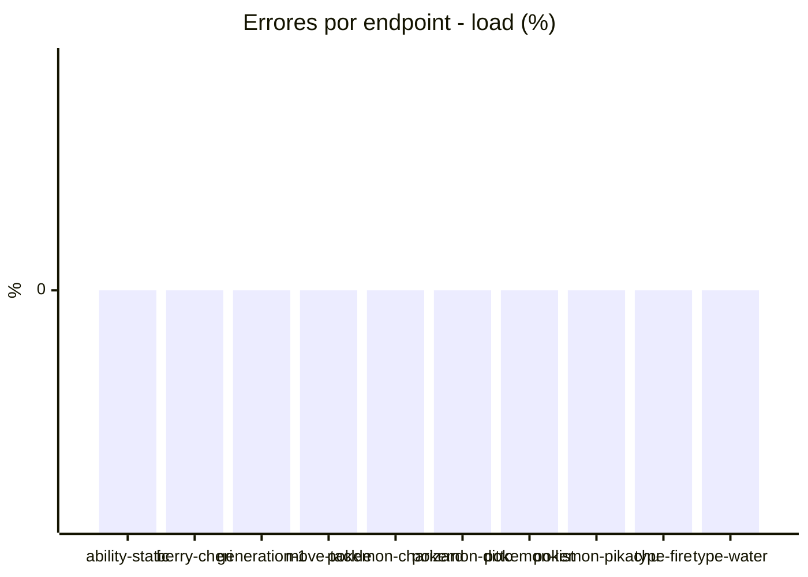
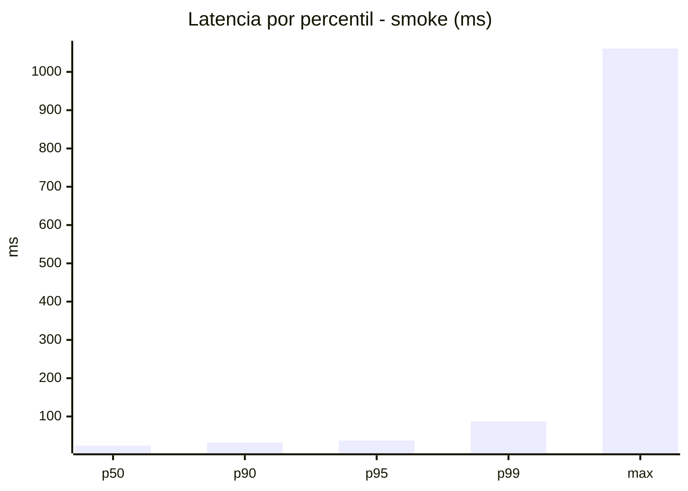
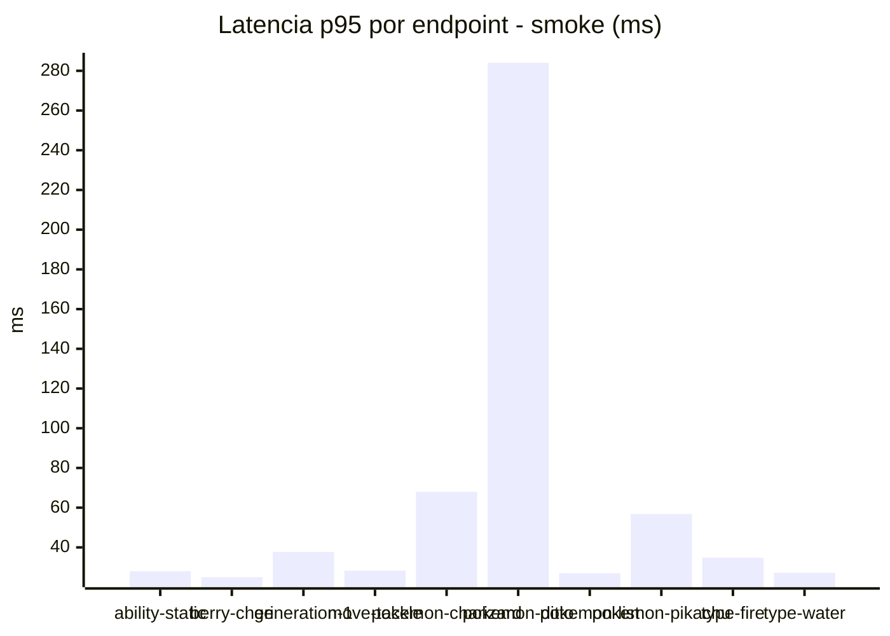
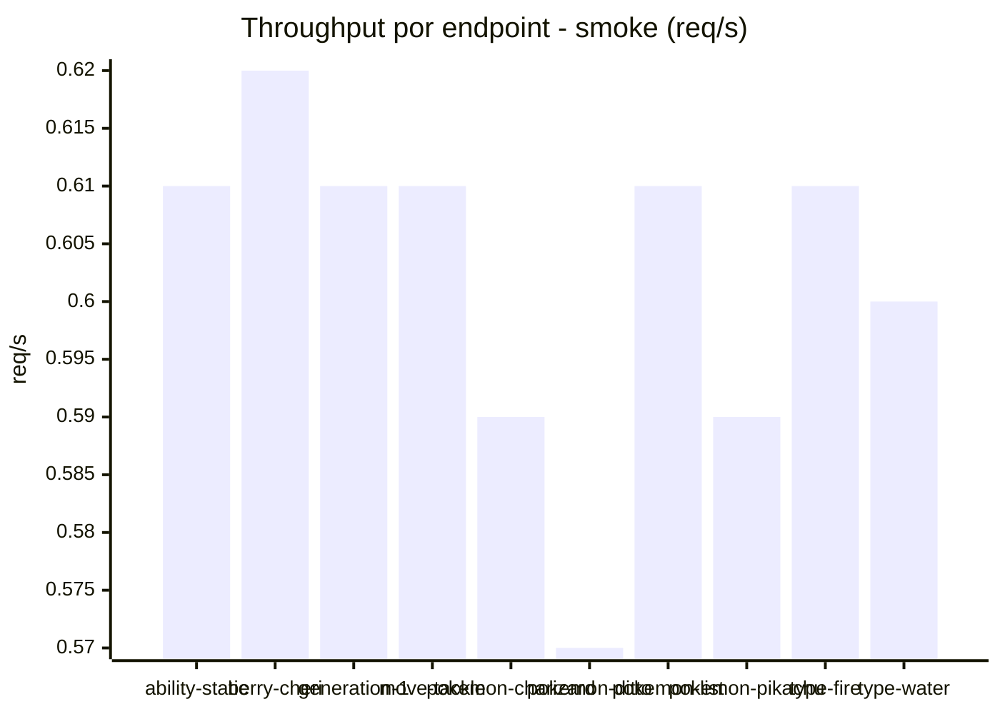

# Reporte de performance - PokeAPI

**Fecha:** 2026-09-10 16:55 UTC  
**Veredicto del agente:** `PASS`  
**Corrida:** [ver en GitHub Actions](https://github.com/lrbg/jmeter-pokeapi-lab/actions/runs/34504736885)  

## Validacion del agente de IA

PASS (fallback por umbrales)

- Error maximo: 0.0%
- p95 maximo: 63.0 ms

## Resultados

### Escenario: `load`

| Metrica | Valor |
| --- | --- |
| Muestras | 15700 |
| Errores | 0 (0.0%) |
| Latencia media | 34.7 ms |
| p50 / p90 / p95 / p99 | 26.0 / 45.0 / 63.0 / 132.0 ms |
| Min / Max | 16 / 4355 ms |
| Throughput | 131.24 req/s |
| Duracion | 119.6 s |

Detalle por endpoint

| Endpoint | Muestras | Error % | avg | p95 | p99 | req/s |
| --- | --- | --- | --- | --- | --- | --- |
| ability-static | 1570 | 0.0% | 32.9 | 62.0 | 106.0 | 13.27 |
| berry-cheri | 1570 | 0.0% | 32.1 | 65.0 | 110.9 | 13.29 |
| generation-1 | 1569 | 0.0% | 33.8 | 58.0 | 118.2 | 13.3 |
| move-tackle | 1569 | 0.0% | 36.8 | 67.8 | 122.6 | 13.29 |
| pokemon-charizard | 1570 | 0.0% | 39.9 | 71.0 | 152.3 | 13.21 |
| pokemon-ditto | 1571 | 0.0% | 31.3 | 49.5 | 111.3 | 13.13 |
| pokemon-list | 1570 | 0.0% | 33.5 | 61.5 | 107.0 | 13.24 |
| pokemon-pikachu | 1571 | 0.0% | 38.0 | 67.0 | 155.4 | 13.19 |
| type-fire | 1570 | 0.0% | 35.2 | 54.0 | 107.3 | 13.25 |
| type-water | 1570 | 0.0% | 33.7 | 54.0 | 106.0 | 13.25 |

### Escenario: `smoke`

| Metrica | Valor |
| --- | --- |
| Muestras | 157 |
| Errores | 0 (0.0%) |
| Latencia media | 33.1 ms |
| p50 / p90 / p95 / p99 | 24.0 / 32.0 / 37.2 / 86.8 ms |
| Min / Max | 20 / 1061 ms |
| Throughput | 5.4 req/s |
| Duracion | 29.1 s |

Detalle por endpoint

| Endpoint | Muestras | Error % | avg | p95 | p99 | req/s |
| --- | --- | --- | --- | --- | --- | --- |
| ability-static | 16 | 0.0% | 24.1 | 28.0 | 28.0 | 0.61 |
| berry-cheri | 15 | 0.0% | 22.5 | 25.0 | 25.0 | 0.62 |
| generation-1 | 15 | 0.0% | 25.7 | 37.7 | 59.5 | 0.61 |
| move-tackle | 15 | 0.0% | 24.9 | 28.3 | 28.9 | 0.61 |
| pokemon-charizard | 16 | 0.0% | 36 | 68.0 | 70.4 | 0.59 |
| pokemon-ditto | 16 | 0.0% | 88.4 | 284.0 | 905.6 | 0.57 |
| pokemon-list | 16 | 0.0% | 23.5 | 27.0 | 27.0 | 0.61 |
| pokemon-pikachu | 16 | 0.0% | 34.5 | 56.8 | 96.9 | 0.59 |
| type-fire | 16 | 0.0% | 26.3 | 34.8 | 50.9 | 0.61 |
| type-water | 16 | 0.0% | 23.7 | 27.2 | 35.0 | 0.6 |

